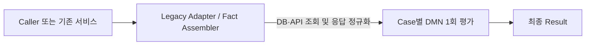
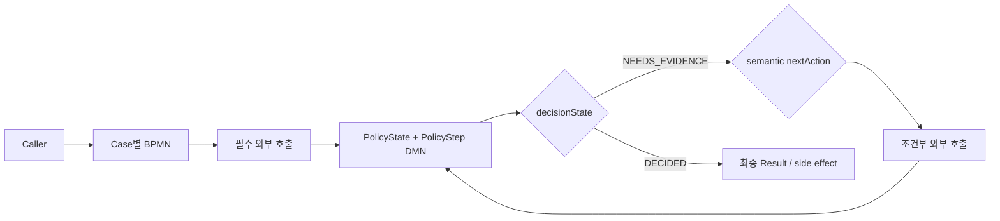
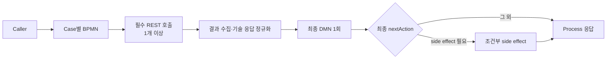
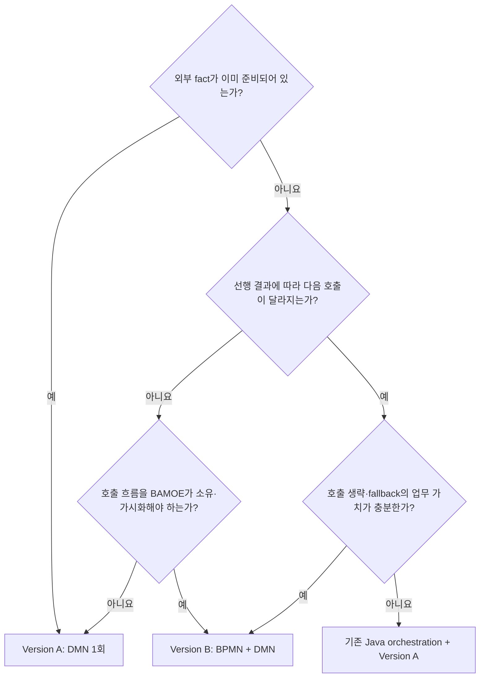

# 구현 버전 선택 가이드

> **먼저 확인할 점**
>
> 이 문서는 두 가지 구현 방식을 비교한다. 현재 고객 합의 범위와 주 실습 경로는
> **여섯 Case 모두 BPMN+DMN으로 구현하는 Version B**다. Version A 문서는 완성된
> fact를 이미 조립할 수 있을 때 참고하는 대안이며, 현재 BPMN 실습 순서에는 포함하지
> 않는다.

## 1. 결론부터 보기

고객의 여섯 사례를 모두 한 가지 구조로 만들 필요는 없다. 두 버전은 우열 관계가 아니라 **BAMOE에 맡길 책임의 범위가 다른 구현 방식**이다.

| 구분 | Version A: Fact-Ready DMN | Version B: Policy-Driven Orchestration |
|---|---|---|
| BAMOE가 받는 입력 | DB/API 결과까지 조립된 완성된 fact | 원래 업무 입력과 현재까지 수집한 fact |
| BAMOE 자산 | 사례별 DMN 1개 | 사례별 BPMN 1개 + DMN 1개 |
| DMN 평가 | 최종 입력으로 1회 | 필요한 사례에서는 같은 DMN을 여러 번 평가 |
| 외부 호출 담당 | 기존 서비스, upstream 또는 adapter | BPMN의 REST Service Call Task |
| DMN 결과 | 즉시 최종 `ALLOW`, `DENY` 등 | `NEEDS_EVIDENCE + nextAction` 또는 최종 `DECIDED` |
| 가장 잘 보여주는 가치 | 규칙의 시각화·설명·회귀 테스트 | 규칙과 조건부 실행 흐름의 협업 |
| 복잡도 | 가장 낮음 | 상대적으로 높음 |

이번 고객 PoC에는 다음 구성을 사용한다.

1. **여섯 사례 모두 Version B로 구현**하여 호출 순서, 호출 생략, fallback,
   side effect와 정책 판정을 한 Process 안에서 설명한다.
2. Case 01·02·04·06은 선행 결과에 따라 다음 호출이 달라지므로 DMN의
   `PolicyState`와 `nextAction`으로 BPMN을 제어한다.
3. Case 03·05는 필요한 호출이 처음부터 정해져 있으므로 BPMN이 결과를 수집한 뒤
   DMN을 한 번 평가한다. 제품 시연을 위해 불필요한 반복 DMN을 만들지 않는다.
4. Version A는 “fact가 이미 준비된 경우에는 BPMN 없이 같은 정책을 재사용할 수
   있다”는 확장 설명으로만 남긴다.

핵심은 여섯 사례에 BPMN을 붙이는 것 자체가 아니다. **호출 구조가 다른 사례에
서로 다른 DMN 평가 패턴을 적용하면서도, DMN=정책·BPMN=실행이라는 책임 경계는
동일하게 유지하는 것**이 이번 PoC의 설계 메시지다.

## 2. Version A: Fact-Ready DMN

### 2.1 구조



이 버전에서 DMN은 외부 API나 DB를 직접 호출하지 않는다. 기존 Java/Spring 서비스, legacy orchestration 또는 adapter가 필요한 결과를 먼저 모아 하나의 요청으로 조립한다.

PoC에서는 아직 실제 연동 정보가 없으므로 다음처럼 **완성된 fact를 request payload에 직접 전달**한다.

```json
{
  "Request": {
    "serviceDetailClassCode": "CA",
    "serviceStatusChangeCode": "F1",
    "ordAux227Result": "GRANTED",
    "promotionSubscriptionCount": 0
  }
}
```

운영 전환 시 request를 사람이 직접 조립하는 대신 adapter가 DB/API 응답을 동일한 계약으로 정규화하면 DMN은 그대로 유지할 수 있다.

### 2.2 장점

- DMN을 한 번만 평가하므로 실행과 설명이 단순하다.
- BPMN 및 중간 상태 계약이 없어 UI에서 처음 학습하기 쉽다.
- SCESIM에서 입력 조합과 최종 결과를 바로 검증할 수 있다.
- 기존 애플리케이션이 이미 API 호출과 트랜잭션을 잘 처리한다면 그 구조를 흔들지 않는다.
- 같은 정규화된 fact 계약을 여러 채널이 제공할 수 있다면 DMN 정책을 재사용하기 쉽다.

### 2.3 단점

- 어떤 API를 호출할지 결정하는 로직이 upstream 코드에 남을 수 있다.
- upstream이 항상 모든 fact를 미리 조회하면 최종 판단에 필요하지 않은 API도 호출할 수 있다.
- 조건부 호출 규칙을 Java와 DMN 양쪽에 작성하면 정책이 두 군데로 분산된다.
- DMN만으로는 실제 호출 순서, fallback 수행 여부, side effect 실행 이력을 보여주지 못한다.
- 테스트가 DMN 결과 검증에 집중되므로 외부 호출 횟수와 순서는 별도의 통합 테스트가 필요하다.

### 2.4 이 버전이 잘 맞는 상황

- 기존 서비스가 이미 필요한 DB/API 결과를 안정적으로 조립하고 있다.
- 외부 호출 목록과 순서가 고정되어 있다.
- batch나 사전 집계처럼 fact가 자연스럽게 먼저 준비된다.
- PoC의 일차 목표가 슈도 코드의 **rule migration과 설명 가능성**을 증명하는 것이다.
- BAMOE가 외부 시스템의 실행 흐름까지 소유할 필요가 없다.

## 3. Version B: Policy-Driven Orchestration

### 3.1 구조

Version B 안에서도 호출 구조에 따라 두 패턴을 사용한다.

#### 패턴 B1: 정책이 다음 호출을 선택



Case 01·02·04·06에 사용한다. `PolicyState`는 여러 상태 조합을 긴 FEEL
`if/else`로 숨기지 않고 Decision Table로 분류한다. `PolicyStep`은 그 상태를
고객이 이해할 수 있는 다음 행동과 최종 결과로 변환한다.

DMN은 일부 외부 결과가 아직 없더라도 오류를 내지 않는다. 현재 fact로 다음 단계를 판단하고 다음처럼 정상적인 중간 결과를 반환한다.

```text
decisionState = NEEDS_EVIDENCE
status        = null
nextAction    = REQUEST_CSMAUX005
```

BPMN은 `nextAction`에 해당하는 호출을 수행하고 결과를 현재 context에 추가한 뒤 같은 DMN을 다시 평가한다. 충분한 fact가 모이면 DMN이 최종 결과를 반환한다.

```text
decisionState = DECIDED
status        = ALLOW | DENY | SYSTEM_ERROR | INVALID_INPUT
```

DMN은 상태를 기억하지 않는다. 현재까지의 상태는 BPMN Process 변수가 보관하고, DMN은 매번 전달받은 전체 context를 기준으로 순수하게 계산한다.

#### 패턴 B2: 고정된 결과를 수집한 뒤 한 번 판정



Case 03·05에 사용한다. 호출 여부가 업무 조건에 따라 바뀌지 않는데도
`NEEDS_EVIDENCE` 반복 상태를 만들면 Java 절차를 DMN 상태 머신으로 옮긴 것에
불과하다. 이 두 사례에서는 BPMN이 명시적인 호출 순서를 보여주고, DMN은 결과의
조합·우선순위·최종 사유를 한 번에 판정한다.

### 3.2 장점

- 불필요한 외부 호출을 실제로 생략할 수 있다.
- fallback과 조건부 side effect를 BPMN 화면과 Mock 호출 journal로 설명할 수 있다.
- 업무 조건은 DMN, 실행 순서와 기술 오류는 BPMN으로 분리할 수 있다.
- `nextAction`을 업무 용어로 표현하면 Gateway마다 복잡한 고객 조건을 반복하지 않는다.
- 향후 호출 단계가 늘거나 순서가 정책적으로 중요해질 때 변경 영향을 추적하기 쉽다.

### 3.3 단점

- DMN 입력·출력 외에 BPMN 변수와 mapping 계약도 함께 관리해야 한다.
- 패턴 B1에서는 `NEEDS_EVIDENCE`와 반복 평가의 의미를 설계자와 운영자가
  이해해야 한다.
- DMN SCESIM뿐 아니라 BPMN 경로, 호출 journal, 기술 실패를 별도로 테스트해야 한다.
- 단순한 고정 호출 두세 개라면 같은 동작을 Java/Spring 코드로 더 짧게 구현할 수 있다.
- BPMN을 사용했다는 이유만으로 retry, timeout, 감사 저장, 장기 실행 기능이 자동으로 완성되는 것은 아니다. 필요한 실행·운영 요구를 별도로 설계해야 한다.

### 3.4 이 버전이 잘 맞는 상황

- 선행 결과에 따라 다음 외부 호출 자체가 달라진다.
- 호출 생략, fallback 순서 또는 side effect 조건이 중요한 업무 정책이다.
- 호출이 고정되어 있어도 그 순서와 기술 오류 경계를 중앙 Process로 가시화할
  필요가 있다.
- 그 실행 경로를 업무 담당자에게 화면으로 설명해야 한다.
- 여러 채널이 동일한 오케스트레이션을 재사용해야 한다.
- 정책 변경 시 Java routing 코드와 DMN이 서로 달라지는 위험을 제거할 가치가 있다.

## 4. 두 버전을 현실적으로 혼용하는 방법

프로젝트 전체를 DMN-only 또는 BPMN+DMN 중 하나로 통일할 필요는 없다. **사례의 호출 구조에 맞춰 entry point를 선택**한다.



이번 고객 PoC에서는 다음처럼 Version B 내부의 평가 패턴을 혼용한다.

- Case 01·02·04·06: `PolicyState` Decision Table이 다음 호출을 선택하는 패턴 B1
- Case 03·05: BPMN이 고정된 결과를 수집하고 최종 DMN을 한 번 평가하는 패턴 B2
- 여섯 Case 모두: 기술 오류는 BPMN, HTTP 200 body의 업무 결과는 DMN

같은 사례의 두 버전을 PoC 비교용으로 함께 보유할 수도 있다. 비교의 안정 계약은
같은 업무 결과에 대한 `status`와 `reasonCode`다. 동일한 사용자 설명을 재사용할 수
있는 행의 `reasonMessage`도 맞추되, 두 버전의 입력 경계가 다른 검증 오류나 Case06
진행 단계 설명은 문구가 달라질 수 있다. `nextAction`도 caller 입력을 고치는
`FIX_INPUT`과 BPMN 내부 수집 상태를 고치는 `FIX_PROCESS_STATE`처럼 실행 주체에
따라 다를 수 있다. 따라서 두 버전을 자동 비교할 때 메시지 문자열 전체를
무조건 identity key로 사용하지 않는다.

공통 enum과 최종 계산 규칙은 최대한 동일하게 유지하되 운영 진입점은 하나로
정해야 한다. 두 모델을 서로 독립적인 운영 정책으로 방치하면 같은 요청에 다른
결과를 낼 위험이 있다.

## 5. 고객 6개 사례별 냉정한 평가

| 사례 | DMN이 주는 실제 가치 | BPMN이 주는 실제 가치 | 코드가 더 단순하고 타당할 수 있는 조건 | 권장 버전 |
|---|---|---|---|---|
| **Case 01 서비스 상태 변경** | 서비스 분류, 상태 변경 코드, 권한, 프로모션 건수의 조합과 우선순위를 표로 설명하고 reason code로 회귀 검증할 가치가 충분하다. | 서비스 상세 조회 후 권한 호출 여부가 갈리고, `F1`에서만 프로모션 조회가 추가되므로 호출 생략을 눈으로 증명할 수 있다. | 분류·상태 조건이 장기간 고정되고 기존 서비스가 이미 필요한 값을 모두 조회하며, 업무 담당자의 규칙 검토 요구가 없다면 코드가 더 짧다. | **Version B / PolicyState 반복 판정** |
| **Case 02 별정서비스 명의변경** | 대상 서비스 분류와 권한 결과를 분리해 표시하는 정도의 가치는 있지만 규칙 조합은 비교적 작다. | 비대상이면 단일 권한 호출을 생략한다는 흐름을 journal로 증명한다. | 대상 판별이 2~3개의 안정적인 조건이고 권한 API 하나만 호출하며 변경 주체가 개발팀뿐이면 Java 조건문이 가장 단순하다. | **Version B / 2단계 PolicyState 판정** |
| **Case 03 MMS 발신번호 권한** | 번호 정규화, 접두어 판별, 권한 결과, 대체 처리 여부를 하나의 설명 가능한 판정으로 만들 수 있다. FEEL 문자열 처리와 Decision Table 시연에도 적당하다. | 권한 호출과 조건부 대체 처리 side effect, 기술 오류 경계를 하나의 Process에서 가시화한다. | 접두어 규칙과 대체 처리 조건이 거의 바뀌지 않고 side effect도 애플리케이션 내부 메서드 하나라면 코드가 더 간결하다. | **Version B / 결과 수집 후 DMN 1회** |
| **Case 04 CSM_AUX_004/005 fallback** | 1차·fallback 권한 결과의 우선순위와 최종 사유를 중앙 정책으로 유지할 가치가 크다. | 004가 `DENIED`인 경우에만 005를 호출하고 `ERROR`에서는 즉시 중단한다. BPMN이 추가 호출의 필요성을 가장 분명하게 보여주는 사례다. | fallback 계약이 절대 바뀌지 않고 호출 주체가 단일 서비스이며 별도 설명·감사 요구가 없다면 코드의 `if/else`가 더 짧을 수 있다. | **Version B / PolicyState fallback 대표** |
| **Case 05 CSM_AUX_006/007 복합 권한** | 두 권한의 AND 조합과 오류 우선순위를 Decision Table로 관리한다. | PDF 상세 흐름과 요약표의 순차/병렬 충돌을 공개하고, 고객 확인 전에는 결정적 순차 baseline으로 두 결과를 모아 한 번 판정한다. | 두 호출과 AND 한 줄이 전부이고 순서·동시성·오류 정책이 고정되어 있으며 audit 요구가 없다면 코드가 가장 단순할 수 있다. | **Version B / 결과 수집 후 DMN 1회** |
| **Case 06 유선 일시정지** | ONLINE 범위에서도 dummy 여부, 102/164 권한 우선순위, 조건부 103, 정지 기간 등 조합이 많아 Decision Table과 reason code의 가치가 뚜렷하다. | 102 오류 시 164 미호출, 164 결과에 따른 수준 결정, 조건부 103, 최종 suspension side effect까지 실행 순서 자체가 업무 의미를 가진다. | 확정된 범위가 매우 작고 규칙 변경도 없으며 단일 애플리케이션에서만 실행할 임시 기능이라면 코드가 초기 구현은 빠를 수 있다. 반대로 BATCH까지 확장되거나 정책이 자주 바뀌면 코드 분기 누적 위험이 커진다. | **Version B / PolicyState 종합 사례** |

## 6. BAMOE가 적합한지 판단하는 기준

BAMOE가 적합한 이유는 단순히 `if` 문이 있기 때문이 아니다. Java로도 모든 조건을 구현할 수 있다. 다음 가치가 실제로 필요한지를 확인해야 한다.

### 6.1 DMN을 선택할 근거

- 정책 조건이나 우선순위가 업무 변경에 따라 반복적으로 바뀐다.
- 개발자가 아닌 업무 담당자도 표를 읽고 검토할 필요가 있다.
- 같은 정책을 여러 채널·Process·서비스가 재사용한다.
- 왜 허용·거절됐는지 reason code와 평가 근거를 설명해야 한다.
- 조합 수가 늘어 누락·중복·우선순위 충돌을 체계적으로 검토해야 한다.
- SCESIM 시나리오로 정책 변경의 회귀 영향을 독립적으로 검증할 가치가 있다.

### 6.2 BPMN까지 선택할 근거

- 외부 호출의 필요 여부와 순서가 선행 업무 결과에 따라 달라진다.
- fallback, join, 조건부 side effect 같은 흐름 자체가 업무 담당자가 알아야 할 정책이다.
- 여러 서비스에 흩어진 routing을 하나의 실행 계약으로 통합할 필요가 있다.
- 어떤 호출이 생략·실행됐는지 통합 테스트와 운영 관점에서 관찰할 가치가 있다.

### 6.3 코드가 더 적합할 수 있는 신호

다음 조건이 함께 성립하면 Java/Spring 코드가 더 간단하고 충분히 타당하다.

- 안정적인 조건이 2~3개뿐이다.
- 외부 호출 순서가 고정되어 있다.
- 규칙 변경과 검토 주체가 개발팀뿐이다.
- 여러 채널에서 재사용할 정책이 아니다.
- 별도의 설명 가능성이나 audit 요구가 없다.
- SCESIM과 BPMN 통합 테스트를 추가로 유지하는 비용이 얻는 가치보다 크다.

이 경우 BAMOE를 억지로 적용하면 Java 조건문보다 DMN type, mapping, BPMN 변수, 테스트 자산이 더 많아질 수 있다. PoC에서도 이 사실을 숨기기보다 **어떤 복잡도와 운영 요구부터 BAMOE의 이점이 유지 비용을 넘어서는지**를 보여주는 편이 신뢰를 높인다.

고객의 여섯 사례는 “BAMOE에 부적합한 로직”이라기보다 BPMN이 주는 추가 가치의
크기가 서로 다르다. Case 01·04·06은 규칙과 조건부 흐름을 나눌 경계가 비교적
선명하다. Case 02·03·05는 현재 요구만 보면 code 또는 Fact-Ready DMN으로도
충분할 수 있지만, 이번 PoC에서는 호출 가시성과 공통 기술 오류 경계를 비교하기
위해 Version B로 구현한다. 이 차이를 숨기지 않고 고객에게 설계 판단으로 설명한다.

## 7. 권장 고객 PoC 시연 구성

### 7.1 1부: 정책 표를 읽는 방법

여섯 사례의 DMN을 먼저 보여준다.

- 고객 조건이 `PolicyState` 또는 최종 결과 Decision Table의 행으로 표현됨
- 긴 절차형 FEEL 대신 입력 조합·우선순위·사유가 한 화면에 보임
- `ALLOW`, `DENY`, `SYSTEM_ERROR`, `INVALID_INPUT`을 SCESIM으로 검증
- Decision Service의 public output만 외부 계약으로 사용

### 7.2 2부: BPMN이 정책을 실행하는 방법

여섯 Process를 두 묶음으로 시연한다.

- Case 01·02·04·06: DMN의 `nextAction`이 조건부 호출과 fallback을 선택
- Case 03·05: BPMN이 정해진 결과를 수집한 후 DMN이 한 번 최종 판정
- Case 03·06: `ALLOW` 또는 대체처리 결정 후에만 side effect 실행
- 모든 Case: Mock journal로 호출 순서와 생략을 증명

반복 평가 사례에서는 중간 결과가 오류가 아니라 `NEEDS_EVIDENCE`임을 설명한다.
고정 호출 사례에서는 같은 제품을 사용하더라도 불필요한 반복 평가를 만들지 않은
설계 판단을 함께 설명한다.

### 7.3 고객에게 명확히 말할 경계

- DMN은 DB/API 호출 노드를 가진 실행 엔진이 아니라 전달받은 fact를 평가하는 정책 모델이다.
- BPMN은 모든 고객 사례에 필수인 장식이 아니라, 실행 순서와 조건부 호출이 관리 대상일 때 추가한다.
- Version B의 동기식 사례는 현재 가이드에서 정의한 straight-through orchestration 범위다.
- 사람 작업, 장시간 대기, timer, persistence, Management Console 같은 stateful 요구가 추가되면 현재 [README](README.md)의 IBM Decision Manager Open Edition STP와 IBM Process Automation Manager Open Edition 구분에 따라 별도 설계한다.
- 실제 제품 선택과 라이선스 범위는 최종 운영 요구와 IBM 계약 기준으로 확인한다.

## 8. 학습 문서 링크

### 8.1 Version A: Fact-Ready DMN

다음 문서는 참고용 Fact-Ready 가이드다. 현재 실습에서는 진행하지 않고, upstream이
이미 모든 fact를 조립하는 대안 구조를 비교할 때만 연다.

| 순서 | 문서 |
|---:|---|
| 개요 | [Fact-Ready DMN 전체 가이드](fact-ready-dmn/README.md) |
| 1 | [Case 01 Fact-Ready](fact-ready-dmn/case-01-service-status-change-dmn-only.md) |
| 2 | [Case 02 Fact-Ready](fact-ready-dmn/case-02-service-name-change-dmn-only.md) |
| 3 | [Case 03 Fact-Ready](fact-ready-dmn/case-03-mms-origin-number-dmn-only.md) |
| 4 | [Case 04 Fact-Ready](fact-ready-dmn/case-04-fallback-authority-dmn-only.md) |
| 5 | [Case 05 Fact-Ready](fact-ready-dmn/case-05-composite-authority-dmn-only.md) |
| 6 | [Case 06 Fact-Ready](fact-ready-dmn/case-06-wireline-suspension-dmn-only.md) |

### 8.2 Version B: Policy-Driven Orchestration

| 순서 | 문서 |
|---:|---|
| 개요 | [현재 전체 가이드](README.md) |
| 0 | [환경 설정](case-00-environment-setup.md) |
| 1 | [Case 01](case-01-process-service-status-change.md) |
| 2 | [Case 02](case-02-service-name-change-authority.md) |
| 3 | [Case 03](case-03-mms-origin-number-authority.md) |
| 4 | [Case 04](case-04-csmaux004-005-fallback.md) |
| 5 | [Case 05](case-05-csmaux006-007-composite.md) |
| 6 | [Case 06](case-06-wireline-suspension.md) |

## 9. 최종 선택 질문

각 사례를 구현하기 전에 다음 순서로 질문한다.

1. DMN이 받을 때 필요한 fact가 이미 준비되어 있는가?
2. 선행 결과에 따라 다음 API 호출 자체가 달라지는가?
3. 그 조건부 실행을 BAMOE가 소유해야 하는가, 아니면 기존 서비스가 이미 잘 처리하는가?
4. 업무 담당자가 정책과 흐름을 직접 읽고 검토할 필요가 있는가?
5. 변경 빈도·재사용·감사·설명 가능성·SCESIM 회귀 검증이 유지 비용을 정당화하는가?

1번이 `예`이고 2~3번의 가치가 작으면 Version A가 기본이다. 2~5번의 가치가 크면 Version B가 타당하다. 대부분이 `아니요`이고 조건과 호출이 단순·고정되어 있다면 Java/Spring 코드도 정당한 최종 선택이다.
