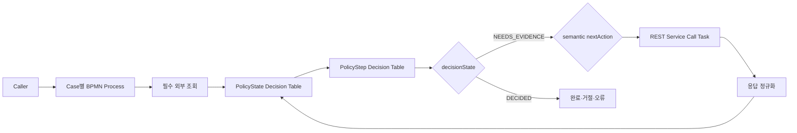
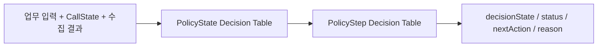
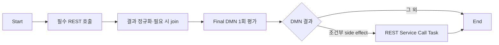

# BAMOE 9.5 고객 규칙 6종 UI 실습 가이드

> **목표**
> 고객이 전달한 슈도 코드를 그대로 도형으로 옮기는 것이 아니라, 업무 정책은 DMN으로 관리하고 외부 호출과 실행 순서는 BPMN으로 제어하는 `Policy-Driven Orchestration`을 직접 만든다.
>
> **PoC 실행 환경**
> `/Users/jihunkeom/Desktop/projects/2026/SKT/skt_bamoe_party/prelim/test` 하나를 Spring Boot + Maven 기반 BAMOE Workflow Business Service root로 사용한다.
>
> **완료 후 보여줄 수 있는 것**
> 동일한 업무 규칙을 시각적으로 설명하고, DMN이 반환한 업무 의미의 `nextAction`에 따라 불필요한 API가 실제로 생략됐는지 Mock 호출 이력으로 증명하며, 정책 변경 영향을 SCESIM과 Maven build로 회귀 검증할 수 있다.

## 1. 전체 학습 순서

| 순서 | 사례 | 핵심 패턴 | 문서 |
|---:|---|---|---|
| 0 | 환경 준비 | Workflow + Decisions Spring Boot 프로젝트, 공통 검증 기반 | [Case 00](case-00-environment-setup.md) |
| 1 | 서비스 상태 변경 | DB 조회 → 조건부 권한 → 조건부 추가 조회 | [Case 01](case-01-process-service-status-change.md) |
| 2 | 별정서비스 명의변경 | 서비스 조회 → 조건부 단일 권한 | [Case 02](case-02-service-name-change-authority.md) |
| 3 | MMS 발신번호 | 항상 권한 확인 → 판단 → 조건부 대안 처리 | [Case 03](case-03-mms-origin-number-authority.md) |
| 4 | 순차 대체 권한 | 1차 권한 → DMN routing → 조건부 fallback | [Case 04](case-04-csmaux004-005-fallback.md) |
| 5 | 복합 권한 | 권한 2건 수집 → AND 종합 | [Case 05](case-05-csmaux006-007-composite.md) |
| 6 | 유선 일시정지 | 모드·DB·다중 권한·후속 처리 종합 | [Case 06](case-06-wireline-suspension.md) |

처음 시작하면 Case 00을 완료하고 숫자 순서대로 진행한다. 고객 시연에서는 현재
정상·업무 오류 정책 경로까지 구현·검증된 Case 04를 대표 후보로 사용하되, 해당
문서의 기술 실패·UI·OCP Gate까지 다시 통과한 뒤 시연 완료본으로 표시한다.
Case 06은 실제 구현과 모든 Gate를 마친 뒤에만 종합 확장 사례로 추가한다.

### 현재 체크인 자산 상태

| 범위 | 현재 상태 | 완료로 판단하기 전에 할 일 |
|---|---|---|
| Case 01~04 | DMN/BPMN/Mock과 로컬 회귀 자산 구현 | 각 Case의 현재 UI Gate와 OCP E2E 재실행 |
| Case 02 SCESIM | 8개 시나리오는 통과하지만 `reasonMessage` EXPECT가 아직 없음 | Case 02 가이드대로 열과 8개 기대값 추가 |
| Case 05 | DMN/SCESIM/Mock과 BPMN 초안 존재 | REST URL 2개를 service hostname으로, DMN output Name을 `Result`로 UI 교정 |
| Case 06 | 가이드만 존재 | 문서 순서대로 DMN/BPMN/SCESIM/Mock 생성 |
| Fact-ready 대안 | 가이드만 존재 | 필요할 때 별도 이름의 DMN 자산 생성 |

따라서 현재 `clean verify`의 성공은 체크인된 5개 SCESIM 집합이 통과했다는 뜻이지,
Case 02 메시지 열, Case 05 OCP 주소 계약, Case 06 구현까지 끝났다는 뜻은 아니다.
각 Case 문서의 정적 Gate와 E2E Gate를 함께 통과해야 완료로 표시한다.

이번 PoC의 새 프로젝트는 BAMOE 9.5의 `Decisions (Spring Boot + Maven)` Accelerator를 가벼운 seed로 만든 뒤, 같은 BAMOE BOM이 관리하는 `jbpm-with-drools-spring-boot-starter`와 `kogito-rest-workitem`으로 lean straight-through workflow 실행 기반을 구성한다. 기본 `Workflows (Spring Boot + Maven)` Accelerator는 persistence, Data Index/Audit, Jobs, User Task, 보안 등 stateful 예제 구성을 폭넓게 포함하므로 현재 여섯 동기식 사례에는 과하다. 이미 이 저장소처럼 lean 전환을 끝낸 프로젝트는 다시 만들지 않고 Case 00의 호환성 Gate만 통과한다.

팀에서 이 구성을 반복해서 사용하게 되면 검증된 현재 POM을 조직용 custom Accelerator로 만들어 수동 전환 자체를 없애는 것이 최종 형태다.

이번 PoC는 사람 작업이나 장시간 대기가 없는 **Straight-Through Process(STP)**다. IBM Decision Manager Open Edition 범위에서도 Decision/Rule orchestration용 STP Workflow를 사용할 수 있다. Process persistence, User Task, timer와 Management Console이 필요한 장기 실행 프로세스는 IBM Process Automation Manager Open Edition 범위의 별도 확장 단계로 둔다.

> **기존 UI 자산이 있을 때**
>
> 가이드 개편은 사용자가 UI에서 만든 DMN/BPMN을 자동 변경하지 않는다. 각 Case의
> 시작 Gate에서 현재 node, Data Type, Rule row와 새 목표 구조를 비교한다. 0바이트
> 파일, 이전 topology, 잘못된 enum 또는 SCESIM 파일명은 `clean verify` 전에
> 정리한다. 문서에 적힌 과거 상태를 현재 파일의 사실로 가정하지 않는다.

## 2. 이 PoC의 핵심 설계

여섯 사례에 한 가지 구조를 억지로 적용하지 않고 실제 정보 수집 패턴에 따라 두 가지 형태를 사용한다.

### 2.1 패턴 B1: 반복 정책 판정

Case 01, 02, 04, 06처럼 외부 결과가 단계적으로 준비되는 사례에 사용한다.



DMN은 먼저 현재 조합을 `PolicyState`로 분류하고, 그 상태를 구조화된
`PolicyStep`으로 변환한다.



`PolicyState`는 `NEEDS_AUTHORITY`, `NEEDS_PROMOTION`, `AUTHORITY_DENIED`,
`ALLOWED`, `INCONSISTENT`처럼 고객이 읽을 수 있는 사례별 enum이다. boolean
`EvidenceConsistent`와 긴 다중분기 FEEL로 상태 조합을 숨기지 않는다.

DMN은 매 평가마다 하나의 구조화된 `PolicyStep`을 반환한다.

| 필드 | 의미 |
|---|---|
| `decisionState` | `"NEEDS_EVIDENCE"` 또는 `"DECIDED"` |
| `status` | 최종 판정일 때 `ALLOW`, `DENY`, `SYSTEM_ERROR`, `INVALID_INPUT`; 증거 수집 중에는 `null` |
| `nextAction` | `CHECK_ORDAUX227`, `LOOKUP_PROMOTION_COUNT` 같은 업무 의미의 다음 행동 |
| `reasonCode`, `reasonMessage` | 현재 단계 또는 최종 결과의 안정적인 설명 |

아직 호출하지 않은 상태는 `CallState = "NOT_REQUESTED"`와 결과 `null`로 표현한다.
REST 응답 mapping이 성공하면 `CallState = "COMPLETED"`와 정규화된 결과를 함께
설정한다. 필요한 외부 결과가 아직 준비되지 않은 것은 입력 오류가 아니므로
`INVALID_INPUT`이 아니라 `NEEDS_EVIDENCE + nextAction`을 반환한다.

이 패턴에서 같은 DMN 모델을 다시 평가하는 것은 의도된 동작이다. BAMOE 9.5 embedded Business Rule Task가 모델 전체를 평가하더라도 모델의 모든 Decision이 부분 상태에서 유효하고, public facade인 `PolicyStep`도 매번 의미 있는 결과를 낸다. 미완성 최종 결과를 계산하고 무시하는 구조가 아니다.

### 2.2 패턴 B2: 결과 수집 후 한 번 판정

Case 03과 05처럼 필요한 외부 결과가 처음부터 고정된 사례에 사용한다.



호출할지 말지가 정책에 따라 달라지지 않으면 불필요한 routing DMN을 만들지 않는다. DMN은 결과 조합과 우선순위를 담당한다.

### 2.3 책임 분리

| 구성요소 | 담당하는 것 | 담당하지 않는 것 |
|---|---|---|
| DMN | 업무 조건, 필요한 외부 증거, 의미 있는 다음 행동, 결과 조합, 최종 상태와 사유 | URL, HTTP 호출, timeout, retry, 실제 상태 변경 |
| BPMN | 호출 순서, 조건부 호출, fallback, join, 기술 오류 흐름, side effect | 복잡한 업무 조건을 Gateway마다 재작성 |
| Mock / Adapter | 외부 계약, URL·인증·payload 변환, 응답 정규화, 호출 journal | 업무 허용·거절 정책 |
| SCESIM | DMN 경계값·조합·우선순위 회귀 테스트 | API 호출 횟수나 BPMN 순서 검증 |

BPMN Gateway에는 다음과 같은 고객 조건을 다시 쓰지 않는다.

```text
serviceCode = "P" and serviceTypeCode = "72"
```

대신 DMN이 반환한 의미 있는 `nextAction`이나 최종 상태만 사용한다.

```text
CHECK_ORDAUX227
LOOKUP_PROMOTION_COUNT
REQUEST_CSMAUX005
ALTERNATIVE_PROCESSING
EXECUTE_SUSPENSION
```

업무 조건을 한 곳에 모아야 정책 변경 시 DMN과 BPMN이 서로 다르게 동작하는 문제를 피할 수 있다.

`nextAction`에는 BPMN node ID, localhost URL 또는 Mock scenario를 넣지 않는다. 업무 의미는 DMN에, 실제 endpoint와 연결 방식은 BPMN/Adapter에 둔다.

### 2.4 하나의 거대한 범용 Process는 만들지 않는다

- 고객 유즈케이스마다 읽기 쉬운 BPMN Process 하나를 둔다.
- 각 Process에서 호출하는 권한명과 업무 단계는 화면에 명시적으로 보이게 한다.
- 실제 고객 API의 차이는 Adapter에서 공통 형식으로 정규화한다.
- 반복 패턴이 안정된 후에만 Called Process나 공통 Subprocess로 추출한다.

PoC에서 호출 Task까지 숨겨 버리면 고객이 순서·생략·fallback을 확인하기 어렵다. 반대로 URL·인증·raw 응답 변환까지 모든 BPMN에 복사하면 운영 관리가 어려워진다. 따라서 **Task는 보이게 하고 연동 구현은 공유하는 구조**를 사용한다.

## 3. 두 종류의 입력 계약

각 케이스에는 서로 목적이 다른 두 입력이 존재한다.

### 3.1 DMN component 입력

DMN의 `Request`에는 이미 정규화된 DB/API 결과를 넣을 수 있다.

```text
업무 입력
+ serviceCode, dummyServiceYn 같은 조회 결과
+ ordAux227Result 같은 권한 결과
```

이 입력은 다음 용도로만 사용한다.

- SCESIM에서 Decision Table을 빠르게 검증
- DMN endpoint로 개별 규칙을 진단
- `/dmnresult`에서 중간 Decision을 확인

### 3.2 BPMN Process 시작 입력

고객 시연과 실제 연동을 대표하는 Process 요청에는 원래 업무 입력만 전달한다.

```text
requestId
+ 서비스 관리 번호 등 조회 key
+ 상태 변경 코드·사유·채널 등 실제 요청값
+ mockScenario                 # 개발/테스트 전용
```

다음 값은 Process caller가 보내지 않는다.

- DB 조회 결과
- 권한 결과
- 프로모션 건수
- 더미 서비스 여부
- BPMN이 계산할 routing 결과

`mockScenario`는 고객 업무 필드가 아니다. 실제 시스템 연결 시 제거하고, 테스트 profile 또는 Mock 사전 설정으로 대체한다.

## 4. 공통 PoC 데이터 계약

### 4.1 `AuthResult`

각 DMN 파일에서 base type `string`인 custom type으로 만든다.

```feel
"GRANTED", "DENIED", "ERROR"
```

| 값 | 의미 |
|---|---|
| `GRANTED` | 권한 있음 |
| `DENIED` | 정상 응답이지만 권한 없음 |
| `ERROR` | 외부 시스템이 정상 HTTP 응답 안에서 반환한 legacy 오류 결과 |

호출하지 않은 상태는 `AuthResult`에 가짜 값을 넣지 않고 별도의 `CallState`와
결과 `null`로 표현한다. 호출하지 않은 결과를 승인이나 거절로 꾸미지 않는다.

### 4.2 `CallState`

```feel
"NOT_REQUESTED", "COMPLETED"
```

| 값 | 결과 필드 계약 |
|---|---|
| `NOT_REQUESTED` | 결과는 `null` |
| `COMPLETED` | 결과는 해당 결과 enum 또는 정상 조회값 |

HTTP 4xx·5xx, timeout, malformed JSON은 `COMPLETED`로 바꾸지 않는다. BPMN의
기술 오류 경로로 보낸다.

### 4.3 사례별 `PolicyState`

`PolicyState`는 기술 실행 상태가 아니라 현재 fact 조합의 업무 의미다. 하나의
거대한 공통 enum을 만들지 않고 Case별로 필요한 값만 정의한다.

```text
Case01: NEEDS_AUTHORITY, NEEDS_PROMOTION, AUTHORITY_DENIED, ALLOWED, INCONSISTENT
Case04: FALLBACK_REQUIRED, PRIMARY_GRANTED, FALLBACK_DENIED, UNEXPECTED_FALLBACK_CALL
Case06: NEEDS_ORDAUB102, NEEDS_ORDAUB164, NEEDS_ORDAUB103, BASE_READY, INVALID_EVIDENCE
```

상태 이름만 읽어도 고객이 현재 단계와 이유를 설명할 수 있어야 한다. 여러 입력을
조합해 `PolicyState`를 만드는 Decision Table에는 마지막 fail-closed 행을 두고,
구체적인 정상 행을 위에 배치한 `First` hit policy를 사용한다.

### 4.4 `PolicyDecisionState`

단계적 증거 수집과 최종 판정을 구분한다.

```feel
"NEEDS_EVIDENCE", "DECIDED"
```

| 값 | 의미 |
|---|---|
| `NEEDS_EVIDENCE` | 정책을 완료하려면 DMN이 지정한 외부 증거가 더 필요함 |
| `DECIDED` | 현재 입력으로 최종 업무 판정이 끝남 |

`NEEDS_EVIDENCE`는 장기 실행 Process instance의 상태나 비동기 `PENDING`을 뜻하지 않는다. 동일한 동기 요청 안에서 BPMN이 다음 외부 호출을 수행해야 한다는 정책 결과다.

### 4.5 `DecisionStatus`

```feel
"ALLOW", "DENY", "SYSTEM_ERROR", "INVALID_INPUT"
```

| 값 | 의미 |
|---|---|
| `ALLOW` | 업무 처리 계속 가능 |
| `DENY` | 정상적인 업무 거절 |
| `SYSTEM_ERROR` | 외부 권한 결과의 legacy `ERROR` 등 업무적으로 표현할 시스템 오류 |
| `INVALID_INPUT` | 필수 입력 누락 또는 불가능한 상태 조합 |

HTTP 4xx·5xx, connection failure, timeout, malformed JSON은 위 enum으로 억지 변환하지 않는다. REST Service Task의 기술 실패로 처리하고 BPMN Error Boundary 경로에서 종료한다.

### 4.6 공통 `PolicyStep`

Case 01·02·04·06의 `Result`는 DMN의 public facade인 `PolicyStep` 역할을 하며 다음 필드를 가진다.

| 필드 | 의미 |
|---|---|
| `decisionState` | `NEEDS_EVIDENCE` 또는 `DECIDED` |
| `status` | `DECIDED`일 때의 최종 상태. `NEEDS_EVIDENCE`일 때는 `null` |
| `reasonCode` | 테스트와 연계에서 사용할 안정적인 단계/결과 코드 |
| `reasonMessage` | 사람이 읽는 설명 |
| `nextAction` | BPMN이 수행할 업무 의미의 다음 행동 |

Case 03·05는 외부 결과를 모두 모은 뒤 한 번 평가하므로 `decisionState` 없이 기존
최종 `Result`만 사용해도 된다. 사례별로 실제 Process가 사용하는
`alternativeProcessingRequired` 같은 필드만 추가하며, 구현하지 않은 출력 계약을
설명에만 만들지 않는다.

Case 01·02의 DMN node 이름은 기존 실습 자산과의 호환을 위해 `Result`로 유지하지만,
그 **의미 역할은 `PolicyStep`**이다. `decisionState = NEEDS_EVIDENCE`인 `Result`는
최종 허용·거절이 아니라 BPMN에 주는 중간 실행 지시이고,
`decisionState = DECIDED`일 때만 terminal policy result다. Process caller가 받는
최종 계약은 DMN node 이름이 아니라 `processResponse.policyResult`다.

운영 확장 시에는 Process 응답이나 구조화 로그에 `requestId`, artifact version, Git SHA를 함께 남긴다. 업무 결과 문구보다 `reasonCode`를 자동 테스트의 기준으로 사용한다.

### 4.7 외부 호출 상태

- 권한 호출 전: `CallState = "NOT_REQUESTED"`, 결과 `null`
- 권한 HTTP 200 정상 body 수신 후: `CallState = "COMPLETED"`와
  `GRANTED`, `DENIED`, `ERROR` 중 하나
- HTTP 4xx·5xx, timeout, malformed body: DMN에 결과를 넣지 않고 BPMN 기술 오류 경로
- 숫자·조회 결과도 동일한 `CallState`를 사용한다.

예를 들어 `promotionCallState = "NOT_REQUESTED"`이면 건수는 `null`이어야 한다.
`promotionCallState = "COMPLETED"`인데 건수가 `null`이면 응답 계약 오류이므로
mapping Script가 DMN 전에 차단한다.

### 4.8 Process 응답 envelope

DMN component 응답과 고객용 Process 응답을 구분한다. 정상 Process는 다음 모양을 기본으로 한다.

```json
{
  "requestId": "C01-001",
  "executionState": "COMPLETED",
  "policyResult": {
    "decisionState": "DECIDED",
    "status": "ALLOW",
    "nextAction": "CONTINUE",
    "reasonCode": "STATUS_CHANGE_ALLOWED",
    "reasonMessage": "..."
  }
}
```

REST transport 실패에서는 아직 정책이 결정되지 않았으므로 가짜 `SYSTEM_ERROR`나 `DECIDED`를 만들지 않는다.

```json
{
  "requestId": "C01-001",
  "executionState": "TECHNICAL_FAILURE",
  "failedOperation": "ORDAUX227",
  "errorCode": "ORDAUX227_HTTP_500"
}
```

Error Boundary를 구성하지 않은 기본 실습에서는 두 번째 envelope 대신 Process POST 자체가 5xx로 실패할 수 있다. 어느 방식을 택하더라도 기술 실패를 DMN `DecisionStatus`에 섞지 않는다.

## 5. 프로젝트 구조와 포트

아래는 여섯 실습을 모두 끝냈을 때의 **목표 구조**다. 현재 Case보다 뒤에 있는
DMN/BPMN/SCESIM/Mock 파일이 아직 없는 것은 정상이며, 각 문서의 UI 절차에서
순서대로 만든다. 반대로 파일 이름만 있고 크기가 0 byte이면 생성 완료로 보지 않는다.

```text
test/
├── README.md
├── case-00-environment-setup.md
├── case-01-process-service-status-change.md
├── case-02-service-name-change-authority.md
├── case-03-mms-origin-number-authority.md
├── case-04-csmaux004-005-fallback.md
├── case-05-csmaux006-007-composite.md
├── case-06-wireline-suspension.md
├── mock-server/
│   ├── case01_mock_server.py
│   ├── case02_mock_server.py
│   ├── case03_mock_server.py
│   ├── case04_mock_server.py
│   ├── case05_mock_server.py
│   └── case06_mock_server.py
├── config/
│   └── settings-bamoe-container.xml
├── pom.xml
└── src/
    ├── main/
    │   ├── java/org/acme/
    │   │   ├── BamoeSpringBootApplication.java
    │   │   └── BamoeCorsConfig.java
    │   └── resources/
    │       ├── application.properties
    │       ├── dmn/
    │       │   ├── Case01ServiceStatusChange.dmn
    │       │   ├── Case02WirelineNameChange.dmn
    │       │   ├── Case03MmsSendAuthority.dmn
    │       │   ├── Case04FallbackAuthority.dmn
    │       │   ├── Case05CompositeAuthority.dmn
    │       │   └── Case06WirelineSuspension.dmn
    │       └── bpmn/
    │           ├── Case01ServiceStatusChangeProcess.bpmn
    │           ├── Case02WirelineNameChangeProcess.bpmn
    │           ├── Case03MmsSendProcess.bpmn
    │           ├── Case04FallbackProcess.bpmn
    │           ├── Case05CompositeAuthorityProcess.bpmn
    │           └── Case06WirelineSuspensionProcess.bpmn
    └── test/
        ├── java/testscenario/TestScenarioJunitActivatorTest.java
        └── resources/scesim/
            ├── Case01ServiceStatusChangeTest.scesim
            ├── Case02WirelineNameChangeTest.scesim
            ├── Case03MmsSendAuthorityTest.scesim
            ├── Case04FallbackAuthorityTest.scesim
            ├── Case05CompositeAuthorityTest.scesim
            └── Case06WirelineSuspensionTest.scesim
```

| 구성요소 | 기본 port |
|---|---:|
| BAMOE Spring Boot | `8080` |
| Case01 Mock | `8091` |
| Case02 Mock | `8092` |
| Case03 Mock | `8093` |
| Case04 Mock | `8094` |
| Case05 Mock | `8095` |
| Case06 Mock | `8096` |
| BAMOE Maven Repository | `10099` |

한 번에 실습하는 Case의 Mock만 실행한다. 다른 Case의 Mock을 모두 동시에 띄울 필요는 없다.

로컬과 OCP에서 같은 BPMN을 수정 없이 사용하기 위해 Mock 주소는 다음 계약으로
통일한다.

| 호출 주체 | 사용할 주소 | 이유 |
|---|---|---|
| BPMN REST Service Task | `http://customer-rule-mock:<Case port>/...` | 로컬에서는 `/etc/hosts`, OCP에서는 같은 이름의 Service가 해석 |
| Mac terminal의 `curl`·journal 확인 | `http://127.0.0.1:<Case port>/...` | 호출 주체가 Mac 자체이므로 loopback 사용 |
| Mock server bind address | `0.0.0.0` | Mac loopback과 container Pod 양쪽에서 수신 가능 |

따라서 BPMN URL에는 `localhost`나 `127.0.0.1`을 넣지 않는다. 컨테이너 안에서
그 주소는 Mock이 아니라 **Business Service 컨테이너 자신**을 뜻한다. Case 00의
`customer-rule-mock` 로컬 hostname 설정을 한 번 마치면 Case 01~06에서 같은
규칙을 재사용할 수 있다.

### 5.1 사례별 최종 아키텍처

| Case | DMN에서 보여줄 핵심 | 평가 방식 | BPMN에서 보여줄 핵심 |
|---:|---|---|---|
| 01 | 상태·권한·프로모션 조합을 `PolicyState` 표로 분류 | `PolicyState + PolicyStep` 반복 | 서비스 조회 후 조건부 ORDAUX227, 승인·F1일 때만 프로모션 조회 |
| 02 | 대상 여부와 권한 수집 상태를 표로 분류 | `PolicyState + PolicyStep` 2단계 | 서비스 정보 조회 후 대상일 때만 ORDAU1520 |
| 03 | 권한 결과·번호 사용 가능 여부·접두어 조합 | 결과 수집 후 최종 DMN 1회 | `DENIED`를 오류로 보지 않고 번호 정책에 따라 대체 처리 |
| 04 | 004 결과와 fallback 상태를 `PolicyState` 표로 분류 | `PolicyState + PolicyStep` 최대 2회 | 004 `DENIED`일 때만 005 fallback |
| 05 | 006/007 AND 조합과 오류 우선순위 | 두 결과 수집 후 최종 DMN 1회 | 원문 순차/병렬 충돌을 공개한 순차 baseline과 공통 기술 오류 경계 |
| 06 | dummy·102·164·103 상태와 기간 정책 | ONLINE `PolicyState + PolicyStep` 반복 | 102 → 필요 시 164 → 조건부 103 → 허용 시 suspend side effect |

Case 01·02·04·06도 DMN 파일은 기본적으로 하나씩 유지한다. 단일 모델의 public facade가 모든 부분 상태에서 완전한 `PolicyStep`을 반환할 수 없을 만큼 커지거나, 단계별 소유팀·배포주기·재사용 계약이 실제로 분리될 때만 stage별 DMN으로 나눈다.

## 6. 공통 UI 작성 원칙

### 6.1 DMN

1. `.dmn` 파일을 `Modern BAMOE DMN Editor`로 연다.
2. Input Data node는 `Request`로 통일한다.
3. 모든 Decision의 output type을 명시한다.
4. 계산·정규화처럼 짧고 분기 없는 로직만 Literal Expression으로 작성한다.
5. 여러 입력 조합이나 세 개 이상의 분기는 `PolicyState` 또는 결과 Decision Table로
   표현한다.
6. 조건부 외부 호출은 boolean보다 업무 의미가 드러나는 `nextAction` enum을 우선한다.
7. 부분 정보가 정상적인 단계라면 `INVALID_INPUT` 대신 `NEEDS_EVIDENCE`를 반환한다.
8. public output은 구조화된 `PolicyStep` 또는 최종 `Result` 하나로 둔다.
9. 사례별 Decision Service 하나에 그 public output만 Output Decision으로 넣어 외부 API 경계를 표현한다.
10. helper Decision은 모두 부분 입력에서 오류 없이 평가 가능한 total function으로 만든다.
11. DMN 안에서 HTTP, DB, Java side effect를 실행하지 않는다.

여기서 “모든 Decision의 output type”은 DRD의 **Decision node**에 지정하는
`Decision Output data type`을 뜻한다. 이 프로젝트에서 출력이 하나뿐인 Decision
Table은 **단일 Output column Data Type에도 같은 enum/custom type을 지정**한다.
현재 사용 중인 BAMOE `9.5.0-ibm-0005` Editor가 저장한 실제 모델과 빌드·실행
결과를 기준으로 이 형태를 유지한다. 일반 DMN validator가 중복 type 관련 warning을
내더라도 그것만 보고 `<Undefined>`로 바꾸지 말고, BAMOE build와 SCESIM/endpoint
결과를 함께 확인한다. 여러 output column으로 구조체를 만드는 결과 표는 각 열의
field type을 표대로 지정한다.

Decision Service 자체에 별도 output type을 지정하는 것이 아니라 Output Decisions에 포함된 Decision의 output type으로 응답이 정해진다.

BAMOE 9.5 build에서 Decision Service variable의 type reference가 없다는 warning이 보일 수 있다. UI에 Decision Service 자체의 output type을 억지로 만들지 않는다. Output Decision의 type, service membership, `BUILD SUCCESS`와 실제 endpoint schema를 함께 확인한다.

IBM DMN 문서는 Decision Service를 BPMN에서 호출 가능한 재사용 경계로 설명하지만, 이 실습의 BAMOE `9.5.0-ibm-0005` Modern BPMN Editor는 Business Rule Task에서 DMN file/namespace/model만 선택하고 특정 Decision Service selector를 제공하지 않는다. 현재 embedded 실행도 선택한 모델을 `evaluateAll()` 한다. 따라서 Decision Service 여러 개를 만들어 실행 범위가 분리될 것이라고 가정하지 않는다.

이번 가이드의 단일 `PolicyStep` 모델은 이 동작을 전제로 설계한다. 모델 전체가 하나의 정책 생명주기만 포함하고, 모든 helper와 facade가 현재까지 수집된 사실에 대해 의미 있는 결과를 내야 한다. 전혀 다른 업무 Decision을 같은 파일에 추가하지 않는다.

### 6.2 BPMN

1. `src/main/resources/bpmn` 아래에 케이스별 파일을 만든다.
2. Process ID와 파일명을 문서대로 지정한다.
3. REST 호출은 `REST Service Call Task`를 사용한다.
4. 응답은 process variable로 매핑한 뒤 DMN Request를 구성한다.
5. 복잡한 조건은 Gateway expression에 쓰지 않고 DMN routing 결과를 사용한다.
6. HTTP 오류는 DMN 업무 결과로 바꾸지 않고 REST Task의 기술 실패로 유지한다. 구조화된 기술 실패 응답이 필요하면 runtime에서 검증한 Error code로 Error Boundary Event를 선택적으로 추가하고, 그렇지 않으면 Process HTTP 5xx로 관측한다.
7. 최종 side effect는 `ALLOW`에서만 실행한다.
8. side effect 재시도 전에는 `requestId` 기반 idempotency 계약을 확인한다.

Gateway의 Condition expression은 Java Script Task와 달리 **MVEL**로 평가된다.
Java Script에서 유효한
`java.lang.Boolean.TRUE.equals(someFlag)`를 Gateway에 그대로 붙여 넣으면
MVEL이 `java`를 변수 이름으로 해석하여 runtime 500이 날 수 있다. boolean
Process Variable은 `someFlag == true` 또는 `someFlag == false`로 비교한다.
Java Script Task 안의 null-safe Java 표현까지 바꿀 필요는 없다.

BPMN을 저장한 뒤 전체 Case에 다음 공통 Gate를 실행한다.

```bash
if rg -n -U \
  '<conditionExpression[^>]*>[^<]*(java\.(lang|util)\.|Boolean\.(TRUE|FALSE)|kcontext\.)' \
  src/main/resources/bpmn
then
  echo "[INVALID] Gateway MVEL에 Java 전용 표현이 있습니다."
else
  echo "[OK] Gateway conditions contain no Java-only syntax"
fi
```

`[OK]`가 나와야 한다. 이 검사는 Java Script Task의 코드를 검사하지 않고
`conditionExpression`만 검사하므로, Script 안의 `java.util.Map`,
`java.lang.Boolean.TRUE.equals(...)`, `kcontext.getVariable(...)`은 그대로 둔다.
`clean verify`는 MVEL expression을 생성 소스에 넣고 compile할 수는 있어도 각
Gateway branch를 실제 데이터로 평가하지 않는다. 따라서 이 Gate와 각 Case의
Process E2E를 모두 통과해야 한다.

이번 프로젝트의 `BamoeSpringBootApplication`은 `org.acme.**`를 component scan
대상으로 포함하므로 여섯 BPMN Package를 `org.acme.case01`부터
`org.acme.case06`으로 통일한다. `com.example...` 같은 다른 Package로 바꾸려면
application의 `scanBasePackages`도 함께 수정하고 OpenAPI에서 Process endpoint가
실제로 등록됐는지 확인해야 한다. BPMN 파일이 build됐다는 사실만으로 Spring
endpoint 등록까지 가정하지 않는다.

환경별 token·timeout은 production에서 BPMN XML에 고정하지 않고
`application.properties` 또는 환경 변수로 외부화한다. 이 PoC의 Mock hostname은
환경 공통 이름인 `customer-rule-mock`으로 고정하고, 로컬 `/etc/hosts`와 OCP
Service가 각각 실제 목적지를 해석한다.

Java Script Task에서는 Process Variable과 같은 이름의 지역변수를 새로 선언하지
않는다. BAMOE/Kogito codegen이 Script 실행 블록 앞에서 참조 가능한 Process
Variable을 같은 Java 이름으로 자동 바인딩하기 때문이다. 예를 들어 Process
Variable이 `requestId`, `authRequest`라면 다음 선언은 사용하지 않는다.

```java
String requestId = (String) kcontext.getVariable("requestId");
java.util.Map authRequest = new java.util.LinkedHashMap();
```

대신 Java 지역변수에 충돌하지 않는 이름을 사용한다. 따옴표 안의 Process Variable
key는 바꾸지 않는다.

```java
String incomingRequestId =
    (String) kcontext.getVariable("requestId");
java.util.Map authPayload = new java.util.LinkedHashMap();

authPayload.put("requestId", incomingRequestId);
kcontext.setVariable("authRequest", authPayload);
```

Process Variables dialog에서 각 변수의 `Tags` 또는 `Custom Tags`를 지정한다.

| 변수 종류 | Tags | REST 계약 |
|---|---|---|
| `requestId` 같은 필수 correlation/idempotency 값 | `input,required,readonly` | 요청에만 노출, 최초 입력 뒤 재할당 금지 |
| DMN이 누락 여부를 판정할 업무 입력 | `input,readonly` | 요청에만 노출. `required`를 붙이지 않아 DMN의 `INVALID_INPUT`까지 도달 |
| 첫 외부 조회 자체에 반드시 필요한 key | `input,required,readonly` 또는 Script에서 명시적으로 검증 | 사례별 실패 계약에 따라 선택 |
| 선택 입력인 `mockScenario` | `input` | 요청에만 노출, 기본값 사용 가능 |
| 최종 `processResponse` | `output` | 응답에만 노출 |
| REST raw request/response, DMN Request, `PolicyStep`, routing 값 | `internal` | OpenAPI request/response에서 숨김 |

태그가 없는 Process Variable은 기본적으로 input과 output 양쪽에 노출될 수 있다. 따라서 외부 caller가 `ordAux227Result`, `decisionRequest` 같은 내부 값을 주입하거나 raw response가 반환되지 않도록 태그를 완료한 후 OpenAPI schema를 확인한다. `internal`과 `required`처럼 서로 모순되는 태그를 함께 쓰지 않는다.

`input`과 `output`을 같은 변수에 함께 붙이면 생성 요청·응답 모델 양쪽에서 모두 빠지므로 함께 사용하지 않는다. `readonly`는 최초 non-null 값이 설정된 뒤 다시 할당하려 하면 runtime 오류가 나므로 caller 원본에만 사용하고 기본값을 채우는 `mockScenario`에는 붙이지 않는다. `business-relevant`와 `tracked`는 OpenAPI 노출 제어가 아니며 이벤트/모니터링 구성이 없는 이번 STP PoC에서는 사용하지 않는다.

`required`도 모든 업무 입력에 기계적으로 붙이지 않는다. 이 태그가 먼저 요청을 거절하면 DMN의 `INVALID_INPUT` 행과 `reasonCode`를 시연할 수 없다. 요청 계층에서 반드시 차단할 값과 정책이 설명해야 할 값을 사례별로 구분한다.

이 실습은 UI 작업을 기준으로 한다. Canvas 빈 곳에서 Process를 선택한 뒤 Properties → Process Data/Variables 표의 `Tags` multiselect를 사용한다. 태그 입력란이 보이지 않으면 BPMN XML을 손으로 고치지 말고 Developer Tools 9.5 확장과 Modern Editor를 먼저 확인한다.

#### REST request body를 연결하는 정확한 방법

이 버전의 Data mapping dialog에서 Inputs가 비어 있는 것은 정상이다. 그러나 **일반 Input mapping의 Name에 `ContentData`를 입력하면 안 된다.**

`ContentData`는 REST Service Task의 예약 속성이다. 일반 mapping 행에 `ContentDat`까지 입력한 뒤 마지막 `a`를 입력하면 editor가 그 이름을 예약 속성으로 인식하여 일반 목록에서 숨긴다. 길이 제한이나 삭제가 아니라 전용 REST Properties에서 관리할 항목을 일반 목록에서 감추는 동작이다.

request body는 두 단계로 연결한다. 예를 들어 process variable이 `serviceLookupRequest`라면 다음과 같다.

1. `Data mapping` → Inputs → `Add Input data mapping`을 누른다.
2. 일반 task input을 다음과 같이 만든다.

   | UI 열 | 설정 |
   |---|---|
   | Name | `serviceLookupRequest` |
   | Data Type | `java.util.Map` |
   | Source 종류 | `Var` |
   | Source에서 선택할 Process Variable | `serviceLookupRequest` |

   이전 메모에서 `Var/serviceLookupRequest`처럼 적힌 표기를 보더라도 이것은
   **Source 종류와 선택 변수**를 함께 나타낸 축약일 뿐 Data Type이 아니다.
   현재 가이드의 설정표는 오해가 없도록 `Data Type`, `Source 종류`,
   `Process Variable`을 서로 다른 열로 적는다. Data Type dropdown에서
   `Var/...`를 찾지 않는다.

3. `Save`로 dialog를 닫는다.
4. REST Task의 Method를 `POST`로 지정한다. `Content Data`는 `POST`, `PUT`, `PATCH`에서만 보인다.
5. 오른쪽 REST 전용 Properties의 **Content Data** 편집기에
   ` #{serviceLookupRequest}`를 입력한다. **첫 글자는 실제 공백 한 칸**이다.
   BAMOE Developer Tools `9.5.0-ibm-0005`의 Modern Editor에서 공백 없이
   `#{serviceLookupRequest}`만 입력하면 생성 코드에 `serviceLookupRequest`라는
   문자열 literal이 남을 수 있다. 선행 공백을 포함하면 runtime이 실제 Map을
   평가한다.
6. REST 전용 Headers에는 `Accept = application/json` 한 행만 추가한다.
   `Content-Type`은 추가하지 않는다. 이 Spring codegen 버전에서는
   `HEADER_Content-Type`의 하이픈이 생성 Java 식별자에 들어가 build를 깨뜨릴 수
   있다. `ContentData`가 Map이면 REST handler가 JSON으로 직렬화하면서 요청의
   Content-Type을 자동 설정한다.
7. 다시 Data mapping을 열었을 때 일반 Input에는 `serviceLookupRequest`만 보이는 것이 정상이다. 내부 예약 input `ContentData`는 editor가 숨긴다.
8. Output은 기존 `Result`의 Data Type을 `java.util.Map`으로 바꾸고 Target에서 response process variable을 선택한다.

다른 Case도 같은 구조다.

| 일반 Input Name / Source variable | Content Data 값 |
|---|---|
| `authRequest` | ` #{authRequest}` |
| `promotionRequest` | ` #{promotionRequest}` |
| `alternativeRequest` | ` #{alternativeRequest}` |
| `adapterRequest` | ` #{adapterRequest}` |
| `suspendRequest` | ` #{suspendRequest}` |

위 표의 모든 `Content Data` 값은 `#` 앞에 실제 공백 한 칸이 있다. 화면에서
구분하기 어려우면 먼저 Space 키를 한 번 누른 뒤 `#{alias}`를 입력한다.

> **버전 호환성 메모:** 일반 HTTP/IBM 제품 원칙을 바꾼 것이 아니라, 이 Lab의
> `BAMOE 9.5.0-ibm-0005 + Spring + Modern Editor/codegen` 조합에서 확인한
> 우회다. Editor가 Content-Type 누락 경고를 표시해도 실제 Map은 JSON
> `sendJson` 경로에서 wire header가 설정되므로 이 Lab에서는 진행한다. BAMOE
> fix pack이나 editor 버전을 바꾸면 수동 `Content-Type` 지원 여부와 선행 공백
> 필요 여부를 다시 검증한다.

실수로 일반 mapping Name에 `ContentData`를 입력해 행이 사라졌다면 아직 저장하지 않은 상태에서는 dialog 오른쪽 위 `X`로 닫고 다시 연다. 이미 저장했다면 Method를 잠시 `GET`으로 바꿨다가 다시 `POST`로 돌려 기존 body 예약값을 비운 후 위 순서로 다시 설정한다.

runtime에서는 editor가 만든 고정 input 이름 `ContentData`를 BAMOE REST Work Item이 읽는다. 사용자는 이 예약 이름을 직접 만들거나 줄여 쓰는 대신, 전용 `Content Data` 속성에 선행 공백을 포함한 ` #{일반 task input}`을 설정한다. 정상 runtime 로그는 `ContentData={...}`이고, `ContentData=alias이름`이면 Map이 아니라 문자열이 전달된 잘못된 상태다.

동적 HTTP header도 같은 원칙을 사용한다. 예를 들어 Case03의 idempotency key는
일반 Input의 Name을 `alternativeIdempotencyKey`, Data Type을 `String`, Source
종류를 `Var`, 선택할 Process Variable을 `alternativeIdempotencyKey`로 설정한다.
그다음 REST 전용 Headers 표에는 `Name = IdempotencyKey`,
`Value =  #{alternativeIdempotencyKey}`를 입력한다. Value의 첫 글자도 실제 공백
한 칸이다. 내부 예약 이름 `HEADER_IdempotencyKey`를 일반 Data Mapping Name으로
직접 만들지 않는다.

위 문장을 UI 열로 풀면 다음과 같다.

| UI 열 | 설정 |
|---|---|
| Name | `alternativeIdempotencyKey` |
| Data Type | `String` |
| Source 종류 | `Var` |
| Source에서 선택할 Process Variable | `alternativeIdempotencyKey` |

REST 전용 `Content Data`에는 JSON body Map을 연결하고, REST 전용 Headers에는
header용 문자열을 연결한다. Case03의 `performAlternativeProcessing`에서는
`Content Data =  #{alternativeRequest}`이고
`IdempotencyKey =  #{alternativeIdempotencyKey}`다. 두 값을 서로 바꾸지 않는다.

여기서 제거하는 것은 **BPMN이 외부 API로 보내는 REST Task의 수동
`Content-Type` header**다. Process/DMN endpoint를 호출하는 `curl`의
`-H 'Content-Type: application/json'`과 Mock 서버가 JSON 응답에 설정하는
`Content-Type`은 올바르므로 그대로 유지한다.

### 6.3 SCESIM

- GIVEN: DMN `Request`의 업무값과 정규화된 외부 결과
- EXPECT: public `PolicyStep` 또는 최종 `Result`; 상태 분류를 설명해야 하는
  시나리오에서만 `PolicyState` helper를 추가
- 필수 결과 EXPECT: `status`, `nextAction`, `reasonCode`, `reasonMessage`.
  `NEEDS_EVIDENCE`처럼 `status`가 null인 중간 상태도 `reasonMessage`는 정확한
  문구를 검증한다.
- 문자열 cell: 큰따옴표가 포함된 FEEL 문자열
- null cell: GIVEN과 EXPECT 모두 `null`을 사용한다. BAMOE 9.5에서는
  EXPECT의 `? = null`도 같은 unary test로 동작하지만, 이 가이드는 간단한
  `null` 표기로 통일한다. 빈 EXPECT cell은 검증 생략이다.
- 공용 activator: `TestScenarioJunitActivatorTest.java` 하나

각 SCESIM scenario의 `reasonMessage` cell에는 Case별 표에 적힌 문구를
큰따옴표까지 포함해 직접 입력한다. 빈 cell은 메시지 null 검증이 아니라 assertion
생략이므로 허용하지 않는다. `reasonCode`로 메시지를 자동 추론하지도 않는다.
특히 Case 06처럼 같은 reasonCode라도 정책 상태에 따라 메시지가 다른 행이 있다.

SCESIM은 DMN component test다. API가 호출됐는지, fallback이 생략됐는지는 Process 실행과 Mock journal로 별도 확인한다.

`mvn ... clean verify`도 DMN/SCESIM과 BPMN code generation을 검증할 뿐, 각
Process의 REST Task를 실제 Mock에 보내지는 않는다. 따라서 `BUILD SUCCESS`는
필수 Gate이지만 E2E 완료 증거는 아니다. 각 Case의 Spring 서버·Mock 서버·Process
payload·journal 검증까지 통과해야 REST body, header, 호출 생략과 순서가
검증된다.

BAMOE 9.5에서는 Test Scenario UI 편집이 **BAMOE Developer Tools for VS Code에서만** 지원되고 BAMOE Canvas에서는 지원되지 않는다. 또한 9.5 UI의 Test Scenario tooling은 DMN 기반 시나리오를 대상으로 한다. 이번 6개 사례에서 DRL을 억지로 섞지 않는 이유 중 하나다.

반복 정책 사례의 SCESIM에는 최종 결과만 넣지 않는다. 최소한 다음 상태 전이를 각각 검증한다.

1. 필요한 외부 결과의 `CallState`가 `NOT_REQUESTED`이면
   `NEEDS_EVIDENCE + 정확한 nextAction`
2. 응답이 들어오면 다음 증거 요청 또는 `DECIDED`
3. 비대상 단계에 외부 결과가 주입되면 `INVALID_INPUT`
4. 모든 정상 경로가 유한 단계 안에 종료됨

## 7. 네 단계 검증

| 단계 | 확인 대상 | 대표 도구 |
|---:|---|---|
| 1 | Decision Table 조합과 경계값 | SCESIM |
| 2 | Mock 요청·응답 계약 | Mock 단독 curl |
| 3 | BPMN 결과와 실제 호출 순서·횟수 | Process endpoint + journal |
| 4 | 4xx·5xx·timeout과 업무 `DENIED/ERROR` 분리 | Error scenario |

공통 Maven Gate:

```bash
cd "/Users/jihunkeom/Desktop/projects/2026/SKT/skt_bamoe_party/prelim/test"

mvn -s config/settings-bamoe-container.xml clean verify
```

서버 실행:

```bash
mvn -s config/settings-bamoe-container.xml spring-boot:run
```

실제 endpoint는 다음에서 확인한다.

```text
http://localhost:8080/swagger-ui/index.html
http://localhost:8080/v3/api-docs
```

DMN endpoint는 component 진단용이고, 고객 시연의 주 endpoint는 각 BPMN Process endpoint다. 문서에 적힌 경로를 추측해서 사용하지 말고 OpenAPI에서 실제 생성된 path를 확인한다.

Process curl이 `curl: (22)`를 출력한 뒤 `null`만 보이면 정상 응답이 아니다.
`jq '.processResponse'`가 5xx 오류 JSON에 존재하지 않는 field를 선택해 원인을
가린 것이다. 각 Case의 최신 실행 helper처럼 HTTP status를 별도로 표시하고,
2xx에서는 `processResponse`, 그 외 status에서는 응답 body 전체를 `jq .`로
출력한다. Mock journal만 맞는다고 완료로 판단하지 않는다.

DMN/Decision Service curl도 같은 원칙을 적용한다. 각 curl Terminal에서
`set -o pipefail`을 먼저 실행해 앞단 `curl`의 실패를 pipeline 성공으로 가리지
않는다. 성공 field를 줄여 볼 때도 `if has("reasonCode") ... else . end` 또는
`if has("decisionResults") ... else . end`처럼 기대 계약이 없으면 원문 body를
그대로 출력한다. 따라서 잘못된 Decision Service 이름으로 받은 404나 FEEL 평가
오류가 여러 `null` field로 보이지 않는다.

## 8. PoC 런타임 범위

이번 가이드가 실제로 보여주는 BAMOE 제품 구성은 다음과 같다.

| 영역 | 이번 PoC에서 사용하는 제품·구성 |
|---|---|
| 모델링 | IBM BAMOE Developer Tools 9.5의 Modern DMN/BPMN Editor |
| 규칙 검증 | VS Code의 DMN Test Scenario(SCESIM) Editor와 공용 JUnit activator |
| 실행 | BAMOE `9.5.0-ibm-0005` Spring Boot Business Service |
| 핵심 runtime | `jbpm-with-drools-spring-boot-starter` |
| 외부 연동 | `kogito-rest-workitem`의 REST Service Call Task |
| dependency 공급 | 로컬 IBM BAMOE Enterprise Maven Repository |
| 라이선스 범위 | Decision/Rule orchestration용 straight-through workflow를 포함하는 IBM Decision Manager Open Edition 범위 |

SCESIM 편집은 BAMOE Canvas가 아니라 BAMOE Developer Tools for VS Code에서 진행한다. 이 PoC를 위해 별도의 Management Console이나 stateful workflow 서비스를 설치하지 않는다.

현재 6개 Process는 한 요청 안에서 끝나는 짧은 straight-through workflow로 만든다. 초기 실습에는 다음을 추가하지 않는다.

- Workflow persistence
- Data Index
- Data Audit
- Jobs Service
- User Task
- 장시간 대기와 Message Event

사용자 승인, timer, 애플리케이션 재시작 후 in-flight 복구, 장기 retry가 필요해지면 별도 stateful Workflow 설계로 확장한다. 현재 PoC에 운영 add-on을 모두 넣으면 핵심인 규칙과 호출 제어가 가려진다.

이 선택은 BAMOE 기능을 덜 보여주는 것이 아니라 제품 범위를 정확히 고르는 것이다.

- IBM Decision Manager Open Edition: Decisions, Rules, Test Scenarios와 decision/rule orchestration용 STP Workflow
- IBM Process Automation Manager Open Edition: 위 기능에 stateful Workflow, Management Console 등 장기 실행 기능 추가

이번 고객 규칙은 모두 동기식 권한·조회·판정이므로 STP가 맞다. 고객이 사람 승인, timer, 중단 후 재개, Process instance 관리 화면을 요구할 때만 persistence/Data Index/Data Audit/Management Console 실습을 별도 Phase로 추가한다.

### 8.1 왜 DRL을 사용하지 않는가

여섯 규칙은 현재 입력 집합이 작고, 결과가 결정적이며, 업무 담당자가 표로 검토해야 한다. 따라서 DMN Decision Table과 명시적인 DRD가 가장 적합하다. Case 06 원문 요약의 `Salience`는 구현 후보이지 필수 업무 요구사항이 아니다. DMN의 `First` hit policy와 명시적 행 우선순위가 이 PoC에서는 더 읽기 쉽고 테스트하기 쉽다.

DRL/Rule Unit은 다음 요구가 생길 때 별도 후보로 평가한다.

- 타입이 다른 많은 fact가 계속 추가되고 수정됨
- forward chaining이나 대규모 규칙 집합이 필요함
- 개발자 중심의 고성능 rule service가 필요함

BAMOE 9.5에서는 BPMN과 DRL이 shared KIE session을 사용하지 않으므로 입출력 mapping이 명시적으로 필요하고, Test Scenario UI도 DMN 중심이다. 제품 기능을 보여주기 위해 DRL을 억지로 넣는 것은 이 사례의 유지보수성을 오히려 떨어뜨린다.

### 8.2 고객 시연에서 보여줄 가치

1. DMN Decision Table에서 조건 하나를 UI로 변경한다.
2. SCESIM에서 영향을 받는 조합과 기존 회귀를 즉시 확인한다.
3. BPMN은 수정하지 않고 Process endpoint를 다시 호출한다.
4. Mock journal에서 DMN 변경에 따라 호출된 API와 생략된 API가 달라진 것을 확인한다.
5. HTTP 200 body의 업무 `ERROR`와 HTTP 4xx·5xx·timeout의 기술 실패가 다른 경로임을 보여준다.
6. Swagger/OpenAPI에서 모델로부터 생성된 domain endpoint와 내부 변수 비노출을 확인한다.

## 9. 전체 완료 기준

- [ ] Case00에서 Workflow + Decisions Spring Boot build가 성공했다.
- [ ] DMN 6개와 BPMN 6개를 BAMOE UI로 열 수 있다.
- [ ] Case 01·02·04·06은 긴 consistency FEEL 대신 `PolicyState` Decision Table을
      사용한다.
- [ ] 미호출 상태는 `CallState=NOT_REQUESTED + 결과=null`, 정상 응답 수집 상태는
      `CallState=COMPLETED + 결과` 계약을 지킨다.
- [ ] Case 01·02·04·06의 DMN이 부분 상태에서 `NEEDS_EVIDENCE` 또는 `DECIDED`를 반환한다.
- [ ] Case 03·05는 결과 수집 후 DMN을 한 번만 평가한다.
- [ ] 모든 SCESIM이 공용 activator로 통과한다.
- [ ] 각 Mock의 readiness와 대표 scenario가 통과한다.
- [ ] Process 시작 payload에 외부 조회 결과나 권한 결과가 없다.
- [ ] 시작 입력은 `input`, 최종 응답은 `output`, 중간 변수는 `internal` 태그를 사용한다.
- [ ] Mock journal에서 조건부 호출의 생략·순서·횟수를 확인했다.
- [ ] HTTP 기술 오류와 HTTP 200의 `DENIED/ERROR`가 다른 경로로 처리된다.
- [ ] Case03·06의 side effect가 최종 허용 경로에서만 1회 실행된다.
- [ ] Case05 병렬 여부와 Case06 미확정 계약을 사실처럼 구현하지 않았다.
- [ ] `mvn ... clean verify`가 `BUILD SUCCESS`로 끝난다.
- [ ] 고객에게 `DMN=정책`, `BPMN=흐름`, `Adapter=연동` 책임을 설명할 수 있다.

## 10. 관련 학습 문서

- [첫 DMN UI](../htmls/labs/core/decision-basics.html#s6)
- [고급 DMN 모델링](../htmls/labs/core/dmn-advanced.html#s10)
- [SCESIM과 Decision Service 검증](../htmls/labs/core/decision-validation.html#s11)
- [BPMN에서 DMN 호출](../htmls/labs/core/workflow-modeling.html#s17-4)
- [Mock 외부 시스템](../htmls/labs/telco/mocks.html#s7)
- [BPMN REST 호출 후 DMN 사용](../htmls/labs/telco/workflow-integration.html#s8-6)
- [IBM BAMOE 9.5 Workflow Services with Spring Boot](https://www.ibm.com/docs/en/ibamoe/9.5.0?topic=workflows-workflow-services-spring-boot)
- [IBM BAMOE 9.5 REST Service Call Task](https://www.ibm.com/docs/en/ibamoe/9.5.0?topic=library-rest-service-call-task-workitemhandler)
- [IBM BAMOE 9.5 Licensing Guide](https://www.ibm.com/docs/en/ibamoe/9.5.0?topic=usage-license-guide)
- [IBM BAMOE 9.5 Known limitations and Accelerator versions](https://www.ibm.com/docs/en/ibamoe/9.5.0?topic=notes-known-limitations)
- [BAMOE 9.5 Decisions Spring Boot Accelerator POM](https://github.com/IBM/bamoe-canvas-quarkus-accelerator/blob/9.5.0-ibm-0005-decisions-spring-boot-maven/pom.xml)
- [BAMOE 9.5 Workflows Spring Boot Accelerator POM](https://github.com/IBM/bamoe-canvas-quarkus-accelerator/blob/9.5.0-ibm-0005-workflows-spring-boot-maven/pom.xml)
