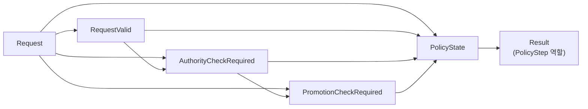
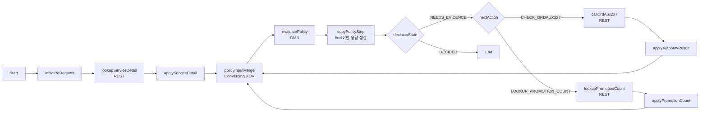

# Case 01 - 서비스 상태 변경 권한 판정

> **시연 메시지**
>
> BPMN은 업무상 항상 필요한 서비스 상세를 먼저 조회한다. DMN은 그 사실을 보고 **조건부로 다음에 무엇을 해야 하는지** 결정한다. BPMN은 ORDAUX227 또는 프로모션 조회를 실행하고 같은 DMN을 다시 평가하며, 모든 사실이 준비되면 최종 허용·거절 결과를 반환한다.

[공통 준비와 UI 절차로 돌아가기](README.md)

> **선행조건**
>
> [Case 00 환경 준비](case-00-environment-setup.md)를 완료하고 `/Users/jihunkeom/Desktop/projects/2026/SKT/skt_bamoe_party/prelim/test`를 프로젝트 root로 연 상태에서 시작한다.

## 1. 고객 규칙

고객 원문의 `processServiceStatusChange` 규칙은 다음과 같다.

1. `zord_svc_s4253` 조회 결과에서 `svc_dtl_cl_cd`를 얻는다.
2. `svc_dtl_cl_cd = "CA"`이고 상태 변경 코드가 `F1`, `F2`, `FR` 중 하나이면 ORDAUX227 권한을 확인한다.
3. 권한 결과가 `ERROR`이면 시스템 오류로 종료한다.
4. 권한 결과가 `DENIED`이면 차량 eSIM 처리 권한 없음으로 거절한다.
5. 권한이 `GRANTED`이고 상태 코드가 `F1`이면 `zord_svc_prod_s0425`에서 프로모션 가입 건수를 조회한다.
6. 가입 건수가 0보다 크면 정지를 거절한다.
7. 나머지는 정상 처리한다.

```text
서비스 상세 조회
└─ CA AND (F1 OR F2 OR FR)?
   ├─ false: ALLOW
   └─ true: ORDAUX227
      ├─ ERROR: SYSTEM_ERROR
      ├─ DENIED: DENY
      └─ GRANTED
         ├─ F1: 프로모션 건수 조회
         │  ├─ count > 0: DENY
         │  └─ count = 0: ALLOW
         └─ F2/FR: ALLOW
```

## 2. BAMOE 설계 원칙

이 가이드에서는 고객 슈도코드를 하나의 긴 FEEL `if/else`로 옮기지 않는다.

| 관심사 | 구현 위치 | 이유 |
|---|---|---|
| 어떤 조회가 필요한가 | DMN `PolicyState` Decision Table | 업무 담당자가 조건과 다음 행동을 표로 검토할 수 있다. |
| 최종 허용·거절과 사유 | DMN `Result` Decision Table | 결과 계약과 사유 코드가 정책 자산에 남는다. |
| REST 호출 순서와 반복 | BPMN | 외부 작업의 실행·분기·실패 경계를 시각화한다. |
| HTTP body schema와 enum 검증 | BPMN mapping Script | 전송 계약 오류를 업무 거절로 위장하지 않는다. |
| HTTP 200 body의 `ERROR` | DMN | 정상 수신된 업무 결과이므로 정책이 해석한다. |
| HTTP 4xx/5xx·timeout | BPMN 기술 오류 | 정책 평가 실패와 외부 시스템 실패를 구분한다. |

`NOT_CHECKED` 문자열과 `promotionLookupCompleted:boolean` 같은 암묵 조합 대신 조건부 호출의 상태를 명시한다.

```text
NOT_REQUESTED → REST 호출 성공 → COMPLETED
```

서비스 상세 조회는 모든 요청에 공통인 BPMN 선행 단계다. 그 이후 DMN이 반환하는 핵심 상태는 다음과 같다.

```text
NEEDS_EVIDENCE + CHECK_ORDAUX227
NEEDS_EVIDENCE + LOOKUP_PROMOTION_COUNT
DECIDED       + CONTINUE/STOP/RETURN_ERROR/FIX_INPUT
```

## 3. 생성할 자산

| 항목 | 값 |
|---|---|
| DMN 파일 | `src/main/resources/dmn/Case01ServiceStatusChange.dmn` |
| Model Name | `Case01ServiceStatusChange` |
| Namespace | `https://example.com/bamoe/poc/case01/v1` |
| Input Data | `Request` |
| public Decision | `Result` |
| Decision Service | `Case01ServiceStatusChangeService` |
| SCESIM | `src/test/resources/scesim/Case01ServiceStatusChangeTest.scesim` |
| BPMN | `src/main/resources/bpmn/Case01ServiceStatusChangeProcess.bpmn` |
| Mock | `mock-server/case01_mock_server.py`, port `8091` |

### 3.1 이전 가이드로 시작한 자산을 전환할 때

현재 DMN에 `EvidenceConsistent`, `NOT_CHECKED`, `promotionLookupCompleted`가 있다면 다음 순서로 UI에서 전환한다.

1. 먼저 Data Types를 4절의 계약으로 수정한다.
2. `tCase01Request`에서 `promotionLookupCompleted`를 삭제하고 권한·프로모션 CallState field를 추가한다.
3. `AuthResult` enumeration에서 `NOT_CHECKED`를 삭제한다.
4. DRD에서 `EvidenceConsistent` Decision과 연결선을 삭제한다.
5. 새 `PolicyState` Decision을 추가하고 5절의 Information Requirement를 연결한다.
6. `PolicyState`와 `Result` 표를 7~8절대로 새로 작성한다.
7. Decision Service에서 `EvidenceConsistent`를 빼고 `PolicyState`를 Encapsulated Decision으로 넣는다.
8. 기존 SCESIM 열은 새 Request 구조와 호환되지 않으므로 10절의 열 계약으로 다시 구성한다.

XML을 직접 고치지 않는다. 각 단계에서 `Cmd+S`로 저장하고 DMN `Problems`가 0건인지 확인한다.

### 3.2 기존 파일 이름과 저장 상태 Gate

UI 편집을 시작하기 전에 Terminal에서 파일 이름과 크기를 확인한다.

```bash
cd "/Users/jihunkeom/Desktop/projects/2026/SKT/skt_bamoe_party/prelim/test"

for file in \
  src/main/resources/dmn/Case01ServiceStatusChange.dmn \
  src/main/resources/bpmn/Case01ServiceStatusChangeProcess.bpmn \
  src/test/resources/scesim/Case01ServiceStatusChangeTest.scesim
do
  if test -s "$file"; then
    echo "[OK] $file"
  else
    echo "[MISSING/EMPTY] $file"
  fi
done

find src/test/resources/scesim -maxdepth 1 -type f -print
```

`[MISSING/EMPTY]`는 자산을 만들었다는 뜻이 아니다. BPMN이나 SCESIM이 0 byte이면
VS Code Explorer에서 그 빈 placeholder를 삭제한 뒤 각 전용 Editor로 정확한
이름의 파일을 다시 만든다. 특히 과거 오타인
`Case01ServiceStatusChageTest.scesim`은 사용하지 않고
`Case01ServiceStatusChangeTest.scesim`으로 생성한다. 새 파일이 저장되어
`test -s`가 성공한 것을 확인한 뒤에만 오타 파일을 정리한다.

## 4. DMN Data Types

Modern BAMOE DMN Editor의 `Data Types` tab에서 다음 순서로 만든다. 모든 enum은 base type `string`, `Is Collection = false`다.

### 4.1 Enum

`CallState`:

```feel
"NOT_REQUESTED", "COMPLETED"
```

`AuthResult`:

```feel
"GRANTED", "DENIED", "ERROR"
```

`PolicyDecisionState`:

```feel
"NEEDS_EVIDENCE", "DECIDED"
```

`DecisionStatus`:

```feel
"ALLOW", "DENY", "SYSTEM_ERROR", "INVALID_INPUT"
```

`Case01PolicyState`:

```feel
"INVALID_REQUEST",
"NOT_APPLICABLE",
"NEEDS_AUTHORITY",
"AUTHORITY_ERROR",
"AUTHORITY_DENIED",
"NEEDS_PROMOTION",
"PROMOTION_COUNT_INVALID",
"PROMOTION_BLOCKED",
"ALLOWED",
"INCONSISTENT"
```

`Case01NextAction`:

```feel
"CHECK_ORDAUX227",
"LOOKUP_PROMOTION_COUNT",
"CONTINUE",
"STOP",
"RETURN_ERROR",
"FIX_INPUT"
```

### 4.2 `tCase01Request`

| Field | Type | 의미 |
|---|---|---|
| `serviceStatusChangeCode` | `string` | 시작 요청의 상태 변경 코드 |
| `serviceDetailClassCode` | `string` | 조회 완료 후의 `svc_dtl_cl_cd` |
| `authorityLookupState` | `CallState` | ORDAUX227 호출 상태 |
| `ordAux227Result` | `AuthResult` | 호출 완료 후 권한 결과 |
| `promotionLookupState` | `CallState` | 프로모션 건수 조회 상태 |
| `promotionSubscriptionCount` | `number` | 조회 완료 후 가입 건수 |

DMN을 처음 평가할 때 서비스 상세는 이미 BPMN이 조회·검증한 값이다. 권한과 프로모션 CallState는 `"NOT_REQUESTED"`이고 결과값은 `null`이다. 해당 REST mapping Script만 상태를 `"COMPLETED"`로 바꾼다.

### 4.3 `tCase01Result`

| Field | Type |
|---|---|
| `decisionState` | `PolicyDecisionState` |
| `status` | `DecisionStatus` |
| `reasonCode` | `string` |
| `reasonMessage` | `string` |
| `nextAction` | `Case01NextAction` |

## 5. DRD

### 5.1 Node

| 종류 | 이름 | Output type |
|---|---|---|
| Input Data | `Request` | `tCase01Request` |
| Decision | `RequestValid` | `boolean` |
| Decision | `AuthorityCheckRequired` | `boolean` |
| Decision | `PromotionCheckRequired` | `boolean` |
| Decision | `PolicyState` | `Case01PolicyState` |
| Decision | `Result` | `tCase01Result` |

### 5.2 Information Requirement



모든 선은 Association이 아니라 `Information Requirement`다. 특히 `PolicyState`가 참조하는 네 항목 `Request`, `RequestValid`, `AuthorityCheckRequired`, `PromotionCheckRequired`를 모두 직접 연결한다.

## 6. Helper Decision

Helper는 한 줄로 설명 가능한 파생 사실만 계산한다. 여러 단계의 상태 전이는 다음 절의 Decision Table에 둔다.

### 6.1 `RequestValid`

Expression type은 `Literal Expression`이다.

```feel
Request.serviceStatusChangeCode != null
and Request.serviceStatusChangeCode != ""
and Request.serviceDetailClassCode != null
and Request.serviceDetailClassCode != ""
and Request.authorityLookupState != null
and Request.promotionLookupState != null
```

운영 adapter에서는 상태 변경 코드 앞뒤 공백을 제거한 뒤 DMN에 전달한다.

### 6.2 `AuthorityCheckRequired`

```feel
RequestValid
and Request.serviceDetailClassCode = "CA"
and list contains(
  ["F1", "F2", "FR"],
  Request.serviceStatusChangeCode
)
```

### 6.3 `PromotionCheckRequired`

```feel
AuthorityCheckRequired
and Request.authorityLookupState = "COMPLETED"
and Request.ordAux227Result = "GRANTED"
and Request.serviceStatusChangeCode = "F1"
```

## 7. `PolicyState` Decision Table

`PolicyState`를 열고 `Decision Table`, Hit Policy `First (F)`를 선택한다. 위에서 아래로 “현재 정상 상태”를 읽고 마지막 catch-all이 불가능한 조합을 잡는 구조다.

### 7.1 Input columns

| # | Input Expression | Type |
|---:|---|---|
| 1 | `RequestValid` | `boolean` |
| 2 | `AuthorityCheckRequired` | `boolean` |
| 3 | `Request.authorityLookupState` | `CallState` |
| 4 | `Request.ordAux227Result` | `AuthResult` |
| 5 | `PromotionCheckRequired` | `boolean` |
| 6 | `Request.promotionLookupState` | `CallState` |
| 7 | `Request.promotionSubscriptionCount` | `number` |

`PolicyState` **Decision node의 Output data type**은
`Case01PolicyState`로 지정한다. 이 표는 출력 열이 하나뿐이므로 output
column의 이름은 `state`, column 자체의 `Data Type`도
`Case01PolicyState`로 지정한다. 현재 실습에서 검증한 BAMOE
`9.5.0-ibm-0005` 저장 형식과 맞추기 위해 Decision node와 단일 output column의
type을 모두 유지한다.

### 7.2 Rule rows

아래 표의 `-`는 Any, `not(null)`은 값이 존재함을 뜻한다.

| # | Valid | Auth req | Auth state | Auth result | Promo req | Promo state | Count | state |
|---:|---:|---:|---|---|---:|---|---|---|
| 1 | `false` | `-` | `-` | `-` | `-` | `-` | `-` | `"INVALID_REQUEST"` |
| 2 | `true` | `false` | `"NOT_REQUESTED"` | `null` | `false` | `"NOT_REQUESTED"` | `null` | `"NOT_APPLICABLE"` |
| 3 | `true` | `true` | `"NOT_REQUESTED"` | `null` | `false` | `"NOT_REQUESTED"` | `null` | `"NEEDS_AUTHORITY"` |
| 4 | `true` | `true` | `"COMPLETED"` | `"ERROR"` | `false` | `"NOT_REQUESTED"` | `null` | `"AUTHORITY_ERROR"` |
| 5 | `true` | `true` | `"COMPLETED"` | `"DENIED"` | `false` | `"NOT_REQUESTED"` | `null` | `"AUTHORITY_DENIED"` |
| 6 | `true` | `true` | `"COMPLETED"` | `"GRANTED"` | `false` | `"NOT_REQUESTED"` | `null` | `"ALLOWED"` |
| 7 | `true` | `true` | `"COMPLETED"` | `"GRANTED"` | `true` | `"NOT_REQUESTED"` | `null` | `"NEEDS_PROMOTION"` |
| 8 | `true` | `true` | `"COMPLETED"` | `"GRANTED"` | `true` | `"COMPLETED"` | `< 0` | `"PROMOTION_COUNT_INVALID"` |
| 9 | `true` | `true` | `"COMPLETED"` | `"GRANTED"` | `true` | `"COMPLETED"` | `> 0` | `"PROMOTION_BLOCKED"` |
| 10 | `true` | `true` | `"COMPLETED"` | `"GRANTED"` | `true` | `"COMPLETED"` | `0` | `"ALLOWED"` |
| 11 | `-` | `-` | `-` | `-` | `-` | `-` | `-` | `"INCONSISTENT"` |

이 표가 긴 `EvidenceConsistent` FEEL을 대체한다. 고객은 각 행을 “현재 상태 → 정책 상태”로 읽을 수 있고, 마지막 행 때문에 알 수 없는 조합도 fail-closed 된다.

## 8. `Result` Decision Table — Policy Step 계약

`Result`는 현재 DMN 파일에서 사용하는 기존 Decision 이름이지만 의미상 최종 응답
전용 node가 아니라 **BPMN에 전달하는 `PolicyStep`**이다.

- `decisionState = "NEEDS_EVIDENCE"`이면 아직 최종 결과가 아니며
  `nextAction`의 증거를 더 수집하라는 실행 지시다.
- `decisionState = "DECIDED"`일 때만 terminal policy result다.
- Process caller가 받는 최종 계약은 `Result` node 자체가 아니라
  `processResponse.policyResult`다.

사용자가 이미 UI로 만든 DMN·Decision Service·SCESIM·BPMN mapping을 흔들지 않기
위해 이번 실습에서는 이름을 `Result`로 유지한다.

`Result`는 `PolicyState`를 외부 계약으로 번역한다.

- Expression: `Decision Table`
- Hit Policy: `Unique (U)`
- Input: `PolicyState`, type `Case01PolicyState`
- Outputs: `decisionState`, `status`, `reasonCode`, `reasonMessage`, `nextAction`

| PolicyState | decisionState | status | reasonCode | reasonMessage | nextAction |
|---|---|---|---|---|---|
| `"INVALID_REQUEST"` | `"DECIDED"` | `"INVALID_INPUT"` | `"REQUIRED_INPUT_MISSING"` | `"상태 변경 코드와 조회 상태가 필요합니다."` | `"FIX_INPUT"` |
| `"NOT_APPLICABLE"` | `"DECIDED"` | `"ALLOW"` | `"RULE_NOT_APPLICABLE"` | `"ORDAUX227 확인 대상이 아닙니다."` | `"CONTINUE"` |
| `"NEEDS_AUTHORITY"` | `"NEEDS_EVIDENCE"` | `null` | `"ORDAUX227_CHECK_REQUIRED"` | `"ORDAUX227 권한 확인이 필요합니다."` | `"CHECK_ORDAUX227"` |
| `"AUTHORITY_ERROR"` | `"DECIDED"` | `"SYSTEM_ERROR"` | `"ORDAUX227_ERROR"` | `"ORDAUX227 권한 확인 중 오류가 발생했습니다."` | `"RETURN_ERROR"` |
| `"AUTHORITY_DENIED"` | `"DECIDED"` | `"DENY"` | `"ORDAUX227_DENIED"` | `"차량 eSIM 처리 권한이 없습니다."` | `"STOP"` |
| `"NEEDS_PROMOTION"` | `"NEEDS_EVIDENCE"` | `null` | `"PROMOTION_LOOKUP_REQUIRED"` | `"프로모션 가입 건수 조회가 필요합니다."` | `"LOOKUP_PROMOTION_COUNT"` |
| `"PROMOTION_COUNT_INVALID"` | `"DECIDED"` | `"INVALID_INPUT"` | `"PROMOTION_COUNT_INVALID"` | `"프로모션 가입 건수는 음수일 수 없습니다."` | `"FIX_INPUT"` |
| `"PROMOTION_BLOCKED"` | `"DECIDED"` | `"DENY"` | `"ACTIVE_PROMOTION_EXISTS"` | `"프로모션 기간 중에는 정지할 수 없습니다."` | `"STOP"` |
| `"ALLOWED"` | `"DECIDED"` | `"ALLOW"` | `"STATUS_CHANGE_ALLOWED"` | `"서비스 상태 변경이 허용되었습니다."` | `"CONTINUE"` |
| `"INCONSISTENT"` | `"DECIDED"` | `"INVALID_INPUT"` | `"EVIDENCE_STATE_INVALID"` | `"외부 조회 상태와 결과값의 조합이 올바르지 않습니다."` | `"FIX_INPUT"` |

`NEEDS_EVIDENCE` 행의 `status`에는 문자열 `"null"`이 아니라 FEEL `null`을 입력한다.

## 9. Decision Service와 저장 Gate

Decision Service `Case01ServiceStatusChangeService`를 만든다.

```text
Case01ServiceStatusChangeService
├─ Input: Request
├─ Encapsulated
│  ├─ RequestValid
│  ├─ AuthorityCheckRequired
│  ├─ PromotionCheckRequired
│  └─ PolicyState
└─ Output: Result
```

Decision Service 자체에 별도 output type을 입력하지 않는다. Output Decision인
`Result:tCase01Result`에서 서비스 응답 타입이 정해진다. 이 버전의 Editor가
Decision Service variable에 `typeRef`를 저장하지 않아 경고를 출력할 수 있지만,
존재하지 않는 서비스용 Data Type을 억지로 만들지는 않는다.

저장 후 다음을 확인한다.

```bash
cd "/Users/jihunkeom/Desktop/projects/2026/SKT/skt_bamoe_party/prelim/test"

DMN_FILE="src/main/resources/dmn/Case01ServiceStatusChange.dmn"
READY=true
if test -s "$DMN_FILE"; then
  echo "[OK] $DMN_FILE"
else
  echo "[MISSING/EMPTY] $DMN_FILE"
  READY=false
fi

if test -s "$DMN_FILE"; then
  rg -n \
    'CallState|Case01PolicyState|PolicyState|CHECK_ORDAUX227|LOOKUP_PROMOTION_COUNT' \
    "$DMN_FILE"

  if rg -n \
    'EvidenceConsistent|promotionLookupCompleted|NOT_CHECKED' \
    "$DMN_FILE"
  then
    echo "[FIX] 이전 boolean/sentinel 기반 설계가 남아 있음"
    READY=false
  else
    echo "[OK] 명시적 상태 기반 설계"
  fi

  if rg -q \
    '<decisionService name="Case01ServiceStatusChangeService"' \
    "$DMN_FILE"
  then
    echo "[OK] Case01 Decision Service name"
  else
    echo "[FIX] Decision Service 이름을 Case01ServiceStatusChangeService로 변경"
    READY=false
  fi

  ENCAPSULATED_COUNT="$(
    rg -o '<encapsulatedDecision ' "$DMN_FILE" \
      | wc -l | tr -d ' '
  )"
  OUTPUT_DECISION_COUNT="$(
    rg -o '<outputDecision ' "$DMN_FILE" \
      | wc -l | tr -d ' '
  )"
  INPUT_DATA_COUNT="$(
    rg -o '<inputData href=' "$DMN_FILE" \
      | wc -l | tr -d ' '
  )"
  INPUT_DECISION_COUNT="$(
    rg -o '<inputDecision ' "$DMN_FILE" \
      | wc -l | tr -d ' '
  )"
  if test "$ENCAPSULATED_COUNT" -eq 4 \
      && test "$OUTPUT_DECISION_COUNT" -eq 1 \
      && test "$INPUT_DATA_COUNT" -eq 1 \
      && test "$INPUT_DECISION_COUNT" -eq 0
  then
    echo "[OK] Decision Service topology: encapsulated=4, output=1, inputData=1"
  else
    echo "[FIX] Decision Service의 Encapsulated 4개, Output 1개, Input Request를 다시 지정"
    READY=false
  fi

  if rg -q '<output[^>]*typeRef="Case01PolicyState"' "$DMN_FILE"; then
    echo "[OK] PolicyState single-output column type is Case01PolicyState"
  else
    echo "[FIX] UI에서 PolicyState 단일 output column의 Data Type을 Case01PolicyState로 지정"
    READY=false
  fi
fi

if test "$READY" = true; then
  echo "CASE01_DMN_STATIC_GATE=PASS"
else
  echo "STOP: 위 [FIX] 항목을 UI에서 수정·저장한 뒤 다시 실행하세요."
fi
```

모든 항목이 `[OK]`이고 `CASE01_DMN_STATIC_GATE=PASS`일 때 10절로 넘어간다.
VS Code `Problems`에서 DMN error가 0건인지 확인한다. 기존 SCESIM은 새 Request
구조와 아직 호환되지 않을 수 있으므로 여기서 `clean verify`를 선행 Gate로
실행하지 않는다. 10절에서 SCESIM을 마이그레이션한 뒤 10.4에서
`BUILD SUCCESS`, `Failures: 0`, `Errors: 0`을 확인한다.

## 10. SCESIM으로 DMN 검증

SCESIM은 BPMN이나 HTTP를 호출하지 않고 DMN의 상태 전이 표를 직접 검증한다.

### 10.1 파일과 Settings

`src/test/resources/scesim/Case01ServiceStatusChangeTest.scesim`을 만든 후 `(classic)`이 없는 **BAMOE Test Scenario Editor**로 연다.

| Setting | 값 |
|---|---|
| Type | `DMN` |
| DMN Model | `Case01ServiceStatusChange.dmn` |
| DMN Name | `Case01ServiceStatusChange` |
| DMN Namespace | `https://example.com/bamoe/poc/case01/v1` |
| Skip this test scenario | 해제 |

`Autofill DMN Data`는 해제하고 필요한 열을 직접 만든다.

### 10.2 열 구성

GIVEN은 `Request`의 6개 field다.

```text
serviceStatusChangeCode
serviceDetailClassCode
authorityLookupState
ordAux227Result
promotionLookupState
promotionSubscriptionCount
```

EXPECT:

```text
RequestValid.value
AuthorityCheckRequired.value
PromotionCheckRequired.value
PolicyState.value
Result.decisionState
Result.status
Result.reasonCode
Result.reasonMessage
Result.nextAction
```

Helper Decision과 `PolicyState`는 DMN이 계산하므로 GIVEN이 아니라 EXPECT다. scalar Decision은 각각 별도 Instance로, `Result`의 field는 같은 Instance 안의 Field로 추가한다.

SCESIM cell 문법:

| 값 | 입력 |
|---|---|
| string | `"COMPLETED"` |
| number | `0`, `-1` |
| boolean | `true`, `false` |
| GIVEN null | `null` |
| EXPECT null | `null` |

EXPECT의 `? = null`도 동작하지만 이 가이드는 `null`로 통일한다. 빈 EXPECT
cell은 null 검증이 아니라 검증 생략이다.

### 10.3 12개 시나리오

아래 `PolicyState`와 Result의 `decisionState`, `status`, `reasonCode`,
`reasonMessage`, `nextAction`을 모두 필수 EXPECT로 입력한다. `reasonMessage`도
SCESIM cell에 큰따옴표까지 포함한 FEEL string으로 표와 정확히 입력한다.

| ID | Change | Detail | Auth state/value | Promo state/count | PolicyState | decisionState | status | reasonCode | reasonMessage | nextAction |
|---|---|---|---|---|---|---|---|---|---|---|
| `C01-S01` | `"F1"` | `null` | `"NOT_REQUESTED"` / `null` | `"NOT_REQUESTED"` / `null` | `"INVALID_REQUEST"` | `"DECIDED"` | `"INVALID_INPUT"` | `"REQUIRED_INPUT_MISSING"` | `"상태 변경 코드와 조회 상태가 필요합니다."` | `"FIX_INPUT"` |
| `C01-S02` | `"F1"` | `"VOICE"` | `"NOT_REQUESTED"` / `null` | `"NOT_REQUESTED"` / `null` | `"NOT_APPLICABLE"` | `"DECIDED"` | `"ALLOW"` | `"RULE_NOT_APPLICABLE"` | `"ORDAUX227 확인 대상이 아닙니다."` | `"CONTINUE"` |
| `C01-S03` | `"F2"` | `"CA"` | `"NOT_REQUESTED"` / `null` | `"NOT_REQUESTED"` / `null` | `"NEEDS_AUTHORITY"` | `"NEEDS_EVIDENCE"` | `null` | `"ORDAUX227_CHECK_REQUIRED"` | `"ORDAUX227 권한 확인이 필요합니다."` | `"CHECK_ORDAUX227"` |
| `C01-S04` | `"F2"` | `"CA"` | `"COMPLETED"` / `"ERROR"` | `"NOT_REQUESTED"` / `null` | `"AUTHORITY_ERROR"` | `"DECIDED"` | `"SYSTEM_ERROR"` | `"ORDAUX227_ERROR"` | `"ORDAUX227 권한 확인 중 오류가 발생했습니다."` | `"RETURN_ERROR"` |
| `C01-S05` | `"FR"` | `"CA"` | `"COMPLETED"` / `"DENIED"` | `"NOT_REQUESTED"` / `null` | `"AUTHORITY_DENIED"` | `"DECIDED"` | `"DENY"` | `"ORDAUX227_DENIED"` | `"차량 eSIM 처리 권한이 없습니다."` | `"STOP"` |
| `C01-S06` | `"F2"` | `"CA"` | `"COMPLETED"` / `"GRANTED"` | `"NOT_REQUESTED"` / `null` | `"ALLOWED"` | `"DECIDED"` | `"ALLOW"` | `"STATUS_CHANGE_ALLOWED"` | `"서비스 상태 변경이 허용되었습니다."` | `"CONTINUE"` |
| `C01-S07` | `"F1"` | `"CA"` | `"COMPLETED"` / `"GRANTED"` | `"NOT_REQUESTED"` / `null` | `"NEEDS_PROMOTION"` | `"NEEDS_EVIDENCE"` | `null` | `"PROMOTION_LOOKUP_REQUIRED"` | `"프로모션 가입 건수 조회가 필요합니다."` | `"LOOKUP_PROMOTION_COUNT"` |
| `C01-S08` | `"F1"` | `"CA"` | `"COMPLETED"` / `"GRANTED"` | `"COMPLETED"` / `2` | `"PROMOTION_BLOCKED"` | `"DECIDED"` | `"DENY"` | `"ACTIVE_PROMOTION_EXISTS"` | `"프로모션 기간 중에는 정지할 수 없습니다."` | `"STOP"` |
| `C01-S09` | `"F1"` | `"CA"` | `"COMPLETED"` / `"GRANTED"` | `"COMPLETED"` / `0` | `"ALLOWED"` | `"DECIDED"` | `"ALLOW"` | `"STATUS_CHANGE_ALLOWED"` | `"서비스 상태 변경이 허용되었습니다."` | `"CONTINUE"` |
| `C01-S10` | `"F1"` | `"CA"` | `"COMPLETED"` / `"GRANTED"` | `"COMPLETED"` / `-1` | `"PROMOTION_COUNT_INVALID"` | `"DECIDED"` | `"INVALID_INPUT"` | `"PROMOTION_COUNT_INVALID"` | `"프로모션 가입 건수는 음수일 수 없습니다."` | `"FIX_INPUT"` |
| `C01-S11` | `"F1"` | `"CA"` | `"NOT_REQUESTED"` / `"GRANTED"` | `"NOT_REQUESTED"` / `null` | `"INCONSISTENT"` | `"DECIDED"` | `"INVALID_INPUT"` | `"EVIDENCE_STATE_INVALID"` | `"외부 조회 상태와 결과값의 조합이 올바르지 않습니다."` | `"FIX_INPUT"` |
| `C01-S12` | `"F1"` | `"CA"` | `"COMPLETED"` / `null` | `"NOT_REQUESTED"` / `null` | `"INCONSISTENT"` | `"DECIDED"` | `"INVALID_INPUT"` | `"EVIDENCE_STATE_INVALID"` | `"외부 조회 상태와 결과값의 조합이 올바르지 않습니다."` | `"FIX_INPUT"` |

Helper EXPECT는 다음과 같이 입력한다.

| ID | RequestValid | AuthorityCheckRequired | PromotionCheckRequired |
|---|---:|---:|---:|
| `C01-S01` | `false` | `false` | `false` |
| `C01-S02` | `true` | `false` | `false` |
| `C01-S03` | `true` | `true` | `false` |
| `C01-S04` | `true` | `true` | `false` |
| `C01-S05` | `true` | `true` | `false` |
| `C01-S06` | `true` | `true` | `false` |
| `C01-S07` | `true` | `true` | `true` |
| `C01-S08` | `true` | `true` | `true` |
| `C01-S09` | `true` | `true` | `true` |
| `C01-S10` | `true` | `true` | `true` |
| `C01-S11` | `true` | `true` | `false` |
| `C01-S12` | `true` | `true` | `false` |

`C01-S11`은 권한 호출 상태가 `NOT_REQUESTED`인데 결과값이 존재하는 조합,
`C01-S12`는 반대로 `COMPLETED`인데 결과가 null인 조합을 fail-closed로 검증한다.

### 10.4 Activator와 실행

Activator는 Case별 파일이 아니라 프로젝트 전체에서 하나만 사용한다.

```bash
cd "/Users/jihunkeom/Desktop/projects/2026/SKT/skt_bamoe_party/prelim/test"

ACTIVATOR="src/test/java/testscenario/TestScenarioJunitActivatorTest.java"
SCESIM="src/test/resources/scesim/Case01ServiceStatusChangeTest.scesim"

if test -f "$ACTIVATOR" && rg -q '@TestScenarioActivator' "$ACTIVATOR"; then
  echo "[OK] project-wide activator"
else
  echo "[MISSING] activator를 아래 절차로 한 번 생성"
fi

if test -s "$SCESIM"; then
  echo "[OK] Case01 SCESIM"
else
  echo "[MISSING/EMPTY] Case01 SCESIM"
fi

if test -s "$SCESIM" \
    && rg -q '<expressionAlias>reasonMessage</expressionAlias>' "$SCESIM"; then
  echo "[OK] Case01 reasonMessage EXPECT column"
else
  echo "[FIX] UI에서 Result.reasonMessage EXPECT column을 추가"
fi
```

Activator가 없을 때만 다음 파일을 UI에서 만든다.

```java
package testscenario;

import org.drools.scenariosimulation.backend.runner.TestScenarioActivator;

@TestScenarioActivator
public class TestScenarioJunitActivatorTest {
}
```

실행:

위 확인에서 `[MISSING]` 또는 `[MISSING/EMPTY]`가 하나라도 나오면 아래 Maven
명령을 실행하지 않고 먼저 UI에서 해당 파일을 생성·저장한다.

```bash
mvn -s config/settings-bamoe-container.xml \
  -Dtest=testscenario.TestScenarioJunitActivatorTest \
  test

mvn -s config/settings-bamoe-container.xml clean verify
```

성공 기준은 12개 Case01 시나리오, `Failures: 0`, `Errors: 0`, `BUILD SUCCESS`다. 다른 SCESIM이 함께 실행되면 전체 테스트 수는 12보다 클 수 있다.
위 문자열 검색은 column 존재만 확인한다. Test Scenario Editor에서 12개 행의
`reasonMessage` cell이 모두 채워졌는지도 표와 대조한다. 빈 EXPECT cell은
테스트 통과가 아니라 **그 field의 검증 생략**이다.

## 11. DMN component REST 확인

### 11.1 서버와 endpoint

Terminal A:

```bash
cd "/Users/jihunkeom/Desktop/projects/2026/SKT/skt_bamoe_party/prelim/test"
mvn -s config/settings-bamoe-container.xml clean verify
mvn -s config/settings-bamoe-container.xml spring-boot:run
```

`Started BamoeSpringBootApplication`을 확인한 뒤 Terminal B:

```bash
curl --fail-with-body -sS \
  'http://127.0.0.1:8080/v3/api-docs' \
  | jq -r '.paths | keys[] | select(contains("Case01ServiceStatusChange"))'
```

일반적으로 다음 네 path가 생성되지만 OpenAPI 출력을 최종 기준으로 사용한다.

```text
/Case01ServiceStatusChange
/Case01ServiceStatusChange/dmnresult
/Case01ServiceStatusChange/Case01ServiceStatusChangeService
/Case01ServiceStatusChange/Case01ServiceStatusChangeService/dmnresult
```

```bash
set -o pipefail
MODEL_URL='http://127.0.0.1:8080/Case01ServiceStatusChange'
SERVICE_URL='http://127.0.0.1:8080/Case01ServiceStatusChange/Case01ServiceStatusChangeService'
```

### 11.2 서비스 상세 확인 후: 권한 요청

```bash
curl --fail-with-body -sS -X POST "$SERVICE_URL" \
  -H 'Content-Type: application/json' \
  -H 'Accept: application/json' \
  -d '{
    "Request": {
      "serviceStatusChangeCode": "F1",
      "serviceDetailClassCode": "CA",
      "authorityLookupState": "NOT_REQUESTED",
      "ordAux227Result": null,
      "promotionLookupState": "NOT_REQUESTED",
      "promotionSubscriptionCount": null
    }
  }' | jq '
      if has("reasonCode")
      then {decisionState,status,reasonCode,reasonMessage,nextAction}
      else .
      end
    '
```

예상:

```json
{
  "decisionState": "NEEDS_EVIDENCE",
  "status": null,
  "reasonCode": "ORDAUX227_CHECK_REQUIRED",
  "reasonMessage": "ORDAUX227 권한 확인이 필요합니다.",
  "nextAction": "CHECK_ORDAUX227"
}
```

### 11.3 서비스·권한 완료: 프로모션 조회 요청

```bash
curl --fail-with-body -sS -X POST "$SERVICE_URL" \
  -H 'Content-Type: application/json' \
  -H 'Accept: application/json' \
  -d '{
    "Request": {
      "serviceStatusChangeCode": "F1",
      "serviceDetailClassCode": "CA",
      "authorityLookupState": "COMPLETED",
      "ordAux227Result": "GRANTED",
      "promotionLookupState": "NOT_REQUESTED",
      "promotionSubscriptionCount": null
    }
  }' | jq '
      if has("reasonCode")
      then {decisionState,status,reasonCode,reasonMessage,nextAction}
      else .
      end
    '
```

예상: `NEEDS_EVIDENCE / PROMOTION_LOOKUP_REQUIRED / LOOKUP_PROMOTION_COUNT`.

### 11.4 최종 허용

```bash
curl --fail-with-body -sS -X POST "$SERVICE_URL" \
  -H 'Content-Type: application/json' \
  -H 'Accept: application/json' \
  -d '{
    "Request": {
      "serviceStatusChangeCode": "F1",
      "serviceDetailClassCode": "CA",
      "authorityLookupState": "COMPLETED",
      "ordAux227Result": "GRANTED",
      "promotionLookupState": "COMPLETED",
      "promotionSubscriptionCount": 0
    }
  }' | jq '
      if has("reasonCode")
      then {decisionState,status,reasonCode,reasonMessage,nextAction}
      else .
      end
    '
```

예상: `DECIDED / ALLOW / STATUS_CHANGE_ALLOWED / CONTINUE`.

### 11.5 전체 모델과 `/dmnresult`

전체 model endpoint는 helper와 `PolicyState`를 함께 보여 준다.

```bash
curl --fail-with-body -sS -X POST "$MODEL_URL" \
  -H 'Content-Type: application/json' \
  -H 'Accept: application/json' \
  -d '{
    "Request": {
      "serviceStatusChangeCode": "F2",
      "serviceDetailClassCode": "CA",
      "authorityLookupState": "COMPLETED",
      "ordAux227Result": "DENIED",
      "promotionLookupState": "NOT_REQUESTED",
      "promotionSubscriptionCount": null
    }
  }' | jq '
      if has("Result")
      then {
        RequestValid,
        AuthorityCheckRequired,
        PromotionCheckRequired,
        PolicyState,
        Result
      }
      else .
      end
    '
```

평가 상태와 message가 필요하면 같은 payload를 `"${MODEL_URL}/dmnresult"`로 보낸다. `Result.status = "DENY"`이면서 각 `evaluationStatus = "SUCCEEDED"`일 수 있다. 전자는 업무 판정이고 후자는 DMN 엔진 평가 결과다.

### 11.6 DMN 진단 서버 종료

Terminal A에서 `Ctrl+C`를 눌러 지금 실행한 DMN-only runtime을 종료한다. 이
runtime은 아직 12절에서 만들 BPMN을 로드하지 않았으므로 켜 둔 채 다음
`spring-boot:run`을 실행하면 8080 충돌 또는 stale endpoint가 발생한다.

다른 Terminal에서 종료를 확인한다.

```bash
if lsof -nP -iTCP:8080 -sTCP:LISTEN; then
  echo 'STOP: 8080의 기존 BAMOE runtime을 먼저 종료하세요.' >&2
  false
else
  echo 'DMN_DIAGNOSTIC_SERVER_STOP_GATE=PASS'
fi
```

## 12. BPMN + Mock orchestration

### 12.1 시작 payload와 내부 DMN payload

Process 시작 시 외부 조회 결과를 받지 않는다.

```json
{
  "requestId": "C01-E2E-001",
  "serviceManagementNumber": "SVC-1001",
  "serviceStatusChangeCode": "F1",
  "mockScenario": "happy"
}
```

`mockScenario`는 dev/test 전용이며 고객 계약 전환 시 제거한다. BPMN 내부에서는 4절의 `tCase01Request` 형태로 `decisionRequest`를 조립한다.

### 12.2 최종 topology



고객에게 보여 줄 핵심은 Gateway에 `CA`, `F1`, `GRANTED` 같은 업무 조건이 없다는 점이다. 첫 Gateway는 DMN의 단계 상태만 보고, 증거가 필요할 때 두 번째 Gateway가 DMN이 정한 semantic action을 실행한다.

### 12.3 Mock server

`mock-server/case01_mock_server.py`를 만든다.

```python
import json
from http.server import BaseHTTPRequestHandler, ThreadingHTTPServer
from urllib.parse import parse_qs, urlparse

JOURNAL = []


class Handler(BaseHTTPRequestHandler):
    def send_json(self, status, body):
        payload = json.dumps(body, ensure_ascii=False).encode("utf-8")
        self.send_response(status)
        self.send_header("Content-Type", "application/json; charset=utf-8")
        self.send_header("Content-Length", str(len(payload)))
        self.end_headers()
        self.wfile.write(payload)

    def read_json(self):
        length = int(self.headers.get("Content-Length", "0"))
        return json.loads(self.rfile.read(length) or b"{}")

    def record(self, path, body):
        JOURNAL.append({
            "sequence": len(JOURNAL) + 1,
            "requestId": body.get("requestId"),
            "path": path,
            "scenario": body.get("scenario", "happy")
        })

    def do_POST(self):
        path = urlparse(self.path).path
        body = self.read_json()
        scenario = body.get("scenario", "happy")
        self.record(path, body)

        if path == "/case01/service-detail":
            if scenario == "service-http-500":
                return self.send_json(500, {"error": "SERVICE_LOOKUP_FAILED"})
            detail = "VOICE" if scenario == "not-target" else "CA"
            return self.send_json(200, {"serviceDetailClassCode": detail})

        if path == "/case01/ordaux227":
            if scenario == "auth-http-500":
                return self.send_json(500, {"error": "ORDAUX227_UNAVAILABLE"})
            result = {
                "auth-denied": "DENIED",
                "auth-body-error": "ERROR"
            }.get(scenario, "GRANTED")
            return self.send_json(200, {"result": result})

        if path == "/case01/promotion-count":
            if scenario == "promo-http-500":
                return self.send_json(500, {"error": "PROMOTION_LOOKUP_FAILED"})
            count = 2 if scenario == "promo-active" else 0
            return self.send_json(200, {"count": count})

        return self.send_json(404, {"error": "NOT_FOUND", "path": path})

    def do_GET(self):
        parsed = urlparse(self.path)
        if parsed.path == "/health":
            return self.send_json(200, {"status": "UP"})
        if parsed.path != "/case01/_test/journal":
            return self.send_json(404, {"error": "NOT_FOUND"})
        request_id = parse_qs(parsed.query).get("requestId", [None])[0]
        calls = [
            call for call in JOURNAL
            if request_id is None or call["requestId"] == request_id
        ]
        self.send_json(200, {"calls": calls})

    def do_DELETE(self):
        if urlparse(self.path).path != "/case01/_test/journal":
            return self.send_json(404, {"error": "NOT_FOUND"})
        JOURNAL.clear()
        self.send_json(200, {"cleared": True})

    def log_message(self, fmt, *args):
        print("[case01-mock]", fmt % args)


print("Case01 mock listening on http://0.0.0.0:8091", flush=True)
ThreadingHTTPServer(("0.0.0.0", 8091), Handler).serve_forever()
```

Terminal M에서 실행하고 Process E2E가 끝날 때까지 이 Terminal을 유지한다.

```bash
cd "/Users/jihunkeom/Desktop/projects/2026/SKT/skt_bamoe_party/prelim/test"
python3 mock-server/case01_mock_server.py
```

다른 Terminal에서 최대 30초 동안 readiness를 확인한다.

```bash
MOCK_READY=0
for attempt in $(seq 1 30)
do
  if curl -fsS 'http://127.0.0.1:8091/health' \
      | jq -e '.status == "UP"' >/dev/null
  then
    MOCK_READY=1
    break
  fi
  sleep 1
done

if [ "$MOCK_READY" -eq 1 ]; then
  echo 'CASE01_MOCK_READINESS_GATE=PASS'
else
  echo 'CASE01_MOCK_READINESS_GATE=FAIL' >&2
  false
fi
```

### 12.4 Process Properties와 Variables

`src/main/resources/bpmn/Case01ServiceStatusChangeProcess.bpmn`을 Modern BAMOE BPMN Editor로 만든다.

| 속성 | 값 |
|---|---|
| Process ID | `Case01ServiceStatusChangeProcess` |
| Name | `Case01 Service Status Change Process` |
| Package | `org.acme.case01` |
| Executable | `true` |

Process Variables:

| 변수 | Type | Tags | 역할 |
|---|---|---|---|
| `requestId` | `String` | `input,required,readonly` | correlation ID |
| `serviceManagementNumber` | `String` | `input,required,readonly` | 조회 key |
| `serviceStatusChangeCode` | `String` | `input,readonly` | 업무 입력 |
| `mockScenario` | `String` | `input` | dev/test 전용 |
| `serviceLookupRequest` | `java.util.Map` | `internal` | REST request |
| `serviceLookupResponse` | `java.util.Map` | `internal` | raw response |
| `authorityRequest` | `java.util.Map` | `internal` | REST request |
| `authorityResponse` | `java.util.Map` | `internal` | raw response |
| `promotionRequest` | `java.util.Map` | `internal` | REST request |
| `promotionResponse` | `java.util.Map` | `internal` | raw response |
| `decisionRequest` | `java.util.Map` | `internal` | DMN Request |
| `policyStep` | `java.util.Map` | `internal` | DMN `Result`가 반환한 PolicyStep |
| `decisionState` | `String` | `internal` | routing 상태 |
| `nextAction` | `String` | `internal` | routing action |
| `policyEvaluationCount` | `Integer` | `internal` | loop 상한 |
| `previousNextAction` | `String` | `internal` | 진행 정지 감지 |
| `processResponse` | `java.util.Map` | `output` | 최종 envelope |

### 12.5 Script Task

모든 Script Language는 `Java`다.

> **Java 지역변수 이름 주의**
>
> Kogito codegen은 Process Variable을 생성 Java 코드의 변수로 노출한다. 따라서
> Script 안에서 `String requestId`, `String mockScenario`,
> `java.util.Map decisionRequest`처럼 **Process Variable과 정확히 같은 이름을
> 다시 선언하지 않는다.** 아래 예제의 `rid`, `serviceNumber`, `scenario`,
> `service`, `auth`, `promo`, `request`, `response`, `step`은 이 충돌을 피한
> 지역 이름이다. `"requestId"`처럼 따옴표 안에 있는 Map key와
> `kcontext.getVariable(...)`의 이름은 Process Variable 계약이므로 그대로 둔다.

`initializeRequest`:

```java
String rid = (String) kcontext.getVariable("requestId");
String serviceNumber =
    (String) kcontext.getVariable("serviceManagementNumber");
String changeCode =
    (String) kcontext.getVariable("serviceStatusChangeCode");
String scenario = (String) kcontext.getVariable("mockScenario");

if (rid == null || rid.isBlank()
        || serviceNumber == null || serviceNumber.isBlank()) {
    throw new IllegalArgumentException(
        "requestId and serviceManagementNumber are required");
}
if (changeCode != null) {
    changeCode = changeCode.trim();
}
if (scenario == null || scenario.isBlank()) {
    scenario = "happy";
    kcontext.setVariable("mockScenario", scenario);
}

java.util.Map service = new java.util.LinkedHashMap();
service.put("requestId", rid);
service.put("serviceManagementNumber", serviceNumber);
service.put("scenario", scenario);
kcontext.setVariable("serviceLookupRequest", service);

java.util.Map auth = new java.util.LinkedHashMap();
auth.put("requestId", rid);
auth.put("serviceManagementNumber", serviceNumber);
auth.put("permission", "ORDAUX227");
auth.put("scenario", scenario);
kcontext.setVariable("authorityRequest", auth);

java.util.Map promo = new java.util.LinkedHashMap();
promo.put("requestId", rid);
promo.put("serviceManagementNumber", serviceNumber);
promo.put("scenario", scenario);
kcontext.setVariable("promotionRequest", promo);

java.util.Map request = new java.util.LinkedHashMap();
request.put("serviceStatusChangeCode", changeCode);
request.put("serviceDetailClassCode", null);
request.put("authorityLookupState", "NOT_REQUESTED");
request.put("ordAux227Result", null);
request.put("promotionLookupState", "NOT_REQUESTED");
request.put("promotionSubscriptionCount", null);
kcontext.setVariable("decisionRequest", request);
kcontext.setVariable("policyEvaluationCount", 0);
kcontext.setVariable("previousNextAction", null);
```

`applyServiceDetail`:

```java
java.util.Map response =
    (java.util.Map) kcontext.getVariable("serviceLookupResponse");
Object value = response == null
    ? null : response.get("serviceDetailClassCode");
if (value == null || value.toString().isBlank()) {
    throw new IllegalStateException(
        "service-detail body missing serviceDetailClassCode");
}
java.util.Map request =
    (java.util.Map) kcontext.getVariable("decisionRequest");
request.put("serviceDetailClassCode", value.toString());
kcontext.setVariable("decisionRequest", request);
```

`applyAuthorityResult`:

```java
java.util.Map response =
    (java.util.Map) kcontext.getVariable("authorityResponse");
Object value = response == null ? null : response.get("result");
String result = value == null ? null : value.toString();
if (result == null
        || !java.util.Set.of(
            "GRANTED", "DENIED", "ERROR").contains(result)) {
    throw new IllegalStateException(
        "invalid ORDAUX227 response body: " + result);
}
java.util.Map request =
    (java.util.Map) kcontext.getVariable("decisionRequest");
request.put("ordAux227Result", result);
request.put("authorityLookupState", "COMPLETED");
kcontext.setVariable("decisionRequest", request);
```

`applyPromotionCount`:

```java
java.util.Map response =
    (java.util.Map) kcontext.getVariable("promotionResponse");
Object value = response == null ? null : response.get("count");
if (!(value instanceof Number)) {
    throw new IllegalStateException(
        "promotion-count body missing numeric count");
}
java.util.Map request =
    (java.util.Map) kcontext.getVariable("decisionRequest");
request.put("promotionSubscriptionCount", (Number) value);
request.put("promotionLookupState", "COMPLETED");
kcontext.setVariable("decisionRequest", request);
```

위 Script는 null-safe하게 wire schema만 검증한다. `ERROR`, `DENIED`, 프로모션 건수의 업무 의미는 Script에서 판단하지 않는다.

`copyPolicyStep`:

```java
java.util.Map step =
    (java.util.Map) kcontext.getVariable("policyStep");
if (step == null
        || step.get("decisionState") == null
        || step.get("nextAction") == null
        || step.get("reasonCode") == null
        || step.get("reasonMessage") == null
        || step.get("reasonCode").toString().isBlank()
        || step.get("reasonMessage").toString().isBlank()) {
    throw new IllegalStateException(
        "Case01 Result mapping is missing: " + step);
}

String state = step.get("decisionState").toString();
String action = step.get("nextAction").toString();
String status =
    step.get("status") == null
        ? null
        : step.get("status").toString();
Integer oldCount =
    (Integer) kcontext.getVariable("policyEvaluationCount");
int count = oldCount == null ? 1 : oldCount + 1;
if (count > 3) {
    throw new IllegalStateException(
        "Case01 policy did not terminate within 3 evaluations");
}

java.util.Set<String> allowedActions = java.util.Set.of(
    "CHECK_ORDAUX227",
    "LOOKUP_PROMOTION_COUNT",
    "CONTINUE",
    "STOP",
    "RETURN_ERROR",
    "FIX_INPUT");
if (!allowedActions.contains(action)) {
    throw new IllegalStateException(
        "Unknown Case01 nextAction: " + action);
}
if (!java.util.Set.of(
        "NEEDS_EVIDENCE", "DECIDED").contains(state)) {
    throw new IllegalStateException(
        "Unknown Case01 decisionState: " + state);
}

java.util.Set<String> evidenceActions = java.util.Set.of(
    "CHECK_ORDAUX227",
    "LOOKUP_PROMOTION_COUNT");
java.util.Map<String, String> finalStatusAction =
    java.util.Map.of(
        "ALLOW", "CONTINUE",
        "DENY", "STOP",
        "SYSTEM_ERROR", "RETURN_ERROR",
        "INVALID_INPUT", "FIX_INPUT");
if ("NEEDS_EVIDENCE".equals(state)) {
    if (status != null || !evidenceActions.contains(action)) {
        throw new IllegalStateException(
            "Invalid Case01 pending Result: " + step);
    }
} else {
    if (status == null
            || !action.equals(finalStatusAction.get(status))) {
        throw new IllegalStateException(
            "Invalid Case01 final Result: " + step);
    }
}

String previous =
    (String) kcontext.getVariable("previousNextAction");
if ("NEEDS_EVIDENCE".equals(state) && action.equals(previous)) {
    throw new IllegalStateException(
        "Evidence action repeated without progress: " + action);
}
if ("NEEDS_EVIDENCE".equals(state)) {
    kcontext.setVariable("previousNextAction", action);
}

kcontext.setVariable("policyEvaluationCount", count);
kcontext.setVariable("decisionState", state);
kcontext.setVariable("nextAction", action);

if ("DECIDED".equals(state)) {
    java.util.Map response = new java.util.LinkedHashMap();
    response.put("requestId", kcontext.getVariable("requestId"));
    response.put("executionState", "COMPLETED");
    response.put("policyEvaluationCount", count);
    response.put(
        "policyResult",
        new java.util.LinkedHashMap(step));
    kcontext.setVariable("processResponse", response);
}
```

### 12.6 REST Service Task

먼저 `Data Assignments`에서 일반 request/response mapping을 만든다.

| Task | Input Name | Input Data Type | Source | Output Name / Data Type | Target |
|---|---|---|---|---|---|
| `lookupServiceDetail` | `serviceLookupRequest` | `java.util.Map` | `Var` → `serviceLookupRequest` | `Result` / `java.util.Map` | `Var` → `serviceLookupResponse` |
| `callOrdAux227` | `authorityRequest` | `java.util.Map` | `Var` → `authorityRequest` | `Result` / `java.util.Map` | `Var` → `authorityResponse` |
| `lookupPromotionCount` | `promotionRequest` | `java.util.Map` | `Var` → `promotionRequest` | `Result` / `java.util.Map` | `Var` → `promotionResponse` |

여기서 `Var → serviceLookupRequest`는 **Data Type 이름이 아니다.** Input 행의
`Data Type`은 항상 `java.util.Map`이고, `Source`의 왼쪽 selector에서 `Var`를
고른 다음 오른쪽 dropdown에서 Process Variable을 선택한다. Output도
`Result`의 `Data Type`은 `java.util.Map`이고, `Target`에서 `Var`와 response
Process Variable을 선택한다. 따라서 Data Type 목록에서
`Var/serviceLookupRequest` 같은 항목을 찾으면 안 된다.

그 다음 REST Properties를 설정한다.

| Task | URL | Content Data |
|---|---|---|
| `lookupServiceDetail` | `http://customer-rule-mock:8091/case01/service-detail` | ` #{serviceLookupRequest}` |
| `callOrdAux227` | `http://customer-rule-mock:8091/case01/ordaux227` | ` #{authorityRequest}` |
| `lookupPromotionCount` | `http://customer-rule-mock:8091/case01/promotion-count` | ` #{promotionRequest}` |

각 Task의 공통 Properties:

| UI field | 값 |
|---|---|
| Method | `POST` |
| Request Timeout | `2000` |
| Access Token Acquisition Strategy | `none` |
| Header `Accept` | `application/json` |

`Headers` 전용 표에는 `Accept` 한 행만 추가한다. 편집기는 내부적으로
`HEADER_Accept`을 만든다. **이 Lab의 BAMOE `9.5.0-ibm-0005` Spring
codegen에서는 `Content-Type` 행을 추가하지 않는다.** 내부 이름
`HEADER_Content-Type`의 하이픈 때문에 생성 Java가 compile되지 않을 수 있다.
위처럼 실제 Map이 `ContentData`에 들어가면 REST handler가 JSON으로
직렬화하면서 요청 Content-Type을 자동 설정한다.

`ContentData`는 일반 Data Assignments의 Name이 아니고 위 input alias의
Data Type도 아니다. 일반 input alias를 먼저 만든 뒤 REST Properties의
`Content Data` 입력 칸에서 **Space 키를 한 번 누른 뒤** `#{alias}`를 입력한다.
즉 실제 저장값은 ` #{alias}`다. 선행 공백 없이 `#{alias}`만 입력하면 이
Editor/codegen 조합에서 alias 이름이 문자열 literal로 전달될 수 있다.
`ContentDat` 다음 `a`에서 일반 input 행이 사라지는 것은 글자 수 제한이 아니라
예약 이름을 일반 목록에서 숨기는 편집기 동작이다.

정상 runtime 로그는 `ContentData={...}`다. `ContentData=serviceLookupRequest`
처럼 alias 이름만 보이면 body mapping이 잘못된 것이다.

### 12.7 Business Rule Task와 Gateway

`applyServiceDetail`, `applyAuthorityResult`, `applyPromotionCount` 세 Script Task의
출력을 `evaluatePolicy`에 직접 여러 개 연결하지 않는다. 세 flow를
**Converging Exclusive Gateway** 하나에 모으고 Name을 `policyInputMerge`로
설정한 뒤, Gateway에서 `evaluatePolicy`로 나가는 sequence flow는 하나만 둔다.
기존 BPMN의 Gateway가 이름 없이 보이면 선택해서 이 Name만 추가한다. 이는
동기화용 Parallel Join이 아니라 세 대안 경로 중 이번에 도착한 한 경로를 합치는
merge다.

`evaluatePolicy`:

| 설정 | 값 |
|---|---|
| Implementation | `DMN` |
| Model relative path | `../dmn/Case01ServiceStatusChange.dmn` |
| Namespace | `https://example.com/bamoe/poc/case01/v1` |
| Model name | `Case01ServiceStatusChange` |
| Input mapping | `Request / java.util.Map ← decisionRequest` |
| Output mapping | `Result / java.util.Map → policyStep` |

같은 애플리케이션의 DMN을 embedded 평가하므로 DMN REST endpoint를 다시 호출하지 않는다.

`decisionState` Gateway:

| 목적지 | MVEL condition |
|---|---|
| `nextAction` Gateway | `return "NEEDS_EVIDENCE".equals(decisionState);` |
| `end` | `return "DECIDED".equals(decisionState);` |

`nextAction` Gateway:

| 목적지 | MVEL condition |
|---|---|
| `callOrdAux227` | `return "CHECK_ORDAUX227".equals(nextAction);` |
| `lookupPromotionCount` | `return "LOOKUP_PROMOTION_COUNT".equals(nextAction);` |

앞의 `copyPolicyStep`이 알 수 없는 상태·action과 잘못된 조합을 먼저 예외로
차단하므로 Gateway에 도달하는 값은 위 경로 중 하나여야 한다. Gateway에 고객의
업무 조건을 중복하지 않는다.

> **Script Task의 Java와 Gateway의 MVEL을 구분한다.**
>
> Script Task는 Java로 code generation되지만 Exclusive Gateway의 sequence flow
> condition은 runtime에 MVEL로 평가된다. 따라서 Gateway condition에
> `java.lang.Boolean.TRUE.equals(...)`, `java.util.Objects.equals(...)`,
> Java 지역변수 선언 같은 Java 전용 표현을 넣지 않는다. 이 Case의 routing 값은
> `copyPolicyStep`에서 null과 허용값을 이미 검증하므로 위처럼 문자열 literal의
> `equals`만 사용한다.
>
> 두 Gateway는 의도적으로 default flow를 두지 않는다. 검증되지 않은 상태를
> 정상 경로로 흘려보내지 않고 계약 오류로 즉시 드러내기 위해서다. 운영에서
> 구조화된 기술 오류 응답이 필요하면 임의의 정상 default가 아니라 Error
> Boundary와 공통 오류 경로를 추가한다.

저장 직후에는 BPMN source의 Gateway 표현만 확인한다.

```bash
BPMN_FILE='src/main/resources/bpmn/Case01ServiceStatusChangeProcess.bpmn'

if rg -n -U \
  '<conditionExpression[^>]*>[^<]*(java\.(lang|util)\.|Boolean\.(TRUE|FALSE)|kcontext\.)' \
  "$BPMN_FILE"
then
  echo '[FIX] Gateway MVEL에서 Java 전용 표현을 제거하세요.'
else
  echo '[OK] Gateway conditions contain no Java-only syntax'
fi
```

merge 이름·종류·연결 수는 build 성공만으로 드러나지 않으므로 XML topology도
exact 검사한다. 아직 이름 없는 기존 Gateway라면 이 Gate가 실패하며, UI에서
`policyInputMerge`를 저장한 뒤 다시 실행한다.

```bash
python3 - "$BPMN_FILE" 3 evaluatePolicy <<'PY'
import sys
import xml.etree.ElementTree as ET

path, expected_incoming, task_name = sys.argv[1], int(sys.argv[2]), sys.argv[3]
root = ET.parse(path).getroot()
local = lambda tag: tag.rsplit("}", 1)[-1]

merges = [
    node for node in root.iter()
    if local(node.tag) == "exclusiveGateway"
    and node.get("name") == "policyInputMerge"
]
tasks = [
    node for node in root.iter()
    if local(node.tag) == "businessRuleTask"
    and node.get("name") == task_name
]

if len(merges) != 1 or len(tasks) != 1:
    raise SystemExit(
        "MERGE_GATE=FAIL: named merge/businessRuleTask must each be exactly one"
    )

merge, task = merges[0], tasks[0]
incoming = [n for n in merge if local(n.tag) == "incoming"]
outgoing = [n for n in merge if local(n.tag) == "outgoing"]
task_incoming = [n for n in task if local(n.tag) == "incoming"]
flows = [n for n in root.iter() if local(n.tag) == "sequenceFlow"]
direct = [
    flow for flow in flows
    if flow.get("sourceRef") == merge.get("id")
    and flow.get("targetRef") == task.get("id")
]

if (
    merge.get("gatewayDirection") != "Converging"
    or len(incoming) != expected_incoming
    or len(outgoing) != 1
    or len(task_incoming) != 1
    or len(direct) != 1
):
    raise SystemExit(
        "MERGE_GATE=FAIL: expected Converging "
        f"{expected_incoming}-in/1-out merge directly into {task_name}"
    )

print("MERGE_GATE=PASS")
PY
```

생성 Java는 fresh checkout에서 아직 없을 수 있으므로 Build가 끝난 뒤 확인한다.
`clean verify`가 성공해도 MVEL condition의 실제 분기는 실행하지 않으므로,
12.9의 Process E2E까지 통과해야 완료다.

### 12.8 HTTP 오류와 업무 `ERROR`

| 상황 | 처리 |
|---|---|
| HTTP 200 + `{"result":"ERROR"}` | mapping 성공 → DMN이 `SYSTEM_ERROR` 결정 |
| HTTP 4xx/5xx | REST Task 기술 실패, 다음 DMN 평가 없음 |
| timeout | transport 기술 실패 |
| HTTP 200이지만 field 누락/unknown enum | mapping Script 기술 실패 |

운영 retry, timeout, idempotency 정책은 고객 API 계약을 받은 뒤 BPMN Error Boundary에 추가한다. 기술 실패를 임의로 `ordAux227Result = "ERROR"`로 바꾸지 않는다.

### 12.9 Build와 E2E

12.3에서 시작한 Terminal M의 Mock과 readiness `PASS` 상태를 유지한다. 중간에
종료했다면 Mock을 다시 시작하고 readiness Gate부터 재실행한다. Terminal A에서는
먼저 Build만 수행한다.

```bash
cd "/Users/jihunkeom/Desktop/projects/2026/SKT/skt_bamoe_party/prelim/test"
mvn -s config/settings-bamoe-container.xml clean verify
```

`BUILD SUCCESS` 뒤에 생성된 Gateway evaluator를 확인한다.

```bash
GENERATED_FILE='target/generated-sources/kogito/org/acme/case01/Case01ServiceStatusChangeProcessProcess.java'

rg -n 'MVELInterpretedReturnValueEvaluator' "$GENERATED_FILE"
```

검색 결과가 각 Gateway condition의 evaluator를 보여야 한다. 이어서 같은
Terminal A에서 서버를 실행한다.

```bash
mvn -s config/settings-bamoe-container.xml spring-boot:run
```

Terminal B에서 OpenAPI로 Process path를 찾는다.

```bash
set -o pipefail
PROCESS_PATH=$(curl --fail-with-body -sS \
  'http://127.0.0.1:8080/v3/api-docs' \
  | jq -r '
      .paths | to_entries[]
      | select(.key == "/Case01ServiceStatusChangeProcess")
      | select(.value.post != null)
      | .key
    ')

test "$PROCESS_PATH" = '/Case01ServiceStatusChangeProcess'
PROCESS_URL="http://127.0.0.1:8080${PROCESS_PATH}"
echo "$PROCESS_URL"
```

출력이 `http://127.0.0.1:8080/Case01ServiceStatusChangeProcess`여야 한다.
`<확인한-POST-path>` 같은 placeholder를 URL에 그대로 넣지 않는다.

> **`curl: (22)`와 `null`은 정상 결과가 아니다.**
>
> 아래 정상 경로 명령은 성공 응답에서 `processResponse`만 보기 위한 것이다.
> Process가 HTTP 500을 반환하면 `jq '.processResponse'`가 오류 body의 다른
> field를 버리고 `null`만 출력할 수 있다. 이때 Mock journal만 보고 성공으로
> 판정하지 말고, 동일 payload를 다음처럼 파일에 받아 전체 오류 body와 Terminal
> A의 첫 `Caused by`를 확인한다.

```bash
debug_file="$(mktemp)"
debug_status=$(curl -sS \
  -o "$debug_file" \
  -w '%{http_code}' \
  -X POST "$PROCESS_URL" \
  -H 'Content-Type: application/json' \
  -H 'Accept: application/json' \
  -d '{
    "requestId": "C01-E2E-DEBUG",
    "serviceManagementNumber": "SVC-1001",
    "serviceStatusChangeCode": "F1",
    "mockScenario": "happy"
  }')

echo "HTTP $debug_status"
jq . "$debug_file"
rm -f "$debug_file"
```

Happy path에서 `HTTP 201`이 아니면 다음 시나리오로 넘어가지 않는다. REST/DMN이
성공해도 Gateway MVEL에서 실패할 수 있으므로 journal의 마지막 호출 위치와
Terminal A의 exception node를 함께 본다.

정상 Process 응답은 단순히 `processResponse`가 존재하는지만 보지 않고 최종
policy tuple과 평가 횟수까지 exact 비교한다. 아래 helper를 같은 Terminal에 한 번
등록한다.

```bash
assert_case01_response () {
  local request_id="$1"
  local expected_status="$2"
  local expected_action="$3"
  local expected_reason_code="$4"
  local expected_evaluation_count="$5"
  local response_body

  response_body="$(cat)"

  if printf '%s\n' "$response_body" \
      | jq -e \
          --arg request_id "$request_id" \
          --arg status "$expected_status" \
          --arg action "$expected_action" \
          --arg reason_code "$expected_reason_code" \
          --argjson evaluation_count "$expected_evaluation_count" \
          '
            .processResponse.requestId == $request_id
            and .processResponse.executionState == "COMPLETED"
            and .processResponse.policyEvaluationCount
              == $evaluation_count
            and .processResponse.policyResult.decisionState == "DECIDED"
            and .processResponse.policyResult.status == $status
            and .processResponse.policyResult.nextAction == $action
            and .processResponse.policyResult.reasonCode == $reason_code
            and (
              .processResponse.policyResult.reasonMessage
              | type == "string" and length > 0
            )
          ' \
          >/dev/null
  then
    echo "[OK] exact Case01 process response"
    printf '%s\n' "$response_body" | jq '.processResponse'
  else
    echo "[INVALID] Case01 process response assertion 실패" >&2
    printf '%s\n' "$response_body" | jq . 2>/dev/null \
      || printf '%s\n' "$response_body"
    return 1
  fi
}
```

Happy path:

```bash
curl --fail-with-body -sS -X DELETE \
  'http://127.0.0.1:8091/case01/_test/journal' >/dev/null

curl --fail-with-body -sS -X POST "$PROCESS_URL" \
  -H 'Content-Type: application/json' \
  -H 'Accept: application/json' \
  -d '{
    "requestId": "C01-E2E-HAPPY",
    "serviceManagementNumber": "SVC-1001",
    "serviceStatusChangeCode": "F1",
    "mockScenario": "happy"
  }' \
  | assert_case01_response \
      'C01-E2E-HAPPY' 'ALLOW' 'CONTINUE' \
      'STATUS_CHANGE_ALLOWED' 3

curl --fail-with-body -sS \
  'http://127.0.0.1:8091/case01/_test/journal?requestId=C01-E2E-HAPPY' \
  | jq -e '
      [.calls[].path] == [
        "/case01/service-detail",
        "/case01/ordaux227",
        "/case01/promotion-count"
      ]
    '
```

기대 결과는 `ALLOW / STATUS_CHANGE_ALLOWED`, `policyEvaluationCount = 3`다.

비대상 skip:

```bash
curl --fail-with-body -sS -X POST "$PROCESS_URL" \
  -H 'Content-Type: application/json' \
  -H 'Accept: application/json' \
  -d '{
    "requestId": "C01-E2E-SKIP",
    "serviceManagementNumber": "SVC-1002",
    "serviceStatusChangeCode": "F1",
    "mockScenario": "not-target"
  }' \
  | assert_case01_response \
      'C01-E2E-SKIP' 'ALLOW' 'CONTINUE' \
      'RULE_NOT_APPLICABLE' 1

curl --fail-with-body -sS \
  'http://127.0.0.1:8091/case01/_test/journal?requestId=C01-E2E-SKIP' \
  | jq -e '
      [.calls[].path] == ["/case01/service-detail"]
    '
```

기대 결과는 `ALLOW / RULE_NOT_APPLICABLE`, `policyEvaluationCount = 1`이다.

업무 body `ERROR`:

```bash
curl --fail-with-body -sS -X POST "$PROCESS_URL" \
  -H 'Content-Type: application/json' \
  -H 'Accept: application/json' \
  -d '{
    "requestId": "C01-E2E-BODY-ERROR",
    "serviceManagementNumber": "SVC-1003",
    "serviceStatusChangeCode": "F1",
    "mockScenario": "auth-body-error"
  }' \
  | assert_case01_response \
      'C01-E2E-BODY-ERROR' 'SYSTEM_ERROR' 'RETURN_ERROR' \
      'ORDAUX227_ERROR' 2
```

기대 **Process 응답은 HTTP 201**이고
`SYSTEM_ERROR / ORDAUX227_ERROR`, 평가 2회이며 프로모션 API는 호출되지 않는다.
여기서 HTTP 200은 Process가 아니라 ORDAUX227 Mock provider가 업무
`{"result":"ERROR"}` body를 반환한 응답이다.

```bash
curl --fail-with-body -sS \
  'http://127.0.0.1:8091/case01/_test/journal?requestId=C01-E2E-BODY-ERROR' \
  | jq -e '
      [.calls[].path] == [
        "/case01/service-detail",
        "/case01/ordaux227"
      ]
    '
```

권한 거절:

```bash
curl --fail-with-body -sS -X POST "$PROCESS_URL" \
  -H 'Content-Type: application/json' \
  -H 'Accept: application/json' \
  -d '{
    "requestId": "C01-E2E-DENIED",
    "serviceManagementNumber": "SVC-1005",
    "serviceStatusChangeCode": "F1",
    "mockScenario": "auth-denied"
  }' \
  | assert_case01_response \
      'C01-E2E-DENIED' 'DENY' 'STOP' \
      'ORDAUX227_DENIED' 2

curl --fail-with-body -sS \
  'http://127.0.0.1:8091/case01/_test/journal?requestId=C01-E2E-DENIED' \
  | jq -e '
      [.calls[].path] == [
        "/case01/service-detail",
        "/case01/ordaux227"
      ]
    '
```

기대 결과는 `DENY / ORDAUX227_DENIED`, `policyEvaluationCount = 2`이며 프로모션
API는 호출되지 않는다.

활성 프로모션 차단:

```bash
curl --fail-with-body -sS -X POST "$PROCESS_URL" \
  -H 'Content-Type: application/json' \
  -H 'Accept: application/json' \
  -d '{
    "requestId": "C01-E2E-PROMO-ACTIVE",
    "serviceManagementNumber": "SVC-1006",
    "serviceStatusChangeCode": "F1",
    "mockScenario": "promo-active"
  }' \
  | assert_case01_response \
      'C01-E2E-PROMO-ACTIVE' 'DENY' 'STOP' \
      'ACTIVE_PROMOTION_EXISTS' 3

curl --fail-with-body -sS \
  'http://127.0.0.1:8091/case01/_test/journal?requestId=C01-E2E-PROMO-ACTIVE' \
  | jq -e '
      [.calls[].path] == [
        "/case01/service-detail",
        "/case01/ordaux227",
        "/case01/promotion-count"
      ]
    '
```

기대 결과는 `DENY / ACTIVE_PROMOTION_EXISTS`, `policyEvaluationCount = 3`이다.

기술 HTTP 500:

```bash
run_case01_raw_technical () {
  local request_id="$1"
  local scenario="$2"
  local expected_paths="$3"
  local body_file
  local http_status
  local response_valid=0
  local journal_valid=0

  body_file="$(mktemp)" || return 1
  curl --fail-with-body -sS -X DELETE \
    'http://127.0.0.1:8091/case01/_test/journal' >/dev/null

  if http_status="$(
      curl -sS \
        -o "$body_file" \
        -w '%{http_code}' \
        -X POST "$PROCESS_URL" \
        -H 'Content-Type: application/json' \
        -H 'Accept: application/json' \
        -d "{
          \"requestId\": \"$request_id\",
          \"serviceManagementNumber\": \"SVC-TECH\",
          \"serviceStatusChangeCode\": \"F1\",
          \"mockScenario\": \"$scenario\"
        }"
    )"
  then
    case "$http_status" in
      5??)
        response_valid=1
        printf '[OK] raw technical HTTP %s\n' "$http_status"
        jq '{status, error, path}' "$body_file" 2>/dev/null \
          || sed -n '1,120p' "$body_file"
        ;;
      *)
        printf '[INVALID] expected HTTP 5xx, got %s\n' \
          "$http_status" >&2
        jq . "$body_file" 2>/dev/null || true
        ;;
    esac
  else
    echo '[INVALID] Process transport 호출 자체가 실패했습니다.' >&2
  fi

  if curl --fail-with-body -sS \
      "http://127.0.0.1:8091/case01/_test/journal?requestId=$request_id" \
      | jq -e \
          --argjson expected_paths "$expected_paths" \
          '[.calls[].path] == $expected_paths' \
          >/dev/null
  then
    journal_valid=1
    echo '[OK] exact technical-failure journal'
  else
    echo '[INVALID] technical-failure journal assertion 실패' >&2
  fi

  rm -f "$body_file"
  test "$response_valid" -eq 1 \
    && test "$journal_valid" -eq 1
}
```

```bash
CASE01_TECHNICAL_FAILED=0

run_case01_raw_technical \
  'C01-E2E-SERVICE-HTTP-ERROR' 'service-http-500' \
  '["/case01/service-detail"]' \
  || CASE01_TECHNICAL_FAILED=1

run_case01_raw_technical \
  'C01-E2E-AUTH-HTTP-ERROR' 'auth-http-500' \
  '["/case01/service-detail","/case01/ordaux227"]' \
  || CASE01_TECHNICAL_FAILED=1

run_case01_raw_technical \
  'C01-E2E-PROMO-HTTP-ERROR' 'promo-http-500' \
  '["/case01/service-detail","/case01/ordaux227","/case01/promotion-count"]' \
  || CASE01_TECHNICAL_FAILED=1

if [ "$CASE01_TECHNICAL_FAILED" -eq 0 ]; then
  echo 'CASE01_TECHNICAL_SUITE=PASS'
else
  echo 'CASE01_TECHNICAL_SUITE=FAIL' >&2
  false
fi
```

세 REST Task 각각의 transport 실패에서 Process는 HTTP 5xx로 끝나고 journal은
실패한 Task에서 정확히 멈춰야 한다. 개발 설정에서는 오류 JSON에 긴 stack
trace가 포함될 수 있으므로 helper는 `status/error/path`만 우선 출력한다. 이것을
DMN `SYSTEM_ERROR`와 같은 결과로 판정하지 않는다.

### 12.10 서버 종료

Terminal A의 BAMOE와 Terminal M의 Mock에서 각각 `Ctrl+C`를 누른다.

```bash
if lsof -nP -iTCP:8080 -sTCP:LISTEN \
  || lsof -nP -iTCP:8091 -sTCP:LISTEN
then
  echo 'STOP: Case01 server가 아직 실행 중입니다.' >&2
  false
else
  echo 'CASE01_SERVER_STOP_GATE=PASS'
fi
```

## 13. 고객 설명 포인트

시연에서는 다음 순서로 보여 준다.

1. BPMN이 공통 선행 단계인 서비스 상세를 조회한 뒤 DMN을 평가하는 것을 보여 준다.
2. `PolicyState` 표에서 대상 요청만 `NEEDS_AUTHORITY`가 되는 행을 보여 준다.
3. Mock journal로 비대상 요청에서는 ORDAUX227과 프로모션 API가 호출되지 않았음을 증명한다.
4. `F1 + GRANTED`일 때만 프로모션 조회가 나타나는 것을 보여 준다.
5. Decision Table에서 정책 문구와 결과를 바꾸면 BPMN topology를 바꾸지 않아도 되는 점을 설명한다.
6. HTTP 200 body `ERROR`와 HTTP 500을 각각 실행해 업무 판정과 기술 실패가 분리됨을 보여 준다.

이 구조의 핵심 가치는 “코드를 그림으로 바꿨다”가 아니다. **정책 상태와 실행 흐름의 책임을 분리하고, 변경 가능한 정책을 Decision Table로 노출하며, 실제 호출 경로를 BPMN과 journal로 추적할 수 있게 한 것**이다.

## 14. 완료 체크리스트

- [ ] `CallState`로 `NOT_REQUESTED/COMPLETED`를 명시했다.
- [ ] `AuthResult`에서 `NOT_CHECKED`를 제거했다.
- [ ] `promotionLookupCompleted:boolean`을 제거했다.
- [ ] `EvidenceConsistent` 긴 FEEL을 제거했다.
- [ ] `PolicyState`는 `First` Decision Table이며 마지막 행이 `INCONSISTENT`다.
- [ ] `Result`의 모든 상태에 reasonCode와 reasonMessage가 있다.
- [ ] `PolicyState`가 참조하는 모든 Decision/Input에 Information Requirement가 있다.
- [ ] 모든 Decision node의 output type을 지정했고 단일 출력 `PolicyState` 표의 output column type도 `Case01PolicyState`다.
- [ ] Decision Service output은 `Result` 하나다.
- [ ] SCESIM 12개 시나리오가 통과한다.
- [ ] 12개 SCESIM 행 모두 `Result.reasonMessage` EXPECT가 채워져 있다.
- [ ] `mvn ... clean verify`가 `BUILD SUCCESS`다.
- [ ] 서비스 상세 확인 후 첫 component 호출이 필요 시 `CHECK_ORDAUX227`을 반환한다.
- [ ] BPMN은 서비스 상세를 먼저 조회하고 같은 `evaluatePolicy`를 최대 3회 평가한다.
- [ ] `applyServiceDetail`·`applyAuthorityResult`·`applyPromotionCount`의 세 대안 flow가 `policyInputMerge` Converging XOR에 합쳐지고, 이 Gateway에서 `evaluatePolicy`로 나가는 flow는 하나다.
- [ ] Gateway는 DMN의 `decisionState`와 semantic `nextAction`만 읽는다.
- [ ] Gateway 조건은 MVEL 식이며 `java.*`, `Boolean.TRUE/FALSE`, `kcontext` 또는 Java 지역변수 선언이 없다.
- [ ] 미지의 routing 값을 정상 처리하는 default flow가 없고 `copyPolicyStep`이 먼저 상태/action을 검증한다.
- [ ] 세 REST Task 모두 `Accept: application/json`만 설정하고 수동 `Content-Type` 행은 추가하지 않았다.
- [ ] REST input/output Data Type은 `java.util.Map`이고 Source/Target에서 `Var`와 Process Variable을 선택했다.
- [ ] 세 `Content Data` 값은 선행 공백을 포함한 ` #{alias}`이며 runtime 로그가 `ContentData={...}`다.
- [ ] Script의 Java 지역변수 이름이 Process Variable 이름과 충돌하지 않는다.
- [ ] mapping Script가 null-safe하게 schema를 검증한다.
- [ ] body `ERROR`와 HTTP 5xx를 구분했다.
- [ ] Happy path journal 순서가 서비스 상세 → ORDAUX227 → 프로모션 조회다.
- [ ] 비대상 journal에는 서비스 상세 조회만 있다.
- [ ] 고객 API가 오면 Mock adapter만 교체하고 Decision Table과 BPMN 책임 경계는 유지한다.
