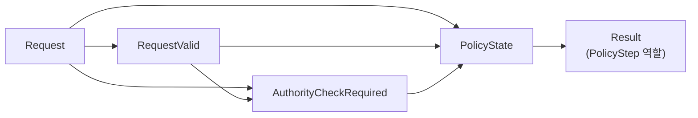
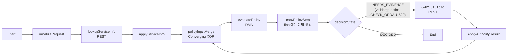

# Case 02 - 별정서비스 명의변경 권한 판정

> **시연 메시지**
>
> BPMN은 업무상 항상 필요한 서비스 정보를 먼저 조회한다. DMN은 그 사실에서 ORDAU1520 확인이 필요한지를 결정하고, BPMN은 대상일 때만 권한 API를 호출한 뒤 같은 DMN을 다시 평가한다. 비대상 서비스에서는 권한 API가 실제로 호출되지 않았음을 Process diagram과 Mock journal로 증명한다.

[공통 준비와 UI 절차로 돌아가기](README.md)

> **선행조건**
>
> [Case 00 환경 준비](case-00-environment-setup.md)를 완료하고 `/Users/jihunkeom/Desktop/projects/2026/SKT/skt_bamoe_party/prelim/test`를 프로젝트 root로 연 상태에서 시작한다.

## 1. 고객 규칙

고객 원문의 `processWirelineNameChange` 규칙은 다음과 같다.

1. `zordmb07s0100` API를 호출한다.
2. 응답의 `svc_cd`와 `svc_typ_cd`를 사용한다.
3. `svc_cd = "P"`이고 `svc_typ_cd = "72"`이면 ORDAU1520 권한을 확인한다.
4. 권한 결과가 `ERROR`이면 시스템 오류다.
5. 권한 결과가 `DENIED`이면 별정서비스 명의변경 권한 없음으로 거절한다.
6. 권한이 승인되었거나 조건에 해당하지 않으면 정상 처리한다.

> 고객 원문은 `svc_cd = "P"`이고 `svc_typ_cd = "72"`다. 두 값을 반대로 입력하지 않는다. 코드 `"72"`는 number가 아니라 string이다.

```text
서비스 정보 조회
└─ serviceCode = P AND serviceTypeCode = 72?
   ├─ false: ALLOW
   └─ true: ORDAU1520
      ├─ ERROR: SYSTEM_ERROR
      ├─ DENIED: DENY
      └─ GRANTED: ALLOW
```

## 2. BAMOE 설계 원칙

| 관심사 | 구현 위치 |
|---|---|
| 현재 상태와 다음 행동 | DMN `PolicyState` Decision Table |
| 최종 상태·사유·행동 | DMN `Result` Decision Table |
| 서비스 정보와 권한 API 호출 | BPMN REST Service Task |
| `NEEDS_EVIDENCE`일 때 ORDAU1520 실행 | BPMN Exclusive Gateway |
| 응답 field/enum/null 검증 | BPMN mapping Script |
| HTTP 200 body의 `ERROR` 해석 | DMN |
| HTTP 4xx/5xx·timeout | BPMN 기술 오류 |

미호출 상태를 `ordAu1520Result = "NOT_CHECKED"`로 표현하지 않는다. 호출 상태와 결과를 분리한다.

```text
authorityLookupState = "NOT_REQUESTED"
ordAu1520Result = null
```

호출과 schema 검증에 성공한 뒤에만 다음 상태가 된다.

```text
authorityLookupState = "COMPLETED"
ordAu1520Result = "GRANTED" | "DENIED" | "ERROR"
```

이렇게 하면 null 자체가 미호출인지 잘못된 응답인지 애매하지 않다.

## 3. 생성할 자산

| 항목 | 값 |
|---|---|
| DMN 파일 | `src/main/resources/dmn/Case02WirelineNameChange.dmn` |
| Model Name | `Case02WirelineNameChange` |
| Namespace | `https://example.com/bamoe/poc/case02/v1` |
| Input Data | `Request` |
| public Decision | `Result` |
| Decision Service | `Case02WirelineNameChangeService` |
| SCESIM | `src/test/resources/scesim/Case02WirelineNameChangeTest.scesim` |
| BPMN | `src/main/resources/bpmn/Case02WirelineNameChangeProcess.bpmn` |
| Mock | `mock-server/case02_mock_server.py`, port `8092` |

### 3.1 이전 가이드로 시작한 자산을 전환할 때

기존 DMN에 `NOT_CHECKED`가 있다면 UI에서 다음 순서로 전환한다.

1. `CallState`, `Case02PolicyState`, `Case02NextAction`을 추가한다.
2. `AuthResult`에서 `NOT_CHECKED`를 삭제하고 `DEINED`가 있으면 `DENIED`로 고친다.
3. `tCase02Request`에 권한 CallState field를 추가한다.
4. 새 `PolicyState` Decision과 5절의 Information Requirement를 만든다.
5. 기존 `Result` 표를 8절의 상태 변환 표로 교체한다.
6. Decision Service의 Encapsulated Decisions에 `PolicyState`를 추가한다.
7. 기존 SCESIM을 10절의 GIVEN/EXPECT 계약으로 다시 구성한다.

XML을 직접 편집하지 말고 Modern BAMOE Editor에서 수정·저장한다.

## 4. DMN Data Types

모든 enum은 base type `string`, `Is Collection = false`다.

### 4.1 Enum

`CallState`:

```feel
"NOT_REQUESTED", "COMPLETED"
```

`AuthResult`:

```feel
"GRANTED", "DENIED", "ERROR"
```

`PolicyDecisionState`:

```feel
"NEEDS_EVIDENCE", "DECIDED"
```

`DecisionStatus`:

```feel
"ALLOW", "DENY", "SYSTEM_ERROR", "INVALID_INPUT"
```

`Case02PolicyState`:

```feel
"INVALID_REQUEST",
"NOT_APPLICABLE",
"NEEDS_AUTHORITY",
"AUTHORITY_ERROR",
"AUTHORITY_DENIED",
"ALLOWED",
"INCONSISTENT"
```

`Case02NextAction`:

```feel
"CHECK_ORDAU1520",
"CONTINUE",
"STOP",
"RETURN_ERROR",
"FIX_INPUT"
```

기존 DMN에 `DEINED`가 있으면 `DENIED`로 고치고 호환값으로 남기지 않는다.

```bash
if rg -n 'DEINED|NOT_CHECKED' \
  src/main/resources/dmn/Case02WirelineNameChange.dmn; then
  echo "[FIX] 이전 오타 또는 sentinel 값이 남아 있음"
else
  echo "[OK] AuthResult 계약"
fi
```

### 4.2 `tCase02Request`

| Field | Type | 의미 |
|---|---|---|
| `serviceCode` | `string` | 조회 완료 후 `svc_cd` |
| `serviceTypeCode` | `string` | 조회 완료 후 `svc_typ_cd` |
| `authorityLookupState` | `CallState` | ORDAU1520 호출 상태 |
| `ordAu1520Result` | `AuthResult` | 호출 완료 후 권한 결과 |

DMN을 처음 평가할 때 서비스 정보는 이미 BPMN이 조회·검증한 값이다. 권한 CallState는 `"NOT_REQUESTED"`이고 권한 결과는 `null`이다.

### 4.3 `tCase02Result`

| Field | Type |
|---|---|
| `decisionState` | `PolicyDecisionState` |
| `status` | `DecisionStatus` |
| `reasonCode` | `string` |
| `reasonMessage` | `string` |
| `nextAction` | `Case02NextAction` |

## 5. DRD

### 5.1 Node

| 종류 | 이름 | Output type |
|---|---|---|
| Input Data | `Request` | `tCase02Request` |
| Decision | `RequestValid` | `boolean` |
| Decision | `AuthorityCheckRequired` | `boolean` |
| Decision | `PolicyState` | `Case02PolicyState` |
| Decision | `Result` | `tCase02Result` |

### 5.2 Information Requirement



`PolicyState`가 참조하는 `Request`, `RequestValid`, `AuthorityCheckRequired`를 모두 직접 연결한다. 모든 선은 Association이 아니라 `Information Requirement`다.

## 6. Helper Decision

### 6.1 `RequestValid`

Expression type은 `Literal Expression`, output type은 `boolean`이다.

```feel
Request.serviceCode != null
and Request.serviceCode != ""
and Request.serviceTypeCode != null
and Request.serviceTypeCode != ""
and Request.authorityLookupState != null
```

서비스 정보는 필수 선행 조회이므로 코드가 없으면 `INVALID_REQUEST`다.

### 6.2 `AuthorityCheckRequired`

```feel
RequestValid
and Request.serviceCode = "P"
and Request.serviceTypeCode = "72"
```

이 helper는 “권한 API를 호출한다”가 아니라 “현재 확보된 서비스 정보상 권한 확인 대상이다”라는 파생 사실이다.

## 7. `PolicyState` Decision Table

- Expression: `Decision Table`
- Hit Policy: `First (F)`
- Decision output type: `Case02PolicyState`
- Output column: `state`, Data Type `Case02PolicyState`

이 표의 enum type은 `PolicyState` **Decision node의 Output data type**과 단일
output column 양쪽에 `Case02PolicyState`로 지정한다. 현재 실습에서 검증한
BAMOE `9.5.0-ibm-0005` 저장 형식과 맞추기 위한 기준이다.

### 7.1 Input columns

| # | Input Expression | Type |
|---:|---|---|
| 1 | `RequestValid` | `boolean` |
| 2 | `AuthorityCheckRequired` | `boolean` |
| 3 | `Request.authorityLookupState` | `CallState` |
| 4 | `Request.ordAu1520Result` | `AuthResult` |

### 7.2 Rule rows

| # | Valid | Auth req | Auth state | Auth result | state |
|---:|---:|---:|---|---|---|
| 1 | `false` | `-` | `-` | `-` | `"INVALID_REQUEST"` |
| 2 | `true` | `false` | `"NOT_REQUESTED"` | `null` | `"NOT_APPLICABLE"` |
| 3 | `true` | `true` | `"NOT_REQUESTED"` | `null` | `"NEEDS_AUTHORITY"` |
| 4 | `true` | `true` | `"COMPLETED"` | `"ERROR"` | `"AUTHORITY_ERROR"` |
| 5 | `true` | `true` | `"COMPLETED"` | `"DENIED"` | `"AUTHORITY_DENIED"` |
| 6 | `true` | `true` | `"COMPLETED"` | `"GRANTED"` | `"ALLOWED"` |
| 7 | `-` | `-` | `-` | `-` | `"INCONSISTENT"` |

마지막 행은 다음과 같은 불가능한 조합을 모두 fail-closed로 처리한다.

- 비대상 요청인데 권한 결과가 존재
- 권한 호출이 `NOT_REQUESTED`인데 결과가 존재
- 권한 호출이 `COMPLETED`인데 결과가 null

긴 `if/else`나 별도의 `EvidenceConsistent:boolean`은 필요하지 않다.

## 8. `Result` Decision Table — Policy Step 계약

`Result`는 현재 DMN 파일의 기존 Decision 이름이지만 의미상 최종 응답 전용 node가
아니라 **BPMN에 전달하는 `PolicyStep`**이다.

- `decisionState = "NEEDS_EVIDENCE"`이면 `nextAction`의 외부 증거가 더 필요하다.
- `decisionState = "DECIDED"`일 때만 terminal policy result다.
- Process caller가 받는 최종 계약은 `processResponse.policyResult`다.

이미 작성 중인 UI 자산과 SCESIM/BPMN mapping을 보호하기 위해 이번 실습에서는
Decision 이름을 `Result`로 유지한다.

- Hit Policy: `Unique (U)`
- Input: `PolicyState`, type `Case02PolicyState`
- Outputs: `decisionState`, `status`, `reasonCode`, `reasonMessage`, `nextAction`

| PolicyState | decisionState | status | reasonCode | reasonMessage | nextAction |
|---|---|---|---|---|---|
| `"INVALID_REQUEST"` | `"DECIDED"` | `"INVALID_INPUT"` | `"SERVICE_INFO_REQUIRED"` | `"서비스 코드, 서비스 유형과 권한 호출 상태가 필요합니다."` | `"FIX_INPUT"` |
| `"NOT_APPLICABLE"` | `"DECIDED"` | `"ALLOW"` | `"RULE_NOT_APPLICABLE"` | `"ORDAU1520 권한 확인 대상이 아닙니다."` | `"CONTINUE"` |
| `"NEEDS_AUTHORITY"` | `"NEEDS_EVIDENCE"` | `null` | `"ORDAU1520_CHECK_REQUIRED"` | `"ORDAU1520 권한 확인이 필요합니다."` | `"CHECK_ORDAU1520"` |
| `"AUTHORITY_ERROR"` | `"DECIDED"` | `"SYSTEM_ERROR"` | `"ORDAU1520_ERROR"` | `"ORDAU1520 권한 확인 중 오류가 발생했습니다."` | `"RETURN_ERROR"` |
| `"AUTHORITY_DENIED"` | `"DECIDED"` | `"DENY"` | `"ORDAU1520_DENIED"` | `"별정서비스 명의변경 권한이 없습니다."` | `"STOP"` |
| `"ALLOWED"` | `"DECIDED"` | `"ALLOW"` | `"NAME_CHANGE_ALLOWED"` | `"명의변경 처리가 허용되었습니다."` | `"CONTINUE"` |
| `"INCONSISTENT"` | `"DECIDED"` | `"INVALID_INPUT"` | `"EVIDENCE_STATE_INVALID"` | `"외부 조회 상태와 결과값의 조합이 올바르지 않습니다."` | `"FIX_INPUT"` |

## 9. Decision Service와 저장 Gate

`Case02WirelineNameChangeService`를 만든다.

```text
Case02WirelineNameChangeService
├─ Input: Request
├─ Encapsulated
│  ├─ RequestValid
│  ├─ AuthorityCheckRequired
│  └─ PolicyState
└─ Output: Result
```

Decision Service 자체의 output type을 별도로 지정하지 않는다. Output Decision
`Result:tCase02Result`에서 파생된다. 이 버전의 Editor가 Decision Service
variable에 `typeRef`를 저장하지 않아 경고를 출력할 수 있지만, 존재하지 않는
서비스용 Data Type을 만들어 넣지는 않는다.

저장 후:

```bash
cd "/Users/jihunkeom/Desktop/projects/2026/SKT/skt_bamoe_party/prelim/test"

DMN_FILE="src/main/resources/dmn/Case02WirelineNameChange.dmn"
READY=true
if test -s "$DMN_FILE"; then
  echo "[OK] $DMN_FILE"
else
  echo "[MISSING/EMPTY] $DMN_FILE"
  READY=false
fi

if test -s "$DMN_FILE"; then
  rg -n \
    'CallState|Case02PolicyState|PolicyState|CHECK_ORDAU1520' \
    "$DMN_FILE"

  if rg -n 'EvidenceConsistent|NOT_CHECKED|DEINED' "$DMN_FILE"; then
    echo "[FIX] 이전 설계 또는 오타가 남아 있음"
    READY=false
  else
    echo "[OK] 명시적 상태 기반 설계"
  fi

  if rg -q \
    '<decisionService name="Case02WirelineNameChangeService"' \
    "$DMN_FILE"
  then
    echo "[OK] Case02 Decision Service name"
  else
    echo "[FIX] UI에서 New Decision Service를 Case02WirelineNameChangeService로 변경"
    READY=false
  fi

  ENCAPSULATED_COUNT="$(
    rg -o '<encapsulatedDecision ' "$DMN_FILE" \
      | wc -l | tr -d ' '
  )"
  OUTPUT_DECISION_COUNT="$(
    rg -o '<outputDecision ' "$DMN_FILE" \
      | wc -l | tr -d ' '
  )"
  INPUT_DATA_COUNT="$(
    rg -o '<inputData href=' "$DMN_FILE" \
      | wc -l | tr -d ' '
  )"
  INPUT_DECISION_COUNT="$(
    rg -o '<inputDecision ' "$DMN_FILE" \
      | wc -l | tr -d ' '
  )"
  if test "$ENCAPSULATED_COUNT" -eq 3 \
      && test "$OUTPUT_DECISION_COUNT" -eq 1 \
      && test "$INPUT_DATA_COUNT" -eq 1 \
      && test "$INPUT_DECISION_COUNT" -eq 0
  then
    echo "[OK] Decision Service topology: encapsulated=3, output=1, inputData=1"
  else
    echo "[FIX] Decision Service의 Encapsulated 3개, Output 1개, Input Request를 다시 지정"
    READY=false
  fi

  if rg -q '<output[^>]*typeRef="Case02PolicyState"' "$DMN_FILE"; then
    echo "[OK] PolicyState single-output column type is Case02PolicyState"
  else
    echo "[FIX] UI에서 PolicyState 단일 output column의 Data Type을 Case02PolicyState로 지정"
    READY=false
  fi
fi

if test "$READY" = true; then
  echo "CASE02_DMN_STATIC_GATE=PASS"
else
  echo "STOP: 위 [FIX] 항목을 UI에서 수정·저장한 뒤 다시 실행하세요."
fi
```

모든 항목이 `[OK]`이고 `CASE02_DMN_STATIC_GATE=PASS`일 때 10절로 넘어간다.
특히 Decision Service가 `New Decision Service`이면 model 전체 endpoint는 생겨도
11장의 이름 있는 service endpoint는 404이므로 그대로 진행하지 않는다. 기존
SCESIM은 새 Request 구조 또는 아직 추가하지 않은 `reasonMessage` 열 때문에
실패할 수 있으므로 여기서 `clean verify`를 선행 Gate로 실행하지 않는다. 10절에서
SCESIM을 마이그레이션한 뒤 10.4에서 DMN `Problems` error 0건,
`Failures: 0`, `Errors: 0`, `BUILD SUCCESS`를 확인한다.

## 10. SCESIM으로 DMN 검증

### 10.1 파일과 Settings

`src/test/resources/scesim/Case02WirelineNameChangeTest.scesim`을 만들고 `(classic)`이 없는 **BAMOE Test Scenario Editor**로 연다.

현재 repository의 checked-in baseline에는 아래 `Result.reasonMessage` EXPECT
mapping이 아직 반영되지 않았다. 기존 다른 EXPECT만으로 `clean verify`가
성공하더라도 메시지 회귀까지 검증된 것은 아니다. 이 절에서 UI로 열을 추가하고
8개 행을 모두 채운 뒤 저장·재검증해야 완료 체크리스트를 통과한 것으로 본다.

| Setting | 값 |
|---|---|
| Type | `DMN` |
| DMN Model | `Case02WirelineNameChange.dmn` |
| DMN Name | `Case02WirelineNameChange` |
| DMN Namespace | `https://example.com/bamoe/poc/case02/v1` |
| Skip this test scenario | 해제 |

### 10.2 열 구성

GIVEN:

```text
Request.serviceCode
Request.serviceTypeCode
Request.authorityLookupState
Request.ordAu1520Result
```

EXPECT:

```text
RequestValid.value
AuthorityCheckRequired.value
PolicyState.value
Result.decisionState
Result.status
Result.reasonCode
Result.reasonMessage
Result.nextAction
```

Helper와 `PolicyState`는 GIVEN이 아니라 EXPECT다. GIVEN과 EXPECT null은 모두
`null`로 입력한다. `? = null`도 동작하지만 이 가이드는 `null`로 통일한다.
string에는 큰따옴표를 포함한다.

### 10.3 8개 시나리오

`Result.reasonMessage`도 모든 행에서 필수 EXPECT다. 실제 SCESIM cell에는 아래
표처럼 큰따옴표까지 포함한 FEEL string을 입력한다.

| ID | Service/type | Auth state/result | PolicyState | decisionState | status | reasonCode | reasonMessage | nextAction |
|---|---|---|---|---|---|---|---|---|
| `C02-S01` | `null` / `"72"` | `"NOT_REQUESTED"` / `null` | `"INVALID_REQUEST"` | `"DECIDED"` | `"INVALID_INPUT"` | `"SERVICE_INFO_REQUIRED"` | `"서비스 코드, 서비스 유형과 권한 호출 상태가 필요합니다."` | `"FIX_INPUT"` |
| `C02-S02` | `"C"` / `"72"` | `"NOT_REQUESTED"` / `null` | `"NOT_APPLICABLE"` | `"DECIDED"` | `"ALLOW"` | `"RULE_NOT_APPLICABLE"` | `"ORDAU1520 권한 확인 대상이 아닙니다."` | `"CONTINUE"` |
| `C02-S03` | `"P"` / `"72"` | `"NOT_REQUESTED"` / `null` | `"NEEDS_AUTHORITY"` | `"NEEDS_EVIDENCE"` | `null` | `"ORDAU1520_CHECK_REQUIRED"` | `"ORDAU1520 권한 확인이 필요합니다."` | `"CHECK_ORDAU1520"` |
| `C02-S04` | `"P"` / `"72"` | `"COMPLETED"` / `"ERROR"` | `"AUTHORITY_ERROR"` | `"DECIDED"` | `"SYSTEM_ERROR"` | `"ORDAU1520_ERROR"` | `"ORDAU1520 권한 확인 중 오류가 발생했습니다."` | `"RETURN_ERROR"` |
| `C02-S05` | `"P"` / `"72"` | `"COMPLETED"` / `"DENIED"` | `"AUTHORITY_DENIED"` | `"DECIDED"` | `"DENY"` | `"ORDAU1520_DENIED"` | `"별정서비스 명의변경 권한이 없습니다."` | `"STOP"` |
| `C02-S06` | `"P"` / `"72"` | `"COMPLETED"` / `"GRANTED"` | `"ALLOWED"` | `"DECIDED"` | `"ALLOW"` | `"NAME_CHANGE_ALLOWED"` | `"명의변경 처리가 허용되었습니다."` | `"CONTINUE"` |
| `C02-S07` | `"P"` / `"72"` | `"NOT_REQUESTED"` / `"GRANTED"` | `"INCONSISTENT"` | `"DECIDED"` | `"INVALID_INPUT"` | `"EVIDENCE_STATE_INVALID"` | `"외부 조회 상태와 결과값의 조합이 올바르지 않습니다."` | `"FIX_INPUT"` |
| `C02-S08` | `"P"` / `"72"` | `"COMPLETED"` / `null` | `"INCONSISTENT"` | `"DECIDED"` | `"INVALID_INPUT"` | `"EVIDENCE_STATE_INVALID"` | `"외부 조회 상태와 결과값의 조합이 올바르지 않습니다."` | `"FIX_INPUT"` |

Helper EXPECT:

| ID | RequestValid | AuthorityCheckRequired |
|---|---:|---:|
| `C02-S01` | `false` | `false` |
| `C02-S02` | `true` | `false` |
| `C02-S03` | `true` | `true` |
| `C02-S04` | `true` | `true` |
| `C02-S05` | `true` | `true` |
| `C02-S06` | `true` | `true` |
| `C02-S07` | `true` | `true` |
| `C02-S08` | `true` | `true` |

`C02-S07`은 권한을 호출하지 않았는데 결과값이 주입된 상태이고, `C02-S08`은
호출이 완료됐는데 결과가 없는 반대 방향의 불가능한 상태다.

### 10.4 Activator와 실행

프로젝트 공용 Activator를 확인한다.

```bash
cd "/Users/jihunkeom/Desktop/projects/2026/SKT/skt_bamoe_party/prelim/test"

ACTIVATOR="src/test/java/testscenario/TestScenarioJunitActivatorTest.java"
SCESIM="src/test/resources/scesim/Case02WirelineNameChangeTest.scesim"
SCESIM_READY=true

if test -f "$ACTIVATOR" && rg -q '@TestScenarioActivator' "$ACTIVATOR"; then
  echo "[OK] project-wide activator"
else
  echo "[MISSING] activator를 project당 한 번 생성"
  SCESIM_READY=false
fi

if test -s "$SCESIM"; then
  echo "[OK] Case02 SCESIM"
else
  echo "[MISSING/EMPTY] Case02 SCESIM"
  SCESIM_READY=false
fi

if test -s "$SCESIM" \
    && rg -q '<expressionAlias>reasonMessage</expressionAlias>' "$SCESIM"; then
  echo "[OK] Case02 reasonMessage EXPECT column"
else
  echo "[FIX] UI에서 Result.reasonMessage EXPECT column을 추가"
  SCESIM_READY=false
fi

if test "$SCESIM_READY" = true; then
  echo "[READY] Case02 SCESIM test를 실행하세요."
else
  echo "STOP: 위 누락 항목을 먼저 만든 뒤 이 Gate를 다시 실행하세요."
fi
```

Activator가 없을 때만 다음 파일을 만든다.

```java
package testscenario;

import org.drools.scenariosimulation.backend.runner.TestScenarioActivator;

@TestScenarioActivator
public class TestScenarioJunitActivatorTest {
}
```

위 확인에서 `[MISSING]` 또는 `[MISSING/EMPTY]`가 하나라도 나오면 아래 Maven
명령을 실행하지 않고 먼저 UI에서 해당 파일을 생성·저장한다.

```bash
mvn -s config/settings-bamoe-container.xml \
  -Dtest=testscenario.TestScenarioJunitActivatorTest \
  test

mvn -s config/settings-bamoe-container.xml clean verify
```

Case02 8개 SCESIM 시나리오, `Failures: 0`, `Errors: 0`, `BUILD SUCCESS`를
확인한다. 다른 SCESIM이 함께 실행되면 전체 테스트 수는 8보다 클 수 있다.
위 문자열 검색은 column 존재만 확인한다. Test Scenario Editor에서 8개 행의
`reasonMessage` cell이 모두 채워졌는지도 표와 대조한다. 빈 EXPECT cell은
null 검증이 아니라 **그 field의 검증 생략**이다.

## 11. DMN component REST 확인

### 11.1 서버와 endpoint

Terminal A:

```bash
cd "/Users/jihunkeom/Desktop/projects/2026/SKT/skt_bamoe_party/prelim/test"
mvn -s config/settings-bamoe-container.xml clean verify
mvn -s config/settings-bamoe-container.xml spring-boot:run
```

Terminal B:

```bash
curl --fail-with-body -sS \
  'http://127.0.0.1:8080/v3/api-docs' \
  | jq -r '.paths | keys[] | select(contains("Case02WirelineNameChange"))'

MODEL_URL='http://127.0.0.1:8080/Case02WirelineNameChange'
SERVICE_URL='http://127.0.0.1:8080/Case02WirelineNameChange/Case02WirelineNameChangeService'
set -o pipefail
```

URL은 예시를 추측해 사용하지 말고 OpenAPI에 표시된 실제 path를 최종 기준으로 한다.

### 11.2 대상 서비스, 권한 미호출

```bash
curl --fail-with-body -sS -X POST "$SERVICE_URL" \
  -H 'Content-Type: application/json' \
  -H 'Accept: application/json' \
  -d '{
    "Request": {
      "serviceCode": "P",
      "serviceTypeCode": "72",
      "authorityLookupState": "NOT_REQUESTED",
      "ordAu1520Result": null
    }
  }' | jq '
      if has("reasonCode")
      then {decisionState,status,reasonCode,reasonMessage,nextAction}
      else .
      end
    '
```

예상: `NEEDS_EVIDENCE / ORDAU1520_CHECK_REQUIRED / CHECK_ORDAU1520`.

### 11.3 승인 완료

```bash
curl --fail-with-body -sS -X POST "$SERVICE_URL" \
  -H 'Content-Type: application/json' \
  -H 'Accept: application/json' \
  -d '{
    "Request": {
      "serviceCode": "P",
      "serviceTypeCode": "72",
      "authorityLookupState": "COMPLETED",
      "ordAu1520Result": "GRANTED"
    }
  }' | jq '
      if has("reasonCode")
      then {decisionState,status,reasonCode,reasonMessage,nextAction}
      else .
      end
    '
```

예상: `DECIDED / ALLOW / NAME_CHANGE_ALLOWED / CONTINUE`.

### 11.4 전체 model과 `/dmnresult`

전체 model endpoint에서는 `RequestValid`, `AuthorityCheckRequired`, `PolicyState`, `Result`를 함께 확인한다.

```bash
curl --fail-with-body -sS -X POST "$MODEL_URL" \
  -H 'Content-Type: application/json' \
  -H 'Accept: application/json' \
  -d '{
    "Request": {
      "serviceCode": "P",
      "serviceTypeCode": "72",
      "authorityLookupState": "COMPLETED",
      "ordAu1520Result": "DENIED"
    }
  }' | jq '
      if has("Result")
      then {
        RequestValid,
        AuthorityCheckRequired,
        PolicyState,
        Result
      }
      else .
      end
    '
```

평가 message와 Decision별 `evaluationStatus`는 `"${MODEL_URL}/dmnresult"`에서 확인한다. 업무 `DENY`와 엔진 평가 `SUCCEEDED`는 서로 다른 축이다.

### 11.5 DMN 진단 서버 종료

Terminal A에서 `Ctrl+C`를 눌러 지금 실행한 DMN-only runtime을 종료한다. 이
runtime은 아직 12절에서 만들 BPMN을 로드하지 않았으므로 켜 둔 채 다음
`spring-boot:run`을 실행하면 8080 충돌 또는 stale endpoint가 발생한다.

다른 Terminal에서 종료를 확인한다.

```bash
if lsof -nP -iTCP:8080 -sTCP:LISTEN; then
  echo 'STOP: 8080의 기존 BAMOE runtime을 먼저 종료하세요.' >&2
  false
else
  echo 'DMN_DIAGNOSTIC_SERVER_STOP_GATE=PASS'
fi
```

## 12. BPMN + Mock orchestration

### 12.1 시작 payload

```json
{
  "requestId": "C02-E2E-001",
  "serviceManagementNumber": "SVC-2001",
  "mockScenario": "target-granted"
}
```

서비스 코드와 권한 결과를 process 시작 payload로 받지 않는다. `mockScenario`는 dev/test 전용이다.

### 12.2 최종 topology



서비스 정보 조회는 고객 원문상 모든 요청에 필요한 선행 단계이므로 BPMN에 명시한다. 조회가 끝난 뒤부터 DMN이 대상 여부와 조건부 ORDAU1520 호출을 결정한다.

### 12.3 Mock server

`mock-server/case02_mock_server.py`:

```python
import json
from http.server import BaseHTTPRequestHandler, ThreadingHTTPServer
from urllib.parse import parse_qs, urlparse

JOURNAL = []


class Handler(BaseHTTPRequestHandler):
    def send_json(self, status, body):
        payload = json.dumps(body, ensure_ascii=False).encode("utf-8")
        self.send_response(status)
        self.send_header("Content-Type", "application/json; charset=utf-8")
        self.send_header("Content-Length", str(len(payload)))
        self.end_headers()
        self.wfile.write(payload)

    def read_json(self):
        length = int(self.headers.get("Content-Length", "0"))
        return json.loads(self.rfile.read(length) or b"{}")

    def record(self, path, body):
        JOURNAL.append({
            "sequence": len(JOURNAL) + 1,
            "requestId": body.get("requestId"),
            "path": path,
            "scenario": body.get("scenario", "target-granted")
        })

    def do_POST(self):
        path = urlparse(self.path).path
        body = self.read_json()
        scenario = body.get("scenario", "target-granted")
        self.record(path, body)

        if path == "/case02/service-info":
            if scenario == "service-http-500":
                return self.send_json(500, {"error": "SERVICE_API_FAILED"})
            if scenario == "not-target":
                return self.send_json(200, {
                    "serviceCode": "C",
                    "serviceTypeCode": "72"
                })
            return self.send_json(200, {
                "serviceCode": "P",
                "serviceTypeCode": "72"
            })

        if path == "/case02/ordau1520":
            if scenario == "auth-http-500":
                return self.send_json(500, {"error": "ORDAU1520_UNAVAILABLE"})
            result = {
                "auth-denied": "DENIED",
                "auth-body-error": "ERROR"
            }.get(scenario, "GRANTED")
            return self.send_json(200, {"result": result})

        return self.send_json(404, {"error": "NOT_FOUND", "path": path})

    def do_GET(self):
        parsed = urlparse(self.path)
        if parsed.path == "/health":
            return self.send_json(200, {"status": "UP"})
        if parsed.path != "/case02/_test/journal":
            return self.send_json(404, {"error": "NOT_FOUND"})
        request_id = parse_qs(parsed.query).get("requestId", [None])[0]
        calls = [
            call for call in JOURNAL
            if request_id is None or call["requestId"] == request_id
        ]
        self.send_json(200, {"calls": calls})

    def do_DELETE(self):
        if urlparse(self.path).path != "/case02/_test/journal":
            return self.send_json(404, {"error": "NOT_FOUND"})
        JOURNAL.clear()
        self.send_json(200, {"cleared": True})

    def log_message(self, fmt, *args):
        print("[case02-mock]", fmt % args)


print("Case02 mock listening on http://0.0.0.0:8092", flush=True)
ThreadingHTTPServer(("0.0.0.0", 8092), Handler).serve_forever()
```

Terminal M에서 실행하고 Process E2E가 끝날 때까지 이 Terminal을 유지한다.

```bash
cd "/Users/jihunkeom/Desktop/projects/2026/SKT/skt_bamoe_party/prelim/test"
python3 mock-server/case02_mock_server.py
```

다른 Terminal에서 최대 30초 동안 readiness를 확인한다.

```bash
MOCK_READY=0
for attempt in $(seq 1 30)
do
  if curl -fsS 'http://127.0.0.1:8092/health' \
      | jq -e '.status == "UP"' >/dev/null
  then
    MOCK_READY=1
    break
  fi
  sleep 1
done

if [ "$MOCK_READY" -eq 1 ]; then
  echo 'CASE02_MOCK_READINESS_GATE=PASS'
else
  echo 'CASE02_MOCK_READINESS_GATE=FAIL' >&2
  false
fi
```

### 12.4 Process Properties와 Variables

`src/main/resources/bpmn/Case02WirelineNameChangeProcess.bpmn`을 Modern BAMOE BPMN Editor로 만든다.

| 속성 | 값 |
|---|---|
| Process ID | `Case02WirelineNameChangeProcess` |
| Name | `Case02 Wireline Name Change Process` |
| Package | `org.acme.case02` |
| Executable | `true` |

| 변수 | Type | Tags | 역할 |
|---|---|---|---|
| `requestId` | `String` | `input,required,readonly` | correlation ID |
| `serviceManagementNumber` | `String` | `input,required,readonly` | 조회 key |
| `mockScenario` | `String` | `input` | dev/test 전용 |
| `serviceInfoRequest` | `java.util.Map` | `internal` | REST request |
| `serviceInfoResponse` | `java.util.Map` | `internal` | raw response |
| `authorityRequest` | `java.util.Map` | `internal` | REST request |
| `authorityResponse` | `java.util.Map` | `internal` | raw response |
| `decisionRequest` | `java.util.Map` | `internal` | DMN Request |
| `policyStep` | `java.util.Map` | `internal` | DMN `Result`가 반환한 PolicyStep |
| `decisionState` | `String` | `internal` | routing 상태 |
| `nextAction` | `String` | `internal` | routing action |
| `policyEvaluationCount` | `Integer` | `internal` | loop 상한 |
| `previousNextAction` | `String` | `internal` | 진행 정지 감지 |
| `processResponse` | `java.util.Map` | `output` | 최종 envelope |

### 12.5 Script Task

모든 Script Language는 `Java`다.

> **Java 지역변수 이름 주의**
>
> Kogito codegen은 Process Variable을 생성 Java 코드의 변수로 노출한다. 따라서
> Script 안에서 `String requestId`, `String mockScenario`,
> `java.util.Map decisionRequest`처럼 **Process Variable과 정확히 같은 이름을
> 다시 선언하지 않는다.** 아래 예제의 `rid`, `serviceNumber`, `scenario`,
> `service`, `auth`, `request`, `response`, `step`은 이 충돌을 피한 지역
> 이름이다. 따옴표 안의 `"requestId"`와
> `kcontext.getVariable("decisionRequest")` 같은 이름은 Process Variable
> 계약이므로 바꾸지 않는다.

`initializeRequest`:

```java
String rid = (String) kcontext.getVariable("requestId");
String serviceNumber =
    (String) kcontext.getVariable("serviceManagementNumber");
String scenario = (String) kcontext.getVariable("mockScenario");

if (rid == null || rid.isBlank()
        || serviceNumber == null || serviceNumber.isBlank()) {
    throw new IllegalArgumentException(
        "requestId and serviceManagementNumber are required");
}
if (scenario == null || scenario.isBlank()) {
    scenario = "target-granted";
    kcontext.setVariable("mockScenario", scenario);
}

java.util.Map service = new java.util.LinkedHashMap();
service.put("requestId", rid);
service.put("serviceManagementNumber", serviceNumber);
service.put("scenario", scenario);
kcontext.setVariable("serviceInfoRequest", service);

java.util.Map auth = new java.util.LinkedHashMap();
auth.put("requestId", rid);
auth.put("serviceManagementNumber", serviceNumber);
auth.put("permission", "ORDAU1520");
auth.put("scenario", scenario);
kcontext.setVariable("authorityRequest", auth);

java.util.Map request = new java.util.LinkedHashMap();
request.put("serviceCode", null);
request.put("serviceTypeCode", null);
request.put("authorityLookupState", "NOT_REQUESTED");
request.put("ordAu1520Result", null);
kcontext.setVariable("decisionRequest", request);
kcontext.setVariable("policyEvaluationCount", 0);
kcontext.setVariable("previousNextAction", null);
```

`applyServiceInfo`:

```java
java.util.Map response =
    (java.util.Map) kcontext.getVariable("serviceInfoResponse");
Object serviceCode =
    response == null ? null : response.get("serviceCode");
Object serviceTypeCode =
    response == null ? null : response.get("serviceTypeCode");
if (serviceCode == null || serviceCode.toString().isBlank()
        || serviceTypeCode == null
        || serviceTypeCode.toString().isBlank()) {
    throw new IllegalStateException(
        "service-info body missing serviceCode/serviceTypeCode");
}
java.util.Map request =
    (java.util.Map) kcontext.getVariable("decisionRequest");
request.put("serviceCode", serviceCode.toString());
request.put("serviceTypeCode", serviceTypeCode.toString());
kcontext.setVariable("decisionRequest", request);
```

`applyAuthorityResult`:

```java
java.util.Map response =
    (java.util.Map) kcontext.getVariable("authorityResponse");
Object value = response == null ? null : response.get("result");
String result = value == null ? null : value.toString();
if (result == null
        || !java.util.Set.of(
            "GRANTED", "DENIED", "ERROR").contains(result)) {
    throw new IllegalStateException(
        "invalid ORDAU1520 response body: " + result);
}
java.util.Map request =
    (java.util.Map) kcontext.getVariable("decisionRequest");
request.put("ordAu1520Result", result);
request.put("authorityLookupState", "COMPLETED");
kcontext.setVariable("decisionRequest", request);
```

두 mapping Script는 null-safe하게 schema만 검증한다. body의 `ERROR`는 유효한 업무 결과이므로 DMN으로 전달한다.

`copyPolicyStep`:

```java
java.util.Map step =
    (java.util.Map) kcontext.getVariable("policyStep");
if (step == null
        || step.get("decisionState") == null
        || step.get("nextAction") == null
        || step.get("reasonCode") == null
        || step.get("reasonMessage") == null
        || step.get("reasonCode").toString().isBlank()
        || step.get("reasonMessage").toString().isBlank()) {
    throw new IllegalStateException(
        "Case02 Result mapping is missing: " + step);
}
String state = step.get("decisionState").toString();
String action = step.get("nextAction").toString();
String status =
    step.get("status") == null
        ? null
        : step.get("status").toString();
Integer oldCount =
    (Integer) kcontext.getVariable("policyEvaluationCount");
int count = oldCount == null ? 1 : oldCount + 1;
if (count > 2) {
    throw new IllegalStateException(
        "Case02 policy did not terminate within 2 evaluations");
}

java.util.Set<String> allowedActions = java.util.Set.of(
    "CHECK_ORDAU1520",
    "CONTINUE",
    "STOP",
    "RETURN_ERROR",
    "FIX_INPUT");
if (!allowedActions.contains(action)) {
    throw new IllegalStateException(
        "Unknown Case02 nextAction: " + action);
}
if (!java.util.Set.of(
        "NEEDS_EVIDENCE", "DECIDED").contains(state)) {
    throw new IllegalStateException(
        "Unknown Case02 decisionState: " + state);
}

java.util.Set<String> evidenceActions =
    java.util.Set.of("CHECK_ORDAU1520");
java.util.Map<String, String> finalStatusAction =
    java.util.Map.of(
        "ALLOW", "CONTINUE",
        "DENY", "STOP",
        "SYSTEM_ERROR", "RETURN_ERROR",
        "INVALID_INPUT", "FIX_INPUT");
if ("NEEDS_EVIDENCE".equals(state)) {
    if (status != null || !evidenceActions.contains(action)) {
        throw new IllegalStateException(
            "Invalid Case02 pending Result: " + step);
    }
} else {
    if (status == null
            || !action.equals(finalStatusAction.get(status))) {
        throw new IllegalStateException(
            "Invalid Case02 final Result: " + step);
    }
}

String previous =
    (String) kcontext.getVariable("previousNextAction");
if ("NEEDS_EVIDENCE".equals(state) && action.equals(previous)) {
    throw new IllegalStateException(
        "Evidence action repeated without progress: " + action);
}
if ("NEEDS_EVIDENCE".equals(state)) {
    kcontext.setVariable("previousNextAction", action);
}

kcontext.setVariable("policyEvaluationCount", count);
kcontext.setVariable("decisionState", state);
kcontext.setVariable("nextAction", action);

if ("DECIDED".equals(state)) {
    java.util.Map response = new java.util.LinkedHashMap();
    response.put("requestId", kcontext.getVariable("requestId"));
    response.put("executionState", "COMPLETED");
    response.put("policyEvaluationCount", count);
    response.put(
        "policyResult",
        new java.util.LinkedHashMap(step));
    kcontext.setVariable("processResponse", response);
}
```

### 12.6 REST Service Task

먼저 `Data Assignments`에서 일반 request/response mapping을 만든다.

| Task | Input Name | Input Data Type | Source | Output Name / Data Type | Target |
|---|---|---|---|---|---|
| `lookupServiceInfo` | `serviceInfoRequest` | `java.util.Map` | `Var` → `serviceInfoRequest` | `Result` / `java.util.Map` | `Var` → `serviceInfoResponse` |
| `callOrdAu1520` | `authorityRequest` | `java.util.Map` | `Var` → `authorityRequest` | `Result` / `java.util.Map` | `Var` → `authorityResponse` |

`Var → serviceInfoRequest`는 **Data Type 이름이 아니다.** Input 행의
`Data Type`은 `java.util.Map`이고, `Source`에서 `Var`를 고른 뒤 오른쪽
dropdown에서 Process Variable을 선택한다. Output `Result`도 Data Type은
`java.util.Map`이고, `Target`에서 `Var`와 response Process Variable을
선택한다. Data Type 목록에서 `Var/serviceInfoRequest` 같은 항목을 찾지 않는다.

그 다음 REST Properties를 설정한다.

| Task | URL | Content Data |
|---|---|---|
| `lookupServiceInfo` | `http://customer-rule-mock:8092/case02/service-info` | ` #{serviceInfoRequest}` |
| `callOrdAu1520` | `http://customer-rule-mock:8092/case02/ordau1520` | ` #{authorityRequest}` |

공통 Properties:

| UI field | 값 |
|---|---|
| Method | `POST` |
| Request Timeout | `2000` |
| Access Token Acquisition Strategy | `none` |
| Header `Accept` | `application/json` |

일반 Data Assignments에는 request alias만 만든다. `ContentData`와 `HEADER_*`는
REST Task 예약 property이므로 일반 Name이나 Data Type으로 직접 만들지 않는다.
REST Properties의 `Content Data`와 `Headers`에서 설정한다.

`Content Data`는 입력 칸에서 Space 키를 한 번 누른 뒤 `#{alias}`를 입력한다.
즉 실제 값은 ` #{alias}`다. `Headers`에는 `Accept` 한 행만 추가하고
`Content-Type`은 추가하지 않는다. 이 Lab의 BAMOE `9.5.0-ibm-0005` Spring
codegen에서는 `HEADER_Content-Type`의 하이픈이 생성 Java를 깨뜨릴 수 있다.
Map body는 REST handler가 JSON으로 직렬화하며 wire Content-Type을 자동
설정한다. 정상 로그는 `ContentData={...}`다.

### 12.7 Business Rule Task와 Gateway

`applyServiceInfo`와 `applyAuthorityResult`의 두 대안 flow를
`evaluatePolicy`에 직접 꽂지 않는다. **Converging Exclusive Gateway** 하나에
모으고 Name을 `policyInputMerge`로 설정한 뒤 `evaluatePolicy`로 나가는
sequence flow 하나만 만든다. 기존 BPMN에서 이름 없는 merge Gateway가 보이면
새로 중복 생성하지 말고 그 Gateway의 Name을 바꾼다. 이 Gateway는 두 경로를
기다리는 Parallel Join이 아니라 이번에 도착한 대안 경로 하나를 합치는 지점이다.

`evaluatePolicy`:

| 설정 | 값 |
|---|---|
| Implementation | `DMN` |
| Model relative path | `../dmn/Case02WirelineNameChange.dmn` |
| Namespace | `https://example.com/bamoe/poc/case02/v1` |
| Model name | `Case02WirelineNameChange` |
| Input mapping | `Request / java.util.Map ← decisionRequest` |
| Output mapping | `Result / java.util.Map → policyStep` |

`decisionState` Gateway:

| 목적지 | MVEL condition |
|---|---|
| `callOrdAu1520` | `return "NEEDS_EVIDENCE".equals(decisionState);` |
| `end` | `return "DECIDED".equals(decisionState);` |

앞의 `copyPolicyStep`이 알 수 없는 상태·action과 잘못된 조합을 먼저 예외로
차단하며 `NEEDS_EVIDENCE`일 때 action이 반드시 `CHECK_ORDAU1520`인지도 검증한다.
이 Case의 evidence action은 한 종류뿐이므로 그 다음에 같은 사실을 확인하는
`nextAction` Gateway를 하나 더 두지 않고 바로 `callOrdAu1520`으로 연결한다.
향후 `NEEDS_EVIDENCE`에서 선택할 action이 두 종류 이상으로 늘어나면 그때
`nextAction` Gateway를 추가한다. 현재 Gateway에는 `serviceCode == "P"`나
`serviceTypeCode == "72"`를 다시 쓰지 않는다.

> **Script Task의 Java와 Gateway의 MVEL을 구분한다.**
>
> Script Task는 Java로 code generation되지만 Exclusive Gateway의 sequence flow
> condition은 runtime에 MVEL로 평가된다. 따라서 Gateway condition에
> `java.lang.Boolean.TRUE.equals(...)`, `java.util.Objects.equals(...)`,
> Java 지역변수 선언 같은 Java 전용 표현을 넣지 않는다. 이 Case의 routing 값은
> `copyPolicyStep`에서 null과 허용값을 이미 검증하므로 위처럼 문자열 literal의
> `equals`만 사용한다.
>
> 이 Gateway는 의도적으로 default flow를 두지 않는다. 검증되지 않은 상태를
> 정상 경로로 흘려보내지 않고 계약 오류로 즉시 드러내기 위해서다. 운영에서
> 구조화된 기술 오류 응답이 필요하면 임의의 정상 default가 아니라 Error
> Boundary와 공통 오류 경로를 추가한다.

저장 직후에는 BPMN source의 Gateway 표현만 확인한다.

```bash
BPMN_FILE='src/main/resources/bpmn/Case02WirelineNameChangeProcess.bpmn'

if rg -n -U \
  '<conditionExpression[^>]*>[^<]*(java\.(lang|util)\.|Boolean\.(TRUE|FALSE)|kcontext\.)' \
  "$BPMN_FILE"
then
  echo '[FIX] Gateway MVEL에서 Java 전용 표현을 제거하세요.'
else
  echo '[OK] Gateway conditions contain no Java-only syntax'
fi
```

merge 이름·종류·연결 수는 build 성공만으로 드러나지 않으므로 XML topology도
exact 검사한다. 아직 이름 없는 기존 Gateway라면 이 Gate가 실패하며, UI에서
`policyInputMerge`를 저장한 뒤 다시 실행한다.

```bash
python3 - "$BPMN_FILE" 2 evaluatePolicy <<'PY'
import sys
import xml.etree.ElementTree as ET

path, expected_incoming, task_name = sys.argv[1], int(sys.argv[2]), sys.argv[3]
root = ET.parse(path).getroot()
local = lambda tag: tag.rsplit("}", 1)[-1]

merges = [
    node for node in root.iter()
    if local(node.tag) == "exclusiveGateway"
    and node.get("name") == "policyInputMerge"
]
tasks = [
    node for node in root.iter()
    if local(node.tag) == "businessRuleTask"
    and node.get("name") == task_name
]

if len(merges) != 1 or len(tasks) != 1:
    raise SystemExit(
        "MERGE_GATE=FAIL: named merge/businessRuleTask must each be exactly one"
    )

merge, task = merges[0], tasks[0]
incoming = [n for n in merge if local(n.tag) == "incoming"]
outgoing = [n for n in merge if local(n.tag) == "outgoing"]
task_incoming = [n for n in task if local(n.tag) == "incoming"]
flows = [n for n in root.iter() if local(n.tag) == "sequenceFlow"]
direct = [
    flow for flow in flows
    if flow.get("sourceRef") == merge.get("id")
    and flow.get("targetRef") == task.get("id")
]

if (
    merge.get("gatewayDirection") != "Converging"
    or len(incoming) != expected_incoming
    or len(outgoing) != 1
    or len(task_incoming) != 1
    or len(direct) != 1
):
    raise SystemExit(
        "MERGE_GATE=FAIL: expected Converging "
        f"{expected_incoming}-in/1-out merge directly into {task_name}"
    )

print("MERGE_GATE=PASS")
PY
```

생성 Java는 fresh checkout에서 아직 없을 수 있으므로 Build가 끝난 뒤 확인한다.
`clean verify`가 성공해도 MVEL condition의 실제 분기는 실행하지 않으므로,
12.9의 Process E2E까지 통과해야 완료다.

### 12.8 기술 오류와 업무 `ERROR`

| 상황 | 처리 |
|---|---|
| HTTP 200 + `{"result":"ERROR"}` | DMN `SYSTEM_ERROR / ORDAU1520_ERROR` |
| HTTP 4xx/5xx | REST Task 기술 실패 |
| timeout | transport 기술 실패 |
| HTTP 200이지만 field 누락/unknown enum | mapping Script 기술 실패 |

고객 retry·timeout·idempotency 계약이 확정되기 전에는 기술 실패를 권한 `ERROR`로 변환하지 않는다.

### 12.9 Build와 E2E

12.3에서 시작한 Terminal M의 Mock과 readiness `PASS` 상태를 유지한다. 중간에
종료했다면 Mock을 다시 시작하고 readiness Gate부터 재실행한다. Terminal A에서는
먼저 Build만 수행한다.

```bash
cd "/Users/jihunkeom/Desktop/projects/2026/SKT/skt_bamoe_party/prelim/test"
mvn -s config/settings-bamoe-container.xml clean verify
```

`BUILD SUCCESS` 뒤 생성된 Gateway evaluator를 확인한다.

```bash
GENERATED_FILE='target/generated-sources/kogito/org/acme/case02/Case02WirelineNameChangeProcessProcess.java'

rg -n 'MVELInterpretedReturnValueEvaluator' "$GENERATED_FILE"
```

검색 결과가 각 Gateway condition의 evaluator를 보여야 한다. 이어서 같은
Terminal A에서 서버를 실행한다.

```bash
mvn -s config/settings-bamoe-container.xml spring-boot:run
```

Terminal B:

```bash
set -o pipefail
PROCESS_PATH=$(curl --fail-with-body -sS \
  'http://127.0.0.1:8080/v3/api-docs' \
  | jq -r '
      .paths | to_entries[]
      | select(.key == "/Case02WirelineNameChangeProcess")
      | select(.value.post != null)
      | .key
    ')

test "$PROCESS_PATH" = '/Case02WirelineNameChangeProcess'
PROCESS_URL="http://127.0.0.1:8080${PROCESS_PATH}"
echo "$PROCESS_URL"
```

출력이 `http://127.0.0.1:8080/Case02WirelineNameChangeProcess`여야 한다.
`<확인한-POST-path>` 같은 placeholder를 URL에 그대로 넣지 않는다.

> **`curl: (22)`와 `null`은 정상 결과가 아니다.**
>
> 아래 정상 경로 명령은 성공 응답에서 `processResponse`만 보기 위한 것이다.
> Process가 HTTP 500을 반환하면 `jq '.processResponse'`가 오류 body의 다른
> field를 버리고 `null`만 출력할 수 있다. 이때 Mock journal만 보고 성공으로
> 판정하지 말고, 동일 payload를 다음처럼 파일에 받아 전체 오류 body와 Terminal
> A의 첫 `Caused by`를 확인한다.

```bash
debug_file="$(mktemp)"
debug_status=$(curl -sS \
  -o "$debug_file" \
  -w '%{http_code}' \
  -X POST "$PROCESS_URL" \
  -H 'Content-Type: application/json' \
  -H 'Accept: application/json' \
  -d '{
    "requestId": "C02-E2E-DEBUG",
    "serviceManagementNumber": "SVC-2001",
    "mockScenario": "target-granted"
  }')

echo "HTTP $debug_status"
jq . "$debug_file"
rm -f "$debug_file"
```

대상 승인 경로에서 `HTTP 201`이 아니면 다음 시나리오로 넘어가지 않는다.
REST/DMN이 성공해도 Gateway MVEL에서 실패할 수 있으므로 journal의 마지막 호출
위치와 Terminal A의 exception node를 함께 본다.

정상 Process 응답은 존재 여부만 보지 않고 최종 policy tuple과 평가 횟수까지
exact 비교한다. 아래 helper를 같은 Terminal에 한 번 등록한다.

```bash
assert_case02_response () {
  local request_id="$1"
  local expected_status="$2"
  local expected_action="$3"
  local expected_reason_code="$4"
  local expected_evaluation_count="$5"
  local response_body

  response_body="$(cat)"

  if printf '%s\n' "$response_body" \
      | jq -e \
          --arg request_id "$request_id" \
          --arg status "$expected_status" \
          --arg action "$expected_action" \
          --arg reason_code "$expected_reason_code" \
          --argjson evaluation_count "$expected_evaluation_count" \
          '
            .processResponse.requestId == $request_id
            and .processResponse.executionState == "COMPLETED"
            and .processResponse.policyEvaluationCount
              == $evaluation_count
            and .processResponse.policyResult.decisionState == "DECIDED"
            and .processResponse.policyResult.status == $status
            and .processResponse.policyResult.nextAction == $action
            and .processResponse.policyResult.reasonCode == $reason_code
            and (
              .processResponse.policyResult.reasonMessage
              | type == "string" and length > 0
            )
          ' \
          >/dev/null
  then
    echo "[OK] exact Case02 process response"
    printf '%s\n' "$response_body" | jq '.processResponse'
  else
    echo "[INVALID] Case02 process response assertion 실패" >&2
    printf '%s\n' "$response_body" | jq . 2>/dev/null \
      || printf '%s\n' "$response_body"
    return 1
  fi
}
```

대상 승인:

```bash
curl --fail-with-body -sS -X DELETE \
  'http://127.0.0.1:8092/case02/_test/journal' >/dev/null

curl --fail-with-body -sS -X POST "$PROCESS_URL" \
  -H 'Content-Type: application/json' \
  -H 'Accept: application/json' \
  -d '{
    "requestId": "C02-E2E-GRANTED",
    "serviceManagementNumber": "SVC-2001",
    "mockScenario": "target-granted"
  }' \
  | assert_case02_response \
      'C02-E2E-GRANTED' 'ALLOW' 'CONTINUE' \
      'NAME_CHANGE_ALLOWED' 2

curl --fail-with-body -sS \
  'http://127.0.0.1:8092/case02/_test/journal?requestId=C02-E2E-GRANTED' \
  | jq -e '
      [.calls[].path] == [
        "/case02/service-info",
        "/case02/ordau1520"
      ]
    '
```

기대 결과는 `ALLOW / NAME_CHANGE_ALLOWED`, `policyEvaluationCount = 2`다.

비대상 skip:

```bash
curl --fail-with-body -sS -X POST "$PROCESS_URL" \
  -H 'Content-Type: application/json' \
  -H 'Accept: application/json' \
  -d '{
    "requestId": "C02-E2E-SKIP",
    "serviceManagementNumber": "SVC-2002",
    "mockScenario": "not-target"
  }' \
  | assert_case02_response \
      'C02-E2E-SKIP' 'ALLOW' 'CONTINUE' \
      'RULE_NOT_APPLICABLE' 1

curl --fail-with-body -sS \
  'http://127.0.0.1:8092/case02/_test/journal?requestId=C02-E2E-SKIP' \
  | jq -e '
      [.calls[].path] == ["/case02/service-info"]
    '
```

기대 결과는 `ALLOW / RULE_NOT_APPLICABLE`, `policyEvaluationCount = 1`이다.

업무 body `ERROR`:

```bash
curl --fail-with-body -sS -X POST "$PROCESS_URL" \
  -H 'Content-Type: application/json' \
  -H 'Accept: application/json' \
  -d '{
    "requestId": "C02-E2E-BODY-ERROR",
    "serviceManagementNumber": "SVC-2003",
    "mockScenario": "auth-body-error"
  }' \
  | assert_case02_response \
      'C02-E2E-BODY-ERROR' 'SYSTEM_ERROR' 'RETURN_ERROR' \
      'ORDAU1520_ERROR' 2
```

기대 **Process 응답은 HTTP 201**이고
`SYSTEM_ERROR / ORDAU1520_ERROR`, `policyEvaluationCount = 2`다. 여기서 HTTP
200은 Process가 아니라 ORDAU1520 Mock provider가 업무
`{"result":"ERROR"}` body를 반환한 응답이다.

```bash
curl --fail-with-body -sS \
  'http://127.0.0.1:8092/case02/_test/journal?requestId=C02-E2E-BODY-ERROR' \
  | jq -e '
      [.calls[].path] == [
        "/case02/service-info",
        "/case02/ordau1520"
      ]
    '
```

권한 거절:

```bash
curl --fail-with-body -sS -X POST "$PROCESS_URL" \
  -H 'Content-Type: application/json' \
  -H 'Accept: application/json' \
  -d '{
    "requestId": "C02-E2E-DENIED",
    "serviceManagementNumber": "SVC-2005",
    "mockScenario": "auth-denied"
  }' \
  | assert_case02_response \
      'C02-E2E-DENIED' 'DENY' 'STOP' \
      'ORDAU1520_DENIED' 2

curl --fail-with-body -sS \
  'http://127.0.0.1:8092/case02/_test/journal?requestId=C02-E2E-DENIED' \
  | jq -e '
      [.calls[].path] == [
        "/case02/service-info",
        "/case02/ordau1520"
      ]
    '
```

기대 결과는 `DENY / ORDAU1520_DENIED`, `policyEvaluationCount = 2`다.

기술 HTTP 500:

```bash
run_case02_raw_technical () {
  local request_id="$1"
  local scenario="$2"
  local expected_paths="$3"
  local body_file
  local http_status
  local response_valid=0
  local journal_valid=0

  body_file="$(mktemp)" || return 1
  curl --fail-with-body -sS -X DELETE \
    'http://127.0.0.1:8092/case02/_test/journal' >/dev/null

  if http_status="$(
      curl -sS \
        -o "$body_file" \
        -w '%{http_code}' \
        -X POST "$PROCESS_URL" \
        -H 'Content-Type: application/json' \
        -H 'Accept: application/json' \
        -d "{
          \"requestId\": \"$request_id\",
          \"serviceManagementNumber\": \"SVC-TECH\",
          \"mockScenario\": \"$scenario\"
        }"
    )"
  then
    case "$http_status" in
      5??)
        response_valid=1
        printf '[OK] raw technical HTTP %s\n' "$http_status"
        jq '{status, error, path}' "$body_file" 2>/dev/null \
          || sed -n '1,120p' "$body_file"
        ;;
      *)
        printf '[INVALID] expected HTTP 5xx, got %s\n' \
          "$http_status" >&2
        jq . "$body_file" 2>/dev/null || true
        ;;
    esac
  else
    echo '[INVALID] Process transport 호출 자체가 실패했습니다.' >&2
  fi

  if curl --fail-with-body -sS \
      "http://127.0.0.1:8092/case02/_test/journal?requestId=$request_id" \
      | jq -e \
          --argjson expected_paths "$expected_paths" \
          '[.calls[].path] == $expected_paths' \
          >/dev/null
  then
    journal_valid=1
    echo '[OK] exact technical-failure journal'
  else
    echo '[INVALID] technical-failure journal assertion 실패' >&2
  fi

  rm -f "$body_file"
  test "$response_valid" -eq 1 \
    && test "$journal_valid" -eq 1
}
```

```bash
CASE02_TECHNICAL_FAILED=0

run_case02_raw_technical \
  'C02-E2E-SERVICE-HTTP-ERROR' 'service-http-500' \
  '["/case02/service-info"]' \
  || CASE02_TECHNICAL_FAILED=1

run_case02_raw_technical \
  'C02-E2E-AUTH-HTTP-ERROR' 'auth-http-500' \
  '["/case02/service-info","/case02/ordau1520"]' \
  || CASE02_TECHNICAL_FAILED=1

if [ "$CASE02_TECHNICAL_FAILED" -eq 0 ]; then
  echo 'CASE02_TECHNICAL_SUITE=PASS'
else
  echo 'CASE02_TECHNICAL_SUITE=FAIL' >&2
  false
fi
```

두 REST Task 각각의 실패에서 다음 DMN 평가가 없어야 하고 journal은 실패한
Task에서 정확히 멈춰야 한다. 이것을 `ORDAU1520_ERROR`로 해석하지 않는다.
개발 설정에서는 오류 JSON에 긴 stack trace가 포함될 수 있으므로 helper는
`status/error/path`만 우선 출력한다.

### 12.10 서버 종료

Terminal A의 BAMOE와 Terminal M의 Mock에서 각각 `Ctrl+C`를 누른다.

```bash
if lsof -nP -iTCP:8080 -sTCP:LISTEN \
  || lsof -nP -iTCP:8092 -sTCP:LISTEN
then
  echo 'STOP: Case02 server가 아직 실행 중입니다.' >&2
  false
else
  echo 'CASE02_SERVER_STOP_GATE=PASS'
fi
```

## 13. 고객 설명 포인트

1. BPMN이 공통 선행 단계인 서비스 정보를 먼저 조회하는 것을 보여 준다.
2. `PolicyState`에서 서비스 정보가 `P/72`일 때만 `CHECK_ORDAU1520`이 나오는 것을 보여 준다.
3. BPMN에는 `P/72` 조건이 없으며, 검증된 `NEEDS_EVIDENCE /
   CHECK_ORDAU1520` 계약만 실행 흐름으로 옮긴다는 점을 강조한다.
4. 비대상 E2E journal에 서비스 API 한 건만 남는 것을 보여 준다.
5. Decision Table에서 대상 코드가 바뀌어도 BPMN과 REST mapping은 바뀌지 않는다고 설명한다.
6. body `ERROR`와 HTTP 500을 비교해 업무 결과와 기술 실패의 경계를 보여 준다.

## 14. 완료 체크리스트

- [ ] `CallState`가 `NOT_REQUESTED/COMPLETED`를 명시한다.
- [ ] `AuthResult`는 `GRANTED/DENIED/ERROR`만 포함한다.
- [ ] `NOT_CHECKED`와 `DEINED`가 없다.
- [ ] `PolicyState`가 7개 행의 `First` Decision Table이다.
- [ ] 마지막 catch-all이 `INCONSISTENT`다.
- [ ] `Result`의 모든 행에 reasonCode와 reasonMessage가 있다.
- [ ] 모든 Decision node의 output type을 지정했고 단일 출력 `PolicyState` 표의 output column type도 `Case02PolicyState`다.
- [ ] DRD Information Requirement가 실제 참조와 일치한다.
- [ ] Decision Service 이름이 `Case02WirelineNameChangeService`다.
- [ ] Decision Service output은 `Result` 하나다.
- [ ] SCESIM 8개 시나리오가 통과한다.
- [ ] 8개 SCESIM 행 모두 `Result.reasonMessage` EXPECT가 채워져 있다.
- [ ] `mvn ... clean verify`가 `BUILD SUCCESS`다.
- [ ] 서비스 정보 확인 후 첫 component 호출이 필요 시 `CHECK_ORDAU1520`을 반환한다.
- [ ] BPMN은 서비스 정보를 먼저 조회하고 같은 `evaluatePolicy`를 최대 2회 평가한다.
- [ ] `applyServiceInfo`와 `applyAuthorityResult`의 두 대안 flow가 `policyInputMerge` Converging XOR에 합쳐지고, 이 Gateway에서 `evaluatePolicy`로 나가는 flow는 하나다.
- [ ] `copyPolicyStep`이 `decisionState`와 semantic `nextAction` 조합을 검증하고, Gateway는 단일 evidence 경로만 실행한다.
- [ ] Gateway 조건은 MVEL 식이며 `java.*`, `Boolean.TRUE/FALSE`, `kcontext` 또는 Java 지역변수 선언이 없다.
- [ ] 미지의 routing 값을 정상 처리하는 default flow가 없고 `copyPolicyStep`이 먼저 상태/action을 검증한다.
- [ ] 두 REST Task 모두 `Accept: application/json`만 설정하고 수동 `Content-Type` 행은 추가하지 않았다.
- [ ] REST input/output Data Type은 `java.util.Map`이고 Source/Target에서 `Var`와 Process Variable을 선택했다.
- [ ] 두 `Content Data` 값은 선행 공백을 포함한 ` #{alias}`이며 runtime 로그가 `ContentData={...}`다.
- [ ] Script의 Java 지역변수 이름이 Process Variable 이름과 충돌하지 않는다.
- [ ] mapping Script가 null-safe하게 schema와 enum을 검증한다.
- [ ] 비대상 E2E에서 ORDAU1520이 호출되지 않는다.
- [ ] body `ERROR`와 HTTP 5xx를 구분했다.
- [ ] 고객 API가 오면 Mock adapter만 교체한다.
