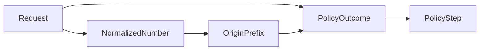
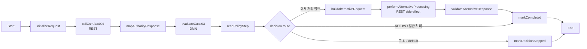

# Case 03 - MMS 발신번호 권한과 대체 처리 판정

> **목표**
> 외부 caller가 권한 결과를 조립하지 않게 한다. BAMOE BPMN이 CSMAUX004를 항상 호출하고, DMN이 대체 처리 필요 여부를 판정하며, `alternativeProcessingRequired = true`일 때만 BPMN이 대체 처리 REST side effect를 실행한다.
>
> **구현 원칙**
> DMN은 순수한 정책 컴포넌트로 유지하고, 외부 호출·side effect·기술 오류·idempotency는 BPMN과 adapter/mock 경계에서 처리한다. 실제 번호 마스킹 규칙은 고객 계약이 확정되지 않았으므로 구현하지 않는다.

[공통 준비와 UI 절차로 돌아가기](README.md)

## 1. 고객 규칙

1. CSMAUX004 권한을 확인한다.
2. 결과가 `ERROR`이면 오류로 종료한다.
3. 결과가 `DENIED`이면 `mms_org_no`의 앞뒤 공백을 제거하고 앞 3자리를 구한다.
4. 접두어가 다음 목록에 있으면 대체 업무 로직을 수행한다.

```text
010, 011, 012, 016, 017, 018, 019
```

5. 권한이 있든 없든, 오류가 아니라면 기본 업무 흐름은 계속한다.

이 사례에서 `DENIED`는 곧바로 업무 거절을 의미하지 않는다는 점이 핵심이다.

## 2. PoC 보완 규칙과 TBD

### 2.1 PoC 보완 규칙

- CSMAUX004는 항상 호출한다. 응답 null이나 허용되지 않은 값은 BPMN mapping의
  기술 계약 오류이며 DMN에 전달하지 않는다.
- `DENIED`인데 발신번호가 `null`이거나 공백 제거 후 길이가 3보다 작으면 `INVALID_INPUT`이다.
- `GRANTED`이면 발신번호를 사용하지 않고 정상 처리한다.
- DMN은 대체 처리 대상이면 다음 정책 결과를 반환한다.

```text
alternativeProcessingRequired = true
nextAction = "ALTERNATIVE_PROCESSING"
```

- BPMN은 이 boolean이 `true`일 때만 대체 처리 REST Task를 실행한다.
- PoC 대체 처리 API는 `requestId`에서 만든 고정 idempotency key를 받는다. 같은 key로 재호출되어도 실제 side effect는 한 번만 수행한다.
- HTTP 200 body의 `result = ERROR`와 HTTP 4xx/5xx·timeout을 구분한다. 전자는 DMN이 해석하는 provider 업무 결과이고, 후자는 BPMN의 기술 오류다.

3자리 미만 번호를 `INVALID_INPUT`으로 처리하는 것은 PDF 원문에 명시된 결과가
아니라 substring 오류를 fail-closed로 만들기 위한 **PoC 보완 계약**이다. 고객이
누락값 처리 방식을 전달하면 해당 행의 status/reason을 재확정한다.

### 2.2 고객 확인 전까지 모델링하지 않는 것

- 번호를 어떤 모양으로 마스킹할지
- 대체 처리 결과를 어디에 저장할지
- 번호 중간의 공백, 하이픈, 국가번호를 정규화할지
- 대체 처리 API의 실제 URL·인증·request/response field
- timeout 후 조회·재시도·보상 정책
- 실제 side effect가 요청 처리 전 실패했는지, 처리 후 응답만 유실됐는지 판별하는 계약

원문에서 마스킹은 예시일 뿐 정확한 변환 규칙이 아니므로 임의로 번호를 바꾸지 않는다. PoC Mock의 `PROCESSED` 응답은 호출 경계와 중복 방지만 검증하며 실제 번호 변환을 의미하지 않는다.

### 2.3 고객에게 보여 줄 설계 메시지

시연에서는 다음 세 문장으로 설명한다.

1. **BPMN이 실행을 소유한다.** CSMAUX004를 한 번 호출하고, 필요할 때만 멱등
   대체 처리 API를 실행한다.
2. **DMN이 정책을 소유한다.** 번호 정규화 결과와 접두어를 `PolicyOutcome`
   Decision Table에서 분류하고 `PolicyStep` 표가 최종 행동 계약을 만든다.
3. **정책 변경이 Process를 흔들지 않는다.** 대체 접두어가 바뀌면 DMN 행만
   수정하며 BPMN Gateway와 REST 호출 구조는 그대로 유지된다.

Case03은 필요한 권한 API가 처음부터 CSMAUX004 하나로 고정되어 있으므로 DMN을
억지로 여러 번 호출하지 않는다. `API 1회 → DMN 1회 → 조건부 side effect`가 이
사례의 가장 단순하고 설명 가능한 구조다.

## 3. 생성할 자산

| 항목 | 값 |
|---|---|
| DMN 파일 | `src/main/resources/dmn/Case03MmsSendAuthority.dmn` |
| Model Name | `Case03MmsSendAuthority` |
| Namespace | `https://example.com/bamoe/poc/case03/v1` |
| Input Data | `Request` |
| 분류 Decision | `PolicyOutcome` |
| 최종 Decision | `PolicyStep` |
| Decision Service | `Case03MmsSendAuthorityService` |
| SCESIM | `src/test/resources/scesim/Case03MmsSendAuthorityTest.scesim` |
| BPMN 파일 | `src/main/resources/bpmn/Case03MmsSendProcess.bpmn` |
| Process ID | `Case03MmsSendProcess` |
| Mock fixture | `mock-server/case03_mock_server.py` |
| Mock port | `8093` |

DMN component와 Process의 입력 계약은 다르다.

| 실행 경계 | caller가 전달하는 값 | 용도 |
|---|---|---|
| DMN component endpoint | `csmAux004Result`, `mmsOriginNumber` | 규칙 단독 진단 |
| BPMN Process endpoint | `requestId`, `mmsOriginNumber`, 개발용 `mockScenario` | 실제 고객 시연과 end-to-end 검증 |

운영 Process에는 `mockScenario`가 없다. 실제 권한 응답은 BPMN의 REST Task 또는 adapter가 만들고, Process 내부에서만 DMN Request로 변환한다.

## 4. Data Types

### 4.1 공통 enum

`AuthResult`:

```feel
"GRANTED", "DENIED", "ERROR"
```

이 enum은 업무 결과 세 개만 표현한다. Process에서는 REST mapping이 null과 알 수
없는 값을 먼저 차단한다. DMN component endpoint를 직접 호출할 때 enum 밖 값을
보내면 구조화된 `PolicyStep`이 아니라 입력 type/evaluation 오류가 날 수 있으며,
그것이 이 계약의 의도다.

`DecisionStatus`:

```feel
"ALLOW", "DENY", "SYSTEM_ERROR", "INVALID_INPUT"
```

`Case03PolicyOutcome`:

```feel
"AUTH_ERROR",
"AUTHORIZED",
"ORIGIN_NUMBER_INVALID",
"ALTERNATIVE_REQUIRED",
"NORMAL_PROCESSING"
```

`NextAction`:

```feel
"RETURN_ERROR", "CONTINUE", "FIX_INPUT", "ALTERNATIVE_PROCESSING"
```

### 4.2 `tCase03Request`

| Field | Type |
|---|---|
| `csmAux004Result` | `AuthResult` |
| `mmsOriginNumber` | `string` |

### 4.3 `tCase03PolicyStep`

| Field | Type |
|---|---|
| `status` | `DecisionStatus` |
| `reasonCode` | `string` |
| `reasonMessage` | `string` |
| `nextAction` | `NextAction` |
| `alternativeProcessingRequired` | `boolean` |

> **기존 Data Type을 먼저 재확인한다**
>
> UI에서 Decision을 만들기 전에 `tCase03Request`의 field 이름이 정확히
> `mmsOriginNumber`인지 확인한다. `mmxOriginNumber`처럼 철자가 다르면 아래
> FEEL에서 같은 Request field를 찾을 수 없다. 또한
> `tCase03PolicyStep.status`의 Type은 기본 `string`이 아니라 enum인
> `DecisionStatus`여야 한다.

## 5. DRD

### 5.1 Node

| 종류 | 이름 | Type |
|---|---|---|
| Input Data | `Request` | `tCase03Request` |
| Decision | `NormalizedNumber` | `string` |
| Decision | `OriginPrefix` | `string` |
| Decision | `PolicyOutcome` | `Case03PolicyOutcome` |
| Decision | `PolicyStep` | `tCase03PolicyStep` |

### 5.2 연결



Information Requirement는 다음 관계를 정확히 연결한다.

1. `Request → NormalizedNumber`
2. `NormalizedNumber → OriginPrefix`
3. `Request`, `OriginPrefix → PolicyOutcome`
4. `PolicyOutcome → PolicyStep`

`PolicyOutcome`이 어떤 업무 상태인지 표로 분류하고 `PolicyStep`이 이를 외부
계약으로 변환한다. 긴 `if/else` boolean 검증식이나 `Result`에서 모든 조건을 한 번에
처리하는 표는 만들지 않는다.

`PolicyOutcome` 표는 `NormalizedNumber`를 직접 읽지 않고 `OriginPrefix`만 읽는다.
따라서 `NormalizedNumber → PolicyOutcome` 직결선은 추가하지 않는다. DRD 연결은
실제 FEEL 참조 관계와 같아야 한다.

## 6. 간단한 값 계산 Decision

### 6.1 `NormalizedNumber`

| UI 설정 | 값 |
|---|---|
| Expression type | `Literal Expression` |
| Decision Output data type | `string` |

설정 후 다음 FEEL을 입력한다.

```feel
if Request.csmAux004Result = "DENIED"
then if Request.mmsOriginNumber = null
     then null
     else replace(Request.mmsOriginNumber, "^\\s+|\\s+$", "")
else null
```

권한이 `DENIED`일 때만 번호를 읽는다. 이 정규식은 앞뒤 whitespace만 제거하며 번호 중간은 변경하지 않는다.

### 6.2 `OriginPrefix`

| UI 설정 | 값 |
|---|---|
| Expression type | `Literal Expression` |
| Decision Output data type | `string` |

설정 후 다음 FEEL을 입력한다.

```feel
if NormalizedNumber != null
   and string length(NormalizedNumber) >= 3
then substring(NormalizedNumber, 1, 3)
else null
```

FEEL의 첫 글자 index는 1이다. 원문 pseudocode의 0 기반 index를 그대로 넣지 않는다.

`NormalizedNumber`와 `OriginPrefix`는 단순한 값 계산이므로 Literal Expression이
적합하다. 여러 입력 조합과 우선순위는 다음 `PolicyOutcome` Decision Table에서
보이게 만든다.

## 7. `PolicyOutcome` Decision Table

| UI 설정 | 값 |
|---|---|
| Expression type | `Decision Table` |
| Decision Output data type | `Case03PolicyOutcome` |
| Hit Policy | `First (F)` |

### 7.1 Input columns

| Input Expression | Type |
|---|---|
| `Request.csmAux004Result` | `AuthResult` |
| `OriginPrefix` | `string` |

### 7.2 Output column

| Output Name | Output column Data Type |
|---|---|
| `PolicyOutcome` | `Case03PolicyOutcome` |

여기서 두 종류의 type 설정을 혼동하지 않는다.

- Decision node의 **Decision Output data type**은 `Case03PolicyOutcome`으로 지정한다.
- 단일 output Decision Table의 **output column Data Type**도 `Case03PolicyOutcome`으로 지정한다.

현재 실습에서 검증한 BAMOE `9.5.0-ibm-0005` 저장 형식은 두 위치의 type을 모두
유지한다. 일반 validator의 중복 type warning만 보고 한쪽을 지우지 말고, 이
가이드의 build와 SCESIM 결과를 기준으로 확인한다.

### 7.3 Rule rows

| # | Auth | OriginPrefix | PolicyOutcome |
|---:|---|---|---|
| 1 | `"ERROR"` | `-` | `"AUTH_ERROR"` |
| 2 | `"GRANTED"` | `-` | `"AUTHORIZED"` |
| 3 | `"DENIED"` | `null` | `"ORIGIN_NUMBER_INVALID"` |
| 4 | `"DENIED"` | `"010", "011", "012", "016", "017", "018", "019"` | `"ALTERNATIVE_REQUIRED"` |
| 5 | `"DENIED"` | `not(null, "010", "011", "012", "016", "017", "018", "019")` | `"NORMAL_PROCESSING"` |

`AuthResult`의 허용값은 세 개이고 각 값의 가능한 조합을 위 표가 모두 다룬다.
응답 null 또는 알 수 없는 값은 이 표의 업무 상태가 아니라 BPMN mapping의 기술
계약 오류다. `First`를 사용하면 향후 더 구체적인 접두어 예외를 위에 추가할 수 있다.

PDF의 대체 접두어는 정확히 다음 7개이며 `017`이 포함된다.

```text
010, 011, 012, 016, 017, 018, 019
```

저장 후 UI에서 `OriginPrefix` 열의 4행과 5행 목록을 다시 대조한다.

## 8. `PolicyStep` Decision Table과 Decision Service

### 8.1 `PolicyStep` Decision Table

| UI 설정 | 값 |
|---|---|
| Expression type | `Decision Table` |
| Decision Output data type | `tCase03PolicyStep` |
| Hit Policy | `Unique (U)` |

Input column:

| Input Expression | Type |
|---|---|
| `PolicyOutcome` | `Case03PolicyOutcome` |

Output columns:

| Output Name | Type |
|---|---|
| `status` | `DecisionStatus` |
| `reasonCode` | `string` |
| `reasonMessage` | `string` |
| `nextAction` | `NextAction` |
| `alternativeProcessingRequired` | `boolean` |

각 상태당 한 행만 입력하고 모든 `reasonMessage`를 생략하지 않는다.

| # | PolicyOutcome | status | reasonCode | reasonMessage | nextAction | alternativeProcessingRequired |
|---:|---|---|---|---|---|---:|
| 1 | `"AUTH_ERROR"` | `"SYSTEM_ERROR"` | `"CSMAUX004_BODY_ERROR"` | `"CSMAUX004가 업무 오류를 반환했습니다."` | `"RETURN_ERROR"` | `false` |
| 2 | `"AUTHORIZED"` | `"ALLOW"` | `"PRIMARY_AUTH_GRANTED"` | `"CSMAUX004 권한이 승인되었습니다."` | `"CONTINUE"` | `false` |
| 3 | `"ORIGIN_NUMBER_INVALID"` | `"INVALID_INPUT"` | `"MMS_ORIGIN_NUMBER_INVALID"` | `"발신번호의 앞 3자리를 확인할 수 없습니다."` | `"FIX_INPUT"` | `false` |
| 4 | `"ALTERNATIVE_REQUIRED"` | `"ALLOW"` | `"ALTERNATIVE_PROCESSING_REQUIRED"` | `"대체 처리 대상 발신번호이므로 대체 처리가 필요합니다."` | `"ALTERNATIVE_PROCESSING"` | `true` |
| 5 | `"NORMAL_PROCESSING"` | `"ALLOW"` | `"NORMAL_PROCESSING"` | `"대체 처리 대상이 아니므로 정상 처리를 계속합니다."` | `"CONTINUE"` | `false` |

`DENIED`라고 해서 `DENY`가 되는 것이 아니다. 접두어에 따라 대체 처리 또는 정상
처리로 계속되는 것이 고객 규칙의 핵심이다.

### 8.2 Decision Service

1. `Case03MmsSendAuthorityService`를 추가한다.
2. `PolicyStep`을 Output Decisions에 넣는다.
3. 다음을 Encapsulated Decisions에 넣는다.
   - `NormalizedNumber`
   - `OriginPrefix`
   - `PolicyOutcome`
4. `Request`가 service input인지 확인한다.

Decision Service 자체에 별도의 output type을 지정하지 않는다. 유일한 Output
Decision인 `PolicyStep`의 Decision Output data type이 `tCase03PolicyStep`이므로
service 응답 타입은 여기서 파생된다.

이 Decision Service는 외부 component 진단용 public facade다. BPMN은 CSMAUX004를 먼저 수집한 뒤 Business Rule Task로 모델 전체를 **한 번만** 평가한다. 특정 Decision Service를 선택 실행하거나 권한 호출 전 provisional 결과를 평가하는 구조가 아니다.

## 9. SCESIM 회귀 테스트 만들기

이 절은 1~8번의 DMN을 저장하고 `Problems` error가 0건인 상태에서 진행한다. SCESIM은 Spring Boot server나 외부 API를 호출하지 않고 Maven test JVM 안에서 DMN을 직접 평가한다.

> **현재 문서 상태**
>
> repository에 저장된 Case 03 baseline은 `clean verify`, OpenAPI, Process E2E로
> 검증했다. 다만 UI에서 새로 만들거나 수정한 자산은 저장된 baseline과 다를 수
> 있으므로 아래 Maven Gate를 다시 실행한 결과를 최종 기준으로 삼는다.

### 9.1 SCESIM 파일 생성

VS Code Explorer에서 다음 순서로 진행한다.

1. `src/test/resources` 아래에 `scesim` folder가 없으면 만든다.
2. 다음 파일을 만든다.

```text
src/test/resources/scesim/Case03MmsSendAuthorityTest.scesim
```

3. text/XML editor로 열리면 editor tab을 우클릭한다.
4. `Reopen Editor With...`를 선택한다.
5. `(classic)`이 붙지 않은 **BAMOE Test Scenario Editor**를 선택한다.
6. `Create a new Test Scenario` dialog를 다음과 같이 입력한다.

| 항목 | 값 |
|---|---|
| Asset type | `Decision (DMN)` |
| DMN file | `Case03MmsSendAuthority.dmn` |
| Autofill DMN Data | 선택 해제 |

7. `Create`를 누른다.

`Autofill DMN Data`는 이번 실습에서는 끈다. 필요한 GIVEN과 EXPECT column을 직접 선택하여 입력 정규화와 최종 결과의 관계를 확인한다.

### 9.2 Settings 설정

gear icon 또는 `Settings`를 열고 다음 값을 확인한다.

| 설정 | 값 |
|---|---|
| Type | `DMN` |
| DMN Model | `Case03MmsSendAuthority.dmn` |
| DMN Name | `Case03MmsSendAuthority` |
| DMN Namespace | `https://example.com/bamoe/poc/case03/v1` |
| Skip this test scenario during the test | 선택 해제 |

설정 후 저장 상태까지 확인한다.

1. `Cmd+S`
2. SCESIM editor tab 닫기
3. Explorer에서 같은 파일 다시 열기
4. Settings의 Model, Name, Namespace, Skip 값 재확인
5. selector에 `Request`, `NormalizedNumber`, `OriginPrefix`, `PolicyOutcome`,
   `PolicyStep`이 보이는지 확인

Terminal에서도 파일이 실제로 저장됐는지 확인한다.

```bash
cd "/Users/jihunkeom/Desktop/projects/2026/SKT/skt_bamoe_party/prelim/test"

SCESIM_FILE="src/test/resources/scesim/Case03MmsSendAuthorityTest.scesim"

if test -s "$SCESIM_FILE"; then
  echo "[OK] SCESIM exists and is non-empty: $SCESIM_FILE"
  wc -c "$SCESIM_FILE"
else
  echo "[MISSING/EMPTY] SCESIM: $SCESIM_FILE"
fi
```

shell의 `test -s` 자체는 성공해도 실패해도 화면에 아무것도 출력하지 않고 종료 코드만 반환한다. 그래서 위처럼 `if`와 메시지를 함께 사용한다. `[MISSING/EMPTY]`가 나오면 파일이 없거나 0 byte이거나 initial dialog가 끝나지 않은 것이다. XML을 직접 작성하지 말고 BAMOE Test Scenario Editor에서 다시 생성한다.

### 9.3 GIVEN과 EXPECT column 구성

`Test Tools` panel 또는 GIVEN/EXPECT header의 `+` menu를 사용한다.

GIVEN:

1. `Request` → `csmAux004Result`
2. `Request` → `mmsOriginNumber`

EXPECT:

1. `NormalizedNumber` → `value`
2. `OriginPrefix` → `value`
3. `PolicyOutcome` → `value`
4. `PolicyStep` → `status`
5. `PolicyStep` → `reasonCode`
6. `PolicyStep` → `reasonMessage`
7. `PolicyStep` → `nextAction`
8. `PolicyStep` → `alternativeProcessingRequired`

`Request`와 `PolicyStep`은 상위 Instance와 하위 field의 2단 header로 보이는 것이
정상이다. `NormalizedNumber`, `OriginPrefix`, `PolicyOutcome`은 scalar
Decision이므로 `Decision 이름 → value`로 추가한다.

### 9.4 cell 입력 문법

SCESIM cell에는 JSON이 아니라 FEEL literal을 입력한다.

| 값 종류 | 입력 예 |
|---|---|
| string | `"DENIED"`, `" 01612345678 "` |
| boolean | `true`, `false` |
| GIVEN null | `null` |
| EXPECT null | `null` |

빈칸과 `null`은 다르다.

- GIVEN의 빈 cell은 해당 field mapping을 생략할 수 있다.
- GIVEN으로 실제 null을 전달하려면 빈칸이 아니라 `null`을 입력한다.
- EXPECT의 빈 cell은 null assertion이 아니라 해당 검증을 생략한다.
- EXPECT에서 결과가 null임을 검증하려면 `null`을 입력한다. `? = null`도
  동작하지만 이 가이드는 간단한 표기로 통일한다.
- 전화번호도 number가 아닌 string이므로 `"01012345678"`처럼 따옴표를 넣는다.
- 공백 제거 시나리오의 앞뒤 공백은 따옴표 안에 그대로 둔다.

### 9.5 다섯 정책 상태와 `017` 회귀 시나리오

Scenario description에는 아래 ID와 설명을 함께 입력한다.

입력과 중간 Decision:

| ID / Scenario description | Auth | Number | NormalizedNumber | OriginPrefix | PolicyOutcome |
|---|---|---|---|---|---|
| `C03-S01 provider 업무 오류` | `"ERROR"` | `"01012345678"` | `null` | `null` | `"AUTH_ERROR"` |
| `C03-S02 권한 승인` | `"GRANTED"` | `"01012345678"` | `null` | `null` | `"AUTHORIZED"` |
| `C03-S03 번호 null` | `"DENIED"` | `null` | `null` | `null` | `"ORIGIN_NUMBER_INVALID"` |
| `C03-S04 번호 3자리 미만` | `"DENIED"` | `"01"` | `"01"` | `null` | `"ORIGIN_NUMBER_INVALID"` |
| `C03-S05 공백 제거 후 대체 처리` | `"DENIED"` | `" 01612345678 "` | `"01612345678"` | `"016"` | `"ALTERNATIVE_REQUIRED"` |
| `C03-S06 일반 처리` | `"DENIED"` | `"01312345678"` | `"01312345678"` | `"013"` | `"NORMAL_PROCESSING"` |
| `C03-S07 원문 017 회귀` | `"DENIED"` | `"01712345678"` | `"01712345678"` | `"017"` | `"ALTERNATIVE_REQUIRED"` |

모든 `PolicyStep` field:

| ID | status | reasonCode | reasonMessage | nextAction | alternativeProcessingRequired |
|---|---|---|---|---|---:|
| `C03-S01` | `"SYSTEM_ERROR"` | `"CSMAUX004_BODY_ERROR"` | `"CSMAUX004가 업무 오류를 반환했습니다."` | `"RETURN_ERROR"` | `false` |
| `C03-S02` | `"ALLOW"` | `"PRIMARY_AUTH_GRANTED"` | `"CSMAUX004 권한이 승인되었습니다."` | `"CONTINUE"` | `false` |
| `C03-S03` | `"INVALID_INPUT"` | `"MMS_ORIGIN_NUMBER_INVALID"` | `"발신번호의 앞 3자리를 확인할 수 없습니다."` | `"FIX_INPUT"` | `false` |
| `C03-S04` | `"INVALID_INPUT"` | `"MMS_ORIGIN_NUMBER_INVALID"` | `"발신번호의 앞 3자리를 확인할 수 없습니다."` | `"FIX_INPUT"` | `false` |
| `C03-S05` | `"ALLOW"` | `"ALTERNATIVE_PROCESSING_REQUIRED"` | `"대체 처리 대상 발신번호이므로 대체 처리가 필요합니다."` | `"ALTERNATIVE_PROCESSING"` | `true` |
| `C03-S06` | `"ALLOW"` | `"NORMAL_PROCESSING"` | `"대체 처리 대상이 아니므로 정상 처리를 계속합니다."` | `"CONTINUE"` | `false` |
| `C03-S07` | `"ALLOW"` | `"ALTERNATIVE_PROCESSING_REQUIRED"` | `"대체 처리 대상 발신번호이므로 대체 처리가 필요합니다."` | `"ALTERNATIVE_PROCESSING"` | `true` |

`PolicyStep.reasonMessage`는 선택 검증이 아니다. 위 일곱 행 모두 표의 문자열을
큰따옴표까지 포함해 EXPECT cell에 입력한다. 빈 cell은 메시지 검증을 생략하므로
사용하지 않는다.

응답 null이나 enum 외 문자열은 SCESIM 업무 행으로 만들지 않는다. BPMN
`mapCsmAux004Response`에서 기술 계약 오류로 검증한다. 먼저 `C03-S07`을 저장해
원문 접두어 `017` 누락을 잡은 뒤 나머지 행을 추가한다.

### 9.6 Activator 확인과 Maven 실행

SCESIM activator는 Case마다 만드는 파일이 아니라 **이 Maven 프로젝트 전체에서 하나만 사용하는 JUnit 진입점**이다. Accelerator 종류와 생성 옵션에 따라 자동 생성 여부가 다를 수 있으므로 존재 여부를 먼저 확인하고, 없을 때만 한 번 수동으로 만든다.

현재 프로젝트에는 `src/test/java/testscenario/TestScenarioJunitActivatorTest.java`가 이미 있으므로 Case 03에서도 그 파일을 그대로 재사용해야 한다. `Case03...Activator` 같은 class를 추가로 만들지 않는다.

shell의 `test -f`와 `test -s`는 조건이 참이어도 화면에 아무것도 출력하지 않는다. 아래 명령은 결과를 `[OK]`, `[MISSING]`, `[INVALID]`로 명확하게 보여 준다.

```bash
cd "/Users/jihunkeom/Desktop/projects/2026/SKT/skt_bamoe_party/prelim/test"

ACTIVATOR_FILE="src/test/java/testscenario/TestScenarioJunitActivatorTest.java"
SCESIM_FILE="src/test/resources/scesim/Case03MmsSendAuthorityTest.scesim"

if test -f "$ACTIVATOR_FILE"; then
  if rg -q '@TestScenarioActivator' "$ACTIVATOR_FILE"; then
    echo "[OK] activator exists and has @TestScenarioActivator: $ACTIVATOR_FILE"
    rg -n '@TestScenarioActivator' "$ACTIVATOR_FILE"
  else
    echo "[INVALID] activator exists but @TestScenarioActivator is missing: $ACTIVATOR_FILE"
  fi
else
  echo "[MISSING] activator: $ACTIVATOR_FILE"
fi

if test -s "$SCESIM_FILE"; then
  echo "[OK] SCESIM exists and is non-empty: $SCESIM_FILE"
else
  echo "[MISSING/EMPTY] SCESIM: $SCESIM_FILE"
fi

if rg -Uq '<artifactId>kogito-scenario-simulation</artifactId>[[:space:]]*<scope>test</scope>' pom.xml; then
  echo "[OK] kogito-scenario-simulation test dependency exists"
  rg -n -B 1 -A 2 '<artifactId>kogito-scenario-simulation</artifactId>' pom.xml
else
  echo "[MISSING/INVALID] kogito-scenario-simulation test dependency"
fi
```

현재 프로젝트에서 `10:@TestScenarioActivator`처럼 annotation 행이 출력되면 activator 확인은 통과한 것이다. 앞의 `test -f`가 조용했던 것은 파일이 없어서가 아니라 `test` 명령의 정상 동작이다.

#### activator가 없을 때만 UI에서 수동 생성

위 확인 결과가 `[OK]`이면 이 절차를 건너뛴다. `[MISSING]`일 때만 다음과 같이 한 번 생성한다.

1. VS Code Explorer에서 `src/test/java` 아래에 `testscenario` 폴더를 만든다.
2. `testscenario`를 우클릭하고 `New File`을 선택한다.
3. 파일 이름을 `TestScenarioJunitActivatorTest.java`로 입력한다.
4. 다음 내용을 붙여 넣고 `Cmd+S`로 저장한다.

```java
package testscenario;

import org.drools.scenariosimulation.backend.runner.TestScenarioActivator;

@TestScenarioActivator
public class TestScenarioJunitActivatorTest {
}
```

`[INVALID]`가 나왔다면 새 class를 만들지 말고 기존 파일을 열어 위 package, import, annotation을 대조한다.

`pom.xml`의 `<dependencies>` 안에는 다음 test dependency가 정확히 한 번 있어야 한다. 현재 프로젝트에는 이미 들어 있으므로 중복 추가하지 않는다.

```xml
<dependency>
  <groupId>org.kie.kogito</groupId>
  <artifactId>kogito-scenario-simulation</artifactId>
  <scope>test</scope>
</dependency>
```

수동 생성 또는 수정 후 앞의 확인 명령을 다시 실행해 activator, SCESIM, dependency가 모두 `[OK]`인지 확인한다.

Maven repository가 정상일 때:

```bash
mvn -s config/settings-bamoe-container.xml clean verify
```

repository가 일시적으로 내려가 있지만 필요한 dependency가 local repository에 모두 캐시되어 있을 때:

```bash
mvn -o -s config/settings-bamoe-container.xml clean verify
```

성공 기준은 `Failures: 0`, `Errors: 0`, `BUILD SUCCESS`이고
`C03-S01`~`C03-S07`이 모두 실행되는 것이다. Maven의 최상위 `Tests run` 숫자가
SCESIM 행 수와 다르게 표시될 수 있으므로 report도 확인한다.

하나의 project-wide activator가 `src/test/resources` 아래의 `.scesim`을 모두 찾으므로, `mvn test`는 현재 Case 03 파일 하나만 선택 실행하는 명령이 아니다. 이전 Case의 `.scesim`도 함께 실행된다. 실패 시 report의 scenario ID로 이전 Case 실패와 현재 Case 03 실패를 먼저 구분한다.

```bash
rg --files target/surefire-reports
rg -n 'tests=|failures=|errors=|C03-S' target/surefire-reports

TESTCASE_COUNT="$(
  rg -o '<testcase\b' target/surefire-reports/*.xml \
    | wc -l | tr -d ' '
)"
FAILED_ELEMENT_COUNT="$(
  rg -o '<(failure|error)\b' target/surefire-reports/*.xml \
    | wc -l | tr -d ' '
)"
echo "actual testcase elements=$TESTCASE_COUNT"
echo "failure/error elements=$FAILED_ELEMENT_COUNT"
```

BAMOE 9.5 runner는 성공한 `<testcase>`의 이름을 빈 문자열로 기록할 수 있다.
또한 `<testsuite tests="...">` header가 실제 scenario 수보다 작게 기록되는 버전이
있으므로 header 값만 세지 않는다. `clean verify` 직후 실제 `<testcase>` element와
`failure/error` element를 위처럼 직접 센다. Case03까지 순서대로 막 만든 학습
시점에 Case01 12개, Case02 8개, Case03 7개만
존재한다면 testcase는 27개다. **현재 체크인된 전체 자산**에는 Case04 9개와
Case05 12개도 있으므로 testcase는 총 48개다. 어느 시점이든 failure/error는
0개여야 한다.
Case ID가 report 검색 결과에 없더라도 이 실제 element 수와 Maven의
`Failures: 0`, `Errors: 0`을 우선 확인한다. UI의 Scenario description은 실패
행을 editor에서 찾기 위한 값이므로 `C03-S01`~`C03-S07`을 모두 입력한다.

최종 Gate:

```bash
DMN_FILE='src/main/resources/dmn/Case03MmsSendAuthority.dmn'
SCESIM_FILE='src/test/resources/scesim/Case03MmsSendAuthorityTest.scesim'
READY=true

if test -s "$DMN_FILE" && test -s "$SCESIM_FILE"; then
  echo "[OK] Case03 DMN and SCESIM exist"
else
  echo "[MISSING/EMPTY] Case03 DMN 또는 SCESIM"
  READY=false
fi

if test -s "$DMN_FILE"; then
  if rg -n \
    '<output[^>]*name="status"[^>]*typeRef="DecisionStatus"' \
    "$DMN_FILE"
  then
    echo "[OK] PolicyStep.status output type is DecisionStatus"
  else
    echo "[INVALID] PolicyStep.status output type을 DecisionStatus로 지정하세요."
    READY=false
  fi

  if rg -q \
    '<decisionService name="Case03MmsSendAuthorityService"' \
    "$DMN_FILE"
  then
    echo "[OK] Case03 Decision Service name"
  else
    echo "[INVALID] New Decision Service를 Case03MmsSendAuthorityService로 변경"
    READY=false
  fi

  ENCAPSULATED_COUNT="$(
    rg -o '<encapsulatedDecision ' "$DMN_FILE" \
      | wc -l | tr -d ' '
  )"
  OUTPUT_DECISION_COUNT="$(
    rg -o '<outputDecision ' "$DMN_FILE" \
      | wc -l | tr -d ' '
  )"
  INPUT_DATA_COUNT="$(
    rg -o '<inputData href=' "$DMN_FILE" \
      | wc -l | tr -d ' '
  )"
  INPUT_DECISION_COUNT="$(
    rg -o '<inputDecision ' "$DMN_FILE" \
      | wc -l | tr -d ' '
  )"
  if test "$ENCAPSULATED_COUNT" -eq 3 \
      && test "$OUTPUT_DECISION_COUNT" -eq 1 \
      && test "$INPUT_DATA_COUNT" -eq 1 \
      && test "$INPUT_DECISION_COUNT" -eq 0
  then
    echo "[OK] Decision Service topology: encapsulated=3, output=1, inputData=1"
  else
    echo "[INVALID] Encapsulated 3개, Output PolicyStep 1개, Input Request를 다시 지정"
    READY=false
  fi

  if rg -q \
    '<output[^>]*typeRef="Case03PolicyOutcome"' \
    "$DMN_FILE"
  then
    echo "[OK] PolicyOutcome output column Data Type is Case03PolicyOutcome"
  else
    echo "[INVALID] PolicyOutcome output column Data Type을 Case03PolicyOutcome으로 지정하세요."
    READY=false
  fi
fi

if test -s "$SCESIM_FILE"; then
  SCESIM_STATUS_TYPE="$(
    xmllint --xpath \
      'string(//*[local-name()="FactMapping"][*[local-name()="expressionAlias"]="status"]/*[local-name()="className"])' \
      "$SCESIM_FILE"
  )"
  if test "$SCESIM_STATUS_TYPE" = "DecisionStatus"; then
    echo "[OK] SCESIM PolicyStep.status type = DecisionStatus"
  else
    echo "[INVALID] SCESIM PolicyStep.status type: $SCESIM_STATUS_TYPE"
    echo "          UI에서 status EXPECT 열을 DecisionStatus 기준으로 다시 선택하세요."
    READY=false
  fi
fi

if test "$READY" = true; then
  mvn -s config/settings-bamoe-container.xml clean verify
else
  echo "STOP: 위 [INVALID] 항목을 UI에서 수정·저장한 뒤 다시 실행하세요."
fi
```

모든 항목이 `[OK]`인 상태에서만 10장의 REST 확인으로 넘어간다. `status`는
`ALLOW`, `SYSTEM_ERROR`, `INVALID_INPUT` 등을 담으므로 DMN output과 SCESIM
EXPECT metadata가 모두 `DecisionStatus`여야 한다. itemDefinition 안의
`<typeRef>DecisionStatus</typeRef>`만 검색하면 실제 Decision Table output type을
놓칠 수 있으므로 위 Gate는 `PolicyStep`의 `<output ... name="status">`를 직접
검사한다. Decision Service가 `New Decision Service`로 남아 있으면 이름 있는
service endpoint는 404가 되므로 반드시 UI에서 이름을 바꾼다.

repository가 내려가 있고 dependency가 캐시되어 있다면 위 명령에 `-o`를 추가한다.

### 9.7 SCESIM 문제 해결

| 증상 | 확인할 것 |
|---|---|
| `No DMN model found` | Settings의 DMN file/name/namespace와 DMN 저장 위치 |
| selector에 Request field가 없음 | `Request` Type이 `tCase03Request`인지, field 대소문자 |
| selector에 중간 Decision이 없음 | DMN 저장 여부, Problems error 0건, SCESIM 재열기 |
| 문자열 parse error | `DENIED`가 아니라 FEEL string `"DENIED"`를 입력했는지 |
| null 기대가 검증되지 않음 | EXPECT를 비우지 말고 `null`을 명시했는지 |
| 공백 제거 결과가 다름 | 공백이 따옴표 안에 있는지, 중간 공백/하이픈까지 제거한다고 가정하지 않았는지 |
| Maven이 SCESIM을 실행하지 않음 | `.scesim`이 존재하고 0 byte가 아닌지, Settings의 Skip이 해제됐는지, project-wide activator 하나에 `@TestScenarioActivator`가 있는지, `kogito-scenario-simulation` test dependency가 있는지 |
| 어느 행이 실패했는지 모름 | Scenario description과 `target/surefire-reports` 대조 |

## 10. Spring Boot server 실행과 endpoint 찾기

SCESIM이 통과한 뒤 REST를 확인한다. BAMOE가 endpoint를 생성하므로 별도 Spring Controller는 만들지 않는다.

### 10.1 Terminal A와 B 분리

- **Terminal A**: Spring Boot server 실행 전용
- **Terminal B**: readiness, OpenAPI, curl 실행 전용

Terminal A에서 실행 전 확인한다.

```bash
cd "/Users/jihunkeom/Desktop/projects/2026/SKT/skt_bamoe_party/prelim/test"

for file in \
  pom.xml \
  src/main/resources/dmn/Case03MmsSendAuthority.dmn
do
  if test -s "$file"; then
    echo "[OK] $file"
  else
    echo "[MISSING/EMPTY] $file"
  fi
done

lsof -nP -iTCP:8080 -sTCP:LISTEN
```

`[MISSING/EMPTY]`가 있으면 server를 시작하지 않는다. `lsof`가 아무것도 출력하지
않으면 8080 port가 비어 있다. 출력이 있으면 PID를 무작정 종료하지 말고 해당
application을 실행한 Terminal에서 `Ctrl+C`로 종료한다.

### 10.2 Terminal A에서 server 시작

repository가 정상일 때:

```bash
mvn -s config/settings-bamoe-container.xml spring-boot:run
```

repository가 내려가 있고 dependency가 캐시되어 있을 때:

```bash
mvn -o -s config/settings-bamoe-container.xml spring-boot:run
```

DMN 구조를 바꾼 직후 깨끗하게 생성하려면:

```bash
mvn -s config/settings-bamoe-container.xml clean verify
mvn -s config/settings-bamoe-container.xml spring-boot:run
```

첫 명령의 `BUILD SUCCESS` 뒤 두 번째 명령을 실행한다. 매번 `clean`할 필요는 없다. 다음 log가 보일 때까지 기다리고 Terminal A를 그대로 둔다.

```text
Started BamoeSpringBootApplication
```

### 10.3 Terminal B에서 readiness와 Swagger 확인

```bash
ready=0

for attempt in {1..30}; do
  if curl -fsS 'http://127.0.0.1:8080/v3/api-docs' >/dev/null 2>&1; then
    ready=1
    break
  fi
  sleep 2
done

test "$ready" -eq 1
```

Browser의 Swagger UI:

```text
http://127.0.0.1:8080/swagger-ui/index.html
```

### 10.4 OpenAPI에서 실제 path 찾기

URL을 추측하지 말고 `/v3/api-docs`를 최종 기준으로 삼는다.

```bash
curl --fail-with-body -sS \
  'http://127.0.0.1:8080/v3/api-docs' \
  | jq -r '.paths | keys[] | select(contains("Case03MmsSendAuthority"))'
```

검증된 baseline에서는 다음 path가 생성된다.

```text
/Case03MmsSendAuthority
/Case03MmsSendAuthority/dmnresult
/Case03MmsSendAuthority/Case03MmsSendAuthorityService
/Case03MmsSendAuthority/Case03MmsSendAuthorityService/dmnresult
```

직접 만든 모델의 OpenAPI 출력이 다르면 임의의 URL로 테스트하지 말고 DMN 저장
여부, Model Name, Decision Service Name을 확인하고 server를 완전히 재시작한다.
재시작 후에도 기대 path가 없으면 UI 설정과 저장된 DMN XML을 비교한다.

Decision Service 자체에 별도 output type을 강제하지 않는다. `PolicyStep`이 유일한
Output Decision이고 Type이 `tCase03PolicyStep`이므로 service 응답 타입은
`PolicyStep`에서 파생된다.

### 10.5 endpoint별 용도

| endpoint | 용도 | 예상 응답 |
|---|---|---|
| model endpoint | 전체 model 평가 | `NormalizedNumber`, `OriginPrefix`, `PolicyOutcome`, `PolicyStep` 포함 |
| Decision Service endpoint | 공개 service 계약 평가 | 유일한 Output Decision인 `PolicyStep` 객체 |
| 각 endpoint의 `/dmnresult` | 평가 진단 | context, message, Decision별 `evaluationStatus` |

## 11. curl로 정책 상태 확인

### 11.1 URL 변수

10.4의 OpenAPI에서 path를 확인한 뒤 Terminal B에 설정한다.

```bash
MODEL_URL='http://127.0.0.1:8080/Case03MmsSendAuthority'
SERVICE_URL='http://127.0.0.1:8080/Case03MmsSendAuthority/Case03MmsSendAuthorityService'
set -o pipefail
```

아래 curl은 Decision Service가 단일 `PolicyStep`을 직접 반환하는 예상 계약을
기준으로 한다. 실제 Swagger schema가 wrapper를 보여주면 마지막 `jq` filter를
빼고 전체 JSON부터 확인한다.

### 11.2 provider 업무 오류

```bash
curl --fail-with-body -sS -X POST \
  "$SERVICE_URL" \
  -H 'Content-Type: application/json' \
  -H 'Accept: application/json' \
  -d '{
    "Request": {
      "csmAux004Result": "ERROR",
      "mmsOriginNumber": "01012345678"
    }
  }' | jq '
      if has("reasonCode")
      then {status, reasonCode, reasonMessage, nextAction, alternativeProcessingRequired}
      else .
      end
    '
```

예상: `SYSTEM_ERROR / CSMAUX004_BODY_ERROR / RETURN_ERROR / false`

### 11.3 권한 승인

```bash
curl --fail-with-body -sS -X POST \
  "$SERVICE_URL" \
  -H 'Content-Type: application/json' \
  -H 'Accept: application/json' \
  -d '{
    "Request": {
      "csmAux004Result": "GRANTED",
      "mmsOriginNumber": "01012345678"
    }
  }' | jq '
      if has("reasonCode")
      then {status, reasonCode, reasonMessage, nextAction, alternativeProcessingRequired}
      else .
      end
    '
```

예상: `ALLOW / PRIMARY_AUTH_GRANTED / CONTINUE / false`

### 11.4 사용할 수 없는 번호

```bash
curl --fail-with-body -sS -X POST \
  "$SERVICE_URL" \
  -H 'Content-Type: application/json' \
  -H 'Accept: application/json' \
  -d '{
    "Request": {
      "csmAux004Result": "DENIED",
      "mmsOriginNumber": "01"
    }
  }' | jq '
      if has("reasonCode")
      then {status, reasonCode, reasonMessage, nextAction, alternativeProcessingRequired}
      else .
      end
    '
```

예상: `INVALID_INPUT / MMS_ORIGIN_NUMBER_INVALID / FIX_INPUT / false`

### 11.5 공백 제거 후 대체 처리

```bash
curl --fail-with-body -sS -X POST \
  "$SERVICE_URL" \
  -H 'Content-Type: application/json' \
  -H 'Accept: application/json' \
  -d '{
    "Request": {
      "csmAux004Result": "DENIED",
      "mmsOriginNumber": " 01612345678 "
    }
  }' | jq '
      if has("reasonCode")
      then {status, reasonCode, reasonMessage, nextAction, alternativeProcessingRequired}
      else .
      end
    '
```

예상: `ALLOW / ALTERNATIVE_PROCESSING_REQUIRED / ALTERNATIVE_PROCESSING / true`

### 11.6 일반 처리

```bash
curl --fail-with-body -sS -X POST \
  "$SERVICE_URL" \
  -H 'Content-Type: application/json' \
  -H 'Accept: application/json' \
  -d '{
    "Request": {
      "csmAux004Result": "DENIED",
      "mmsOriginNumber": "01312345678"
    }
  }' | jq '
      if has("reasonCode")
      then {status, reasonCode, reasonMessage, nextAction, alternativeProcessingRequired}
      else .
      end
    '
```

예상: `ALLOW / NORMAL_PROCESSING / CONTINUE / false`

### 11.7 PDF 원문 접두어 `017` 회귀

```bash
curl --fail-with-body -sS -X POST \
  "$SERVICE_URL" \
  -H 'Content-Type: application/json' \
  -H 'Accept: application/json' \
  -d '{
    "Request": {
      "csmAux004Result": "DENIED",
      "mmsOriginNumber": "01712345678"
    }
  }' | jq '
      if has("reasonCode")
      then {status, reasonCode, nextAction, alternativeProcessingRequired}
      else .
      end
    '
```

예상: `ALLOW / ALTERNATIVE_PROCESSING_REQUIRED / ALTERNATIVE_PROCESSING / true`. 이 호출이 `NORMAL_PROCESSING`이면 DMN 목록에 `017`이 빠진 것이다.

### 11.8 전체 model 응답 확인

```bash
curl --fail-with-body -sS -X POST \
  "$MODEL_URL" \
  -H 'Content-Type: application/json' \
  -H 'Accept: application/json' \
  -d '{
    "Request": {
      "csmAux004Result": "DENIED",
      "mmsOriginNumber": " 01612345678 "
    }
  }' | jq '
      if has("PolicyStep")
      then {
        NormalizedNumber,
        OriginPrefix,
        PolicyOutcome,
        PolicyStep
      }
      else .
      end
    '
```

예상 중간값:

```json
{
  "NormalizedNumber": "01612345678",
  "OriginPrefix": "016",
  "PolicyOutcome": "ALTERNATIVE_REQUIRED",
  "PolicyStep": {
    "status": "ALLOW",
    "reasonCode": "ALTERNATIVE_PROCESSING_REQUIRED",
    "reasonMessage": "대체 처리 대상 발신번호이므로 대체 처리가 필요합니다.",
    "nextAction": "ALTERNATIVE_PROCESSING",
    "alternativeProcessingRequired": true
  }
}
```

### 11.9 `/dmnresult` 상세 확인

```bash
curl --fail-with-body -sS -X POST \
  "${MODEL_URL}/dmnresult" \
  -H 'Content-Type: application/json' \
  -H 'Accept: application/json' \
  -d '{
    "Request": {
      "csmAux004Result": "DENIED",
      "mmsOriginNumber": "01312345678"
    }
  }' | jq '
      if has("decisionResults")
      then {
        namespace,
        modelName,
        policyStep: .dmnContext.PolicyStep,
        messages,
        decisions: [
          .decisionResults[] |
          {
            decisionName,
            evaluationStatus,
            messages
          }
        ]
      }
      else .
      end
    '
```

확인할 것:

- `modelName`은 `Case03MmsSendAuthority`
- 최상위 `messages`는 빈 배열
- 각 `evaluationStatus`는 `SUCCEEDED`
- `.dmnContext.PolicyStep`은 `ALLOW / NORMAL_PROCESSING / CONTINUE / false`

`SYSTEM_ERROR`나 `INVALID_INPUT`은 업무 규칙의 `PolicyStep.status`다. 규칙이
정상적으로 그 값을 계산했다면 HTTP 200과 `evaluationStatus: SUCCEEDED`가 나올 수
있다. 반대로 `evaluationStatus: FAILED`는 FEEL 평가나 모델 실행 자체의 실패다.

### 11.10 REST 문제 해결과 server 종료

| 증상 | 확인할 것 |
|---|---|
| `curl: (7) Failed to connect` | Terminal A의 `Started` log와 8080 port |
| HTTP 404 | `/v3/api-docs`에서 실제 path 재확인 |
| HTTP 400/type 오류 | JSON field 대소문자와 두 입력이 string인지 확인 |
| 공백 제거·접두어가 예상과 다름 | 전체 model 또는 `/dmnresult`에서 중간 Decision 확인 |
| 예전 결과가 나옴 | Terminal A 종료 후 `clean verify`하고 재시작 |
| `jq: command not found` | curl 뒤의 jq 파이프 단계를 빼고 원문 JSON 확인 |

검증이 끝나면 Terminal A에서 `Ctrl+C`를 누르고 Terminal B에서 확인한다.

```bash
lsof -nP -iTCP:8080 -sTCP:LISTEN
```

아무 출력도 없으면 정상 종료된 것이다.

## 12. end-to-end 목표와 책임 경계

앞 절까지는 DMN component를 검증했다. 이제 같은 규칙을 실제 업무 진입점에서 사용하는 Process를 만든다.



역할은 다음처럼 나눈다.

| 위치 | 담당 |
|---|---|
| BPMN | CSMAUX004 호출, DMN 실행, 조건부 대체 처리 호출, 실행 상태 |
| DMN | 번호 정규화, 접두어 정책, `alternativeProcessingRequired`, 최종 업무 판정 |
| Mock/Adapter | 외부 wire 계약, HTTP status, side effect idempotency |
| SCESIM | DMN 규칙과 경계값 회귀 |
| 호출 journal | 어떤 API가 실제로 몇 번 호출·실행됐는지 증명 |

Gateway에서 `csmAux004Result = "DENIED"`나 전화번호 prefix를 다시 비교하지 않는다.
반드시 DMN 결과인 `nextAction`을 canonical routing key로 사용하고,
`decisionStatus`와 `alternativeProcessingRequired`는 계약 일관성 검증에 함께
사용한다. 그래야 접두어 목록이 변경되어도 BPMN을 수정하지 않는다.

Case03은 호출할 외부 증거가 처음부터 CSMAUX004 하나로 고정되어 있다. 따라서
`NEEDS_EVIDENCE`를 반환하는 반복 평가 loop를 추가하지 않는다. BPMN이 권한을
항상 먼저 수집하고 `PolicyStep`을 정확히 한 번 평가하는 편이 더 단순하고 의도를
잘 드러낸다.

Process 결과에는 정책 결과와 실행 결과를 함께 남긴다.

| 변수 | 예 | 의미 |
|---|---|---|
| `decisionStatus` | `ALLOW` | DMN 정책 판정 |
| `decisionReasonCode` | `ALTERNATIVE_PROCESSING_REQUIRED` | 정책 이유 |
| `processStatus` | `COMPLETED` | 외부 호출까지 포함한 실행 상태 |
| `processReasonCode` | `ALTERNATIVE_PROCESSING_COMPLETED` | 실행 결과 |

`decisionStatus = ALLOW`라도 side effect가 HTTP 500으로 실패하면 `processStatus = TECHNICAL_ERROR`다. 두 값을 하나로 덮어쓰지 않는다.

caller에게는 내부 scalar를 나열하지 않고 공통 envelope 하나만 반환한다.

```json
{
  "requestId": "C03-P03",
  "executionState": "COMPLETED",
  "policyResult": {
    "status": "ALLOW",
    "reasonCode": "ALTERNATIVE_PROCESSING_REQUIRED",
    "reasonMessage": "대체 처리 대상 발신번호이므로 대체 처리가 필요합니다.",
    "nextAction": "ALTERNATIVE_PROCESSING",
    "alternativeProcessingRequired": true
  },
  "alternativeExecuted": true,
  "processReasonCode": "ALTERNATIVE_PROCESSING_COMPLETED"
}
```

여기서 `SYSTEM_ERROR`, `INVALID_INPUT`처럼 DMN이 정상 평가한 정책 결과도 Process 실행 자체는 `COMPLETED`다. transport 실패용 Error Boundary를 선택 구현할 때만 `{requestId, executionState:"TECHNICAL_FAILURE", failedOperation, errorCode}`를 반환하고 `policyResult`를 위조하지 않는다.

## 13. Workflow 실행 기반 확인

### 13.1 실행 중인 server 종료

기존 Decision server가 켜져 있으면 Terminal에서 `Ctrl+C`를 누른다.

```bash
cd "/Users/jihunkeom/Desktop/projects/2026/SKT/skt_bamoe_party/prelim/test"

lsof -nP -iTCP:8080 -sTCP:LISTEN
```

아무 출력도 없어야 한다.

### 13.2 `pom.xml` Gate

Case00에서 Workflow 실행 기반까지 설정했다는 전제다. 이 Case에서 starter 교체를 반복하지 않고 상태만 확인한다.

```bash
rg -n \
  'jbpm-with-drools-spring-boot-starter|kogito-rest-workitem|drools-decisions-spring-boot-starter' \
  pom.xml
```

판정 기준:

- `jbpm-with-drools-spring-boot-starter`가 한 번 있다.
- `kogito-rest-workitem`이 한 번 있다.
- `drools-decisions-spring-boot-starter`는 없다.

다르면 이 문서에서 POM을 임의 변경하지 말고 Case00의 Workflow 환경 설정 절을 다시 수행한다.

```bash
mvn -s config/settings-bamoe-container.xml -U clean verify
```

기존 Case01~03 SCESIM을 포함해 `BUILD SUCCESS`여야 다음으로 간다.

## 14. Case03 Mock API 만들기

고객 API 계약이 아직 없으므로 호출 경계와 실행 순서를 검증하는 임시 fixture를 만든다.

### 14.1 scenario와 endpoint

| `mockScenario` | CSMAUX004 | 대체 처리 | 기대 호출 |
|---|---|---|---|
| `GRANTED` | HTTP 200 `GRANTED` | 호출되면 오류 | `CSMAUX004` |
| `DENIED_NORMAL` | HTTP 200 `DENIED` | 호출되면 오류 | `CSMAUX004` |
| `DENIED_ALT_SUCCESS` | HTTP 200 `DENIED` | HTTP 200 `PROCESSED` | `CSMAUX004 → ALTERNATIVE_PROCESSING` |
| `AUTH_BODY_ERROR` | HTTP 200 `ERROR` | 호출되면 오류 | `CSMAUX004` |
| `AUTH_HTTP_500` | HTTP 500 | 미호출 | `CSMAUX004` |
| `ALT_HTTP_500` | HTTP 200 `DENIED` | HTTP 500 | `CSMAUX004 → ALTERNATIVE_PROCESSING` |

`DENIED_NORMAL`은 Process payload에 `mmsOriginNumber = "15881234"`를 사용하고, 대체 처리 scenario는 `" 01012345678 "`을 사용한다. 호출 여부는 scenario 이름이 아니라 DMN이 번호와 권한 결과를 함께 판정해 결정한다.

| Method | Path | 용도 |
|---|---|---|
| `GET` | `/health` | readiness |
| `POST` | `/mock/auth/csmaux004` | 권한 조회 |
| `POST` | `/mock/alternative-processing` | idempotent side effect |
| `GET` | `/mock/calls/{requestId}` | 호출·실행 journal |
| `DELETE` | `/mock/calls/{requestId}` | 재실행 전 journal 초기화 |

`mockScenario`는 dev/test 전용이다. 운영 request에는 포함하지 않는다.

### 14.2 UI로 `case03_mock_server.py` 생성

1. Explorer에서 project root를 오른쪽 클릭한다.
2. `mock-server` folder가 없으면 만든다.
3. `mock-server/case03_mock_server.py`를 만든다.
4. 다음 내용을 붙여 넣고 저장한다.

```python
#!/usr/bin/env python3
import json
from http.server import BaseHTTPRequestHandler, ThreadingHTTPServer
from urllib.parse import unquote, urlparse


SCENARIOS = {
    "GRANTED": {"auth": "GRANTED", "alternative": None},
    "DENIED_NORMAL": {"auth": "DENIED", "alternative": None},
    "DENIED_ALT_SUCCESS": {"auth": "DENIED", "alternative": "PROCESSED"},
    "AUTH_BODY_ERROR": {"auth": "ERROR", "alternative": None},
    "AUTH_HTTP_500": {"auth": "HTTP_500", "alternative": None},
    "ALT_HTTP_500": {"auth": "DENIED", "alternative": "HTTP_500"},
}

CALLS = {}
EXECUTIONS = {}


class Handler(BaseHTTPRequestHandler):
    def send_json(self, status, payload):
        body = json.dumps(payload, ensure_ascii=False).encode("utf-8")
        self.send_response(status)
        self.send_header("Content-Type", "application/json; charset=utf-8")
        self.send_header("Content-Length", str(len(body)))
        self.end_headers()
        self.wfile.write(body)

    def read_json(self):
        length = int(self.headers.get("Content-Length", "0"))
        return json.loads(self.rfile.read(length).decode("utf-8"))

    def append_call(self, request_id, operation, **values):
        event = {"operation": operation, **values}
        CALLS.setdefault(request_id, []).append(event)

    def do_GET(self):
        path = urlparse(self.path).path
        if path == "/health":
            self.send_json(200, {"status": "UP"})
            return

        prefix = "/mock/calls/"
        if path.startswith(prefix):
            request_id = unquote(path[len(prefix):])
            self.send_json(
                200,
                {"requestId": request_id, "calls": CALLS.get(request_id, [])},
            )
            return

        self.send_json(404, {"error": "NOT_FOUND", "path": path})

    def do_POST(self):
        path = urlparse(self.path).path
        try:
            request = self.read_json()
        except (json.JSONDecodeError, UnicodeDecodeError, ValueError):
            self.send_json(400, {"error": "INVALID_JSON"})
            return

        request_id = request.get("requestId")
        scenario_name = request.get("mockScenario")
        if not request_id or scenario_name not in SCENARIOS:
            self.send_json(
                400,
                {
                    "error": "INVALID_REQUEST",
                    "allowedScenarios": sorted(SCENARIOS),
                },
            )
            return

        scenario = SCENARIOS[scenario_name]

        if path == "/mock/auth/csmaux004":
            self.append_call(request_id, "CSMAUX004")
            if scenario["auth"] == "HTTP_500":
                self.send_json(500, {"error": "AUTH_PROVIDER_FAILURE"})
                return
            self.send_json(
                200,
                {"authority": "CSMAUX004", "result": scenario["auth"]},
            )
            return

        if path == "/mock/alternative-processing":
            key = self.headers.get("IdempotencyKey")
            self.append_call(
                request_id,
                "ALTERNATIVE_PROCESSING",
                idempotencyKey=key,
            )
            if scenario["alternative"] is None:
                self.send_json(
                    409,
                    {"error": "UNEXPECTED_ALTERNATIVE_CALL"},
                )
                return
            if scenario["alternative"] == "HTTP_500":
                self.send_json(500, {"error": "ALTERNATIVE_PROVIDER_FAILURE"})
                return
            if not key:
                self.send_json(400, {"error": "IDEMPOTENCY_KEY_REQUIRED"})
                return

            existing = EXECUTIONS.get(key)
            duplicate = existing is not None
            if existing is None:
                existing = {
                    "operationId": "ALT-" + request_id,
                    "result": "PROCESSED",
                }
                EXECUTIONS[key] = existing
                self.append_call(
                    request_id,
                    "ALTERNATIVE_EFFECT_APPLIED",
                    idempotencyKey=key,
                )

            self.send_json(
                200,
                {
                    **existing,
                    "duplicate": duplicate,
                    "idempotencyKey": key,
                },
            )
            return

        self.send_json(404, {"error": "NOT_FOUND", "path": path})

    def do_DELETE(self):
        path = urlparse(self.path).path
        prefix = "/mock/calls/"
        if path.startswith(prefix):
            request_id = unquote(path[len(prefix):])
            CALLS.pop(request_id, None)
            keys = [
                key for key in EXECUTIONS
                if key == "case03-alt:" + request_id
            ]
            for key in keys:
                EXECUTIONS.pop(key, None)
            self.send_json(200, {"requestId": request_id, "calls": []})
            return
        self.send_json(404, {"error": "NOT_FOUND", "path": path})

    def log_message(self, format_string, *args):
        print(
            "%s - %s" %
            (self.log_date_time_string(), format_string % args),
            flush=True,
        )


if __name__ == "__main__":
    server = ThreadingHTTPServer(("0.0.0.0", 8093), Handler)
    print("Case03 mock listening on http://0.0.0.0:8093", flush=True)
    try:
        server.serve_forever()
    except KeyboardInterrupt:
        pass
    finally:
        server.server_close()
```

### 14.3 Mock 실행과 단독 검증

Terminal A:

```bash
cd "/Users/jihunkeom/Desktop/projects/2026/SKT/skt_bamoe_party/prelim/test"

python3 -m py_compile mock-server/case03_mock_server.py
python3 mock-server/case03_mock_server.py
```

Terminal B:

```bash
curl --fail-with-body -sS 'http://127.0.0.1:8093/health' | jq .

curl --fail-with-body -sS \
  -X DELETE \
  'http://127.0.0.1:8093/mock/calls/C03-MOCK-01' \
  >/dev/null

curl --fail-with-body -sS \
  -X POST \
  -H 'Content-Type: application/json' \
  -d '{
    "requestId": "C03-MOCK-01",
    "mockScenario": "DENIED_ALT_SUCCESS"
  }' \
  'http://127.0.0.1:8093/mock/auth/csmaux004' \
  | jq .

curl --fail-with-body -sS \
  -X POST \
  -H 'Content-Type: application/json' \
  -H 'IdempotencyKey: case03-alt:C03-MOCK-01' \
  -d '{
    "requestId": "C03-MOCK-01",
    "mockScenario": "DENIED_ALT_SUCCESS",
    "mmsOriginNumber": "01012345678"
  }' \
  'http://127.0.0.1:8093/mock/alternative-processing' \
  | jq .
```

마지막 POST를 같은 key로 한 번 더 실행한다. 첫 응답은 `duplicate = false`, 두 번째는 `duplicate = true`여야 한다.

```bash
curl --fail-with-body -sS \
  'http://127.0.0.1:8093/mock/calls/C03-MOCK-01' \
  | jq .
```

`ALTERNATIVE_PROCESSING` 호출 시도는 두 번이지만 `ALTERNATIVE_EFFECT_APPLIED`는 한 번이어야 idempotency가 증명된다.

## 15. UI로 BPMN Process 만들기

### 15.1 파일과 Process Properties

1. `src/main/resources` 아래에 `bpmn` folder가 없으면 만든다.
2. `src/main/resources/bpmn/Case03MmsSendProcess.bpmn`을 만든다.
3. BAMOE BPMN Editor로 연다.
4. 빈 canvas를 선택하고 다음을 설정한다.

| Property | 값 |
|---|---|
| Name | `Case03 MMS Send Process` |
| ID | `Case03MmsSendProcess` |
| Package | `org.acme.case03` |
| Process Type | `Public` |
| Executable | `true` |
| Namespace/Target Namespace | `https://example.com/bamoe/poc/case03/process/v1` |

### 15.2 Process Variables

Properties의 `Process Variables`에서 다음 변수를 만든다.

| Name | Data Type | Tags | 작성 주체 / 역할 |
|---|---|---|---|
| `requestId` | `String` | `input,required,readonly` | correlation/idempotency ID |
| `mmsOriginNumber` | `String` | `input,readonly` | DMN이 누락/짧은 값도 판정할 업무 입력 |
| `mockScenario` | `String` | `input` | dev/test 전용 |
| `authRequest` | `java.util.Map` | `internal` | 초기 Script |
| `csmAux004Response` | `java.util.Map` | `internal` | 권한 REST raw 응답 |
| `csmAux004Result` | `String` | `internal` | 정규화된 auth 결과 |
| `decisionRequest` | `java.util.Map` | `internal` | DMN input |
| `policyStep` | `java.util.Map` | `internal` | 최종 DMN `PolicyStep` output |
| `decisionStatus` | `String` | `internal` | 결과 복사 Script |
| `decisionReasonCode` | `String` | `internal` | 결과 복사 Script |
| `decisionReasonMessage` | `String` | `internal` | 결과 복사 Script |
| `nextAction` | `String` | `internal` | semantic routing key |
| `alternativeProcessingRequired` | `Boolean` | `internal` | 결과 복사 Script |
| `alternativeRequest` | `java.util.Map` | `internal` | side effect 요청 |
| `alternativeIdempotencyKey` | `String` | `internal` | side effect 중복 방지 |
| `alternativeResponse` | `java.util.Map` | `internal` | side effect raw 응답 |
| `alternativeExecuted` | `Boolean` | `internal` | side effect 검증 결과 |
| `processStatus` | `String` | `internal` | 실행 상태 |
| `processReasonCode` | `String` | `internal` | 실행 사유 |
| `failureOperation` | `String` | `internal` | 기술 오류 위치 |
| `processResponse` | `java.util.Map` | `output` | 표준 Process 응답 envelope |

Tags는 Process Properties → Process Data/Variables 표에서 지정한다. 태그가 없으면 내부 변수도 요청·응답 schema 양쪽에 노출될 수 있다. `mmsOriginNumber`에 `required`를 붙이면 DMN의 PoC 보완 오류 행을 보여주기 전에 요청 계층이 막으므로 붙이지 않는다. `input`과 `output`은 같은 변수에 함께 붙이지 않는다.

### 15.3 node 배치

다음 순서로 node를 배치한다.

1. Start Event
2. Script Task `initializeRequest`
3. Rest Service Task `callCsmAux004`
4. Script Task `mapCsmAux004Response`
5. Business Rule Task `evaluateCase03`
6. Script Task `readPolicyStep`
7. Exclusive Gateway `decisionRoute`
8. 대체 처리 branch의 Script Task `buildAlternativeRequest`
9. Rest Service Task `performAlternativeProcessing`
10. Script Task `validateAlternativeResponse`
11. 일반 처리 branch와 합치는 Exclusive Gateway `successMerge`
12. Script Task `markCompleted`
13. default branch의 Script Task `markDecisionStopped`
14. End Event

일반 Task를 놓았다면 node variant 버튼으로 `Script`, `Business Rule`, `Rest Service`를 정확히 선택한다.

### 15.4 `initializeRequest`

Script Language는 `Java`다.

```java
String incomingRequestId =
    (String) kcontext.getVariable("requestId");
String scenario = (String) kcontext.getVariable("mockScenario");

if (incomingRequestId == null || incomingRequestId.isBlank()
        || scenario == null || scenario.isBlank()) {
    throw new IllegalArgumentException(
        "requestId and mockScenario are required");
}

java.util.Map authPayload = new java.util.LinkedHashMap();
authPayload.put("requestId", incomingRequestId);
authPayload.put("mockScenario", scenario);

kcontext.setVariable("authRequest", authPayload);
kcontext.setVariable("csmAux004Response", null);
kcontext.setVariable("csmAux004Result", null);
kcontext.setVariable("decisionRequest", null);
kcontext.setVariable("policyStep", null);
kcontext.setVariable("alternativeProcessingRequired", false);
kcontext.setVariable("alternativeExecuted", false);
kcontext.setVariable("processStatus", "RUNNING");
kcontext.setVariable("processReasonCode", null);
kcontext.setVariable("failureOperation", null);
```

Kogito codegen은 Process Variable을 Script Task의 Java 변수로 먼저 바인딩한다.
따라서 Java 지역변수를 `requestId`, `authRequest`처럼 Process Variable과 같은
이름으로 다시 선언하면 `variable ... is already defined` compile error가 난다.
위 코드처럼 지역변수에는 `incomingRequestId`, `authPayload`처럼 다른 이름을
사용하고, `kcontext.getVariable("requestId")` 안의 문자열은 Process Variable
이름이므로 그대로 둔다.

`mmsOriginNumber`는 `GRANTED`일 때 사용되지 않을 수 있으므로 초기 Script에서 무조건 필수로 막지 않는다. 번호 유효성은 권한 결과까지 받은 DMN이 판정한다.

### 15.5 `callCsmAux004` Rest Service Task

| UI field | 값 |
|---|---|
| Name/ID | `callCsmAux004` |
| Method | `POST` |
| URL | `http://customer-rule-mock:8093/mock/auth/csmaux004` |
| Request Timeout | `2000` |
| Access Token Acquisition Strategy | `none` |

Headers에는 다음 값만 추가한다.

| Name | Value |
|---|---|
| `Accept` | `application/json` |

이 Lab의 BAMOE `9.5.0-ibm-0005` Spring codegen에서는 `Content-Type` 행을
추가하지 않는다. 내부 이름 `HEADER_Content-Type`의 하이픈이 생성 Java
식별자에 들어가 build를 깨뜨릴 수 있다. Map `ContentData`는 REST handler가
JSON으로 직렬화하면서 wire Content-Type을 자동 설정한다.

`ContentData`는 REST Work Item Handler가 사용하는 **예약 속성**이다. 일반 `Data
Mapping` 창에는 선택 항목으로 나타나지 않으며, Inputs의 Name으로 직접 추가하지도
않는다. 다음 두 화면을 구분해서 설정한다.

> `Var`는 Data Type이 아니다. `Data Type`에는 `java.util.Map` 또는 `String`을
> 선택하고, `Source`/`Target` 영역의 왼쪽 방식 선택기에서 `Var`를 고른 뒤 오른쪽
> 변수 목록에서 Process Variable을 선택한다. UI에는 보통
> `Var | <Undefined>`처럼 두 칸으로 보인다.

| UI 위치 | Name/속성 | Data Type | Source/Target 방식 | 선택할 변수 또는 값 |
|---|---|---|---|---|
| `Data Mapping` → Inputs | `authRequest` | `java.util.Map` | Source 종류 `Var` | Process Variable `authRequest` |
| REST Task `Properties` | `Content Data` | 직접 지정하지 않음 | expression | ` #{authRequest}` |
| `Data Mapping` → Outputs | `Result` | `java.util.Map` | Target 종류 `Var` | Process Variable `csmAux004Response` |

설정 순서는 다음과 같다.

1. `Data Mapping`을 열고 `Add Input data mapping`을 누른다.
2. 새 Input 행의 Name에 `authRequest`, Data Type에 `java.util.Map`을 지정한다.
3. 같은 행의 Source에서 종류 `Var`를 선택한 뒤, 옆 변수 목록에서
   `authRequest`를 선택한다.
4. Outputs의 기존 `Result` 행은 Data Type을 `java.util.Map`으로 두고,
   Target 종류 `Var`를 선택한 뒤 변수 목록에서 `csmAux004Response`를 선택한다.
5. 저장한 뒤 REST Task의 `Properties`로 돌아가 `Content Data` 입력 칸에서 Space
   키를 한 번 누른 뒤 `#{authRequest}`를 입력한다. 실제 값은
   ` #{authRequest}`다.
6. 다시 저장한다. 편집기는 REST handler용 예약 input인 `ContentData`를 숨은
   `Object` 항목으로 내부 생성한다.

`ContentData`를 Input Name으로 직접 입력하다가 마지막 `a`에서 행이 사라지는 것은 글자 수 제한이 아니다. editor가 완성된 예약 이름을 일반 목록에서 숨기는 동작이다. 아직 저장하지 않았다면 dialog를 `X`로 닫고 다시 열고, 이미 저장했다면 Method를 잠시 `GET`으로 바꿨다가 `POST`로 되돌린다. 그다음 위 순서대로 `authRequest` 행과 선행 공백이 있는 `Content Data` expression을 만든다. BPMN XML을 직접 고칠 필요도 없다. 정상 runtime 로그는 `ContentData={...}`다.

### 15.6 `mapCsmAux004Response`

```java
java.util.Map response =
    (java.util.Map) kcontext.getVariable("csmAux004Response");
Object raw = response == null ? null : response.get("result");
String result = raw == null ? null : raw.toString();

if (result == null
        || !java.util.List.of(
            "GRANTED", "DENIED", "ERROR").contains(result)) {
    throw new IllegalStateException(
        "Invalid CSMAUX004 response: " + response);
}

java.util.Map request = new java.util.LinkedHashMap();
request.put("csmAux004Result", result);
request.put(
    "mmsOriginNumber",
    kcontext.getVariable("mmsOriginNumber"));

kcontext.setVariable("csmAux004Result", result);
kcontext.setVariable("decisionRequest", request);
```

외부 response 전체를 바로 DMN에 넘기지 않고 허용된 enum만 내부 계약으로 승격한다.

### 15.7 `evaluateCase03` Business Rule Task

1. node를 `Business Rule Task` variant로 만든다.
2. Properties → Implementation에서 `DMN`을 선택한다.
3. `Autofill...`로 `../dmn/Case03MmsSendAuthority.dmn`을 선택한다.
4. 다음 값을 확인한다.

| DMN field | 값 |
|---|---|
| Relative path | `../dmn/Case03MmsSendAuthority.dmn` |
| Namespace | `https://example.com/bamoe/poc/case03/v1` |
| Model | `Case03MmsSendAuthority` |

Data Mapping:

| 방향 | DMN Name | Process variable | Type |
|---|---|---|---|
| Input | `Request` | `decisionRequest` | `java.util.Map` |
| Output | `PolicyStep` | `policyStep` | `java.util.Map` |

이 Task에서 REST Decision Service endpoint를 호출하지 않는다. 같은 application 안의
DMN model을 embedded 방식으로 **한 번** 평가한다. `NormalizedNumber`,
`OriginPrefix`, `PolicyOutcome`이 먼저 계산되고 `PolicyStep`으로 변환되지만
Process에는 공개 계약인 `PolicyStep`만 output mapping한다.

### 15.8 `readPolicyStep`

```java
java.util.Map result =
    (java.util.Map) kcontext.getVariable("policyStep");
if (result == null
        || result.get("status") == null
        || result.get("reasonCode") == null
        || result.get("reasonMessage") == null
        || result.get("nextAction") == null
        || result.get("alternativeProcessingRequired") == null) {
    throw new IllegalStateException(
        "Case03 PolicyStep mapping is missing: " + result);
}

String status = result.get("status").toString();
String action = result.get("nextAction").toString();
boolean alternative =
    java.lang.Boolean.TRUE.equals(
        result.get("alternativeProcessingRequired"));

boolean validContract =
    ("ALLOW".equals(status)
        && "ALTERNATIVE_PROCESSING".equals(action)
        && alternative)
    || ("ALLOW".equals(status)
        && "CONTINUE".equals(action)
        && !alternative)
    || ("SYSTEM_ERROR".equals(status)
        && "RETURN_ERROR".equals(action)
        && !alternative)
    || ("INVALID_INPUT".equals(status)
        && "FIX_INPUT".equals(action)
        && !alternative);

if (!validContract) {
    throw new IllegalStateException(
        "Inconsistent Case03 PolicyStep tuple: " + result);
}

kcontext.setVariable(
    "decisionStatus",
    status);
kcontext.setVariable(
    "decisionReasonCode",
    String.valueOf(result.get("reasonCode")));
kcontext.setVariable(
    "decisionReasonMessage",
    String.valueOf(result.get("reasonMessage")));
kcontext.setVariable(
    "nextAction",
    action);
kcontext.setVariable(
    "alternativeProcessingRequired",
    alternative);
```

### 15.9 `decisionRoute` Gateway

세 경로를 만든다.

Canvas에서 Gateway가 아니라 **Gateway에서 나가는 Sequence Flow 화살표**를
선택하고 오른쪽 Properties의 Condition expression에 아래 값을 입력한다.
`markDecisionStopped`로 가는 화살표는 Gateway의 Default route로 지정한다.

| 목적지 | 조건 |
|---|---|
| `buildAlternativeRequest` | `return "ALLOW".equals(decisionStatus) && "ALTERNATIVE_PROCESSING".equals(nextAction) && alternativeProcessingRequired == true;` |
| `successMerge` | `return "ALLOW".equals(decisionStatus) && "CONTINUE".equals(nextAction) && alternativeProcessingRequired == false;` |
| `markDecisionStopped` | Default route |

번호 prefix나 auth result를 Gateway condition에 다시 쓰지 않는다. `nextAction`이
실제 분기를 소유하고, boolean은 읽기 쉬운 공개 신호이자 tuple 검증 값으로만 함께
사용한다.

Gateway condition은 Java Script가 아니라 **MVEL**로 평가된다. 따라서 Java
Script Task에서는 유효한
`java.lang.Boolean.TRUE.equals(alternativeProcessingRequired)`를 Gateway에
복사하지 않는다. BAMOE 9.5의 MVEL evaluator에서는 `java`를 변수 이름으로
해석하려다가 `unresolvable property or identifier: java`로 실패한다. 위처럼
boolean process variable을 `true`/`false`와 직접 비교한다.

### 15.10 `buildAlternativeRequest`

```java
String currentRequestId =
    (String) kcontext.getVariable("requestId");
String key = "case03-alt:" + currentRequestId;

java.util.Map request = new java.util.LinkedHashMap();
request.put("requestId", currentRequestId);
request.put("mockScenario", kcontext.getVariable("mockScenario"));
request.put(
    "mmsOriginNumber",
    kcontext.getVariable("mmsOriginNumber"));

kcontext.setVariable("alternativeIdempotencyKey", key);
kcontext.setVariable("alternativeRequest", request);
```

같은 업무 요청의 retry는 같은 key를 사용해야 한다. timestamp나 random UUID를 key에 붙이지 않는다.

### 15.11 `performAlternativeProcessing`

| UI field | 값 |
|---|---|
| Name/ID | `performAlternativeProcessing` |
| Method | `POST` |
| URL | `http://customer-rule-mock:8093/mock/alternative-processing` |
| Request Timeout | `2000` |
| Access Token Acquisition Strategy | `none` |

Headers:

| Name | Value |
|---|---|
| `Accept` | constant `application/json` |
| `IdempotencyKey` | ` #{alternativeIdempotencyKey}` |

하이픈 없는 `IdempotencyKey`는 현재 BAMOE 9.5 Spring codegen 실습용 alias다. 고객 API가 `Idempotency-Key`를 요구하면 adapter 또는 검증된 fix pack에서 wire header로 변환한다.

Data Assignments:

| UI 위치 | Name/속성 | Data Type | Source/Target 방식 | 선택할 변수 또는 값 |
|---|---|---|---|---|
| `Data Mapping` → Inputs | `alternativeRequest` | `java.util.Map` | Source 종류 `Var` | Process Variable `alternativeRequest` |
| `Data Mapping` → Inputs | `alternativeIdempotencyKey` | `String` | Source 종류 `Var` | Process Variable `alternativeIdempotencyKey` |
| REST Task `Properties` | `Content Data` | 직접 지정하지 않음 | expression | ` #{alternativeRequest}` |
| REST Task `Headers` | `IdempotencyKey` | editor가 `String` 예약 input 생성 | expression | ` #{alternativeIdempotencyKey}` |
| `Data Mapping` → Outputs | `Result` | `java.util.Map` | Target 종류 `Var` | Process Variable `alternativeResponse` |

일반 `Data Mapping`에는 다음과 같이 두 Input 행을 만든다.

1. `alternativeRequest`: Data Type은 `java.util.Map`, Source 종류는 `Var`,
   선택할 Process Variable은 `alternativeRequest`
2. `alternativeIdempotencyKey`: Data Type은 `String`, Source 종류는 `Var`,
   선택할 Process Variable은 `alternativeIdempotencyKey`

그다음 REST Task의 별도 `Content Data` 속성에는 ` #{alternativeRequest}`,
Headers 표의 `IdempotencyKey` 값에는 ` #{alternativeIdempotencyKey}`를 입력한다.
두 값 모두 `#` 앞에 실제 공백 한 칸을 넣는다. Output `Result`는 Data Type
`java.util.Map`, Target 종류 `Var`, Process Variable `alternativeResponse`로
설정한다. **Data Type 목록에서 `Var/alternativeRequest` 같은 항목을 찾지 않는다.**

`ContentData`와 `HEADER_IdempotencyKey`는 모두 REST handler의 예약 input이므로 일반 Data Mapping의 Name으로 직접 만들지 않는다. REST 전용 `Content Data`와 `Headers` 속성을 저장하면 편집기가 이 예약 항목들을 내부 생성한다.

### 15.12 `validateAlternativeResponse`

```java
java.util.Map response =
    (java.util.Map) kcontext.getVariable("alternativeResponse");
String result = response == null || response.get("result") == null
    ? null
    : response.get("result").toString();
String operationId =
    response == null || response.get("operationId") == null
    ? null
    : response.get("operationId").toString();

if (!"PROCESSED".equals(result)
        || operationId == null
        || operationId.isBlank()) {
    throw new IllegalStateException(
        "Invalid alternative response: " + response);
}

kcontext.setVariable("alternativeExecuted", true);
```

HTTP 200만으로 성공이라 판단하지 않는다. body의 업무 status와 operation ID도 검증한다.

### 15.13 완료와 정책 중단 Script

`markCompleted`:

```java
boolean alternative =
    java.lang.Boolean.TRUE.equals(
        kcontext.getVariable("alternativeProcessingRequired"));
kcontext.setVariable("processStatus", "COMPLETED");
kcontext.setVariable(
    "processReasonCode",
    alternative
        ? "ALTERNATIVE_PROCESSING_COMPLETED"
        : "NORMAL_PROCESSING_COMPLETED");

java.util.Map policy = new java.util.LinkedHashMap(
    (java.util.Map) kcontext.getVariable("policyStep"));
java.util.Map response = new java.util.LinkedHashMap();
response.put("requestId", kcontext.getVariable("requestId"));
response.put("executionState", "COMPLETED");
response.put("policyResult", policy);
response.put("alternativeExecuted",
    kcontext.getVariable("alternativeExecuted"));
response.put("processReasonCode",
    kcontext.getVariable("processReasonCode"));
kcontext.setVariable("processResponse", response);
```

`markDecisionStopped`:

```java
kcontext.setVariable("processStatus", "DECISION_STOPPED");
kcontext.setVariable(
    "processReasonCode",
    kcontext.getVariable("decisionReasonCode"));

java.util.Map policy = new java.util.LinkedHashMap(
    (java.util.Map) kcontext.getVariable("policyStep"));
java.util.Map response = new java.util.LinkedHashMap();
response.put("requestId", kcontext.getVariable("requestId"));
response.put("executionState", "COMPLETED");
response.put("policyResult", policy);
response.put("alternativeExecuted", false);
response.put("processReasonCode",
    kcontext.getVariable("processReasonCode"));
kcontext.setVariable("processResponse", response);
```

`AUTH_BODY_ERROR`는 HTTP 통신 자체는 성공했으므로 이 경로에서 `decisionStatus = SYSTEM_ERROR`, `processStatus = DECISION_STOPPED`가 된다.

### 15.14 저장 source와 build Gate

```bash
cd "/Users/jihunkeom/Desktop/projects/2026/SKT/skt_bamoe_party/prelim/test"

MODEL='src/main/resources/bpmn/Case03MmsSendProcess.bpmn'

rg -n \
  'Case03MmsSendProcess|callCsmAux004|evaluateCase03|performAlternativeProcessing|decisionRoute' \
  "$MODEL"

rg -n \
  'customer-rule-mock:8093|ContentData|authRequest|alternativeRequest|alternativeIdempotencyKey|IdempotencyKey|alternativeProcessingRequired' \
  "$MODEL"

if rg -q \
    'http://customer-rule-mock:8093/mock/auth/csmaux004' \
    "$MODEL" \
    && rg -q \
      'http://customer-rule-mock:8093/mock/alternative-processing' \
      "$MODEL"
then
  echo "[OK] BPMN REST Tasks use the environment-neutral mock hostname"
else
  echo "[INVALID] 두 REST Task URL을 customer-rule-mock:8093으로 수정하세요."
fi

if rg -n \
  'https?://(localhost|127\.0\.0\.1)(:|/)' \
  "$MODEL"
then
  echo "[INVALID] BPMN에 container 내부 loopback URL이 남아 있습니다."
else
  echo "[OK] BPMN contains no localhost/127.0.0.1 REST URL"
fi

# 두 번째 REST Task의 핵심 계약을 정적으로 확인한다.
rg -n \
  'name="alternativeIdempotencyKey"[^>]*drools:dtype="String"' \
  "$MODEL"
rg -n \
  'name="HEADER_IdempotencyKey"' \
  "$MODEL"
rg -Fn \
  '> #{alternativeRequest}</from>' \
  "$MODEL"
rg -Fn \
  '> #{alternativeIdempotencyKey}</from>' \
  "$MODEL"

if rg -n -U \
  '<conditionExpression[^>]*>[^<]*(java\.(lang|util)\.|Boolean\.(TRUE|FALSE)|kcontext\.)' \
  "$MODEL"
then
  echo "[INVALID] Gateway MVEL에서 Java 전용 표현을 사용하고 있습니다."
else
  echo "[OK] Gateway conditions contain no Java-only syntax"
fi

rg -Fn \
  'alternativeProcessingRequired == true' \
  "$MODEL"
rg -Fn \
  'alternativeProcessingRequired == false' \
  "$MODEL"

mvn -s config/settings-bamoe-container.xml clean verify
```

두 번째 검색 결과에서 `authRequest`, `alternativeRequest`,
`alternativeIdempotencyKey`는 사용자가 만든 일반 task input으로 확인한다.
각 input은 Data Type과 Process Variable source가 모두 맞아야 한다.
`ContentData`와 `HEADER_IdempotencyKey`가 보이면 각각 REST Task의
`Content Data`와 `Headers` 속성에서 편집기가 만든 숨은 예약 input이어야 하며,
일반 Data Mapping에서 직접 만든 행이면 안 된다.

body/header 네 개와 Gateway boolean 두 개의 정적 확인은 모두 한 줄 이상
출력되어야 하고, Gateway 검사에서는 `[OK]`가 나와야 한다. 특히
`alternativeIdempotencyKey`가 `java.util.Map`으로 나오거나, `ContentData`가
`alternativeIdempotencyKey`를 가리키면 Data Mapping을 다시 열어 수정한다.

`clean verify` 성공만으로 REST mapping이 맞다고 판단하지 않는다. SCESIM은 DMN을
직접 평가하고 Mock REST endpoint를 실제 호출하지 않기 때문에 잘못된 body/header
mapping도 build를 통과할 수 있다. 정적 확인 후 17장의
`DENIED_ALT_SUCCESS` E2E까지 통과해야 두 번째 REST Task가 완성된 것이다.

`BUILD SUCCESS`가 아니면 server를 실행하지 않는다.

## 16. 기술 오류 경로

### 16.1 업무 결과와 기술 실패

| 상황 | HTTP | 처리 위치 | 결과 |
|---|---:|---|---|
| `result = DENIED` | 200 | DMN | 접두어 정책에 따라 계속/대체 처리 |
| `result = ERROR` | 200 | DMN | `SYSTEM_ERROR` 정책 결과 |
| 잘못된 body | 200 | mapping Script | 계약 위반 |
| provider 500 | 500 | REST Task / BPMN | 기술 오류 |
| client timeout | 응답 없음 | REST Task / BPMN | 결과 불확실 가능 |

HTTP 500을 문자열 `"ERROR"`로 바꿔 DMN에 넣지 않는다. 반대로 HTTP 200 body의 `"ERROR"`를 무조건 transport 예외로 취급하지 않는다.

### 16.2 HTTP 500 Error Boundary 선택 구성

현재 BAMOE 9.5 fix pack의 REST Work Item Handler와 Editor에서 Error Boundary를 먼저 작은 branch로 검증한다.

1. Process Properties → Errors에서 다음 Error를 만든다.

| Name | Error code |
|---|---|
| `restHttp500` | `500` |

2. `callCsmAux004` 테두리에 interrupting Error Boundary Event를 붙이고 Error Ref를 `restHttp500`으로 선택한다.
3. `performAlternativeProcessing`에도 같은 방식으로 붙인다.
4. 각 boundary를 별도 Script Task로 연결한다.

권한 실패 Script:

```java
kcontext.setVariable("processStatus", "TECHNICAL_ERROR");
kcontext.setVariable("processReasonCode", "CSMAUX004_HTTP_500");
kcontext.setVariable("failureOperation", "CSMAUX004");
java.util.Map response = new java.util.LinkedHashMap();
response.put("requestId", kcontext.getVariable("requestId"));
response.put("executionState", "TECHNICAL_FAILURE");
response.put("failedOperation", "CSMAUX004");
response.put("errorCode", "CSMAUX004_HTTP_500");
kcontext.setVariable("processResponse", response);
```

대체 처리 실패 Script:

```java
kcontext.setVariable("processStatus", "TECHNICAL_ERROR");
kcontext.setVariable(
    "processReasonCode",
    "ALTERNATIVE_PROCESSING_HTTP_500");
kcontext.setVariable(
    "failureOperation",
    "ALTERNATIVE_PROCESSING");
java.util.Map response = new java.util.LinkedHashMap();
response.put("requestId", kcontext.getVariable("requestId"));
response.put("executionState", "TECHNICAL_FAILURE");
response.put("failedOperation", "ALTERNATIVE_PROCESSING");
response.put("errorCode", "ALTERNATIVE_PROCESSING_HTTP_500");
kcontext.setVariable("processResponse", response);
```

두 Script를 기술 오류용 End Event에 연결한다. Boundary가 현재 fix pack에서 기대대로 catch되지 않으면 그 사실을 감추지 말고 HTTP 500으로 Process endpoint가 실패하는 baseline 증거를 남긴다.

timeout은 HTTP status `500` Error로 잡힌다고 가정하지 않는다. side effect timeout은 처리 전 실패인지 처리 후 응답 유실인지 알 수 없으므로, 운영에서는 같은 idempotency key로 provider 상태 조회 후 재시도하는 reconciliation 설계가 필요하다.

## 17. Process end-to-end 실행

### 17.1 Terminal 역할

| Terminal | 역할 |
|---|---|
| A | Case03 Mock, port 8093 |
| B | BAMOE Spring Boot, port 8080 |
| C | OpenAPI, Process curl, journal |

Terminal A는 14.3의 Mock을 계속 실행한다.

Terminal B:

```bash
cd "/Users/jihunkeom/Desktop/projects/2026/SKT/skt_bamoe_party/prelim/test"

mvn -s config/settings-bamoe-container.xml clean verify
```

첫 명령의 `BUILD SUCCESS`를 확인한 뒤 같은 Terminal B에서 server를 유지한다.

```bash
mvn -s config/settings-bamoe-container.xml spring-boot:run
```

`clean spring-boot:run`만 한 번에 실행해 BPMN code generation lifecycle을
건너뛰지 않는다.

### 17.2 OpenAPI로 Process endpoint 발견

Terminal C:

```bash
APP_READY=0
APP_READY_ATTEMPT=1

while [ "$APP_READY_ATTEMPT" -le 30 ]
do
  if curl -fsS \
      'http://127.0.0.1:8080/actuator/health' \
      2>/dev/null \
    | jq -e '.status == "UP"' >/dev/null
  then
    APP_READY=1
    break
  fi
  sleep 1
  APP_READY_ATTEMPT=$((APP_READY_ATTEMPT + 1))
done

if [ "$APP_READY" -eq 1 ]; then
  printf 'APP_READINESS_GATE=PASS\n'
else
  printf 'APP_READINESS_GATE=FAIL: BAMOE Terminal 로그를 확인하세요.\n' >&2
  false
fi
```

`PASS`일 때만 OpenAPI를 조회한다.

```bash
curl --fail-with-body -sS \
  'http://127.0.0.1:8080/v3/api-docs' \
  | jq -r \
    '.paths | keys[] | select(contains("Case03MmsSendProcess"))'
```

출력된 실제 POST path를 사용한다.

```bash
PROCESS_URL='http://127.0.0.1:8080/Case03MmsSendProcess'
```

### 17.3 공통 실행 함수

```bash
set -o pipefail
run_case03 () {
  local request_id="$1"
  local scenario="$2"
  local number="$3"
  local expected_policy="$4"
  local expected_calls="$5"
  local response
  local response_body
  local journal_body
  local http_status
  local process_failed=0
  local journal_failed=0

  curl --fail-with-body -sS \
    -X DELETE \
    "http://127.0.0.1:8093/mock/calls/$request_id" \
    >/dev/null

  if ! response="$(curl -sS \
      -X POST \
      -H 'Content-Type: application/json' \
      -d "{
        \"requestId\": \"$request_id\",
        \"mmsOriginNumber\": \"$number\",
        \"mockScenario\": \"$scenario\"
      }" \
      "$PROCESS_URL" \
      -w $'\n%{http_code}')"
  then
    process_failed=1
  fi

  http_status="${response##*$'\n'}"
  response_body="${response%$'\n'*}"
  printf 'Process HTTP %s\n' "$http_status"

  case "$http_status" in
    2*)
      if printf '%s\n' "$response_body" \
          | jq -e \
              --arg request_id "$request_id" \
              --argjson expected_policy "$expected_policy" \
              '
                .processResponse.requestId == $request_id
                and .processResponse.executionState == "COMPLETED"
                and (
                  .processResponse.policyResult
                  | {
                      status,
                      reasonCode,
                      nextAction,
                      alternativeProcessingRequired
                    }
                ) == $expected_policy
                and (
                  .processResponse.policyResult.reasonMessage
                  | type == "string" and length > 0
                )
                and (
                  .processResponse.alternativeExecuted
                  == $expected_policy.alternativeProcessingRequired
                )
              ' \
              >/dev/null
      then
        echo "[OK] exact policy result"
        printf '%s\n' "$response_body" | jq '.processResponse'
      else
        process_failed=1
        echo "[INVALID] 2xx policy result assertion 실패"
        printf '%s\n' "$response_body" | jq .
      fi
      ;;
    *)
      process_failed=1
      printf '%s\n' "$response_body" | jq .
      ;;
  esac

  if journal_body="$(
      curl --fail-with-body -sS \
        "http://127.0.0.1:8093/mock/calls/$request_id"
    )" \
    && printf '%s\n' "$journal_body" \
      | jq -e \
          --argjson expected_calls "$expected_calls" \
          '[.calls[].operation] == $expected_calls' \
          >/dev/null
  then
    echo "[OK] exact journal"
    printf '%s\n' "$journal_body" | jq .
  else
    journal_failed=1
    echo "[INVALID] journal assertion 실패"
    printf '%s\n' "$journal_body" | jq . 2>/dev/null || true
  fi

  if test "$process_failed" -ne 0 \
      || test "$journal_failed" -ne 0
  then
    return 1
  fi
  return 0
}
```

기대 `status/reasonCode/nextAction/alternativeProcessingRequired`와 exact journal까지
검증한다. HTTP non-2xx, transport 실패, 결과 불일치 또는 journal 조회 실패면
확인 가능한 body를 출력한 뒤 함수도 nonzero로 끝난다. 따라서 여러 호출을
자동화할 때 뒤 단계의 성공이 앞선 실패를 가리지 않는다.

### 17.4 정상·분기 scenario

```bash
CASE03_POLICY_FAILED=0

run_case03 \
  'C03-P01' 'GRANTED' '01012345678' \
  '{"status":"ALLOW","reasonCode":"PRIMARY_AUTH_GRANTED","nextAction":"CONTINUE","alternativeProcessingRequired":false}' \
  '["CSMAUX004"]' \
  || CASE03_POLICY_FAILED=1

run_case03 \
  'C03-P02' 'DENIED_NORMAL' '15881234' \
  '{"status":"ALLOW","reasonCode":"NORMAL_PROCESSING","nextAction":"CONTINUE","alternativeProcessingRequired":false}' \
  '["CSMAUX004"]' \
  || CASE03_POLICY_FAILED=1

run_case03 \
  'C03-P03' 'DENIED_ALT_SUCCESS' ' 01012345678 ' \
  '{"status":"ALLOW","reasonCode":"ALTERNATIVE_PROCESSING_REQUIRED","nextAction":"ALTERNATIVE_PROCESSING","alternativeProcessingRequired":true}' \
  '["CSMAUX004","ALTERNATIVE_PROCESSING","ALTERNATIVE_EFFECT_APPLIED"]' \
  || CASE03_POLICY_FAILED=1

run_case03 \
  'C03-P04' 'AUTH_BODY_ERROR' '01012345678' \
  '{"status":"SYSTEM_ERROR","reasonCode":"CSMAUX004_BODY_ERROR","nextAction":"RETURN_ERROR","alternativeProcessingRequired":false}' \
  '["CSMAUX004"]' \
  || CASE03_POLICY_FAILED=1

if [ "$CASE03_POLICY_FAILED" -eq 0 ]; then
  echo 'CASE03_POLICY_SUITE=PASS'
else
  echo 'CASE03_POLICY_SUITE=FAIL' >&2
  false
fi
```

기대 결과:

| ID | `policyResult.status` | `policyResult.alternativeProcessingRequired` | `executionState` | journal |
|---|---|---:|---|---|
| P01 | `ALLOW` | `false` | `COMPLETED` | `CSMAUX004` |
| P02 | `ALLOW` | `false` | `COMPLETED` | `CSMAUX004` |
| P03 | `ALLOW` | `true` | `COMPLETED` | `CSMAUX004`, `ALTERNATIVE_PROCESSING`, `ALTERNATIVE_EFFECT_APPLIED` |
| P04 | `SYSTEM_ERROR` | `false` | `COMPLETED` | `CSMAUX004` |

P01과 P02에서 alternative endpoint가 호출되지 않아야 한다. 이것이 “호출 여부를 BAMOE가 결정했다”는 핵심 증거다.

### 17.5 side effect idempotency Process replay

같은 `requestId`와 같은 payload로 P03 Process를 한 번 더 시작한다. 이때 journal을 삭제하지 않는다.

```bash
curl --fail-with-body -sS \
  -X POST \
  -H 'Content-Type: application/json' \
  -d '{
    "requestId": "C03-P03",
    "mmsOriginNumber": " 01012345678 ",
    "mockScenario": "DENIED_ALT_SUCCESS"
  }' \
  "$PROCESS_URL" \
  | jq -e '
      if .processResponse? != null
      then .
      else error("2xx response에 processResponse가 없습니다: \(. | tojson)")
      end
    '

curl --fail-with-body -sS \
  'http://127.0.0.1:8093/mock/calls/C03-P03' \
  | jq -e '
      [.calls[].operation] == [
        "CSMAUX004",
        "ALTERNATIVE_PROCESSING",
        "ALTERNATIVE_EFFECT_APPLIED",
        "CSMAUX004",
        "ALTERNATIVE_PROCESSING"
      ]
      and (
        [.calls[]
          | select(.operation == "ALTERNATIVE_EFFECT_APPLIED")]
        | length
      ) == 1
    '
```

Process 실행은 두 번이고 `ALTERNATIVE_PROCESSING` 호출 시도도 두 번이지만 `ALTERNATIVE_EFFECT_APPLIED`는 한 번이어야 한다. 이 테스트는 Process instance 중복 자체를 막는 것이 아니라 **외부 side effect의 중복 적용을 막는 것**이다.

### 17.6 HTTP 500 scenario

helper의 `expected_mode`는 두 runtime 관측 중 사용자가 실제로 구현한 한 가지만
성공으로 인정한다.

```bash
run_case03_technical () {
  local request_id="$1"
  local scenario="$2"
  local number="$3"
  local expected_mode="$4"
  local expected_operation="$5"
  local expected_calls="$6"
  local process_body
  local journal_body
  local process_status
  local process_valid=0
  local journal_valid=0

  process_body="$(mktemp)" || return 1
  journal_body="$(mktemp)" || {
    rm -f "$process_body"
    return 1
  }

  if ! curl --fail-with-body -sS -X DELETE \
      "http://127.0.0.1:8093/mock/calls/$request_id" \
      >/dev/null
  then
    echo "[INVALID] journal 초기화 실패: $request_id"
    rm -f "$process_body" "$journal_body"
    return 1
  fi

  if process_status="$(
      curl -sS \
        -o "$process_body" \
        -w '%{http_code}' \
        -X POST \
        -H 'Content-Type: application/json' \
        -d "{
          \"requestId\": \"$request_id\",
          \"mmsOriginNumber\": \"$number\",
          \"mockScenario\": \"$scenario\"
        }" \
        "$PROCESS_URL"
  )"
  then
    case "$expected_mode:$process_status" in
      boundary:2??)
        if jq -e \
            --arg request_id "$request_id" \
            --arg operation "$expected_operation" \
            --arg error_code "${expected_operation}_HTTP_500" \
            '
              .processResponse.requestId == $request_id
              and .processResponse.executionState == "TECHNICAL_FAILURE"
              and .processResponse.failedOperation == $operation
              and .processResponse.errorCode == $error_code
              and (.processResponse | has("policyResult") | not)
            ' \
            "$process_body" >/dev/null
        then
          process_valid=1
          echo "[OK] Boundary technical envelope"
          jq '{processResponse}' "$process_body"
        else
          echo "[INVALID] 2xx technical envelope assertion 실패"
          jq . "$process_body"
        fi
        ;;
      raw-5xx:5??)
        process_valid=1
        echo "[OK] Process HTTP $process_status"
        jq . "$process_body" 2>/dev/null \
          || sed -n '1,120p' "$process_body"
        ;;
      boundary:*)
        echo "[INVALID] boundary mode expected 2xx envelope; got HTTP $process_status"
        jq . "$process_body" 2>/dev/null \
          || sed -n '1,120p' "$process_body"
        ;;
      raw-5xx:*)
        echo "[INVALID] raw-5xx mode expected HTTP 5xx; got $process_status"
        jq . "$process_body" 2>/dev/null \
          || sed -n '1,120p' "$process_body"
        ;;
      *)
        echo "[INVALID] expected_mode must be boundary or raw-5xx"
        jq . "$process_body" 2>/dev/null \
          || sed -n '1,120p' "$process_body"
        ;;
    esac
  else
    echo "[INVALID] Process transport 호출 실패"
  fi

  if curl --fail-with-body -sS \
      -o "$journal_body" \
      "http://127.0.0.1:8093/mock/calls/$request_id" \
    && jq -e \
      --argjson expected_calls "$expected_calls" \
      '[.calls[].operation] == $expected_calls' \
      "$journal_body" >/dev/null
  then
    journal_valid=1
    echo "[OK] exact journal"
    jq . "$journal_body"
  else
    echo "[INVALID] journal assertion 실패"
    jq . "$journal_body" 2>/dev/null || true
  fi

  rm -f "$process_body" "$journal_body"
  if [ "$process_valid" -eq 1 ] \
    && [ "$journal_valid" -eq 1 ]
  then
    return 0
  fi
  return 1
}
```

Error Boundary를 만들지 않은 baseline은 아래 값을 그대로 사용한다. Boundary를
구성하고 정확한 envelope를 검증할 때만 이 한 줄의 값을 `boundary`로 바꾼 뒤
같은 suite를 다시 실행한다.

```bash
CASE03_TECHNICAL_MODE='raw-5xx'
```

```bash
CASE03_TECHNICAL_FAILED=0

run_case03_technical \
  'C03-P05' 'AUTH_HTTP_500' '01012345678' \
  "$CASE03_TECHNICAL_MODE" \
  'CSMAUX004' '["CSMAUX004"]' \
  || CASE03_TECHNICAL_FAILED=1

run_case03_technical \
  'C03-P06' 'ALT_HTTP_500' '01012345678' \
  "$CASE03_TECHNICAL_MODE" \
  'ALTERNATIVE_PROCESSING' \
  '["CSMAUX004","ALTERNATIVE_PROCESSING"]' \
  || CASE03_TECHNICAL_FAILED=1

if [ "$CASE03_TECHNICAL_FAILED" -eq 0 ]; then
  echo 'CASE03_TECHNICAL_SUITE=PASS'
else
  echo 'CASE03_TECHNICAL_SUITE=FAIL' >&2
  false
fi
```

기대:

| ID | `processResponse.executionState` | `processResponse.failedOperation` | DMN 실행 |
|---|---|---|---|
| P05 | `TECHNICAL_FAILURE` | `CSMAUX004` | 안 함 |
| P06 | `TECHNICAL_FAILURE` | `ALTERNATIVE_PROCESSING` | 함, `ALLOW` |

`raw-5xx` mode는 Process POST 5xx만, `boundary` mode는 exact 2xx
`TECHNICAL_FAILURE` envelope만 성공으로 인정한다. 두 mode 모두 exact journal이
맞아야 하며 HTTP 4xx나 연결 자체 실패는 성공으로 처리하지 않는다.

### 17.7 종료

1. Terminal B에서 `Ctrl+C`로 BAMOE를 종료한다.
2. Terminal A에서 `Ctrl+C`로 Mock을 종료한다.
3. 다음 두 명령이 아무것도 출력하지 않는지 확인한다.

```bash
lsof -nP -iTCP:8080 -sTCP:LISTEN
lsof -nP -iTCP:8093 -sTCP:LISTEN
```

## 18. 고객 계약으로 전환할 때

| PoC fixture | 고객 계약 확정 후 |
|---|---|
| `mockScenario` | 제거 |
| `127.0.0.1:8093` | 환경별 externalized URL |
| `IdempotencyKey` alias | 실제 provider header 또는 adapter 변환 |
| `PROCESSED` | 실제 대체 처리 응답 DTO |
| in-memory journal | 구조화 audit/trace |
| 앞뒤 공백만 제거 | 합의된 번호 정규화·마스킹 정책 |

실제 마스킹이 값 계산만 한다면 DMN 또는 순수 transformer에 둘 수 있다. 저장·발송·외부 시스템 변경이라면 BPMN의 명시적 Service Task로 둔다. DMN FEEL 안에 REST 호출을 넣지 않는다.

## 19. 문제 해결

| 증상 | 확인 |
|---|---|
| Data Type 목록에 `Var/alternativeRequest`가 없음 | 정상이다. Data Type은 `java.util.Map`; Source 종류에서 `Var`를 고르고 변수 목록에서 `alternativeRequest`를 선택한다. |
| `variable requestId/authRequest is already defined` | Script의 Java 지역변수 이름을 Process Variable과 다르게 바꾼다. 문자열 `"requestId"`, `"authRequest"`는 그대로 둔다. |
| Rest Service Task가 palette에 없음 | Workflow starter, Maven reload, editor 재열기 |
| Process endpoint가 없음 | Process ID, Executable, BPMN 저장, `clean verify` |
| HTTP 415 또는 body가 비어 있음 | 일반 Input alias/Var Source, 선행 공백이 있는 REST `Content Data`, runtime의 `ContentData={...}`를 확인 |
| REST `Result` type 오류 | output을 `java.util.Map`으로 지정 |
| DMN 결과가 null | model/namespace와 `Request → decisionRequest`, `PolicyStep → policyStep` |
| Process POST 500, journal에는 `CSMAUX004`만 있고 조회한 instance에는 `policyStep`이 있음 | DMN 이후 `decisionRoute` 실패다. Gateway condition에서 `java.lang.Boolean.TRUE.equals(...)`를 제거하고 `alternativeProcessingRequired == true`/`== false`로 바꾼다. |
| 대체 처리가 항상 호출됨 | Gateway가 DMN boolean을 읽는지 확인 |
| 010인데 대체 처리가 안 됨 | 앞뒤 공백, SCESIM C03-S05, Process의 실제 번호 |
| idempotency header 없음 | `alternativeIdempotencyKey` Input의 Data Type `String`, Source 종류 `Var`, Process Variable `alternativeIdempotencyKey`와 Headers의 선행 공백 포함 `IdempotencyKey =  #{alternativeIdempotencyKey}` 확인 |
| HTTP 500이 boundary로 안 감 | Error code `500`, Error Ref, 현재 fix pack 지원 확인 |
| 예전 모델이 실행됨 | server 종료 후 `clean verify`, 재시작 |

## 20. 완료 체크리스트

### DMN component

- [ ] `tCase03Request` field 이름은 `mmsOriginNumber`이고 `tCase03PolicyStep.status` Type은 `DecisionStatus`다.
- [ ] DRD가 `Request → NormalizedNumber → OriginPrefix`, `Request/OriginPrefix → PolicyOutcome → PolicyStep`으로 연결된다.
- [ ] `NormalizedNumber`와 `OriginPrefix`만 간단한 Literal Expression이다.
- [ ] `PolicyOutcome`은 `First` Decision Table이고 다섯 업무 상태를 분류한다.
- [ ] `PolicyOutcome` node와 단일 output column의 Data Type이 모두 `Case03PolicyOutcome`이다.
- [ ] `PolicyStep`은 `Decision Table / tCase03PolicyStep / Unique (U)`다.
- [ ] `PolicyStep`의 모든 output type과 다섯 `reasonMessage`를 지정했다.
- [ ] SCESIM 7개 행 모두 `PolicyStep.reasonMessage` EXPECT가 채워져 있다.
- [ ] 접두어 7개와 FEEL `substring` 시작 index 1이 정확하다.
- [ ] 실제 DMN의 접두어 목록에 `017`이 있고 `C03-S07`이 통과한다.
- [ ] DENIED가 곧바로 DENY가 되지 않는다.
- [ ] DENIED+null/3자 미만의 `INVALID_INPUT`은 PDF 원문이 아닌 PoC 보완 계약임을 표시했다.
- [ ] DMN은 대체 처리 flag만 반환하고 side effect를 실행하지 않는다.
- [ ] SCESIM `C03-S01`~`C03-S07`이 통과한다.
- [ ] DMN component curl과 `/dmnresult`를 확인했다.

### Workflow와 Mock

- [ ] Workflow starter와 `kogito-rest-workitem`이 있고 기존 Decisions starter가 중복되지 않는다.
- [ ] `case03_mock_server.py`가 8093에서 실행되고 `/health`가 UP이다.
- [ ] Process 입력과 DMN component 입력을 구분했다.
- [ ] Process ID가 `Case03MmsSendProcess`이고 Executable이다.
- [ ] CSMAUX004는 항상 BAMOE가 호출한다.
- [ ] 시작 입력은 `input`, 최종 `processResponse`는 `output`, raw/DMN/helper 변수는 `internal` tag다.
- [ ] `initializeRequest`와 `buildAlternativeRequest`의 Java 지역변수 이름이 Process Variable 이름과 충돌하지 않는다.
- [ ] `callCsmAux004`의 일반 Input은 Data Type `java.util.Map`, Source 종류 `Var`, Process Variable `authRequest`이고 REST `Content Data`는 선행 공백을 포함한 ` #{authRequest}`다.
- [ ] 두 REST Task에 `Accept: application/json`만 지정하고 수동 `Content-Type` 행은 추가하지 않았다.
- [ ] 외부 response null과 enum을 null-safe하게 검증한 뒤 DMN Request를 만든다.
- [ ] CSMAUX004 결과를 수집한 뒤 DMN을 정확히 한 번 평가한다.
- [ ] Gateway는 DMN의 `alternativeProcessingRequired`를 읽고, MVEL-safe한 `== true`/`== false` 조건을 사용하며 Java 전용 표현이 없다.
- [ ] `performAlternativeProcessing`의 `alternativeRequest` Input은 Data Type `java.util.Map`, Source 종류 `Var`, Process Variable `alternativeRequest`이고 REST `Content Data`는 선행 공백을 포함한 ` #{alternativeRequest}`다.
- [ ] `alternativeIdempotencyKey` Input은 Data Type `String`, Source 종류 `Var`, Process Variable `alternativeIdempotencyKey`이고 Header 값은 선행 공백을 포함한 ` #{alternativeIdempotencyKey}`다.
- [ ] 대체 처리 REST Task에 고정 idempotency key를 전달한다.
- [ ] 일반·대체·정책 중단 Process scenario가 기대대로 완료된다.
- [ ] Mock journal에서 불필요한 대체 처리 호출이 0건임을 확인했다.
- [ ] 같은 request replay에도 실제 side effect 적용은 한 번이다.
- [ ] HTTP 200 body `ERROR`와 HTTP 500을 서로 다른 경로로 확인했다.
- [ ] `decisionStatus`와 `processStatus`를 함께 확인했다.
- [ ] Maven `clean verify`가 성공한다.
- [ ] OpenAPI에서 실제 Process endpoint를 발견했다.
- [ ] Mock과 BAMOE server를 모두 종료했다.

### 고객 확인 Gate

- [ ] 번호 마스킹·정규화 계약은 확정 전임을 표시했다.
- [ ] 실제 대체 처리 request/response와 인증 방식이 TBD다.
- [ ] timeout 후 lookup/retry/보상과 idempotency 보장 주체가 TBD다.
