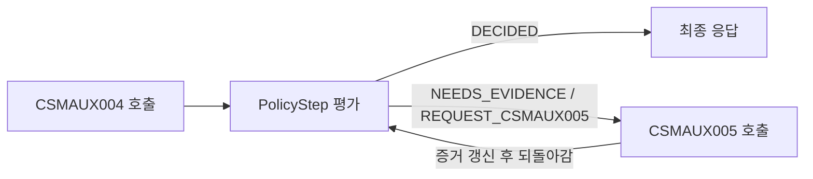
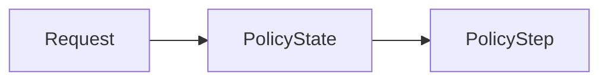
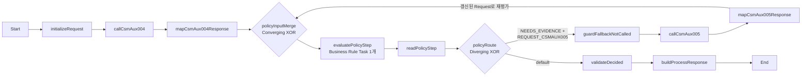

# Case 04 - CSMAUX004/005 순차 대체 권한

> **목표**
>
> BPMN이 CSMAUX004를 반드시 먼저 호출하고, DMN의 `PolicyState`가 현재 증거
> 조합을 업무 상태로 분류한 뒤 `PolicyStep`이 다음 행동을 반환한다.
> `REQUEST_CSMAUX005`인 경우에만 BPMN이 CSMAUX005를 호출하고 같은 DMN을
> 재평가하여 최종 결정을 만든다.
>
> **완료 기준**
>
> - CSMAUX004가 `GRANTED` 또는 HTTP 200 body `ERROR`이면 CSMAUX005를 호출하지 않는다.
> - CSMAUX004가 `DENIED`일 때만 CSMAUX005를 정확히 한 번 호출한다.
> - Business Rule Task는 하나이며, 정상 경로는 1회, fallback 경로는 2회 평가한다.
> - HTTP 4xx/5xx, timeout 같은 기술 실패는 DMN의 `ERROR` 값으로 바꾸지 않는다.
> - SCESIM은 각 정책 상태를 검증하고, BPMN E2E는 Mock journal로 호출 순서와 미호출을 증명한다.

[공통 준비와 UI 절차로 돌아가기](README.md)

---

## 1. 고객 규칙과 구현 경계

고객 규칙은 다음과 같다.

```text
CSMAUX004 = GRANTED
OR
(CSMAUX004 = DENIED AND CSMAUX005 = GRANTED)
```

호출 순서까지 포함하면 다음과 같다.

1. CSMAUX004를 호출한다.
2. 004가 `GRANTED`이면 허용한다.
3. 004가 HTTP 200 body `ERROR`이면 업무 오류로 종료한다.
4. 004가 `DENIED`인 경우에만 CSMAUX005가 필요하다.
5. 005가 `GRANTED`이면 허용한다.
6. 005가 `DENIED`이면 거절한다.
7. 005가 HTTP 200 body `ERROR`이면 업무 오류로 종료한다.

DMN은 외부 API를 호출하지 않는다. 같은 입력에 같은 `PolicyStep`을 반환하는
순수한 정책 함수이고, BPMN이 호출, 순서, 기술 오류와 process 상태를 담당한다.



그림의 `PolicyStep 평가`는 같은 DMN을 가리키는 Task 두 개가 아니라
**BPMN Business Rule Task 하나**다. 005 결과를 `Request`에 반영한 뒤 명시적인
Sequence Flow loop로 그 Task에 다시 진입한다. 따라서 BPMN에서도 “새 증거가
생기면 같은 정책을 다시 평가한다”는 의도가 그대로 보인다.

### 1.1 `NEEDS_EVIDENCE`와 `DECIDED`

`PolicyStep.decisionState`는 두 값만 사용한다.

| decisionState | 의미 | BPMN 동작 |
|---|---|---|
| `NEEDS_EVIDENCE` | 아직 필요한 외부 증거가 남아 있음 | `nextAction`에 해당하는 API 호출 |
| `DECIDED` | 허용·거절·오류·입력 모순 중 하나로 최종화됨 | 외부 권한 호출을 더 하지 않고 응답 생성 |

`NEEDS_EVIDENCE`는 public process 결과가 아니다. BPMN 안에서만 사용하는 중간
정책 상태다. 정상적인 process 응답은 항상 `DECIDED`다.

### 1.2 업무 `ERROR`와 기술 실패

| 상황 | 예 | 처리 위치 | DMN 실행 |
|---|---|---|---:|
| 정상 업무 결과 | HTTP 200 + `GRANTED`/`DENIED` | 응답 정규화 후 DMN | 예 |
| provider 업무 오류 | HTTP 200 + body `ERROR` | 응답 정규화 후 DMN | 예 |
| HTTP 기술 오류 | HTTP 4xx/5xx | BPMN Error Boundary | 아니오 |
| 전송 기술 오류 | timeout, 연결 실패 | BPMN 오류 경로/운영 정책 | 아니오 |
| 계약 오류 | JSON 누락, 알 수 없는 enum | 응답 mapping에서 fail fast | 아니오 |

HTTP 500을 `"ERROR"`라는 문자열로 바꾸면 업무 오류와 장애가 섞인다. retry와
감사 의미가 달라지므로 두 경로를 끝까지 분리한다.

### 1.3 고객에게 보여 줄 설계 메시지

시연에서는 다음 세 문장으로 설명한다.

1. **DMN의 `PolicyState` 표가 현재 증거 조합을 이름 있는 상태로 분류한다.**
2. **`PolicyStep` 표가 그 상태를 `다음 API 요청` 또는 `최종 결정`으로 변환한다.**
3. **BPMN은 `nextAction`만 실행하고 호출 journal로 005의 조건부 호출을 증명한다.**

004 결과에 따라 005 호출 필요 여부가 달라지므로 이 사례는 같은 정책 모델을
재평가할 가치가 있다. 다만 BPMN Gateway가 `004 = DENIED`를 다시 코딩하지 않고
DMN의 `REQUEST_CSMAUX005`를 따른다는 점이 핵심이다. 정책 조건은 DMN에 한 번만
존재하고 Process는 실행에만 집중한다.

---

## 2. 만들 자산

| 항목 | 값 |
|---|---|
| DMN | `src/main/resources/dmn/Case04FallbackAuthority.dmn` |
| Model Name | `Case04FallbackAuthority` |
| Namespace | `https://example.com/bamoe/poc/case04/v2` |
| Input Data | `Request` |
| 분류 Decision | `PolicyState` |
| 공개 Decision | `PolicyStep` |
| Decision Service facade | `Case04PolicyFacade` |
| SCESIM | `src/test/resources/scesim/Case04FallbackAuthorityTest.scesim` |
| BPMN | `src/main/resources/bpmn/Case04FallbackProcess.bpmn` |
| Process ID | `Case04FallbackProcess` |
| Mock | `mock-server/case04_mock_server.py` |
| Mock port | `8094` |

이 가이드에서는 Business Rule Task `evaluatePolicyStep`을 하나만 만든다.
일반 경로에서는 한 번, 005가 필요한 경로에서는 같은 Task에 다시 진입하여 최대
두 번 평가한다. Task의 `Request` 입력과 `PolicyStep` 출력 mapping도 한 번만
관리한다. `PolicyState`는 표 형태로 현재 증거 조합을 분류하는 캡슐화 Decision이다.

---

## 3. UI로 `PolicyState`와 `PolicyStep` DMN 만들기

### 3.1 파일과 Model 설정

1. Explorer에서 `src/main/resources` 아래에 `dmn` folder를 만든다.
2. `Case04FallbackAuthority.dmn` 파일을 만든다.
3. 파일을 BAMOE DMN Editor로 연다.
4. 빈 canvas를 선택하고 Model 설정을 다음과 같이 입력한다.

| UI 항목 | 값 |
|---|---|
| Name | `Case04FallbackAuthority` |
| Namespace | `https://example.com/bamoe/poc/case04/v2` |

### 3.2 Data Types

`Data Types` panel에서 다음 타입을 만든다. 허용값은 `Constraints`에 FEEL list로
입력한다.

`AuthResult`

```feel
"GRANTED", "DENIED", "ERROR"
```

이 enum은 provider의 HTTP 200 업무 결과만 표현한다. null과 enum 밖 응답은
`PolicyState`의 업무 행으로 만들지 않고 BPMN REST mapping에서 기술 계약 오류로
차단한다. DMN facade를 직접 호출할 때도 enum 밖 값은 구조화된 `PolicyStep`보다
입력 type/evaluation 오류가 먼저 날 수 있다.

`CallState`

```feel
"NOT_REQUESTED", "COMPLETED"
```

`PolicyDecisionState`

```feel
"NEEDS_EVIDENCE", "DECIDED"
```

`DecisionStatus`

```feel
"ALLOW", "DENY", "SYSTEM_ERROR", "INVALID_INPUT"
```

`NextAction`

```feel
"REQUEST_CSMAUX005", "CONTINUE", "STOP", "RETURN_ERROR", "FIX_PROCESS_STATE"
```

`Case04PolicyState`

```feel
"FALLBACK_RESULT_WITHOUT_CALL",
"FALLBACK_RESULT_MISSING",
"UNEXPECTED_FALLBACK_CALL",
"PRIMARY_GRANTED",
"PRIMARY_ERROR",
"FALLBACK_REQUIRED",
"FALLBACK_GRANTED",
"FALLBACK_DENIED",
"FALLBACK_ERROR"
```

`tCase04Request`는 Structure로 만들고 다음 field를 추가한다.

| Field | Type |
|---|---|
| `csmAux004Result` | `AuthResult` |
| `csmAux005State` | `CallState` |
| `csmAux005Result` | `AuthResult` |

`csmAux005Result`는 005를 호출하기 전에는 `null`이다. `null`만으로 호출 상태를
추측하지 않도록 `csmAux005State`를 별도로 둔다.

`tCase04PolicyStep`도 Structure로 만든다.

| Field | Type |
|---|---|
| `decisionState` | `PolicyDecisionState` |
| `status` | `DecisionStatus` |
| `nextAction` | `NextAction` |
| `reasonCode` | `string` |
| `reasonMessage` | `string` |

### 3.3 DRD

canvas에 다음 node를 둔다.

| 종류 | 이름 | Type |
|---|---|---|
| Input Data | `Request` | `tCase04Request` |
| Decision | `PolicyState` | `Case04PolicyState` |
| Decision | `PolicyStep` | `tCase04PolicyStep` |

Information Requirement는 다음 두 개를 정확히 연결한다.

1. `Request → PolicyState`
2. `PolicyState → PolicyStep`



긴 `if/else` boolean 검증식은 만들지 않는다. `PolicyState` 표가 가능한 상태와
불가능한 상태를 이름으로 분류하고, `PolicyStep` 표가 그 상태를 BPMN이 이해할 수
있는 `decisionState`, `status`, `nextAction` 계약으로 변환한다.

### 3.4 `PolicyState` Decision Table

`PolicyState`를 열어 다음처럼 설정한다.

| 설정 | 값 |
|---|---|
| Expression type | `Decision Table` |
| Decision Output data type | `Case04PolicyState` |
| Hit Policy | `First (F)` |

Input column:

| Input Expression | Type |
|---|---|
| `Request.csmAux004Result` | `AuthResult` |
| `Request.csmAux005State` | `CallState` |
| `Request.csmAux005Result` | `AuthResult` |

Output column의 이름은 `PolicyState`로 만들고, **output column 자체의 Data
Type도 `Case04PolicyState`로 지정**한다.

Decision node의 **Decision Output data type**도 위 표대로
`Case04PolicyState`를 유지한다. 현재 실습에서 검증한 BAMOE
`9.5.0-ibm-0005` 저장 형식과 일치시키기 위해 두 위치의 type을 모두 유지한다.

규칙은 위에서 아래 순서대로 입력한다.

| # | 004 result | 005 state | 005 result | PolicyState |
|---:|---|---|---|---|
| 1 | `-` | `"NOT_REQUESTED"` | `not(null)` | `"FALLBACK_RESULT_WITHOUT_CALL"` |
| 2 | `-` | `"COMPLETED"` | `null` | `"FALLBACK_RESULT_MISSING"` |
| 3 | `"GRANTED", "ERROR"` | `"COMPLETED"` | `-` | `"UNEXPECTED_FALLBACK_CALL"` |
| 4 | `"GRANTED"` | `"NOT_REQUESTED"` | `null` | `"PRIMARY_GRANTED"` |
| 5 | `"ERROR"` | `"NOT_REQUESTED"` | `null` | `"PRIMARY_ERROR"` |
| 6 | `"DENIED"` | `"NOT_REQUESTED"` | `null` | `"FALLBACK_REQUIRED"` |
| 7 | `"DENIED"` | `"COMPLETED"` | `"GRANTED"` | `"FALLBACK_GRANTED"` |
| 8 | `"DENIED"` | `"COMPLETED"` | `"DENIED"` | `"FALLBACK_DENIED"` |
| 9 | `"DENIED"` | `"COMPLETED"` | `"ERROR"` | `"FALLBACK_ERROR"` |

1~3행은 BPMN 조립 오류를 잡는 방어 규칙이고 4~9행은 정상 실행 경로다.
세 입력의 허용 범위 안에서는 이 9개 행이 모든 조합을 다룬다. `First`이므로
이 순서를 바꾸지 않는다. 응답 null이나 허용되지 않은 enum은 이 표에 넣지 않고
BPMN 응답 mapping에서 기술 계약 오류로 차단한다.

### 3.5 `PolicyStep` Decision Table

`PolicyStep`을 열어 다음처럼 설정한다.

| 설정 | 값 |
|---|---|
| Expression type | `Decision Table` |
| Decision Output data type | `tCase04PolicyStep` |
| Hit Policy | `Unique (U)` |

Input column:

| Input Expression | Type |
|---|---|
| `PolicyState` | `Case04PolicyState` |

Output columns:

| Output Name | Type |
|---|---|
| `decisionState` | `PolicyDecisionState` |
| `status` | `DecisionStatus` |
| `nextAction` | `NextAction` |
| `reasonCode` | `string` |
| `reasonMessage` | `string` |

모든 문구를 다음 표와 정확히 입력한다. `NEEDS_EVIDENCE` 행만 `status`가 null이다.

| # | PolicyState | decisionState | status | nextAction | reasonCode | reasonMessage |
|---:|---|---|---|---|---|---|
| 1 | `"FALLBACK_RESULT_WITHOUT_CALL"` | `"DECIDED"` | `"INVALID_INPUT"` | `"FIX_PROCESS_STATE"` | `"FALLBACK_RESULT_WITHOUT_CALL"` | `"호출되지 않은 CSMAUX005의 결과가 존재합니다."` |
| 2 | `"FALLBACK_RESULT_MISSING"` | `"DECIDED"` | `"INVALID_INPUT"` | `"FIX_PROCESS_STATE"` | `"FALLBACK_RESULT_MISSING"` | `"완료된 CSMAUX005 호출의 결과가 없습니다."` |
| 3 | `"UNEXPECTED_FALLBACK_CALL"` | `"DECIDED"` | `"INVALID_INPUT"` | `"FIX_PROCESS_STATE"` | `"UNEXPECTED_FALLBACK_CALL"` | `"CSMAUX004 결과상 불필요한 CSMAUX005 호출이 수행되었습니다."` |
| 4 | `"PRIMARY_GRANTED"` | `"DECIDED"` | `"ALLOW"` | `"CONTINUE"` | `"PRIMARY_AUTH_GRANTED"` | `"CSMAUX004 권한이 승인되었습니다."` |
| 5 | `"PRIMARY_ERROR"` | `"DECIDED"` | `"SYSTEM_ERROR"` | `"RETURN_ERROR"` | `"CSMAUX004_BODY_ERROR"` | `"CSMAUX004가 업무 오류를 반환했습니다."` |
| 6 | `"FALLBACK_REQUIRED"` | `"NEEDS_EVIDENCE"` | `null` | `"REQUEST_CSMAUX005"` | `"FALLBACK_AUTH_REQUIRED"` | `"CSMAUX004 권한이 거절되어 CSMAUX005 확인이 필요합니다."` |
| 7 | `"FALLBACK_GRANTED"` | `"DECIDED"` | `"ALLOW"` | `"CONTINUE"` | `"FALLBACK_AUTH_GRANTED"` | `"CSMAUX005 대체 권한이 승인되었습니다."` |
| 8 | `"FALLBACK_DENIED"` | `"DECIDED"` | `"DENY"` | `"STOP"` | `"ALL_AUTH_DENIED"` | `"CSMAUX004와 CSMAUX005 권한이 모두 거절되었습니다."` |
| 9 | `"FALLBACK_ERROR"` | `"DECIDED"` | `"SYSTEM_ERROR"` | `"RETURN_ERROR"` | `"CSMAUX005_BODY_ERROR"` | `"CSMAUX005가 업무 오류를 반환했습니다."` |

저장한 뒤 Editor의 `Analysis`에서 overlap을 확인한다. `First`를 사용하므로
`PolicyState`의 방어 규칙이 정상 규칙보다 위에 있어야 한다. primary 004의 null과
enum 밖 값은 DMN 업무 입력 범위가 아니라 BPMN mapping이 차단하는 기술 계약
오류이므로 그 범위의 gap은 의도된 것이다. 정상화된 입력 범위에서는 정확히 한
상태로 분류되고, `PolicyStep`은 각 상태당 정확히 한 행만 매칭되어야 한다.

### 3.6 하나의 Decision Service facade

DMN canvas에서 Decision Service를 하나 추가한다.

| 항목 | 값 |
|---|---|
| Name | `Case04PolicyFacade` |
| Output Decisions | `PolicyStep` |
| Encapsulated Decisions | `PolicyState` |
| Input | `Request`가 자동 노출되는지 확인 |

`PolicyState`는 규칙 검토와 SCESIM에는 보이지만 facade 응답에는 노출하지 않는다.
외부 소비자는 최종 실행 계약인 `PolicyStep`만 받는다. routing/final stage별
Decision Service는 만들지 않는다.

Decision Service 자체에는 별도 output type을 강제로 지정하지 않는다. 유일한
Output Decision인 `PolicyStep`의 `tCase04PolicyStep`에서 응답 type이 파생된다.

---

## 4. SCESIM으로 상태 전이 검증

### 4.1 파일 만들기

1. `src/test/resources/scesim` folder를 만든다.
2. `Case04FallbackAuthorityTest.scesim`을 만든다.
3. text editor로 열리면 tab 우클릭 → `Reopen Editor With...` →
   `(classic)`이 붙지 않은 **BAMOE Test Scenario Editor**를 선택한다.
4. initial dialog에서 `DMN`을 선택한다.
5. DMN file은 `Case04FallbackAuthority.dmn`을 선택한다.
6. `DMN model`과 Namespace가 3.1의 값인지 확인한다.

Settings에서 다음을 다시 확인한다.

| 항목 | 값 |
|---|---|
| Type | `DMN` |
| DMN file | `Case04FallbackAuthority.dmn` |
| DMN namespace | `https://example.com/bamoe/poc/case04/v2` |
| DMN name | `Case04FallbackAuthority` |

저장하고 닫았다가 다시 열어 설정이 유지되는지 확인한다.

### 4.2 GIVEN과 EXPECT

GIVEN:

- `Request.csmAux004Result`
- `Request.csmAux005State`
- `Request.csmAux005Result`

EXPECT:

- `PolicyState.value`
- `PolicyStep.decisionState`
- `PolicyStep.status`
- `PolicyStep.nextAction`
- `PolicyStep.reasonCode`
- `PolicyStep.reasonMessage`

문자열 cell은 `"DENIED"`처럼 큰따옴표를 포함한 FEEL literal로 입력한다.
GIVEN과 EXPECT에서 null은 `null`로 입력한다. `? = null`도 동작하지만 이
가이드는 `null`로 통일한다. 빈 EXPECT cell은 검증 생략이다.

### 4.3 필수 scenario

SCESIM에는 문자열을 `"GRANTED"`처럼 큰따옴표까지 포함해 입력한다. 아래 표에서는
읽기 쉽게 따옴표를 생략했다.

| ID | 004 | 005 state | 005 result | PolicyState | decisionState | status | nextAction | reasonCode |
|---|---|---|---|---|---|---|---|---|
| C04-S01 | GRANTED | NOT_REQUESTED | `null` | PRIMARY_GRANTED | DECIDED | ALLOW | CONTINUE | PRIMARY_AUTH_GRANTED |
| C04-S02 | ERROR | NOT_REQUESTED | `null` | PRIMARY_ERROR | DECIDED | SYSTEM_ERROR | RETURN_ERROR | CSMAUX004_BODY_ERROR |
| C04-S03 | DENIED | NOT_REQUESTED | `null` | FALLBACK_REQUIRED | NEEDS_EVIDENCE | `null` | REQUEST_CSMAUX005 | FALLBACK_AUTH_REQUIRED |
| C04-S04 | DENIED | COMPLETED | GRANTED | FALLBACK_GRANTED | DECIDED | ALLOW | CONTINUE | FALLBACK_AUTH_GRANTED |
| C04-S05 | DENIED | COMPLETED | DENIED | FALLBACK_DENIED | DECIDED | DENY | STOP | ALL_AUTH_DENIED |
| C04-S06 | DENIED | COMPLETED | ERROR | FALLBACK_ERROR | DECIDED | SYSTEM_ERROR | RETURN_ERROR | CSMAUX005_BODY_ERROR |
| C04-S07 | GRANTED | COMPLETED | GRANTED | UNEXPECTED_FALLBACK_CALL | DECIDED | INVALID_INPUT | FIX_PROCESS_STATE | UNEXPECTED_FALLBACK_CALL |
| C04-S08 | DENIED | NOT_REQUESTED | GRANTED | FALLBACK_RESULT_WITHOUT_CALL | DECIDED | INVALID_INPUT | FIX_PROCESS_STATE | FALLBACK_RESULT_WITHOUT_CALL |
| C04-S09 | DENIED | COMPLETED | `null` | FALLBACK_RESULT_MISSING | DECIDED | INVALID_INPUT | FIX_PROCESS_STATE | FALLBACK_RESULT_MISSING |

`PolicyStep.reasonMessage` EXPECT:

| ID | reasonMessage |
|---|---|
| C04-S01 | `"CSMAUX004 권한이 승인되었습니다."` |
| C04-S02 | `"CSMAUX004가 업무 오류를 반환했습니다."` |
| C04-S03 | `"CSMAUX004 권한이 거절되어 CSMAUX005 확인이 필요합니다."` |
| C04-S04 | `"CSMAUX005 대체 권한이 승인되었습니다."` |
| C04-S05 | `"CSMAUX004와 CSMAUX005 권한이 모두 거절되었습니다."` |
| C04-S06 | `"CSMAUX005가 업무 오류를 반환했습니다."` |
| C04-S07 | `"CSMAUX004 결과상 불필요한 CSMAUX005 호출이 수행되었습니다."` |
| C04-S08 | `"호출되지 않은 CSMAUX005의 결과가 존재합니다."` |
| C04-S09 | `"완료된 CSMAUX005 호출의 결과가 없습니다."` |

이 표는 참고용 목록이 아니라 `PolicyStep.reasonMessage`의 필수 EXPECT 값이다.
아홉 행 모두 큰따옴표까지 포함해 입력하며 빈 cell로 두지 않는다. 빈 EXPECT
cell은 null 검증이 아니라 assertion 생략이다.

S03은 첫 평가, S04~S06은 같은 Request가 005 결과로 갱신된 뒤 두 번째 평가다.
SCESIM은 HTTP 호출 순서를 검증하지 않으므로 E2E journal을 생략할 수 없다.

### 4.4 실행

project root에서 전체 모델 생성까지 포함하여 실행한다.

```bash
cd "/Users/jihunkeom/Desktop/projects/2026/SKT/skt_bamoe_party/prelim/test"

READY=true
for file in \
  src/main/resources/dmn/Case04FallbackAuthority.dmn \
  src/test/resources/scesim/Case04FallbackAuthorityTest.scesim \
  src/test/java/testscenario/TestScenarioJunitActivatorTest.java
do
  if test -s "$file"; then
    echo "[OK] $file"
  else
    echo "[MISSING/EMPTY] $file"
    READY=false
  fi
done

if ! rg -q '@TestScenarioActivator' \
  src/test/java/testscenario/TestScenarioJunitActivatorTest.java 2>/dev/null
then
  echo "[INVALID] @TestScenarioActivator가 없습니다."
  READY=false
fi

if test "$READY" = true; then
  mvn -s config/settings-bamoe-container.xml clean verify
else
  echo "STOP: 자산을 UI에서 저장한 뒤 다시 실행하세요."
fi
```

SCESIM scenario가 test로 발견되지 않으면 공통
`TestScenarioJunitActivatorTest`와 SCESIM dependency를
[Case 00 §8.5](case-00-environment-setup.md#85-병합-결과-확인) 기준으로 확인한다.
activator를 case마다 중복 생성하지 않는다.

---

## 5. 호출 journal이 있는 Mock API

### 5.1 시나리오

| `mockScenario` | 004 | 005 | 기대 journal |
|---|---|---|---|
| `PRIMARY_GRANTED` | body `GRANTED` | 호출 금지 | `["CSMAUX004"]` |
| `PRIMARY_BODY_ERROR` | body `ERROR` | 호출 금지 | `["CSMAUX004"]` |
| `FALLBACK_GRANTED` | body `DENIED` | body `GRANTED` | `["CSMAUX004","CSMAUX005"]` |
| `FALLBACK_DENIED` | body `DENIED` | body `DENIED` | `["CSMAUX004","CSMAUX005"]` |
| `FALLBACK_BODY_ERROR` | body `DENIED` | body `ERROR` | `["CSMAUX004","CSMAUX005"]` |
| `PRIMARY_HTTP_500` | HTTP 500 | 호출 금지 | `["CSMAUX004"]` |
| `FALLBACK_HTTP_500` | body `DENIED` | HTTP 500 | `["CSMAUX004","CSMAUX005"]` |

### 5.2 UI로 Mock 파일 만들기

Explorer에서 `mock-server/case04_mock_server.py`를 만들고 다음 내용을 저장한다.

```python
#!/usr/bin/env python3
import json
from http.server import BaseHTTPRequestHandler, ThreadingHTTPServer
from urllib.parse import unquote, urlparse


SCENARIOS = {
    "PRIMARY_GRANTED": ("GRANTED", None),
    "PRIMARY_BODY_ERROR": ("ERROR", None),
    "FALLBACK_GRANTED": ("DENIED", "GRANTED"),
    "FALLBACK_DENIED": ("DENIED", "DENIED"),
    "FALLBACK_BODY_ERROR": ("DENIED", "ERROR"),
    "PRIMARY_HTTP_500": ("HTTP_500", None),
    "FALLBACK_HTTP_500": ("DENIED", "HTTP_500"),
}
PATHS = {
    "/mock/auth/csmaux004": ("CSMAUX004", 0),
    "/mock/auth/csmaux005": ("CSMAUX005", 1),
}
CALLS = {}


class Handler(BaseHTTPRequestHandler):
    def send_json(self, status, payload):
        body = json.dumps(payload, ensure_ascii=False).encode("utf-8")
        self.send_response(status)
        self.send_header("Content-Type", "application/json; charset=utf-8")
        self.send_header("Content-Length", str(len(body)))
        self.end_headers()
        self.wfile.write(body)

    def read_json(self):
        length = int(self.headers.get("Content-Length", "0"))
        return json.loads(self.rfile.read(length).decode("utf-8"))

    def do_GET(self):
        path = urlparse(self.path).path
        if path == "/health":
            self.send_json(200, {"status": "UP"})
            return
        prefix = "/mock/auth/calls/"
        if path.startswith(prefix):
            request_id = unquote(path[len(prefix):])
            self.send_json(
                200,
                {"requestId": request_id, "calls": CALLS.get(request_id, [])},
            )
            return
        self.send_json(404, {"error": "NOT_FOUND", "path": path})

    def do_DELETE(self):
        path = urlparse(self.path).path
        prefix = "/mock/auth/calls/"
        if path.startswith(prefix):
            request_id = unquote(path[len(prefix):])
            CALLS.pop(request_id, None)
            self.send_json(200, {"requestId": request_id, "calls": []})
            return
        self.send_json(404, {"error": "NOT_FOUND", "path": path})

    def do_POST(self):
        path = urlparse(self.path).path
        target = PATHS.get(path)
        if target is None:
            self.send_json(404, {"error": "NOT_FOUND", "path": path})
            return
        try:
            request = self.read_json()
        except (ValueError, UnicodeDecodeError):
            self.send_json(400, {"error": "INVALID_JSON"})
            return

        request_id = request.get("requestId")
        scenario = request.get("mockScenario", "PRIMARY_GRANTED")
        if not request_id or scenario not in SCENARIOS:
            self.send_json(400, {"error": "INVALID_REQUEST"})
            return

        authority, index = target
        CALLS.setdefault(request_id, []).append(authority)
        result = SCENARIOS[scenario][index]

        if result is None:
            self.send_json(
                409,
                {"error": "UNEXPECTED_FALLBACK_CALL", "authority": authority},
            )
            return
        if result == "HTTP_500":
            self.send_json(
                500,
                {"error": "PROVIDER_UNAVAILABLE", "authority": authority},
            )
            return
        self.send_json(200, {"authority": authority, "result": result})

    def log_message(self, format_string, *args):
        print(
            "%s - %s"
            % (self.log_date_time_string(), format_string % args),
            flush=True,
        )


if __name__ == "__main__":
    server = ThreadingHTTPServer(("0.0.0.0", 8094), Handler)
    print(
        "Case04 auth mock listening on http://0.0.0.0:8094",
        flush=True,
    )
    try:
        server.serve_forever()
    except KeyboardInterrupt:
        pass
    finally:
        server.server_close()
```

### 5.3 실행과 smoke test

Terminal A:

```bash
cd "/Users/jihunkeom/Desktop/projects/2026/SKT/skt_bamoe_party/prelim/test"
python3 -m py_compile mock-server/case04_mock_server.py
python3 mock-server/case04_mock_server.py
```

Terminal B:

```bash
curl --fail-with-body -sS 'http://127.0.0.1:8094/health' | jq
```

---

## 6. UI로 BPMN 만들기

### 6.1 Process Properties

1. `src/main/resources/bpmn/Case04FallbackProcess.bpmn`을 만든다.
2. BAMOE BPMN Editor로 연다.
3. 빈 canvas를 선택하고 다음 값을 지정한다.

| Property | 값 |
|---|---|
| Name | `Case04 Fallback Process` |
| ID | `Case04FallbackProcess` |
| Package | `org.acme.case04` |
| Process Type | `Public` |
| Executable | `true` |
| Target Namespace | `https://example.com/bamoe/poc/case04/process/v2` |

### 6.2 Process Variables와 Tags

Process Properties → `Process Variables`에서 다음 변수를 만든다. Tags는 아래
문자열을 그대로 입력한다.

| Name | Data Type | Tags | 의미 |
|---|---|---|---|
| `requestId` | `String` | `input,required,readonly` | 추적·journal key |
| `customerId` | `String` | `input,required,readonly` | Mock/권한 요청의 필수 업무 대상 |
| `mockScenario` | `String` | `input` | PoC fixture 선택; process가 기본값을 채움 |
| `authRequest` | `java.util.Map` | `internal` | REST body alias |
| `csmAux004Response` | `java.util.Map` | `internal` | 004 raw response |
| `csmAux005Response` | `java.util.Map` | `internal` | 005 raw response |
| `csmAux004Result` | `String` | `internal` | 정규화 결과 |
| `csmAux005State` | `String` | `internal` | `NOT_REQUESTED`/`COMPLETED` |
| `csmAux005Result` | `String` | `internal` | 정규화 결과 또는 null |
| `decisionRequest` | `java.util.Map` | `internal` | DMN Request |
| `policyStep` | `java.util.Map` | `internal` | 현재 DMN 출력 |
| `decisionState` | `String` | `internal` | `NEEDS_EVIDENCE`/`DECIDED` gateway 값 |
| `decisionStatus` | `String` | `internal` | 최종 정책 status |
| `nextAction` | `String` | `internal` | semantic action |
| `reasonCode` | `String` | `internal` | 정책 사유 |
| `reasonMessage` | `String` | `internal` | 정책 설명 |
| `policyEvaluationCount` | `Integer` | `internal` | DMN 재평가 횟수와 loop 상한 |
| `failureOperation` | `String` | `internal` | 기술 실패 지점 |
| `processResponse` | `java.util.Map` | `output` | caller에게 반환할 유일한 업무 응답 |

Tags 의미:

| Tags | REST 계약 |
|---|---|
| `input,required,readonly` | 시작 요청에 노출되는 필수 원본이며 process 중 덮어쓰지 않음 |
| `input,readonly` | 시작 요청에 노출되는 선택 원본이며 process 중 덮어쓰지 않음 |
| `input` | 시작 요청에 노출되고 process가 기본값을 채울 수 있음 |
| `internal` | 시작 요청과 최종 응답에서 숨김 |
| `output` | 시작 요청으로 받지 않고 완료 응답에만 노출 |

Tags를 생략하면 내부 변수가 input/output 양쪽에 노출될 수 있다. 권한 결과와
`policyStep`은 caller가 주입할 수 없도록 반드시 `internal`로 지정한다.
`required`는 이 Process의 무조건 필수 식별자인 `requestId`, `customerId`에만
둔다. 여러 업무 field의 조합·조건부 필수 여부는 초기 validation에서 검사하여
generated schema에 `required`를 남발하지 않는다.

### 6.3 Node 배치

다음 순서로 배치한다.

1. Start Event
2. Script Task `initializeRequest`
3. Rest Service Task `callCsmAux004`
4. Script Task `mapCsmAux004Response`
5. Exclusive Gateway `policyInputMerge` — **Converging**
6. Business Rule Task `evaluatePolicyStep`
7. Script Task `readPolicyStep`
8. Exclusive Gateway `policyRoute` — **Diverging**
9. `REQUEST_CSMAUX005` branch: Script Task `guardFallbackNotCalled`
10. Rest Service Task `callCsmAux005`
11. Script Task `mapCsmAux005Response`
12. `mapCsmAux005Response → policyInputMerge` loop
13. `policyRoute`의 default branch: Script Task `validateDecided`
14. Script Task `buildProcessResponse`
15. End Event



일반 Task를 놓은 뒤 node의 variant menu에서 `Script`, `Rest Service`,
`Business Rule`을 정확히 선택한다.

`policyInputMerge`와 `policyRoute`는 모양이 같은 Exclusive Gateway지만 역할이
다르다.

| Gateway | Direction | Incoming | Outgoing | 역할 |
|---|---|---:|---:|---|
| `policyInputMerge` | `Converging` | 2 | 1 | 004 직후 경로와 005 갱신 후 loop를 한 줄로 합침 |
| `policyRoute` | `Diverging` | 1 | 2 | DMN의 다음 행동에 따라 005 호출 또는 종료 선택 |

`mapCsmAux004Response`와 `mapCsmAux005Response`를 Business Rule Task에 직접 두
개의 incoming flow로 연결하지 않는다. 이 runtime의 Rule Task는 기본 설정에서
incoming connection 하나를 전제로 하므로 두 경로를 `policyInputMerge`에서 먼저
합친다. 여기에는 Parallel Gateway를 쓰면 안 된다. 첫 평가에는 005 쪽 token이
없어서 두 입력을 기다리며 멈출 수 있다.

Business Rule Task의 `Standard Loop Characteristics`도 켜지 않는다. 이번 loop는
DMN 실행 사이에 REST 호출과 `decisionRequest` 갱신이 있어야 하므로
`mapCsmAux005Response → policyInputMerge`의 명시적인 Sequence Flow로 표현한다.

기존 가이드를 따라 일부 노드를 이미 만들었다면 다음처럼 전환한다.

| 기존 노드 | 처리 |
|---|---|
| `evaluatePolicyStepAfter004` | 유지하고 `evaluatePolicyStep`으로 이름 변경 |
| `readPolicyStepAfter004` | 유지하고 `readPolicyStep`으로 이름 변경 |
| `policyRouteAfter004` | 유지하고 `policyRoute`로 이름 변경 |
| `validateDecidedAfter004` | 유지하고 `validateDecided`로 이름 변경 |
| `evaluatePolicyStepAfter005` | 삭제 |
| `readPolicyStepAfter005` | 삭제 |
| `finalMerge` | 삭제 |

`evaluatePolicyStep` 앞에는 `policyInputMerge`를 새로 삽입하고
`mapCsmAux005Response`도 이 Gateway로 되돌린다. 기존 005 쪽 Business Rule Task의
Data Mapping을 첫 Task로 옮길 필요는 없다. 첫 Task의 mapping 하나만 올바르면 된다.

### 6.4 `initializeRequest`

Script Language는 `Java`다.

```java
String incomingRequestId =
    (String) kcontext.getVariable("requestId");
String incomingCustomerId =
    (String) kcontext.getVariable("customerId");
String scenario = (String) kcontext.getVariable("mockScenario");

if (incomingRequestId == null || incomingRequestId.isBlank()
        || incomingCustomerId == null
        || incomingCustomerId.isBlank()) {
    throw new IllegalArgumentException(
        "requestId and customerId are required");
}
if (scenario == null || scenario.isBlank()) {
    scenario = "PRIMARY_GRANTED";
    kcontext.setVariable("mockScenario", scenario);
}

java.util.Map authPayload = new java.util.LinkedHashMap();
authPayload.put("requestId", incomingRequestId);
authPayload.put("customerId", incomingCustomerId);
authPayload.put("mockScenario", scenario);

java.util.Map initialDecisionRequest =
    new java.util.LinkedHashMap();
initialDecisionRequest.put("csmAux004Result", null);
initialDecisionRequest.put("csmAux005State", "NOT_REQUESTED");
initialDecisionRequest.put("csmAux005Result", null);

kcontext.setVariable("authRequest", authPayload);
kcontext.setVariable("decisionRequest", initialDecisionRequest);
kcontext.setVariable("csmAux004Result", null);
kcontext.setVariable("csmAux005State", "NOT_REQUESTED");
kcontext.setVariable("csmAux005Result", null);
kcontext.setVariable("policyStep", null);
kcontext.setVariable("decisionState", null);
kcontext.setVariable("decisionStatus", null);
kcontext.setVariable("nextAction", null);
kcontext.setVariable("reasonCode", null);
kcontext.setVariable("reasonMessage", null);
kcontext.setVariable("policyEvaluationCount", 0);
kcontext.setVariable("processResponse", null);
```

Kogito codegen은 Process Variable을 Script Task의 Java 변수로 먼저 바인딩한다.
따라서 `requestId`, `customerId`, `authRequest`, `decisionRequest`와 같은 이름을
Java 지역변수로 다시 선언하면 compile 단계에서 `variable ... is already defined`
오류가 난다. 위 코드처럼 지역변수에 다른 이름을 쓰되,
`kcontext.getVariable("requestId")` 같은 문자열은 실제 Process Variable
이름이므로 변경하지 않는다.

### 6.5 Rest Service Task의 body mapping

`callCsmAux004`:

| UI field | 값 |
|---|---|
| Method | `POST` |
| URL | `http://customer-rule-mock:8094/mock/auth/csmaux004` |
| Request Timeout | `2000` |
| Access Token Acquisition Strategy | `none` |
| Header | `Accept = application/json` |

REST body에는 서로 다른 두 UI 설정이 필요하다.

> `Var`는 Data Type이 아니다. `Data Type`에는 `java.util.Map`을 선택하고,
> Source/Target 영역의 왼쪽 방식 선택기에서 `Var`를 고른 뒤 오른쪽 변수 목록에서
> Process Variable을 선택한다.

| UI 위치 | 이름 | Data Type | Source/Target 방식 | 선택할 변수 또는 값 |
|---|---|---|---|---|
| `Data Mapping` → Inputs | `authRequest` | `java.util.Map` | Source 종류 `Var` | Process Variable `authRequest` |
| REST Task 전용 Properties | `Content Data` | 직접 지정하지 않음 | expression | ` #{authRequest}` |
| `Data Mapping` → Outputs | `Result` | `java.util.Map` | Target 종류 `Var` | Process Variable `csmAux004Response` |

설정 순서:

1. `Data Mapping` → `Add Input data mapping`을 누른다.
2. 일반 alias 이름은 `authRequest`, Data Type은 `java.util.Map`으로 지정한다.
3. 같은 행의 Source 종류에서 `Var`를 선택하고, 옆 변수 목록에서
   `authRequest`를 선택한다.
4. Output `Result`의 Data Type은 `java.util.Map`, Target 종류는 `Var`,
   선택할 변수는 `csmAux004Response`로 설정하고 저장한다.
5. Task Properties로 돌아가 REST 전용 `Content Data` 입력 칸에서 Space 키를
   한 번 누른 뒤 `#{authRequest}`를 입력하고 다시 저장한다. 실제 값은
   ` #{authRequest}`다.

`ContentData`는 REST handler의 예약 내부 이름이다. 일반 Input Name에
`ContentData`를 직접 입력하거나 목록에서 선택하지 않는다. 마지막 `a`를 입력할 때
행이 사라지는 현상은 글자 수 제한이 아니라 editor가 예약 항목을 일반 mapping에서
숨기는 동작이다. 일반 alias와 별도의 `Content Data` 속성을 사용하면 된다.

`Headers`에는 `Accept = application/json` 한 행만 둔다. 이 Lab의 BAMOE
`9.5.0-ibm-0005` Spring codegen에서는 `Content-Type` 행이 내부
`HEADER_Content-Type`으로 생성되면서 하이픈 때문에 compile을 깨뜨릴 수 있다.
Map body는 REST handler의 JSON 전송 경로에서 wire Content-Type이 자동
설정된다. 정상 runtime 로그는 `ContentData={...}`다.

`callCsmAux005`도 동일하게 설정하되 다음만 바꾼다.

| UI 위치/field | 값 |
|---|---|
| URL | `http://customer-rule-mock:8094/mock/auth/csmaux005` |
| 일반 Input Name | `authRequest` |
| 일반 Input Data Type | `java.util.Map` |
| 일반 Input Source | 종류 `Var`, Process Variable `authRequest` |
| REST `Content Data` | ` #{authRequest}` |
| Output `Result` Data Type | `java.util.Map` |
| Output Target | 종류 `Var`, Process Variable `csmAux005Response` |

### 6.6 응답 정규화 Script

`mapCsmAux004Response`:

```java
java.util.Map response =
    (java.util.Map) kcontext.getVariable("csmAux004Response");
Object rawAuthority =
    response == null ? null : response.get("authority");
Object raw = response == null ? null : response.get("result");
String authority =
    rawAuthority == null ? null : rawAuthority.toString();
String value = raw == null ? null : raw.toString();
if (value == null
        || !"CSMAUX004".equals(authority)
        || !java.util.List.of(
            "GRANTED", "DENIED", "ERROR").contains(value)) {
    throw new IllegalStateException(
        "Invalid CSMAUX004 response: " + response);
}

java.util.Map request =
    (java.util.Map) kcontext.getVariable("decisionRequest");
request.put("csmAux004Result", value);
kcontext.setVariable("csmAux004Result", value);
kcontext.setVariable("decisionRequest", request);
```

`mapCsmAux005Response`:

```java
java.util.Map response =
    (java.util.Map) kcontext.getVariable("csmAux005Response");
Object rawAuthority =
    response == null ? null : response.get("authority");
Object raw = response == null ? null : response.get("result");
String authority =
    rawAuthority == null ? null : rawAuthority.toString();
String value = raw == null ? null : raw.toString();
if (value == null
        || !"CSMAUX005".equals(authority)
        || !java.util.List.of(
            "GRANTED", "DENIED", "ERROR").contains(value)) {
    throw new IllegalStateException(
        "Invalid CSMAUX005 response: " + response);
}

java.util.Map request =
    (java.util.Map) kcontext.getVariable("decisionRequest");
request.put("csmAux005State", "COMPLETED");
request.put("csmAux005Result", value);
kcontext.setVariable("csmAux005State", "COMPLETED");
kcontext.setVariable("csmAux005Result", value);
kcontext.setVariable("decisionRequest", request);
```

### 6.7 하나의 Business Rule Task

`policyInputMerge` 바로 뒤에 `evaluatePolicyStep`을 **한 개만** 만들고 다음처럼
설정한다.

1. Implementation을 `DMN`으로 선택한다.
2. `Autofill...`에서 `../dmn/Case04FallbackAuthority.dmn`을 고른다.
3. 다음 값을 대조한다.

| DMN field | 값 |
|---|---|
| Relative path | `../dmn/Case04FallbackAuthority.dmn` |
| Namespace | `https://example.com/bamoe/poc/case04/v2` |
| Model | `Case04FallbackAuthority` |

Data Mapping:

| 방향 | DMN Name | Process variable | Type |
|---|---|---|---|
| Input | `Request` | `decisionRequest` | `java.util.Map` |
| Output | `PolicyStep` | `policyStep` | `java.util.Map` |

Business Rule Task는 3.6의 component REST API를 선택 호출하지 않는다. 같은
application의 DMN Model을 embedded 평가한다. `PolicyState`가 먼저 계산되고
`PolicyStep`이 이를 최종 계약으로 변환되지만, Process에는 `PolicyStep`만 mapping한다.

첫 진입에서는 004 결과와 `NOT_REQUESTED` 상태가 든 `decisionRequest`를 평가한다.
004가 `DENIED`이면 정상적으로 `NEEDS_EVIDENCE`가 나온다. 005 호출 후에는
`mapCsmAux005Response`가 같은 Map을 `COMPLETED + 결과`로 갱신하고
`policyInputMerge`로 되돌아간다. 그러면 같은 Task가 현재 값을 다시 읽어 DMN을
새로 실행하고 기존 `policyStep`을 두 번째 결과로 덮어쓴다. 이전 평가 결과를
cache해서 재사용하는 구조가 아니다.

### 6.8 `PolicyStep` 읽기와 Gateway

`evaluatePolicyStep` 바로 뒤에 `readPolicyStep`을 하나 만들고 다음 Java Script를
입력한다. 이 Script는 결과 계약 검증과 함께 DMN 평가 횟수를 최대 2회로 제한한다.

```java
java.util.Map step =
    (java.util.Map) kcontext.getVariable("policyStep");
if (step == null
        || step.get("decisionState") == null
        || step.get("nextAction") == null
        || step.get("reasonCode") == null
        || step.get("reasonMessage") == null) {
    throw new IllegalStateException(
        "PolicyStep mapping is incomplete: " + step);
}

String state = step.get("decisionState").toString();
String action = step.get("nextAction").toString();
String code = step.get("reasonCode").toString();
String message = step.get("reasonMessage").toString();
String status = step.get("status") == null
    ? null
    : step.get("status").toString();
if (code.isBlank() || message.isBlank()) {
    throw new IllegalStateException(
        "PolicyStep reason is blank: " + step);
}

Integer oldCount =
    (Integer) kcontext.getVariable("policyEvaluationCount");
int count = oldCount == null ? 1 : oldCount + 1;
if (count > 2) {
    throw new IllegalStateException(
        "Case04 policy did not terminate within 2 evaluations");
}

if ("DECIDED".equals(state)) {
    boolean validDecidedContract =
        ("ALLOW".equals(status) && "CONTINUE".equals(action))
        || ("DENY".equals(status) && "STOP".equals(action))
        || ("SYSTEM_ERROR".equals(status)
            && "RETURN_ERROR".equals(action))
        || ("INVALID_INPUT".equals(status)
            && "FIX_PROCESS_STATE".equals(action));
    if (!validDecidedContract) {
        throw new IllegalStateException(
            "Invalid DECIDED PolicyStep: " + step);
    }
} else if ("NEEDS_EVIDENCE".equals(state)) {
    if (status != null
            || !"REQUEST_CSMAUX005".equals(action)) {
        throw new IllegalStateException(
            "Invalid NEEDS_EVIDENCE PolicyStep: " + step);
    }
    String callState =
        (String) kcontext.getVariable("csmAux005State");
    Object fallbackResult =
        kcontext.getVariable("csmAux005Result");
    if (!"NOT_REQUESTED".equals(callState)
            || fallbackResult != null) {
        throw new IllegalStateException(
            "CSMAUX005 cannot be requested again: state="
            + callState + ", result=" + fallbackResult);
    }
} else {
    throw new IllegalStateException(
        "Unknown PolicyStep decisionState: " + step);
}

kcontext.setVariable("policyEvaluationCount", count);
kcontext.setVariable("decisionState", state);
kcontext.setVariable("decisionStatus", status);
kcontext.setVariable("nextAction", action);
kcontext.setVariable("reasonCode", code);
kcontext.setVariable("reasonMessage", message);
```

`policyRoute → guardFallbackNotCalled` flow:

```mvel
return "NEEDS_EVIDENCE".equals(decisionState)
    && "REQUEST_CSMAUX005".equals(nextAction);
```

이 조건은 Sequence Flow의 condition expression에 입력한다. 이 필드는 Java Script
Task가 아니라 이 runtime에서 MVEL로 평가되는 표현식이므로
`java.lang.Boolean.TRUE.equals(...)` 같은 Java static class 표현을 붙이지 않는다.
위처럼 문자열 비교만 사용한다.

`guardFallbackNotCalled`에는 다음 Java Script를 넣는다. reader에서도 동일한
불변식을 확인하지만, 외부 호출 바로 앞에서 한 번 더 막아 005가 두 번 호출될
가능성을 구조적으로 차단한다.

```java
String callState =
    (String) kcontext.getVariable("csmAux005State");
Object fallbackResult =
    kcontext.getVariable("csmAux005Result");
java.util.Map request =
    (java.util.Map) kcontext.getVariable("decisionRequest");

if (!"NOT_REQUESTED".equals(callState)
        || fallbackResult != null
        || request == null
        || !"NOT_REQUESTED".equals(
            request.get("csmAux005State"))
        || request.get("csmAux005Result") != null) {
    throw new IllegalStateException(
        "Duplicate or inconsistent CSMAUX005 call: state="
        + callState + ", result=" + fallbackResult);
}
```

이 Script를 `callCsmAux005`에 연결하고, 기존 6.6의
`mapCsmAux005Response` 뒤 Sequence Flow는 `policyInputMerge`로 되돌린다.

`policyRoute`에서 `validateDecided`로 가는 다른 flow를 **Default route로 반드시
지정**한다. Gateway를 선택해 이 flow를 Default route로 고른다.
`validateDecided`에는 다음 Java Script를 넣고 곧바로
`buildProcessResponse`로 연결한다.

```java
if (!"DECIDED".equals(kcontext.getVariable("decisionState"))) {
    throw new IllegalStateException(
        "Unsupported PolicyStep: " + kcontext.getVariable("policyStep"));
}
```

Default route를 곧바로 `buildProcessResponse`에 연결하지 않는다. 잘못된
`decisionState/nextAction` 조합도 default로 들어올 수 있으므로 검증 없이 응답을
만들면 라우팅 오류의 실제 위치를 잃는다.

Gateway에서 `csmAux004Result = "DENIED"`를 다시 비교하지 않는다. 호출 필요 여부는
DMN의 semantic `nextAction`만 읽는다.

### 6.9 public 응답

`buildProcessResponse`:

```java
if (!"DECIDED".equals(kcontext.getVariable("decisionState"))) {
    throw new IllegalStateException("Only DECIDED result can be returned");
}
java.util.Map policyResult = new java.util.LinkedHashMap();
policyResult.put(
    "decisionState",
    kcontext.getVariable("decisionState"));
policyResult.put("status", kcontext.getVariable("decisionStatus"));
policyResult.put("nextAction", kcontext.getVariable("nextAction"));
policyResult.put("reasonCode", kcontext.getVariable("reasonCode"));
policyResult.put(
    "reasonMessage",
    kcontext.getVariable("reasonMessage"));

java.util.Map response = new java.util.LinkedHashMap();
response.put("requestId", kcontext.getVariable("requestId"));
response.put("executionState", "COMPLETED");
response.put(
    "policyEvaluationCount",
    kcontext.getVariable("policyEvaluationCount"));
response.put("policyResult", policyResult);
kcontext.setVariable("processResponse", response);
```

004만으로 결정된 경로의 `policyEvaluationCount`는 `1`, 005를 호출하고 같은
정책으로 돌아온 경로는 `2`여야 한다. 이 값은 PoC에서 재평가를 눈으로 확인하기
위한 진단 정보다. 운영 API 계약에 포함할지는 고객과 별도로 결정한다.

### 6.10 선택 실습: HTTP 기술 오류 Boundary

현재 체크인된 baseline BPMN에는 Boundary가 없다. Process HTTP 5xx와 정확한
journal을 기술 실패 증거로 사용해도 필수 Case04 구현은 완료다. 구조화된
`TECHNICAL_FAILURE` envelope까지 시연하려면 다음 선택 실습을 추가한다.

1. Process Properties → Errors에 `restHttp500`, Error code `500`을 추가한다.
2. 두 Rest Service Task에 interrupting Error Boundary를 각각 붙인다.
3. 004 boundary는 `failureOperation=CSMAUX004`, 005 boundary는
   `failureOperation=CSMAUX005`로 설정하는 Script로 연결한다.
4. Script에서 정책 결과가 아닌 기술 실패 envelope를 만들고 기술 오류 End로 보낸다.

004 Boundary 뒤의 Script:

```java
java.util.Map response = new java.util.LinkedHashMap();
response.put("requestId", kcontext.getVariable("requestId"));
response.put("executionState", "TECHNICAL_FAILURE");
response.put("failedOperation", "CSMAUX004");
response.put("errorCode", "CSMAUX004_HTTP_500");
response.put("errorMessage", "CSMAUX004 transport call failed");
kcontext.setVariable("failureOperation", "CSMAUX004");
kcontext.setVariable("processResponse", response);
```

005 Boundary 뒤의 Script:

```java
java.util.Map response = new java.util.LinkedHashMap();
response.put("requestId", kcontext.getVariable("requestId"));
response.put("executionState", "TECHNICAL_FAILURE");
response.put("failedOperation", "CSMAUX005");
response.put("errorCode", "CSMAUX005_HTTP_500");
response.put("errorMessage", "CSMAUX005 transport call failed");
kcontext.setVariable("failureOperation", "CSMAUX005");
kcontext.setVariable("processResponse", response);
```

두 Script를 각각 기술 오류 End Event로 연결한다. 005 Boundary에서 004용 Script를
재사용해 상수만 그대로 두면 T02가 잘못된 `failedOperation=CSMAUX004`를 반환하므로
각 Task의 이름과 errorCode를 반드시 대조한다.

기술 실패 envelope에는 `decisionState`나 정책 `status`를 넣지 않는다. 아직 정책이
결정되지 않았기 때문이다. 정상 응답의 `policyResult`와 기술 실패의
`failedOperation/errorCode`를 소비자가 명확히 구분할 수 있어야 한다.

현재 fix pack에서 timeout/연결 실패가 Error code `500`으로 catch된다고 추측하지
않는다. 별도의 runtime test로 실제 error code를 확인한 뒤 운영 boundary, retry,
compensation 정책을 추가한다. Boundary가 없거나 code가 다르면 process POST 자체가
5xx로 실패하는 것도 올바른 기술 실패 관측이다.

---

## 7. Build와 endpoint 발견

Workflow dependency를 확인한다.

```bash
cd "/Users/jihunkeom/Desktop/projects/2026/SKT/skt_bamoe_party/prelim/test"

READY=true
for file in \
  src/main/resources/dmn/Case04FallbackAuthority.dmn \
  src/main/resources/bpmn/Case04FallbackProcess.bpmn \
  src/test/resources/scesim/Case04FallbackAuthorityTest.scesim
do
  if test -s "$file"; then
    echo "[OK] $file"
  else
    echo "[MISSING/EMPTY] $file"
    READY=false
  fi
done

REST_DEP_COUNT="$(
  rg -o '<artifactId>kogito-rest-workitem</artifactId>' pom.xml \
    | wc -l | tr -d ' '
)"
if test "$REST_DEP_COUNT" -eq 1; then
  echo "[OK] kogito-rest-workitem exactly once"
else
  echo "[INVALID] kogito-rest-workitem count=$REST_DEP_COUNT"
  READY=false
fi

MODEL='src/main/resources/bpmn/Case04FallbackProcess.bpmn'
if test -s "$MODEL"; then
  AUTH_ALIAS_COUNT="$(
    rg -o \
      'name="authRequest"[^>]*drools:dtype="java.util.Map"' \
      "$MODEL" | wc -l | tr -d ' '
  )"
  CONTENT_DATA_COUNT="$(
    rg -Fo '> #{authRequest}</from>' "$MODEL" \
      | wc -l | tr -d ' '
  )"
  RULE_TASK_COUNT="$(
    rg -o '<businessRuleTask ' "$MODEL" \
      | wc -l | tr -d ' '
  )"
  DMN_MODEL_COUNT="$(
    rg -Fo '>Case04FallbackAuthority</from>' "$MODEL" \
      | wc -l | tr -d ' '
  )"
  DMN_NAMESPACE_COUNT="$(
    rg -Fo \
      '>https://example.com/bamoe/poc/case04/v2</from>' \
      "$MODEL" | wc -l | tr -d ' '
  )"
  REQUEST_MAPPING_COUNT="$(
    rg -o \
      'name="Request"[^>]*drools:dtype="java.util.Map"' \
      "$MODEL" | wc -l | tr -d ' '
  )"
  POLICY_MAPPING_COUNT="$(
    rg -o \
      'name="PolicyStep"[^>]*drools:dtype="java.util.Map"' \
      "$MODEL" | wc -l | tr -d ' '
  )"
  CONVERGING_GATEWAY_COUNT="$(
    rg -o 'gatewayDirection="Converging"' "$MODEL" \
      | wc -l | tr -d ' '
  )"
  DIVERGING_GATEWAY_COUNT="$(
    rg -o 'gatewayDirection="Diverging"' "$MODEL" \
      | wc -l | tr -d ' '
  )"

  for check in \
    "authRequest Map alias:$AUTH_ALIAS_COUNT:2" \
    "ContentData expression:$CONTENT_DATA_COUNT:2" \
    "Business Rule Task:$RULE_TASK_COUNT:1" \
    "DMN model assignment:$DMN_MODEL_COUNT:1" \
    "DMN namespace assignment:$DMN_NAMESPACE_COUNT:1" \
    "DMN Request input:$REQUEST_MAPPING_COUNT:1" \
    "PolicyStep output:$POLICY_MAPPING_COUNT:1" \
    "Converging XOR Gateway:$CONVERGING_GATEWAY_COUNT:1" \
    "Diverging XOR Gateway:$DIVERGING_GATEWAY_COUNT:1"
  do
    label="${check%%:*}"
    remainder="${check#*:}"
    actual="${remainder%%:*}"
    expected="${remainder##*:}"
    if test "$actual" -eq "$expected"; then
      echo "[OK] $label = $actual"
    else
      echo "[INVALID] $label: actual=$actual expected=$expected"
      READY=false
    fi
  done

  for node in \
    policyInputMerge \
    evaluatePolicyStep \
    readPolicyStep \
    policyRoute \
    guardFallbackNotCalled \
    validateDecided
  do
    NODE_COUNT="$(
      rg -o "name=\"$node\"" "$MODEL" \
        | wc -l | tr -d ' '
    )"
    if test "$NODE_COUNT" -eq 1; then
      echo "[OK] node $node exactly once"
    else
      echo "[INVALID] node $node count=$NODE_COUNT"
      READY=false
    fi
  done

  if rg -q \
    '<exclusiveGateway[^>]*(name="policyInputMerge"[^>]*gatewayDirection="Converging"|gatewayDirection="Converging"[^>]*name="policyInputMerge")' \
    "$MODEL"
  then
    echo "[OK] policyInputMerge is Converging XOR"
  else
    echo "[INVALID] policyInputMerge must be Converging XOR"
    READY=false
  fi

  if rg -q \
    '<exclusiveGateway[^>]*(name="policyRoute"[^>]*gatewayDirection="Diverging"|gatewayDirection="Diverging"[^>]*name="policyRoute")' \
    "$MODEL"
  then
    echo "[OK] policyRoute is Diverging XOR"
  else
    echo "[INVALID] policyRoute must be Diverging XOR"
    READY=false
  fi

  if rg -q \
    '<businessRuleTask[^>]*(name="evaluatePolicyStep"[^>]*implementation="http://www.jboss.org/drools/dmn"|implementation="http://www.jboss.org/drools/dmn"[^>]*name="evaluatePolicyStep")' \
    "$MODEL"
  then
    echo "[OK] evaluatePolicyStep uses embedded DMN"
  else
    echo "[INVALID] evaluatePolicyStep DMN implementation is missing"
    READY=false
  fi

  if rg -q '<standardLoopCharacteristics' "$MODEL"; then
    echo "[INVALID] Standard Loop Characteristics를 제거하세요."
    READY=false
  else
    echo "[OK] no Standard Loop Characteristics"
  fi

  if rg -n \
    '(evaluatePolicyStep|readPolicyStep|policyRoute|validateDecided)After(004|005)|finalMerge' \
    "$MODEL"
  then
    echo "[INVALID] 이전의 중복 평가 노드 이름을 단일 loop 구조로 바꾸세요."
    READY=false
  else
    echo "[OK] no stale duplicated policy nodes"
  fi

  if rg -q 'HEADER_Content-Type' "$MODEL"; then
    echo "[INVALID] 수동 Content-Type header를 제거하세요."
    READY=false
  else
    echo "[OK] no HEADER_Content-Type"
  fi

  if rg -n -U \
    '<conditionExpression[^>]*>[^<]*(java\.(lang|util)\.|Boolean\.(TRUE|FALSE)|kcontext\.)' \
    "$MODEL"
  then
    echo "[INVALID] Gateway MVEL에서 Java 전용 표현을 제거하세요."
    READY=false
  else
    echo "[OK] Gateway conditions contain no Java-only syntax"
  fi
fi

if test "$READY" = true; then
  mvn -s config/settings-bamoe-container.xml clean verify
else
  echo "STOP: build 전 자산과 dependency를 수정하세요."
fi
```

모든 count Gate가 `[OK]`여야 한다. 특히 Business Rule Task와 DMN mapping은
각각 1개, REST body mapping은 각각 2개여야 한다. 각 REST Task의 Output `Result`
Target이 각각 `csmAux004Response`, `csmAux005Response`인지 UI에서도 다시
확인한다. `policyInputMerge`에는 두 incoming과 한 outgoing,
`evaluatePolicyStep`에는 한 incoming과 한 outgoing이 보여야 한다. Gateway
condition은 MVEL 영역이므로 `java.*`, `Boolean.TRUE`, `kcontext` 같은 Java 전용
표현이 검출되면 build가 성공하더라도 runtime 분기에서 실패할 수 있다.

`clean verify`와 SCESIM은 Mock REST endpoint를 실제 호출하지 않으므로 body/response
mapping 오류를 모두 잡아주지 않는다. 위 정적 확인과 8장의 E2E journal 검증까지
통과해야 두 REST Task가 완성된 것이다.

dependency는 정확히 한 번만 있어야 한다. `BUILD SUCCESS` 후 Terminal B에서:

```bash
mvn -s config/settings-bamoe-container.xml spring-boot:run
```

Terminal C:

```bash
APP_READY=0
APP_READY_ATTEMPT=1

while [ "$APP_READY_ATTEMPT" -le 30 ]
do
  if curl -fsS \
      'http://127.0.0.1:8080/actuator/health' \
      2>/dev/null \
    | jq -e '.status == "UP"' >/dev/null
  then
    APP_READY=1
    break
  fi
  sleep 1
  APP_READY_ATTEMPT=$((APP_READY_ATTEMPT + 1))
done

if [ "$APP_READY" -eq 1 ]; then
  printf 'APP_READINESS_GATE=PASS\n'
else
  printf 'APP_READINESS_GATE=FAIL: BAMOE Terminal 로그를 확인하세요.\n' >&2
  false
fi
```

`PASS`일 때만 OpenAPI를 조회한다.

```bash
curl --fail-with-body -sS \
  'http://127.0.0.1:8080/v3/api-docs' \
  | jq -r \
    '.paths | keys[] | select(contains("Case04"))'
```

실제 출력으로 다음 네 DMN endpoint 종류와 Process path를 찾는다.

| endpoint 종류 | 용도 |
|---|---|
| `/Case04FallbackAuthority` | 전체 model context |
| `/Case04FallbackAuthority/dmnresult` | 전체 model message/evaluation status |
| `/Case04FallbackAuthority/Case04PolicyFacade` | `PolicyState`를 숨긴 `PolicyStep` component 응답 |
| `/Case04FallbackAuthority/Case04PolicyFacade/dmnresult` | facade 상세 진단 |

경로가 다르면 아래 예상값보다 OpenAPI가 우선이다.

```bash
DMN_URL='http://127.0.0.1:8080/Case04FallbackAuthority/Case04PolicyFacade'
DMN_DIAG_URL="${DMN_URL}/dmnresult"
PROCESS_URL='http://127.0.0.1:8080/Case04FallbackProcess'
set -o pipefail
```

004 DENIED 직후:

```bash
C04_BEFORE='{
  "Request": {
    "csmAux004Result": "DENIED",
    "csmAux005State": "NOT_REQUESTED",
    "csmAux005Result": null
  }
}'

curl --fail-with-body -sS -X POST "$DMN_URL" \
  -H 'Content-Type: application/json' \
  -d "$C04_BEFORE" | jq
```

기대: `decisionState=NEEDS_EVIDENCE`, status null,
`nextAction=REQUEST_CSMAUX005`.

005 승인 후:

```bash
C04_AFTER='{
  "Request": {
    "csmAux004Result": "DENIED",
    "csmAux005State": "COMPLETED",
    "csmAux005Result": "GRANTED"
  }
}'

curl --fail-with-body -sS -X POST "$DMN_URL" \
  -H 'Content-Type: application/json' \
  -d "$C04_AFTER" | jq

curl --fail-with-body -sS -X POST "$DMN_DIAG_URL" \
  -H 'Content-Type: application/json' \
  -d "$C04_AFTER" \
  | jq '
      if has("decisionResults")
      then {messages, decisionResults}
      else .
      end
    '
```

기대: `decisionState=DECIDED`, `status=ALLOW`. `/dmnresult`에서는 message와
`PolicyStep`의 evaluation status를 확인한다. 이 component endpoint는 규칙 단독
진단용이고 고객 시연의 주 endpoint는 Process다.

---

## 8. E2E journal 검증

### 8.1 실행 helper

```bash
set -o pipefail
run_case04_policy () {
  local request_id="$1"
  local scenario="$2"
  local expected_status="$3"
  local expected_reason="$4"
  local expected_count="$5"
  local expected_calls="$6"
  local process_body
  local journal_body
  local process_status

  process_body="$(mktemp)" || return 1
  journal_body="$(mktemp)" || {
    rm -f "$process_body"
    return 1
  }

  if ! curl --fail-with-body -sS -X DELETE \
      "http://127.0.0.1:8094/mock/auth/calls/$request_id" \
      >/dev/null
  then
    echo "[INVALID] journal 초기화 실패: $request_id"
    rm -f "$process_body" "$journal_body"
    return 1
  fi

  if ! process_status="$(
    curl -sS \
      -o "$process_body" \
      -w '%{http_code}' \
      -X POST \
      -H 'Content-Type: application/json' \
      -d "{
        \"requestId\": \"$request_id\",
        \"customerId\": \"C001\",
        \"mockScenario\": \"$scenario\"
      }" \
      "$PROCESS_URL"
  )"
  then
    echo "[INVALID] Process 호출 실패"
    rm -f "$process_body" "$journal_body"
    return 1
  fi

  if ! case "$process_status" in 2??) true;; *) false;; esac
  then
    echo "[INVALID] 정책 경로가 HTTP $process_status 를 반환했습니다."
    jq . "$process_body" 2>/dev/null \
      || sed -n '1,120p' "$process_body"
    rm -f "$process_body" "$journal_body"
    return 1
  fi

  if ! jq -e \
      --arg request_id "$request_id" \
      --arg status "$expected_status" \
      --arg reason "$expected_reason" \
      --argjson evaluation_count "$expected_count" \
      '
        .processResponse.requestId == $request_id
        and .processResponse.executionState == "COMPLETED"
        and .processResponse.policyEvaluationCount
          == $evaluation_count
        and .processResponse.policyResult.decisionState
          == "DECIDED"
        and .processResponse.policyResult.status == $status
        and .processResponse.policyResult.reasonCode == $reason
        and (
          .processResponse.policyResult.reasonMessage
          | type == "string"
        )
        and (
          .processResponse.policyResult.reasonMessage
          | length > 0
        )
      ' \
      "$process_body" >/dev/null
  then
    echo "[INVALID] 정책 응답 assertion 실패"
    jq . "$process_body"
    rm -f "$process_body" "$journal_body"
    return 1
  fi
  echo "[OK] PROCESS HTTP $process_status"
  jq '{processResponse}' "$process_body"

  if ! curl --fail-with-body -sS \
      -o "$journal_body" \
      "http://127.0.0.1:8094/mock/auth/calls/$request_id"
  then
    echo "[INVALID] journal 조회 실패"
    rm -f "$process_body" "$journal_body"
    return 1
  fi

  if ! jq -e \
      --argjson expected_calls "$expected_calls" \
      '.calls == $expected_calls' \
      "$journal_body" >/dev/null
  then
    echo "[INVALID] 호출 순서 assertion 실패"
    jq . "$journal_body"
    rm -f "$process_body" "$journal_body"
    return 1
  fi
  echo "[OK] exact journal"
  jq . "$journal_body"

  rm -f "$process_body" "$journal_body"
  return 0
}
```

이 helper는 화면에 값을 출력하는 데서 끝나지 않는다. Process HTTP 2xx,
`COMPLETED`, 최종 status, reasonCode, 평가 횟수, 비어 있지 않은 reasonMessage와
정확한 journal 배열을 모두 `jq -e`로 검증한다. journal 초기화나 조회가 실패해도
즉시 nonzero로 끝난다.

### 8.2 정책 경로

```bash
CASE04_POLICY_FAILED=0

run_case04_policy \
  'C04-P01' 'PRIMARY_GRANTED' \
  'ALLOW' 'PRIMARY_AUTH_GRANTED' 1 \
  '["CSMAUX004"]' \
  || CASE04_POLICY_FAILED=1

run_case04_policy \
  'C04-P02' 'PRIMARY_BODY_ERROR' \
  'SYSTEM_ERROR' 'CSMAUX004_BODY_ERROR' 1 \
  '["CSMAUX004"]' \
  || CASE04_POLICY_FAILED=1

run_case04_policy \
  'C04-P03' 'FALLBACK_GRANTED' \
  'ALLOW' 'FALLBACK_AUTH_GRANTED' 2 \
  '["CSMAUX004","CSMAUX005"]' \
  || CASE04_POLICY_FAILED=1

run_case04_policy \
  'C04-P04' 'FALLBACK_DENIED' \
  'DENY' 'ALL_AUTH_DENIED' 2 \
  '["CSMAUX004","CSMAUX005"]' \
  || CASE04_POLICY_FAILED=1

run_case04_policy \
  'C04-P05' 'FALLBACK_BODY_ERROR' \
  'SYSTEM_ERROR' 'CSMAUX005_BODY_ERROR' 2 \
  '["CSMAUX004","CSMAUX005"]' \
  || CASE04_POLICY_FAILED=1

if [ "$CASE04_POLICY_FAILED" -eq 0 ]; then
  echo 'CASE04_POLICY_SUITE=PASS'
else
  echo 'CASE04_POLICY_SUITE=FAIL' >&2
  false
fi
```

| ID | 최종 status | reasonCode | 평가 횟수 | 정확한 journal |
|---|---|---|---:|---|
| P01 | `ALLOW` | `PRIMARY_AUTH_GRANTED` | 1 | `["CSMAUX004"]` |
| P02 | `SYSTEM_ERROR` | `CSMAUX004_BODY_ERROR` | 1 | `["CSMAUX004"]` |
| P03 | `ALLOW` | `FALLBACK_AUTH_GRANTED` | 2 | `["CSMAUX004","CSMAUX005"]` |
| P04 | `DENY` | `ALL_AUTH_DENIED` | 2 | `["CSMAUX004","CSMAUX005"]` |
| P05 | `SYSTEM_ERROR` | `CSMAUX005_BODY_ERROR` | 2 | `["CSMAUX004","CSMAUX005"]` |

P01/P02에서 005가 **없음**을 확인하는 것이 핵심 증거다. 응답 status만 확인해서는
fallback short-circuit를 증명할 수 없다. P03~P05의 평가 횟수 `2`는 동일한
Business Rule Task로 돌아와 새 증거로 정책을 다시 평가했음을 보여 준다.

### 8.3 기술 실패

```bash
run_case04_technical () {
  local request_id="$1"
  local scenario="$2"
  local expected_mode="$3"
  local expected_operation="$4"
  local expected_calls="$5"
  local process_body
  local journal_body
  local process_status
  local process_valid=0
  local journal_valid=0

  process_body="$(mktemp)" || return 1
  journal_body="$(mktemp)" || {
    rm -f "$process_body"
    return 1
  }

  if ! curl --fail-with-body -sS -X DELETE \
      "http://127.0.0.1:8094/mock/auth/calls/$request_id" \
      >/dev/null
  then
    echo "[INVALID] journal 초기화 실패: $request_id"
    rm -f "$process_body" "$journal_body"
    return 1
  fi

  if ! process_status="$(
    curl -sS \
      -o "$process_body" \
      -w '%{http_code}' \
      -X POST \
      -H 'Content-Type: application/json' \
      -d "{
        \"requestId\": \"$request_id\",
        \"customerId\": \"C001\",
        \"mockScenario\": \"$scenario\"
      }" \
      "$PROCESS_URL"
  )"
  then
    echo "[INVALID] Process 호출 실패"
  else
    case "$expected_mode:$process_status" in
      boundary:2??)
        if jq -e \
            --arg request_id "$request_id" \
            --arg operation "$expected_operation" \
            --arg error_code \
              "${expected_operation}_HTTP_500" \
            '
              .processResponse.requestId == $request_id
              and .processResponse.executionState
                == "TECHNICAL_FAILURE"
              and .processResponse.failedOperation
                == $operation
              and .processResponse.errorCode
                == $error_code
              and (
                .processResponse.errorMessage
                | type == "string"
              )
              and (
                .processResponse.errorMessage
                | length > 0
              )
              and (
                .processResponse
                | has("policyResult")
                | not
              )
              and (
                .processResponse
                | has("decisionState")
                | not
              )
              and (
                .processResponse
                | has("status")
                | not
              )
            ' \
            "$process_body" >/dev/null
        then
          process_valid=1
          echo "[OK] Boundary technical envelope"
          jq '{processResponse}' "$process_body"
        else
          echo "[INVALID] 2xx technical envelope assertion 실패"
          jq . "$process_body"
        fi
        ;;
      raw-5xx:5??)
        process_valid=1
        echo "[OK] Process HTTP $process_status"
        jq . "$process_body" 2>/dev/null \
          || sed -n '1,120p' "$process_body"
        ;;
      boundary:*)
        echo "[INVALID] boundary mode expected 2xx envelope; got HTTP $process_status"
        jq . "$process_body" 2>/dev/null \
          || sed -n '1,120p' "$process_body"
        ;;
      raw-5xx:*)
        echo "[INVALID] raw-5xx mode expected HTTP 5xx; got $process_status"
        jq . "$process_body" 2>/dev/null \
          || sed -n '1,120p' "$process_body"
        ;;
      *)
        echo "[INVALID] expected_mode must be boundary or raw-5xx"
        jq . "$process_body" 2>/dev/null \
          || sed -n '1,120p' "$process_body"
        ;;
    esac
  fi

  if curl --fail-with-body -sS \
      -o "$journal_body" \
      "http://127.0.0.1:8094/mock/auth/calls/$request_id" \
      && jq -e \
        --argjson expected_calls "$expected_calls" \
        '.calls == $expected_calls' \
        "$journal_body" >/dev/null
  then
    journal_valid=1
    echo "[OK] exact journal"
    jq . "$journal_body"
  else
    echo "[INVALID] journal assertion 실패"
    jq . "$journal_body" 2>/dev/null || true
  fi

  rm -f "$process_body" "$journal_body"
  if test "$process_valid" -eq 1 \
      && test "$journal_valid" -eq 1
  then
    return 0
  fi
  return 1
}
```

Error Boundary를 만들지 않은 baseline은 아래 값을 그대로 사용한다. Boundary를
구성해 정확한 envelope를 검증할 때만 이 값을 `boundary`로 바꾸고 같은 suite를
다시 실행한다.

```bash
CASE04_TECHNICAL_MODE='raw-5xx'
```

```bash
CASE04_TECHNICAL_FAILED=0

run_case04_technical \
  'C04-T01' 'PRIMARY_HTTP_500' \
  "$CASE04_TECHNICAL_MODE" \
  'CSMAUX004' '["CSMAUX004"]' \
  || CASE04_TECHNICAL_FAILED=1

run_case04_technical \
  'C04-T02' 'FALLBACK_HTTP_500' \
  "$CASE04_TECHNICAL_MODE" \
  'CSMAUX005' '["CSMAUX004","CSMAUX005"]' \
  || CASE04_TECHNICAL_FAILED=1

if [ "$CASE04_TECHNICAL_FAILED" -eq 0 ]; then
  echo 'CASE04_TECHNICAL_SUITE=PASS'
else
  echo 'CASE04_TECHNICAL_SUITE=FAIL' >&2
  false
fi
```

| ID | 기대 journal | DMN 평가 |
|---|---|---|
| T01 | `["CSMAUX004"]` | 004 이후 평가 없음 |
| T02 | `["CSMAUX004","CSMAUX005"]` | 첫 평가는 `NEEDS_EVIDENCE`; 005 HTTP 실패가 mapping 전에 interrupt하므로 두 번째 평가는 없음 |

P03~P05처럼 005가 HTTP 200 body를 반환한 경로에서는 두 번째 평가가 반드시
`DECIDED`다. T02만 transport 실패가 두 번째 평가 전에 발생한다.
`run_case04_technical`은 선택한 한 가지 runtime 관측만 성공으로 인정한다.

- Error Boundary가 잡으면 HTTP 2xx 안의 `TECHNICAL_FAILURE`,
  `failedOperation`, `errorCode`, 비어 있지 않은 message를 검증한다. 정책이 아직
  결정되지 않았으므로 `policyResult`, `decisionState`, `status`가 모두 없는지도
  확인한다.
- `raw-5xx` mode에서는 Process HTTP 5xx 자체만 기술 실패 증거로 인정한다.

두 경우 모두 journal 배열이 정확히 일치해야 성공한다. HTTP 4xx, 연결 실패,
잘못된 2xx envelope는 성공으로 처리하지 않는다.

### 8.4 종료

BAMOE Terminal과 Mock Terminal에서 각각 `Ctrl+C`를 누른다.

```bash
lsof -nP -iTCP:8080 -sTCP:LISTEN
lsof -nP -iTCP:8094 -sTCP:LISTEN
```

두 명령 모두 출력이 없어야 한다.

---

## 9. 문제 해결

| 증상 | 확인 |
|---|---|
| Data Type 목록에 `Var/authRequest`가 없음 | 정상이다. Data Type은 `java.util.Map`; Source 종류에서 `Var`를 선택하고 변수 목록에서 `authRequest`를 고른다. |
| `variable requestId/authRequest is already defined` | Script의 Java 지역변수 이름을 Process Variable과 다르게 바꾼다. `kcontext`의 변수명 문자열은 그대로 둔다. |
| `ContentData`의 마지막 글자에서 행이 사라짐 | 일반 Input alias는 `authRequest`; REST 전용 `Content Data`에 선행 공백을 포함한 ` #{authRequest}` 입력 |
| HTTP 415/body 누락 | alias의 Map Source, 선행 공백이 있는 `Content Data`, runtime의 `ContentData={...}`를 확인 |
| response가 String/null | REST Output `Result` Type과 Target이 `java.util.Map`인지 |
| 첫 평가가 `INVALID_INPUT` | 004 result mapping과 005 state=`NOT_REQUESTED`, result=`null` |
| 004 DENIED인데 005 미호출 | `PolicyStep.nextAction` mapping과 Gateway 조건 |
| 004 GRANTED/ERROR인데 005 호출 | Gateway가 raw result를 비교하거나 default route가 뒤바뀌었는지 |
| Rule Task에 incoming connection 관련 build 오류 | 두 mapping Task를 Rule Task에 직접 연결하지 말고 `policyInputMerge` Converging XOR에서 먼저 합친다. |
| 첫 평가에서 process가 Gateway에 멈춤 | 합류 노드가 Parallel Gateway가 아닌 Exclusive Gateway이며 Direction이 `Converging`인지 확인 |
| Gateway 직후 `unable to resolve method/field: java.lang...` | condition은 Java Script가 아니라 MVEL이다. `java.lang.Boolean.TRUE` 같은 static 표현을 제거하고 문서의 문자열 비교식을 그대로 사용 |
| 잘못된 PolicyStep이 마지막 응답에서야 실패 | default route가 `validateDecided`를 거쳐 `buildProcessResponse`로 가는지 확인 |
| 두 번째 평가가 `NEEDS_EVIDENCE` 또는 중복 호출 guard 실패 | 005 mapping이 Process Variable과 `decisionRequest` 양쪽을 `COMPLETED + 결과`로 갱신하고 `policyInputMerge`로 돌아가는지 확인 |
| 평가 횟수가 2를 초과함 | 별도 두 번째 Rule Task나 Standard Loop를 제거하고 명시적 loop 하나만 남긴다. |
| 내부 변수가 OpenAPI request에 보임 | Process Variable Tags가 `internal`인지 |
| body `ERROR`가 HTTP failure로 처리됨 | Mock HTTP status가 200인지, Error Boundary로 연결하지 않았는지 |
| HTTP 500이 DMN `SYSTEM_ERROR`가 됨 | 기술 실패를 문자열 `ERROR`로 변환하는 Script 제거 |
| 결과는 맞지만 호출 순서를 모름 | 동일 requestId의 journal GET 확인 |

---

## 10. 완료 체크리스트

### DMN과 SCESIM

- [ ] DRD가 `Request → PolicyState → PolicyStep`으로 연결되어 있다.
- [ ] `PolicyState`는 긴 boolean 식이 아니라 `First` Decision Table이다.
- [ ] `PolicyState` node와 단일 output column의 Data Type이 모두 `Case04PolicyState`다.
- [ ] `PolicyStep`은 `PolicyState`를 구조화된 실행 계약으로 변환한다.
- [ ] `PolicyStep.decisionState`는 `NEEDS_EVIDENCE` 또는 `DECIDED`다.
- [ ] `NEEDS_EVIDENCE`의 status는 null이고 `DECIDED`만 status를 가진다.
- [ ] 004 DENIED + 005 NOT_REQUESTED만 `REQUEST_CSMAUX005`를 반환한다.
- [ ] 허용 enum 안의 불가능한 증거 조합은 `INVALID_INPUT`으로 fail closed한다.
- [ ] `Case04PolicyFacade`는 `PolicyStep`만 Output Decision으로 노출한다.
- [ ] 9개 `PolicyStep.reasonMessage`를 표 그대로 입력했다.
- [ ] C04-S01~S09가 통과한다.

### BPMN과 REST

- [ ] 004를 고정으로 먼저 호출한다.
- [ ] Business Rule Task `evaluatePolicyStep`과 DMN input/output mapping이 정확히 한 개다.
- [ ] `policyInputMerge`는 Converging Exclusive Gateway이고 incoming 2개, outgoing 1개다.
- [ ] `policyRoute`는 Diverging Exclusive Gateway이고 incoming 1개, outgoing 2개다.
- [ ] Parallel Gateway나 Business Rule Task의 Standard Loop Characteristics를 사용하지 않았다.
- [ ] `mapCsmAux005Response`가 `policyInputMerge`로 돌아와 같은 Business Rule Task를 재실행한다.
- [ ] Gateway는 raw auth result가 아니라 `decisionState`와 semantic `nextAction`만 읽는다.
- [ ] Gateway condition은 MVEL 문자열 비교식이며 `java.*`, `Boolean.TRUE/FALSE`, `kcontext` 같은 Java 전용 표현이 없다.
- [ ] Gateway default route는 `validateDecided`를 거쳐 `buildProcessResponse`로 간다.
- [ ] `guardFallbackNotCalled`가 CSMAUX005 중복 호출을 막는다.
- [ ] PolicyStep reader가 decisionState/status/nextAction 조합, 비어 있지 않은 reason, 최대 평가 횟수 2를 검증한다.
- [ ] `policyEvaluationCount`를 0으로 초기화하고 정상 응답에는 1 또는 2가 기록된다.
- [ ] `requestId`와 `customerId`는 모두 `input,required,readonly`다.
- [ ] Script의 Java 지역변수 이름이 Process Variable 이름과 충돌하지 않는다.
- [ ] 기본값을 채우는 mockScenario는 `input`이다.
- [ ] 나머지 Process Variable에 `internal` 또는 `output` Tags를 지정했다.
- [ ] 권한 결과와 `policyStep`은 `internal`이다.
- [ ] public 응답은 `processResponse` 하나만 `output`이다.
- [ ] 일반 body alias와 REST 전용 `Content Data` 속성을 구분했다.
- [ ] 두 REST Task의 `authRequest` Input은 Data Type `java.util.Map`, Source 종류 `Var`, Process Variable `authRequest`로 설정했다.
- [ ] 예약 내부 이름 `ContentData`를 Data Mapping Name으로 만들지 않았다.
- [ ] 두 REST Task에 `Accept: application/json`만 지정하고 수동 `Content-Type` 행은 추가하지 않았다.
- [ ] 두 `Content Data` 값은 선행 공백을 포함한 ` #{authRequest}`이며 runtime 로그가 `ContentData={...}`다.
- [ ] response mapping이 null을 `List.of(...).contains(...)`에 넘기지 않는다.
- [ ] HTTP 200 body `ERROR`와 HTTP 500 경로를 분리했다.
- [ ] Boundary를 구성했다면 기술 실패 envelope에 정책 `decisionState/status`가 없고, 구성하지 않았다면 Process HTTP 5xx를 확인했다.

### 실행 증거

- [ ] P01/P02 journal에는 CSMAUX004만 있다.
- [ ] P03~P05 journal은 정확히 CSMAUX004 → CSMAUX005다.
- [ ] P01/P02의 `policyEvaluationCount`는 1이고 P03~P05는 2다.
- [ ] P01~P05는 journal뿐 아니라 Process HTTP 2xx와 non-null `processResponse`를 확인했다.
- [ ] T01/T02의 HTTP 실패 journal과 process 실패 경로를 확인했다.
- [ ] facade component curl 전/후와 `/dmnresult` 진단을 확인했다.
- [ ] `mvn ... clean verify`가 성공했다.
- [ ] OpenAPI에서 실제 Process endpoint를 확인했다.
- [ ] 실행 후 8080과 8094 server를 종료했다.
