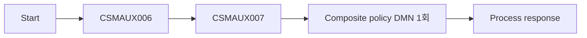
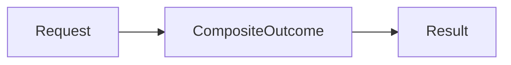

# Case 05 - CSMAUX006/007 복합 AND 권한

> **목표**
>
> BPMN이 CSMAUX006과 CSMAUX007 결과를 수집한 뒤 하나의 DMN 모델을 한 번만
> 평가한다. `CompositeOutcome`이 복합 상태를 설명하고 `Result`가 두 권한이 모두
> `GRANTED`인 경우에만 허용한다.
>
> **PoC baseline**
>
> `CSMAUX006 → CSMAUX007` 순차 호출이다. 고객 PDF의 상세 슈도코드는 순차로
> 읽히지만 요약표는 `병렬 2건 (AND)`와 `병렬 평가`를 명시하여 원문 안에 충돌이
> 있다. 현재 순차 방식은 고객 확인 전 재현 가능한 PoC baseline이며, 병렬 여부는
> 확정 계약이 아니다.

[공통 준비와 UI 절차로 돌아가기](README.md)

---

## 1. 고객 규칙과 확정 범위

```text
CSMAUX006 = GRANTED
AND
CSMAUX007 = GRANTED
→ ALLOW
```

1. 두 권한을 모두 확인한다.
2. 하나라도 HTTP 200 body `ERROR`이면 `SYSTEM_ERROR`다.
3. 두 결과가 모두 `GRANTED`인 경우에만 `ALLOW`다.
4. 그 외 정상 권한 결과 조합은 `DENY`다.

이 가이드의 재현 가능한 baseline은 다음과 같다.

- 호출 순서: `006 → 007`
- 006이 HTTP 200 body `ERROR`여도 007까지 수집
- 두 결과를 모두 mapping한 뒤 DMN을 정확히 한 번 평가
- 두 body가 모두 `ERROR`이면 rule order에 따라 006을 대표 사유로 사용
- HTTP 4xx/5xx, timeout, 연결 실패는 결과 수집이 아니므로 DMN을 실행하지 않음

PDF의 상세 흐름과 요약표가 서로 다르므로 “AND이니 반드시 순차” 또는 “요약표가
병렬이니 반드시 동시 호출”이라고 단정하지 않는다. 현재 baseline과 마지막 두
정책은 결정적 시연을 위한 선택이다. 고객 계약이 도착하면 다음을 다시 확인한다.

- body `ERROR`에서 다음 권한 호출을 계속할지
- 두 오류가 동시에 있을 때 대표 사유
- 두 API의 독립성, rate limit, 감사 순서
- 병렬 실행과 한쪽 실패 시 sibling 취소 정책

### 1.1 책임 분리

| 구성요소 | 책임 |
|---|---|
| BPMN | 006/007 호출, 순서, 결과 수집, 기술 오류 |
| DMN `CompositeOutcome`/`Result` | 두 결과의 복합 상태, AND 정책과 사유 |
| Mock | 결과 fixture와 호출 journal |
| SCESIM | 3×3 조합과 방어 규칙 |
| E2E | 실제 호출 횟수·순서와 DMN 1회 이후 결과 |



고객에게는 다음과 같이 설명한다.

> BPMN은 두 권한을 정해진 순서로 수집하고 기술 실패를 처리합니다. DMN은
> `CompositeOutcome`에서 현재 복합 상태를 이름 붙인 뒤 `Result`에서 최종 정책과
> 사유를 결정합니다. 호출 순서를 바꾸지 않고도 AND 정책과 메시지를 표에서
> 독립적으로 변경하고 SCESIM으로 회귀 검증할 수 있습니다.

---

## 2. 업무 결과와 기술 실패

| 상황 | 예 | 처리 위치 | DMN |
|---|---|---|---:|
| 승인/거절 | HTTP 200 body `GRANTED`/`DENIED` | mapping → DMN | 실행 |
| provider 업무 오류 | HTTP 200 body `ERROR` | mapping → DMN | 실행 |
| HTTP 장애 | 4xx/5xx | BPMN Error Boundary | 미실행 |
| 전송 장애 | timeout/connection error | BPMN 기술 오류 | 미실행 |
| 계약 위반 | body field 누락/unknown enum | mapping fail fast | 미실행 |

body `ERROR`를 HTTP failure로 처리하거나, HTTP 500을 DMN 문자열 `"ERROR"`로
바꾸지 않는다.

---

## 3. 만들 자산

| 항목 | 값 |
|---|---|
| DMN | `src/main/resources/dmn/Case05CompositeAuthority.dmn` |
| Model Name | `Case05CompositeAuthority` |
| Namespace | `https://example.com/bamoe/poc/case05/v2` |
| Input Data | `Request` |
| Decision | `CompositeOutcome`, `Result` |
| Decision Service facade | `Case05DecisionFacade` |
| SCESIM | `src/test/resources/scesim/Case05CompositeAuthorityTest.scesim` |
| BPMN | `src/main/resources/bpmn/Case05CompositeAuthorityProcess.bpmn` |
| Process ID | `Case05CompositeAuthorityProcess` |
| Mock | `mock-server/case05_mock_server.py` |
| Mock port | `8095` |

현재 DMN 파일에 Data Type 골격만 있다면 같은 파일을 열어 아래 Input Data와
Decision을 추가한다. 별도의 routing Decision은 만들지 않는다.

> **현재 체크인 BPMN 초안의 필수 UI 교정**
>
> 현재 `Case05CompositeAuthorityProcess.bpmn`에는 이전 초안의 두 값이 남아 있다.
> 7.5에서 006/007 REST URL을 `customer-rule-mock:8095`로 저장하고, 7.8에서
> Business Rule Task의 Output Name을 `Response`가 아닌 `Result`로 저장해야 한다.
> 이 두 값은 XML 문법이나 Java compile을 깨뜨리지 않을 수 있으므로
> `BUILD SUCCESS`만으로는 교정됐다고 판단할 수 없다. §8의 정적 Gate가 두 URL,
> localhost 부재, 세 개의 `Result` mapping을 모두 확인한 뒤에만 server를
> 실행한다.

---

## 4. UI로 복합 결과가 보이는 DMN 만들기

### 4.1 Model과 Data Types

1. `src/main/resources/dmn/Case05CompositeAuthority.dmn`을 BAMOE DMN Editor로 연다.
2. 빈 canvas를 선택한다.
3. 다음 값을 지정한다.

| Model 설정 | 값 |
|---|---|
| Name | `Case05CompositeAuthority` |
| Namespace | `https://example.com/bamoe/poc/case05/v2` |

`AuthResult`:

```feel
"GRANTED", "DENIED", "ERROR"
```

`DecisionStatus`:

```feel
"ALLOW", "DENY", "SYSTEM_ERROR", "INVALID_INPUT"
```

`Case05CompositeOutcome`:

```feel
"MISSING_006", "MISSING_007",
"ERROR_006", "ERROR_007",
"ALL_GRANTED", "DENIED", "UNRECOGNIZED"
```

`NextAction`:

```feel
"CONTINUE", "STOP", "RETURN_ERROR", "FIX_PROCESS_STATE"
```

`tCase05Request`:

| Field | Type |
|---|---|
| `csmAux006Result` | `AuthResult` |
| `csmAux007Result` | `AuthResult` |

이 Process는 두 호출을 모두 마친 뒤 DMN을 한 번만 평가하므로 Request에 별도
`CallState`가 필요 없다. 호출 도중에는 DMN payload를 만들지 않으며, 직접 component
API를 잘못 호출한 경우에만 null을 “미수집”으로 fail closed한다.

`tCase05Result`:

| Field | Type |
|---|---|
| `status` | `DecisionStatus` |
| `nextAction` | `NextAction` |
| `reasonCode` | `string` |
| `reasonMessage` | `string` |

### 4.2 DRD

| 종류 | 이름 | Type |
|---|---|---|
| Input Data | `Request` | `tCase05Request` |
| Decision | `CompositeOutcome` | `Case05CompositeOutcome` |
| Decision | `Result` | `tCase05Result` |

`Request → CompositeOutcome → Result` Information Requirement를 연결한다.



`AllAuthoritiesGranted=true/false`처럼 의미가 약한 boolean 대신
`CompositeOutcome`이 `ALL_GRANTED`, `ERROR_006`, `DENIED`처럼 현재 복합 상태를
설명한다. BPMN은 두 결과를 모은 뒤 이 DMN 모델을 한 번만 평가한다.

### 4.3 `CompositeOutcome` Decision Table

| 설정 | 값 |
|---|---|
| Expression type | `Decision Table` |
| Decision Output data type | `Case05CompositeOutcome` |
| Hit Policy | `First (F)` |

Input:

| Input Expression | Type |
|---|---|
| `Request.csmAux006Result` | `AuthResult` |
| `Request.csmAux007Result` | `AuthResult` |

Output Name은 `outcome`으로 둔다. `Case05CompositeOutcome`은 **Decision node의
Output data type**과 단일 output column의 Data Type 양쪽에 지정한다. 현재
실습에서 검증한 BAMOE `9.5.0-ibm-0005` 저장 형식과 맞추기 위한 기준이다.

| # | 006 | 007 | outcome |
|---:|---|---|---|
| 1 | `null` | `-` | `"MISSING_006"` |
| 2 | `-` | `null` | `"MISSING_007"` |
| 3 | `"ERROR"` | `-` | `"ERROR_006"` |
| 4 | `-` | `"ERROR"` | `"ERROR_007"` |
| 5 | `"GRANTED"` | `"GRANTED"` | `"ALL_GRANTED"` |
| 6 | `"DENIED"` | `-` | `"DENIED"` |
| 7 | `-` | `"DENIED"` | `"DENIED"` |
| 8 | `-` | `-` | `"UNRECOGNIZED"` |

`First`이므로 결과 완전성 규칙이 모든 업무 판정보다 먼저이고, ERROR rule이 DENY
rule보다 위에 있어야 한다. 두 값이 모두 `ERROR`면 3행이 일치해 006을 대표 사유로
반환한다. 이는 순차 baseline의 결정적 선택이지 고객 원문의 추가 업무 규칙이라고
주장하지 않는다.

### 4.4 `Result` Decision Table

| 설정 | 값 |
|---|---|
| Expression type | `Decision Table` |
| Decision Output data type | `tCase05Result` |
| Hit Policy | `Unique (U)` |

Input은 `CompositeOutcome`, Type은 `Case05CompositeOutcome`이다. Output은 `status`,
`nextAction`, `reasonCode`, `reasonMessage` 순서로 만든다.

| CompositeOutcome | status | nextAction | reasonCode | reasonMessage |
|---|---|---|---|---|
| `"MISSING_006"` | `"INVALID_INPUT"` | `"FIX_PROCESS_STATE"` | `"CSMAUX006_RESULT_NOT_COLLECTED"` | `"CSMAUX006 결과가 수집되지 않았습니다."` |
| `"MISSING_007"` | `"INVALID_INPUT"` | `"FIX_PROCESS_STATE"` | `"CSMAUX007_RESULT_NOT_COLLECTED"` | `"CSMAUX007 결과가 수집되지 않았습니다."` |
| `"ERROR_006"` | `"SYSTEM_ERROR"` | `"RETURN_ERROR"` | `"CSMAUX006_BODY_ERROR"` | `"CSMAUX006 권한 서비스가 업무 오류를 반환했습니다."` |
| `"ERROR_007"` | `"SYSTEM_ERROR"` | `"RETURN_ERROR"` | `"CSMAUX007_BODY_ERROR"` | `"CSMAUX007 권한 서비스가 업무 오류를 반환했습니다."` |
| `"ALL_GRANTED"` | `"ALLOW"` | `"CONTINUE"` | `"COMPOSITE_AUTH_GRANTED"` | `"CSMAUX006과 CSMAUX007 권한이 모두 승인되었습니다."` |
| `"DENIED"` | `"DENY"` | `"STOP"` | `"COMPOSITE_AUTH_DENIED"` | `"CSMAUX006 또는 CSMAUX007 권한이 거절되었습니다."` |
| `"UNRECOGNIZED"` | `"INVALID_INPUT"` | `"FIX_PROCESS_STATE"` | `"UNRECOGNIZED_AUTH_COMBINATION"` | `"인식할 수 없는 복합 권한 결과 조합입니다."` |

`reasonMessage`는 위 문구를 그대로 입력한다. 이렇게 해야 SCESIM, component API,
Process API가 같은 설명 계약을 검증할 수 있다.

### 4.5 하나의 Decision Service facade

DMN canvas에서 Decision Service를 하나 추가한다.

| 항목 | 값 |
|---|---|
| Name | `Case05DecisionFacade` |
| Output Decisions | `Result` |
| Encapsulated Decisions | `CompositeOutcome` |
| Input | `Request`가 자동 노출되는지 확인 |

이 facade는 외부 DMN 소비자에게 전체 model context 대신 `Result` 하나만 노출하는
public component API다. `/dmnresult`에서는 `CompositeOutcome`도 진단할 수 있지만
component 응답은 최종 `Result`만 노출한다. stage별 facade는 만들지 않는다.
Decision Service 자체에 별도 Output data type을 강제로 지정하지 않는다. public
output의 실제 type은 Output Decision인 `Result`의 `tCase05Result`에서 결정된다.

---

## 5. SCESIM 회귀 테스트

### 5.1 생성

1. `src/test/resources/scesim/Case05CompositeAuthorityTest.scesim`을 만든다.
2. `Reopen Editor With...` →
   `(classic)`이 붙지 않은 **BAMOE Test Scenario Editor**를 선택한다.
3. initial dialog에서 `DMN`을 선택한다.
4. DMN file은 `Case05CompositeAuthority.dmn`을 선택한다.
5. Settings에서 다음을 확인한다.

| 항목 | 값 |
|---|---|
| DMN namespace | `https://example.com/bamoe/poc/case05/v2` |
| DMN name | `Case05CompositeAuthority` |

### 5.2 GIVEN/EXPECT

GIVEN:

- `Request.csmAux006Result`
- `Request.csmAux007Result`

EXPECT:

- `CompositeOutcome.value`
- `Result.status`
- `Result.nextAction`
- `Result.reasonCode`
- `Result.reasonMessage`

문자열은 `"GRANTED"`처럼 FEEL literal로 입력한다. 이 표의 null은 모두 GIVEN
값이므로 `null`을 입력한다. 이후 EXPECT에서 null 자체를 검증하는 열을 추가해도
`null`을 사용한다. `? = null`도 동작하지만 이 가이드는 `null`로 통일하고, 빈
EXPECT cell은 검증 생략으로 둔다.

### 5.3 필수 scenario

`Result.nextAction`과 `Result.reasonMessage`도 생략하지 않고 모든 행에서 필수
EXPECT로 입력한다. 특히 `reasonMessage`는 아래 표처럼 큰따옴표까지 포함한 FEEL
string이다.

| ID | 006 | 007 | CompositeOutcome | status | nextAction | reasonCode | reasonMessage |
|---|---|---|---|---|---|---|---|
| C05-S01 | `"GRANTED"` | `"GRANTED"` | `"ALL_GRANTED"` | `"ALLOW"` | `"CONTINUE"` | `"COMPOSITE_AUTH_GRANTED"` | `"CSMAUX006과 CSMAUX007 권한이 모두 승인되었습니다."` |
| C05-S02 | `"DENIED"` | `"GRANTED"` | `"DENIED"` | `"DENY"` | `"STOP"` | `"COMPOSITE_AUTH_DENIED"` | `"CSMAUX006 또는 CSMAUX007 권한이 거절되었습니다."` |
| C05-S03 | `"GRANTED"` | `"DENIED"` | `"DENIED"` | `"DENY"` | `"STOP"` | `"COMPOSITE_AUTH_DENIED"` | `"CSMAUX006 또는 CSMAUX007 권한이 거절되었습니다."` |
| C05-S04 | `"DENIED"` | `"DENIED"` | `"DENIED"` | `"DENY"` | `"STOP"` | `"COMPOSITE_AUTH_DENIED"` | `"CSMAUX006 또는 CSMAUX007 권한이 거절되었습니다."` |
| C05-S05 | `"ERROR"` | `"GRANTED"` | `"ERROR_006"` | `"SYSTEM_ERROR"` | `"RETURN_ERROR"` | `"CSMAUX006_BODY_ERROR"` | `"CSMAUX006 권한 서비스가 업무 오류를 반환했습니다."` |
| C05-S06 | `"GRANTED"` | `"ERROR"` | `"ERROR_007"` | `"SYSTEM_ERROR"` | `"RETURN_ERROR"` | `"CSMAUX007_BODY_ERROR"` | `"CSMAUX007 권한 서비스가 업무 오류를 반환했습니다."` |
| C05-S07 | `"ERROR"` | `"ERROR"` | `"ERROR_006"` | `"SYSTEM_ERROR"` | `"RETURN_ERROR"` | `"CSMAUX006_BODY_ERROR"` | `"CSMAUX006 권한 서비스가 업무 오류를 반환했습니다."` |
| C05-S08 | `"DENIED"` | `"ERROR"` | `"ERROR_007"` | `"SYSTEM_ERROR"` | `"RETURN_ERROR"` | `"CSMAUX007_BODY_ERROR"` | `"CSMAUX007 권한 서비스가 업무 오류를 반환했습니다."` |
| C05-S09 | `"ERROR"` | `"DENIED"` | `"ERROR_006"` | `"SYSTEM_ERROR"` | `"RETURN_ERROR"` | `"CSMAUX006_BODY_ERROR"` | `"CSMAUX006 권한 서비스가 업무 오류를 반환했습니다."` |
| C05-S10 | `null` | `"GRANTED"` | `"MISSING_006"` | `"INVALID_INPUT"` | `"FIX_PROCESS_STATE"` | `"CSMAUX006_RESULT_NOT_COLLECTED"` | `"CSMAUX006 결과가 수집되지 않았습니다."` |
| C05-S11 | `"GRANTED"` | `null` | `"MISSING_007"` | `"INVALID_INPUT"` | `"FIX_PROCESS_STATE"` | `"CSMAUX007_RESULT_NOT_COLLECTED"` | `"CSMAUX007 결과가 수집되지 않았습니다."` |
| C05-S12 | `"ERROR"` | `null` | `"MISSING_007"` | `"INVALID_INPUT"` | `"FIX_PROCESS_STATE"` | `"CSMAUX007_RESULT_NOT_COLLECTED"` | `"CSMAUX007 결과가 수집되지 않았습니다."` |

S12는 업무 오류 판정보다 입력 완전성 검증이 먼저임을 확인한다. 이 고정 수집
Process는 두 결과를 모두 받은 뒤에만 DMN을 실행하므로 미수집 값은 null이다.
007 HTTP 기술 실패 시에는 이 payload를 만들지 않고 DMN 자체를 실행하지 않는다.

```bash
cd "/Users/jihunkeom/Desktop/projects/2026/SKT/skt_bamoe_party/prelim/test"

READY=true
for file in \
  src/main/resources/dmn/Case05CompositeAuthority.dmn \
  src/test/resources/scesim/Case05CompositeAuthorityTest.scesim \
  src/test/java/testscenario/TestScenarioJunitActivatorTest.java
do
  if test -s "$file"; then
    echo "[OK] $file"
  else
    echo "[MISSING/EMPTY] $file"
    READY=false
  fi
done

if ! rg -q '@TestScenarioActivator' \
  src/test/java/testscenario/TestScenarioJunitActivatorTest.java 2>/dev/null
then
  echo "[INVALID] @TestScenarioActivator가 없습니다."
  READY=false
fi

if test "$READY" = true; then
  mvn -s config/settings-bamoe-container.xml clean verify
else
  echo "STOP: 자산을 UI에서 저장한 뒤 다시 실행하세요."
fi
```

Activator는 project 전체에서 하나만 재사용한다. 파일이나 annotation이 없으면
[Case 00 §8.5](case-00-environment-setup.md#85-병합-결과-확인)의 공통 Activator
생성 절차를 먼저 수행한다. `clean verify`의
`BUILD SUCCESS`와 SCESIM 실행 건수를 함께 확인한다.

SCESIM은 두 HTTP 요청이 실제로 발생했는지 알 수 없다. 호출 순서는 9절 journal로
따로 검증한다.

---

## 6. 호출 journal Mock

### 6.1 시나리오

| `mockScenario` | 006 | 007 | baseline journal |
|---|---|---|---|
| `BOTH_GRANTED` | 200 `GRANTED` | 200 `GRANTED` | `006 → 007` |
| `AUTH006_DENIED` | 200 `DENIED` | 200 `GRANTED` | `006 → 007` |
| `AUTH007_DENIED` | 200 `GRANTED` | 200 `DENIED` | `006 → 007` |
| `BOTH_DENIED` | 200 `DENIED` | 200 `DENIED` | `006 → 007` |
| `AUTH006_BODY_ERROR` | 200 `ERROR` | 200 `GRANTED` | `006 → 007` |
| `AUTH007_BODY_ERROR` | 200 `GRANTED` | 200 `ERROR` | `006 → 007` |
| `BOTH_BODY_ERROR` | 200 `ERROR` | 200 `ERROR` | `006 → 007` |
| `AUTH006_HTTP_500` | HTTP 500 | 미호출 | `006` |
| `AUTH007_HTTP_500` | 200 `GRANTED` | HTTP 500 | `006 → 007` |

### 6.2 UI로 파일 만들기

`mock-server/case05_mock_server.py`를 만들고 저장한다.

```python
#!/usr/bin/env python3
import json
from http.server import BaseHTTPRequestHandler, ThreadingHTTPServer
from urllib.parse import unquote, urlparse


SCENARIOS = {
    "BOTH_GRANTED": ("GRANTED", "GRANTED"),
    "AUTH006_DENIED": ("DENIED", "GRANTED"),
    "AUTH007_DENIED": ("GRANTED", "DENIED"),
    "BOTH_DENIED": ("DENIED", "DENIED"),
    "AUTH006_BODY_ERROR": ("ERROR", "GRANTED"),
    "AUTH007_BODY_ERROR": ("GRANTED", "ERROR"),
    "BOTH_BODY_ERROR": ("ERROR", "ERROR"),
    "AUTH006_HTTP_500": ("HTTP_500", "GRANTED"),
    "AUTH007_HTTP_500": ("GRANTED", "HTTP_500"),
}
PATHS = {
    "/mock/auth/csmaux006": ("CSMAUX006", 0),
    "/mock/auth/csmaux007": ("CSMAUX007", 1),
}
CALLS = {}


class Handler(BaseHTTPRequestHandler):
    def send_json(self, status, payload):
        body = json.dumps(payload, ensure_ascii=False).encode("utf-8")
        self.send_response(status)
        self.send_header("Content-Type", "application/json; charset=utf-8")
        self.send_header("Content-Length", str(len(body)))
        self.end_headers()
        self.wfile.write(body)

    def read_json(self):
        size = int(self.headers.get("Content-Length", "0"))
        return json.loads(self.rfile.read(size).decode("utf-8"))

    def do_GET(self):
        path = urlparse(self.path).path
        if path == "/health":
            self.send_json(200, {"status": "UP"})
            return
        prefix = "/mock/calls/"
        if path.startswith(prefix):
            request_id = unquote(path[len(prefix):])
            self.send_json(
                200,
                {"requestId": request_id, "calls": CALLS.get(request_id, [])},
            )
            return
        self.send_json(404, {"error": "NOT_FOUND", "path": path})

    def do_DELETE(self):
        path = urlparse(self.path).path
        prefix = "/mock/calls/"
        if path.startswith(prefix):
            request_id = unquote(path[len(prefix):])
            CALLS.pop(request_id, None)
            self.send_json(200, {"requestId": request_id, "calls": []})
            return
        self.send_json(404, {"error": "NOT_FOUND", "path": path})

    def do_POST(self):
        path = urlparse(self.path).path
        target = PATHS.get(path)
        if target is None:
            self.send_json(404, {"error": "NOT_FOUND", "path": path})
            return
        try:
            request = self.read_json()
        except (ValueError, UnicodeDecodeError):
            self.send_json(400, {"error": "INVALID_JSON"})
            return

        request_id = request.get("requestId")
        customer_id = request.get("customerId")
        scenario = request.get("mockScenario", "BOTH_GRANTED")
        if not request_id or not customer_id or scenario not in SCENARIOS:
            self.send_json(400, {"error": "INVALID_REQUEST"})
            return

        authority, index = target
        CALLS.setdefault(request_id, []).append(authority)
        result = SCENARIOS[scenario][index]
        if result == "HTTP_500":
            self.send_json(
                500,
                {"error": "AUTH_PROVIDER_FAILURE", "authority": authority},
            )
            return
        self.send_json(200, {"authority": authority, "result": result})

    def log_message(self, format_string, *args):
        print(
            "%s - %s"
            % (self.log_date_time_string(), format_string % args),
            flush=True,
        )


if __name__ == "__main__":
    server = ThreadingHTTPServer(("0.0.0.0", 8095), Handler)
    print("Case05 mock listening on http://0.0.0.0:8095", flush=True)
    try:
        server.serve_forever()
    except KeyboardInterrupt:
        pass
    finally:
        server.server_close()
```

Terminal A:

```bash
cd "/Users/jihunkeom/Desktop/projects/2026/SKT/skt_bamoe_party/prelim/test"
python3 -m py_compile mock-server/case05_mock_server.py
python3 mock-server/case05_mock_server.py
```

Terminal C:

```bash
curl --fail-with-body -sS 'http://127.0.0.1:8095/health' | jq
```

---

## 7. UI로 순차 baseline BPMN 만들기

### 7.1 Process Properties

1. `src/main/resources/bpmn/Case05CompositeAuthorityProcess.bpmn`을 만든다.
2. BAMOE BPMN Editor로 연다.
3. 빈 canvas를 선택하고 설정한다.

| Property | 값 |
|---|---|
| Name | `Case05 Composite Authority Process` |
| ID | `Case05CompositeAuthorityProcess` |
| Package | `org.acme.case05` |
| Process Type | `Public` |
| Executable | `true` |
| Target Namespace | `https://example.com/bamoe/poc/case05/process/v2` |

### 7.2 Process Variables와 Tags

| Name | Data Type | Tags | 의미 |
|---|---|---|---|
| `requestId` | `String` | `input,required,readonly` | 추적/journal key |
| `customerId` | `String` | `input,required,readonly` | Mock/권한 요청의 필수 업무 대상 |
| `mockScenario` | `String` | `input` | PoC fixture; process가 기본값을 채움 |
| `authRequest` | `java.util.Map` | `internal` | REST body alias |
| `csmAux006Response` | `java.util.Map` | `internal` | 006 raw response |
| `csmAux007Response` | `java.util.Map` | `internal` | 007 raw response |
| `csmAux006Result` | `String` | `internal` | 정규화 값 |
| `csmAux007Result` | `String` | `internal` | 정규화 값 |
| `decisionRequest` | `java.util.Map` | `internal` | DMN input |
| `decisionResult` | `java.util.Map` | `internal` | DMN output |
| `decisionStatus` | `String` | `internal` | 응답 projection·진단 값 |
| `nextAction` | `String` | `internal` | 응답 projection·진단 값 |
| `reasonCode` | `String` | `internal` | 응답 projection·정책 사유 |
| `failureOperation` | `String` | `internal` | 기술 실패 지점 |
| `processResponse` | `java.util.Map` | `output` | public response |

`input,required,readonly`, `input,readonly`, `input`, `internal`, `output`을 Tags cell에
정확히 입력한다. untagged 변수는 generated REST request/response 양쪽에 노출될 수
있다. 특히 권한 결과와 DMN Request/Result는 caller가 주입하지 못하도록
`internal`이어야 한다. `required`는 이 Process의 무조건 필수 식별자인
`requestId`, `customerId`에만 두고, 업무 field 조합은 초기 validation에서
검사하여 required를 남발하지 않는다.

### 7.3 Node와 Sequence Flow

1. Start Event
2. Script Task `initializeRequest`
3. Rest Service Task `callCsmAux006`
4. Script Task `mapCsmAux006Response`
5. Rest Service Task `callCsmAux007`
6. Script Task `mapCsmAux007Response`
7. Script Task `assembleDecisionRequest`
8. Business Rule Task `evaluateCompositeAuthority`
9. Script Task `buildProcessResponse`
10. End Event

두 Rest Service Task 사이에 gateway를 두지 않는다. HTTP 200 body `ERROR`도 정상
응답 mapping 후 007로 이어지고, 기술 Error Boundary만 정상 flow를 중단한다.

### 7.4 초기화

```java
String incomingRequestId =
    (String) kcontext.getVariable("requestId");
String incomingCustomerId =
    (String) kcontext.getVariable("customerId");
String selectedScenario =
    (String) kcontext.getVariable("mockScenario");
if (incomingRequestId == null || incomingRequestId.isBlank()
        || incomingCustomerId == null
        || incomingCustomerId.isBlank()) {
    throw new IllegalArgumentException(
        "requestId and customerId are required");
}
if (selectedScenario == null || selectedScenario.isBlank()) {
    selectedScenario = "BOTH_GRANTED";
    kcontext.setVariable("mockScenario", selectedScenario);
}

java.util.Map body = new java.util.LinkedHashMap();
body.put("requestId", incomingRequestId);
body.put("customerId", incomingCustomerId);
body.put("mockScenario", selectedScenario);
kcontext.setVariable("authRequest", body);
kcontext.setVariable("csmAux006Result", null);
kcontext.setVariable("csmAux007Result", null);
kcontext.setVariable("decisionRequest", null);
kcontext.setVariable("decisionResult", null);
kcontext.setVariable("processResponse", null);
```

Kogito codegen은 Process Variable을 Script Task의 Java 변수로 이미 바인딩한다.
따라서 Script 안에서 `String requestId`, `String customerId`처럼 같은 이름을 다시
선언하면 `variable ... is already defined` compile error가 난다. 따옴표 안의
`"requestId"`는 Process Variable key이므로 유지하고, Java 지역변수 이름만 위처럼
`incomingRequestId`로 구분한다.

### 7.5 두 Rest Service Task

공통:

| UI field | 값 |
|---|---|
| Method | `POST` |
| Request Timeout | `2000` |
| Access Token Acquisition Strategy | `none` |
| Header 1 | `Accept = application/json` |

Task별:

| Task | URL | Output Target |
|---|---|---|
| `callCsmAux006` | `http://customer-rule-mock:8095/mock/auth/csmaux006` | `csmAux006Response` |
| `callCsmAux007` | `http://customer-rule-mock:8095/mock/auth/csmaux007` | `csmAux007Response` |

각 Task에서 다음 두 UI 영역을 모두 설정한다.

| UI 위치 | Name | Data Type | Source/Target 종류 | 선택 변수 또는 값 |
|---|---|---|---|---|
| `Data Mapping` Input | `authRequest` | `java.util.Map` | `Var` | `authRequest` |
| REST 전용 Properties | `Content Data` | editor 관리 | 해당 없음 | ` #{authRequest}` |
| `Data Mapping` Output | `Result` | `java.util.Map` | `Var` | `csmAux006Response` 또는 `csmAux007Response` |

`Var/authRequest`는 Data Type 이름이 아니다. UI에서 Source 종류로 `Var`를 고른 뒤
옆의 변수 선택란에서 `authRequest`를 고른 상태를 줄여 쓴 표현이다. Data Type은
항상 `java.util.Map`이다. Output도 같은 방식으로 Target 종류 `Var`를 고르고 해당
response Process Variable을 선택한다.

`ContentData`는 예약 내부 이름이다. `Add Input data mapping`의 Name에는 일반 alias
`authRequest`를 입력하고, 별도의 REST `Content Data` 속성에
Space 키를 한 번 누른 뒤 `#{authRequest}`를 입력한다. 실제 값은
` #{authRequest}`다. 마지막 `a`에서 일반 행이 사라지는 것은 글자 수 제한이
아니다. `ContentData`를 직접 만들지 말고 alias와 전용 속성을 사용한다.

`Headers`에는 `Accept = application/json` 한 행만 둔다. 이 Lab의 BAMOE
`9.5.0-ibm-0005` Spring codegen에서는 `Content-Type` 행이
`HEADER_Content-Type`으로 생성되며 하이픈 때문에 compile을 깨뜨릴 수 있다.
Map body는 REST handler가 JSON으로 전송하며 wire Content-Type을 자동 설정한다.
정상 runtime 로그는 `ContentData={...}`다.

### 7.6 결과 mapping

`mapCsmAux006Response`:

```java
java.util.Map response =
    (java.util.Map) kcontext.getVariable("csmAux006Response");
Object rawAuthority =
    response == null ? null : response.get("authority");
Object raw = response == null ? null : response.get("result");
String authority =
    rawAuthority == null ? null : rawAuthority.toString();
String value = raw == null ? null : raw.toString();
if (value == null
        || !"CSMAUX006".equals(authority)
        || !java.util.List.of(
            "GRANTED", "DENIED", "ERROR").contains(value)) {
    throw new IllegalStateException(
        "Invalid CSMAUX006 response: " + response);
}
kcontext.setVariable("csmAux006Result", value);
```

`mapCsmAux007Response`:

```java
java.util.Map response =
    (java.util.Map) kcontext.getVariable("csmAux007Response");
Object rawAuthority =
    response == null ? null : response.get("authority");
Object raw = response == null ? null : response.get("result");
String authority =
    rawAuthority == null ? null : rawAuthority.toString();
String value = raw == null ? null : raw.toString();
if (value == null
        || !"CSMAUX007".equals(authority)
        || !java.util.List.of(
            "GRANTED", "DENIED", "ERROR").contains(value)) {
    throw new IllegalStateException(
        "Invalid CSMAUX007 response: " + response);
}
kcontext.setVariable("csmAux007Result", value);
```

### 7.7 두 결과를 모은 뒤 Request 조립

`assembleDecisionRequest`:

```java
java.util.Map request = new java.util.LinkedHashMap();
request.put(
    "csmAux006Result",
    kcontext.getVariable("csmAux006Result"));
request.put(
    "csmAux007Result",
    kcontext.getVariable("csmAux007Result"));
kcontext.setVariable("decisionRequest", request);
```

이 Script는 두 mapping 뒤에 하나만 둔다. DMN을 006 뒤에서 먼저 실행하지 않는다.

### 7.8 Business Rule Task 1회

`evaluateCompositeAuthority`:

1. variant를 `Business Rule Task`로 바꾼다.
2. Implementation은 `DMN`을 선택한다.
3. `Autofill...`에서 `../dmn/Case05CompositeAuthority.dmn`을 선택한다.

| DMN field | 값 |
|---|---|
| Relative path | `../dmn/Case05CompositeAuthority.dmn` |
| Namespace | `https://example.com/bamoe/poc/case05/v2` |
| Model | `Case05CompositeAuthority` |

Data Mapping:

| 방향 | DMN Name | Process variable | Type |
|---|---|---|---|
| Input | `Request` | `decisionRequest` | `java.util.Map` |
| Output | `Result` | `decisionResult` | `java.util.Map` |

Process 전체에서 이 Business Rule Task는 하나뿐이다.
Business Rule Task는 4.5의 Decision Service REST API를 선택 호출하지 않는다. 같은
application의 DMN Model을 embedded 평가하고 `Result`만 mapping한다.

### 7.9 public 응답

`buildProcessResponse`:

```java
java.util.Map result =
    (java.util.Map) kcontext.getVariable("decisionResult");
if (result == null
        || result.get("status") == null
        || result.get("nextAction") == null
        || result.get("reasonCode") == null
        || result.get("reasonMessage") == null) {
    throw new IllegalStateException(
        "Case05 Result mapping is incomplete: " + result);
}

String status = result.get("status").toString();
String action = result.get("nextAction").toString();
String code = result.get("reasonCode").toString();
String message = result.get("reasonMessage").toString();
if (code.isBlank() || message.isBlank()) {
    throw new IllegalStateException(
        "Case05 Result reason is blank: " + result);
}
boolean validContract =
    ("ALLOW".equals(status) && "CONTINUE".equals(action))
    || ("DENY".equals(status) && "STOP".equals(action))
    || ("SYSTEM_ERROR".equals(status)
        && "RETURN_ERROR".equals(action))
    || ("INVALID_INPUT".equals(status)
        && "FIX_PROCESS_STATE".equals(action));
if (!validContract) {
    throw new IllegalStateException(
        "Inconsistent Case05 Result tuple: " + result);
}

java.util.Map policyResult = new java.util.LinkedHashMap();
policyResult.put("status", status);
policyResult.put("nextAction", action);
policyResult.put("reasonCode", code);
policyResult.put("reasonMessage", message);

java.util.Map response = new java.util.LinkedHashMap();
response.put("requestId", kcontext.getVariable("requestId"));
response.put("executionState", "COMPLETED");
response.put("policyResult", policyResult);
kcontext.setVariable(
    "decisionStatus",
    status);
kcontext.setVariable(
    "nextAction",
    action);
kcontext.setVariable(
    "reasonCode",
    code);
kcontext.setVariable("processResponse", response);
```

### 7.10 선택 실습: 기술 Error Boundary

현재 체크인된 baseline BPMN에는 Boundary가 없다. 먼저 Process HTTP 5xx와
journal로 transport 실패를 관찰해도 Case05의 필수 범위는 완료다. 구조화된
기술 envelope까지 보여 주려면 다음 선택 실습을 추가한다.

1. Process Properties → Errors에 `restHttp500`, code `500`을 추가한다.
2. 006/007 Rest Service Task에 interrupting Error Boundary를 붙인다.
3. 각 boundary에서 `failureOperation`과 `TECHNICAL_FAILURE` 실행 envelope를 만든
   뒤 기술 오류 End로 보낸다.

006 예:

```java
java.util.Map response = new java.util.LinkedHashMap();
response.put("requestId", kcontext.getVariable("requestId"));
response.put("executionState", "TECHNICAL_FAILURE");
response.put("failedOperation", "CSMAUX006");
response.put("errorCode", "CSMAUX006_HTTP_500");
response.put("errorMessage", "CSMAUX006 transport call failed");
kcontext.setVariable("failureOperation", "CSMAUX006");
kcontext.setVariable("processResponse", response);
```

007은 operation과 errorCode만 바꾼다. 기술 실패 envelope에는 정책 `status`나
`nextAction`을 넣지 않는다. 아직 AND 정책을 평가하지 않았기 때문이다. timeout이
code `500`이라고 가정하지 않고 현재 runtime의 실제 error code를 별도 시험한 뒤
운영 정책을 확정한다.

---

## 8. Build와 endpoint

```bash
cd "/Users/jihunkeom/Desktop/projects/2026/SKT/skt_bamoe_party/prelim/test"

READY=true
for file in \
  src/main/resources/dmn/Case05CompositeAuthority.dmn \
  src/main/resources/bpmn/Case05CompositeAuthorityProcess.bpmn \
  src/test/resources/scesim/Case05CompositeAuthorityTest.scesim
do
  if test -s "$file"; then
    echo "[OK] $file"
  else
    echo "[MISSING/EMPTY] $file"
    READY=false
  fi
done

REST_DEP_COUNT="$(
  rg -o '<artifactId>kogito-rest-workitem</artifactId>' pom.xml \
    | wc -l | tr -d ' '
)"
if test "$REST_DEP_COUNT" -eq 1; then
  echo "[OK] kogito-rest-workitem exactly once"
else
  echo "[INVALID] kogito-rest-workitem count=$REST_DEP_COUNT"
  READY=false
fi

MODEL='src/main/resources/bpmn/Case05CompositeAuthorityProcess.bpmn'
if test -s "$MODEL"; then
  AUTH_ALIAS_COUNT="$(
    rg -o \
      'name="authRequest"[^>]*drools:dtype="java.util.Map"' \
      "$MODEL" | wc -l | tr -d ' '
  )"
  CONTENT_DATA_COUNT="$(
    rg -Fo '> #{authRequest}</from>' "$MODEL" \
      | wc -l | tr -d ' '
  )"
  RULE_TASK_COUNT="$(
    rg -o '<businessRuleTask ' "$MODEL" \
      | wc -l | tr -d ' '
  )"
  DMN_MODEL_COUNT="$(
    rg -Fo '>Case05CompositeAuthority</from>' "$MODEL" \
      | wc -l | tr -d ' '
  )"
  DMN_NAMESPACE_COUNT="$(
    rg -Fo \
      '>https://example.com/bamoe/poc/case05/v2</from>' \
      "$MODEL" | wc -l | tr -d ' '
  )"
  REQUEST_MAPPING_COUNT="$(
    rg -o \
      'name="Request"[^>]*drools:dtype="java.util.Map"' \
      "$MODEL" | wc -l | tr -d ' '
  )"
  MAP_RESULT_OUTPUT_COUNT="$(
    rg -o \
      'name="Result"[^>]*drools:dtype="java.util.Map"' \
      "$MODEL" | wc -l | tr -d ' '
  )"
  CSMAUX006_SERVICE_URL_COUNT="$(
    rg -F -o \
      'http://customer-rule-mock:8095/mock/auth/csmaux006' \
      "$MODEL" | wc -l | tr -d ' '
  )"
  CSMAUX007_SERVICE_URL_COUNT="$(
    rg -F -o \
      'http://customer-rule-mock:8095/mock/auth/csmaux007' \
      "$MODEL" | wc -l | tr -d ' '
  )"
  LOOPBACK_REST_URL_COUNT="$(
    rg -o \
      'https?://(localhost|127\.0\.0\.1)(:|/)' \
      "$MODEL" | wc -l | tr -d ' '
  )"
  GATEWAY_COUNT="$(
    rg -o \
      '<(exclusiveGateway|inclusiveGateway|parallelGateway)' \
      "$MODEL" | wc -l | tr -d ' '
  )"

  for check in \
    "authRequest Map alias:$AUTH_ALIAS_COUNT:2" \
    "ContentData expression:$CONTENT_DATA_COUNT:2" \
    "Business Rule Task:$RULE_TASK_COUNT:1" \
    "DMN model assignment:$DMN_MODEL_COUNT:1" \
    "DMN namespace assignment:$DMN_NAMESPACE_COUNT:1" \
    "DMN Request input:$REQUEST_MAPPING_COUNT:1" \
    "Map Result outputs:$MAP_RESULT_OUTPUT_COUNT:3" \
    "CSMAUX006 Service URL:$CSMAUX006_SERVICE_URL_COUNT:1" \
    "CSMAUX007 Service URL:$CSMAUX007_SERVICE_URL_COUNT:1" \
    "Loopback REST URL:$LOOPBACK_REST_URL_COUNT:0" \
    "Gateway:$GATEWAY_COUNT:0"
  do
    label="${check%%:*}"
    remainder="${check#*:}"
    actual="${remainder%%:*}"
    expected="${remainder##*:}"
    if test "$actual" -eq "$expected"; then
      echo "[OK] $label = $actual"
    else
      echo "[INVALID] $label: actual=$actual expected=$expected"
      READY=false
    fi
  done

  if rg -q 'HEADER_Content-Type' "$MODEL"; then
    echo "[INVALID] 수동 Content-Type header를 제거하세요."
    READY=false
  else
    echo "[OK] no HEADER_Content-Type"
  fi
fi

if test "$READY" = true; then
  mvn -s config/settings-bamoe-container.xml clean verify
else
  echo "STOP: build 전 자산과 dependency를 수정하세요."
fi
```

모든 count Gate가 `[OK]`여야 한다. Case05 baseline은 006과 007 사이에 정책
Gateway가 없으므로 `Gateway=0`, Business Rule Task는 두 결과 조립 뒤 정확히
한 번이므로 `Business Rule Task=1`이어야 한다. `Map Result outputs=3`은 두 REST
Task의 `Result`와 한 Business Rule Task의 `Result`를 합한 수다. 두 Service URL은
각각 한 번이고 `Loopback REST URL=0`이어야 로컬 `/etc/hosts`와 OCP Service DNS
양쪽에서 같은 BPMN을 사용할 수 있다.
`BUILD SUCCESS`일 때만 다음 명령으로 server를 실행한다.

```bash
mvn -s config/settings-bamoe-container.xml spring-boot:run
```

`kogito-rest-workitem`은 정확히 한 번만 있어야 한다. server가 올라온 뒤 다른
Terminal에서:

```bash
APP_READY=0
APP_READY_ATTEMPT=1

while [ "$APP_READY_ATTEMPT" -le 30 ]
do
  if curl -fsS \
      'http://127.0.0.1:8080/actuator/health' \
      2>/dev/null \
    | jq -e '.status == "UP"' >/dev/null
  then
    APP_READY=1
    break
  fi
  sleep 1
  APP_READY_ATTEMPT=$((APP_READY_ATTEMPT + 1))
done

if [ "$APP_READY" -eq 1 ]; then
  printf 'APP_READINESS_GATE=PASS\n'
else
  printf 'APP_READINESS_GATE=FAIL: BAMOE Terminal 로그를 확인하세요.\n' >&2
  false
fi
```

`PASS`일 때만 OpenAPI를 조회한다.

```bash
curl --fail-with-body -sS \
  'http://127.0.0.1:8080/v3/api-docs' \
  | jq -r \
    '.paths | keys[] | select(contains("Case05"))'
```

실제 출력에서 다음 네 DMN endpoint 종류와 Process path를 찾는다.

| endpoint 종류 | 용도 |
|---|---|
| `/Case05CompositeAuthority` | 전체 model context |
| `/Case05CompositeAuthority/dmnresult` | 전체 model message/evaluation status |
| `/Case05CompositeAuthority/Case05DecisionFacade` | 좁은 `Result` component 응답 |
| `/Case05CompositeAuthority/Case05DecisionFacade/dmnresult` | facade 상세 진단 |

경로가 다르면 OpenAPI 출력이 우선이다.

```bash
DMN_URL='http://127.0.0.1:8080/Case05CompositeAuthority/Case05DecisionFacade'
DMN_DIAG_URL="${DMN_URL}/dmnresult"
PROCESS_URL='http://127.0.0.1:8080/Case05CompositeAuthorityProcess'
set -o pipefail
```

두 결과 승인:

```bash
C05_GRANTED='{
  "Request": {
    "csmAux006Result": "GRANTED",
    "csmAux007Result": "GRANTED"
  }
}'

curl --fail-with-body -sS -X POST "$DMN_URL" \
  -H 'Content-Type: application/json' \
  -d "$C05_GRANTED" | jq
```

기대: `ALLOW / COMPOSITE_AUTH_GRANTED`.

두 번째 결과 미수집:

```bash
C05_INCOMPLETE='{
  "Request": {
    "csmAux006Result": "ERROR",
    "csmAux007Result": null
  }
}'

curl --fail-with-body -sS -X POST "$DMN_URL" \
  -H 'Content-Type: application/json' \
  -d "$C05_INCOMPLETE" | jq

curl --fail-with-body -sS -X POST "$DMN_DIAG_URL" \
  -H 'Content-Type: application/json' \
  -d "$C05_INCOMPLETE" \
  | jq '
      if has("decisionResults")
      then {messages, decisionResults}
      else .
      end
    '
```

기대: `INVALID_INPUT / CSMAUX007_RESULT_NOT_COLLECTED`. Process 정상 경로에서는
이 상태로 DMN을 실행하지 않지만 component API는 조립 오류를 fail closed한다.

---

## 9. E2E journal

### 9.1 helper

```bash
set -o pipefail
run_case05 () {
  local request_id="$1"
  local scenario="$2"
  local expected_policy="$3"
  local expected_calls="$4"
  local process_body
  local process_status
  local journal_body
  local process_failed=0
  local journal_failed=0

  curl --fail-with-body -sS -X DELETE \
    "http://127.0.0.1:8095/mock/calls/$request_id" \
    >/dev/null

  process_body="$(mktemp)"
  process_status="$(
    curl -sS \
      -o "$process_body" \
      -w '%{http_code}' \
      -X POST \
      -H 'Content-Type: application/json' \
      -d "{
        \"requestId\": \"$request_id\",
        \"customerId\": \"C001\",
        \"mockScenario\": \"$scenario\"
      }" \
      "$PROCESS_URL"
  )"

  case "$process_status" in
    2??)
      echo "[PROCESS HTTP $process_status]"
      if jq -e \
          --arg request_id "$request_id" \
          --argjson expected_policy "$expected_policy" \
          '
            .processResponse.requestId == $request_id
            and .processResponse.executionState == "COMPLETED"
            and (
              .processResponse.policyResult
              | {
                  status,
                  nextAction,
                  reasonCode
                }
            ) == $expected_policy
            and (
              .processResponse.policyResult.reasonMessage
              | type == "string" and length > 0
            )
          ' \
          "$process_body" >/dev/null
      then
        echo "[OK] exact policy result"
        jq '{processResponse}' "$process_body"
      else
        process_failed=1
        echo "[INVALID] 2xx policy result assertion 실패"
        jq . "$process_body"
      fi
      ;;
    *)
      process_failed=1
      echo "[PROCESS HTTP $process_status - FAILURE BODY]"
      jq . "$process_body" 2>/dev/null \
        || sed -n '1,120p' "$process_body"
      ;;
  esac
  rm -f "$process_body"

  if journal_body="$(
      curl --fail-with-body -sS \
        "http://127.0.0.1:8095/mock/calls/$request_id"
    )" \
    && printf '%s\n' "$journal_body" \
      | jq -e \
          --argjson expected_calls "$expected_calls" \
          '.calls == $expected_calls' \
          >/dev/null
  then
    echo "[OK] exact journal"
    printf '%s\n' "$journal_body" | jq .
  else
    journal_failed=1
    echo "[INVALID] journal assertion 실패"
    printf '%s\n' "$journal_body" | jq . 2>/dev/null || true
  fi

  if test "$process_failed" -ne 0 \
      || test "$journal_failed" -ne 0
  then
    return 1
  fi
  return 0
}
```

이 helper는 기대 `status/nextAction/reasonCode`와 정확한 journal 배열까지
인자로 받아 검증한다. Process HTTP status와 원문 body도 분리해 출력한다. 500 응답을
`jq '{processResponse}'`로 바로 projection하면 실제 오류 설명이 `null`처럼 보여
원인 분석을 방해한다. 정책 경로 P01~P07은 journal뿐 아니라
`PROCESS HTTP 2xx`와 non-null `processResponse`까지 성공 조건이다. HTTP
non-2xx 또는 journal 조회 실패면 helper도 nonzero로 끝난다.

### 9.2 정책 경로

```bash
CASE05_POLICY_FAILED=0

run_case05 \
  'C05-P01' 'BOTH_GRANTED' \
  '{"status":"ALLOW","nextAction":"CONTINUE","reasonCode":"COMPOSITE_AUTH_GRANTED"}' \
  '["CSMAUX006","CSMAUX007"]' \
  || CASE05_POLICY_FAILED=1

run_case05 \
  'C05-P02' 'AUTH006_DENIED' \
  '{"status":"DENY","nextAction":"STOP","reasonCode":"COMPOSITE_AUTH_DENIED"}' \
  '["CSMAUX006","CSMAUX007"]' \
  || CASE05_POLICY_FAILED=1

run_case05 \
  'C05-P03' 'AUTH007_DENIED' \
  '{"status":"DENY","nextAction":"STOP","reasonCode":"COMPOSITE_AUTH_DENIED"}' \
  '["CSMAUX006","CSMAUX007"]' \
  || CASE05_POLICY_FAILED=1

run_case05 \
  'C05-P04' 'BOTH_DENIED' \
  '{"status":"DENY","nextAction":"STOP","reasonCode":"COMPOSITE_AUTH_DENIED"}' \
  '["CSMAUX006","CSMAUX007"]' \
  || CASE05_POLICY_FAILED=1

run_case05 \
  'C05-P05' 'AUTH006_BODY_ERROR' \
  '{"status":"SYSTEM_ERROR","nextAction":"RETURN_ERROR","reasonCode":"CSMAUX006_BODY_ERROR"}' \
  '["CSMAUX006","CSMAUX007"]' \
  || CASE05_POLICY_FAILED=1

run_case05 \
  'C05-P06' 'AUTH007_BODY_ERROR' \
  '{"status":"SYSTEM_ERROR","nextAction":"RETURN_ERROR","reasonCode":"CSMAUX007_BODY_ERROR"}' \
  '["CSMAUX006","CSMAUX007"]' \
  || CASE05_POLICY_FAILED=1

run_case05 \
  'C05-P07' 'BOTH_BODY_ERROR' \
  '{"status":"SYSTEM_ERROR","nextAction":"RETURN_ERROR","reasonCode":"CSMAUX006_BODY_ERROR"}' \
  '["CSMAUX006","CSMAUX007"]' \
  || CASE05_POLICY_FAILED=1

if [ "$CASE05_POLICY_FAILED" -eq 0 ]; then
  echo 'CASE05_POLICY_SUITE=PASS'
else
  echo 'CASE05_POLICY_SUITE=FAIL' >&2
  false
fi
```

| ID | status | reasonCode | 정확한 journal |
|---|---|---|---|
| P01 | `ALLOW` | `COMPOSITE_AUTH_GRANTED` | `["CSMAUX006","CSMAUX007"]` |
| P02~P04 | `DENY` | `COMPOSITE_AUTH_DENIED` | `["CSMAUX006","CSMAUX007"]` |
| P05 | `SYSTEM_ERROR` | `CSMAUX006_BODY_ERROR` | `["CSMAUX006","CSMAUX007"]` |
| P06 | `SYSTEM_ERROR` | `CSMAUX007_BODY_ERROR` | `["CSMAUX006","CSMAUX007"]` |
| P07 | `SYSTEM_ERROR` | `CSMAUX006_BODY_ERROR` | `["CSMAUX006","CSMAUX007"]` |

P05가 `006 → 007`인 것은 제품 제약이 아니라 이 가이드의 collect-both baseline이다.

### 9.3 기술 실패

```bash
run_case05_technical () {
  local request_id="$1"
  local scenario="$2"
  local expected_mode="$3"
  local expected_operation="$4"
  local expected_calls="$5"
  local process_body
  local journal_body
  local process_status
  local process_valid=0
  local journal_valid=0

  process_body="$(mktemp)" || return 1
  journal_body="$(mktemp)" || {
    rm -f "$process_body"
    return 1
  }

  if ! curl --fail-with-body -sS -X DELETE \
      "http://127.0.0.1:8095/mock/calls/$request_id" \
      >/dev/null
  then
    echo "[INVALID] journal 초기화 실패: $request_id"
    rm -f "$process_body" "$journal_body"
    return 1
  fi

  if process_status="$(
      curl -sS \
        -o "$process_body" \
        -w '%{http_code}' \
        -X POST \
        -H 'Content-Type: application/json' \
        -d "{
          \"requestId\": \"$request_id\",
          \"customerId\": \"C001\",
          \"mockScenario\": \"$scenario\"
        }" \
        "$PROCESS_URL"
  )"
  then
    case "$expected_mode:$process_status" in
      boundary:2??)
        if jq -e \
            --arg request_id "$request_id" \
            --arg operation "$expected_operation" \
            --arg error_code "${expected_operation}_HTTP_500" \
            '
              .processResponse.requestId == $request_id
              and .processResponse.executionState == "TECHNICAL_FAILURE"
              and .processResponse.failedOperation == $operation
              and .processResponse.errorCode == $error_code
              and (
                .processResponse.errorMessage
                | type == "string" and length > 0
              )
              and (.processResponse | has("policyResult") | not)
            ' \
            "$process_body" >/dev/null
        then
          process_valid=1
          echo "[OK] Boundary technical envelope"
          jq '{processResponse}' "$process_body"
        else
          echo "[INVALID] 2xx technical envelope assertion 실패"
          jq . "$process_body"
        fi
        ;;
      raw-5xx:5??)
        process_valid=1
        echo "[OK] Process HTTP $process_status"
        jq . "$process_body" 2>/dev/null \
          || sed -n '1,120p' "$process_body"
        ;;
      boundary:*)
        echo "[INVALID] boundary mode expected 2xx envelope; got HTTP $process_status"
        jq . "$process_body" 2>/dev/null \
          || sed -n '1,120p' "$process_body"
        ;;
      raw-5xx:*)
        echo "[INVALID] raw-5xx mode expected HTTP 5xx; got $process_status"
        jq . "$process_body" 2>/dev/null \
          || sed -n '1,120p' "$process_body"
        ;;
      *)
        echo "[INVALID] expected_mode must be boundary or raw-5xx"
        jq . "$process_body" 2>/dev/null \
          || sed -n '1,120p' "$process_body"
        ;;
    esac
  else
    echo "[INVALID] Process transport 호출 실패"
  fi

  if curl --fail-with-body -sS \
      -o "$journal_body" \
      "http://127.0.0.1:8095/mock/calls/$request_id" \
    && jq -e \
      --argjson expected_calls "$expected_calls" \
      '.calls == $expected_calls' \
      "$journal_body" >/dev/null
  then
    journal_valid=1
    echo "[OK] exact journal"
    jq . "$journal_body"
  else
    echo "[INVALID] journal assertion 실패"
    jq . "$journal_body" 2>/dev/null || true
  fi

  rm -f "$process_body" "$journal_body"
  if [ "$process_valid" -eq 1 ] \
    && [ "$journal_valid" -eq 1 ]
  then
    return 0
  fi
  return 1
}
```

Error Boundary를 만들지 않은 baseline은 아래 값을 그대로 사용한다. Boundary를
구성해 exact envelope를 검증할 때만 값을 `boundary`로 바꾸고 같은 suite를 다시
실행한다.

```bash
CASE05_TECHNICAL_MODE='raw-5xx'
```

```bash
CASE05_TECHNICAL_FAILED=0

run_case05_technical \
  'C05-T01' 'AUTH006_HTTP_500' \
  "$CASE05_TECHNICAL_MODE" \
  'CSMAUX006' '["CSMAUX006"]' \
  || CASE05_TECHNICAL_FAILED=1

run_case05_technical \
  'C05-T02' 'AUTH007_HTTP_500' \
  "$CASE05_TECHNICAL_MODE" \
  'CSMAUX007' '["CSMAUX006","CSMAUX007"]' \
  || CASE05_TECHNICAL_FAILED=1

if [ "$CASE05_TECHNICAL_FAILED" -eq 0 ]; then
  echo 'CASE05_TECHNICAL_SUITE=PASS'
else
  echo 'CASE05_TECHNICAL_SUITE=FAIL' >&2
  false
fi
```

| ID | journal | DMN |
|---|---|---|
| T01 | `["CSMAUX006"]` | 미실행 |
| T02 | `["CSMAUX006","CSMAUX007"]` | 미실행 |

`boundary` mode는 exact `TECHNICAL_FAILURE` envelope와 `failedOperation`만,
`raw-5xx` mode는 Process POST 5xx만 성공으로 인정한다. 두 mode 모두 정확한
journal까지 맞아야 helper가 성공한다.

### 9.4 종료

BAMOE와 Mock Terminal에서 각각 `Ctrl+C`를 누른다.

```bash
lsof -nP -iTCP:8080 -sTCP:LISTEN
lsof -nP -iTCP:8095 -sTCP:LISTEN
```

출력이 없어야 한다.

---

## 10. 병렬 variant를 검토할 때

PDF 요약표의 `병렬 2건 (AND)` 요구는 무시하지 않되, 상세 슈도코드의 순차 흐름과
충돌하므로 현재 baseline을 바로 Parallel Gateway로 바꾸지 않는다. 고객이 다음을
명시적으로 확인한 뒤 별도 variant로 검증한다.

- 입력과 provider 상태 측면에서 두 호출이 독립적인가?
- 동시 호출이 rate limit와 감사 순서를 위반하지 않는가?
- 한쪽 기술 실패 시 다른 호출을 취소하는가?
- 두 결과가 모두 오류일 때 대표 사유는 무엇인가?

Parallel Gateway 도형만 배치했다고 실제 두 HTTP 요청이 동시에 실행되거나 지연이
`max(t006,t007)`가 된다고 주장할 수 없다. 적용할 때는 다음을 측정한다.

- Mock의 요청 시작·종료 timestamp overlap
- 각 authority가 정확히 한 번 호출됐는지
- branch가 공유 Map을 동시에 수정하지 않는지
- 한 branch 실패 시 sibling token이 남지 않는지

실제 overlap이 확인되지 않으면 synchronous REST handler 또는 실행 설정을 조사하고
순차 baseline과 성능 수치를 비교한다. 논리 AND와 실행 concurrency는 별개다.

---

## 11. 문제 해결

| 증상 | 확인 |
|---|---|
| 006 뒤 DMN이 실행됨 | node order를 006 → 007 → assemble → DMN으로 수정 |
| 006 body ERROR 뒤 007 미호출 | body ERROR를 기술 boundary로 보내는 잘못된 분기 제거 |
| HTTP 500 뒤 DMN 실행 | Error Boundary가 정상 flow에 merge되지 않고 기술 End로 가는지 확인 |
| ERROR가 DENY | Hit Policy `First`, ERROR rule이 DENY보다 위인지 |
| `ContentData` 입력 행이 사라짐 | 일반 alias `authRequest` + REST 전용 `Content Data` 사용 |
| request body 누락/415 | alias Source Map, 선행 공백이 있는 ` #{authRequest}`, runtime의 `ContentData={...}`를 확인 |
| 내부 결과가 OpenAPI input에 보임 | variable Tags를 `internal`로 수정 |
| journal 순서가 007 → 006 | baseline Sequence Flow 또는 병렬 variant 여부 |
| DMN `INVALID_INPUT` | 두 mapping이 모두 끝난 뒤 Request를 조립했는지 |
| journal은 맞는데 Process가 500 | helper의 `[PROCESS HTTP ... - FAILURE BODY]` 전체를 보고 Business Rule mapping 또는 `buildProcessResponse` tuple 검증 오류를 확인 |
| 병렬 도형인데 latency가 줄지 않음 | 실제 요청 timestamp overlap과 async 실행 설정 확인 |
| Java compile에 `variable ... is already defined` | Script 지역변수가 Process Variable 이름을 재선언하지 않았는지 확인 |

---

## 12. 완료 체크리스트

### DMN/SCESIM

- [ ] DRD는 `Request → CompositeOutcome → Result`다.
- [ ] `CompositeOutcome`이 두 권한의 복합 상태를 명시적으로 설명한다.
- [ ] `AuthResult`는 `GRANTED`/`DENIED`/`ERROR`만 사용하고 미수집 값은 null이다.
- [ ] 두 결과가 모두 `GRANTED`일 때만 `ALLOW`다.
- [ ] ERROR가 DENY보다 우선한다.
- [ ] 결과 완전성 검증이 ERROR/DENY보다 먼저다.
- [ ] 모든 rule에 정확한 `reasonMessage`를 입력했다.
- [ ] `Case05DecisionFacade`는 `Result`만 Output Decision으로 노출한다.
- [ ] C05-S01~S12가 통과한다.

### BPMN

- [ ] baseline 호출 순서는 006 → 007이다.
- [ ] 두 결과를 모은 뒤 Business Rule Task를 한 번만 실행한다.
- [ ] `buildProcessResponse`가 status/nextAction 조합과 비어 있지 않은 reason을 fail fast로 검증한다.
- [ ] `requestId`와 `customerId`는 모두 `input,required,readonly`다.
- [ ] 기본값을 채우는 mockScenario는 `input`이다.
- [ ] 나머지 Process Variables에 `internal` 또는 `output` Tags를 지정했다.
- [ ] 외부 권한 결과와 DMN context는 `internal`이다.
- [ ] `processResponse`만 `output`이다.
- [ ] Script 지역변수는 Process Variable과 다른 이름을 사용한다.
- [ ] REST 일반 alias와 전용 `Content Data` 속성을 구분했다.
- [ ] 모든 POST REST Task에 `Accept: application/json`만 설정하고 수동 `Content-Type` 행은 추가하지 않았다.
- [ ] 모든 `Content Data` 값은 선행 공백을 포함한 ` #{authRequest}`다.
- [ ] body `ERROR`와 HTTP 기술 오류 경로를 분리했다.
- [ ] Boundary를 구성했다면 기술 실패 envelope에 정책 `status/nextAction`이 없고, 구성하지 않았다면 Process HTTP 5xx를 확인했다.

### 증거

- [ ] P01~P07 journal이 모두 정확히 006 → 007이다.
- [ ] P01~P07은 Process HTTP 2xx와 non-null `processResponse`도 확인했다.
- [ ] T01은 006만, T02는 006 → 007이며 둘 다 DMN 미실행이다.
- [ ] facade component curl과 `/dmnresult` 진단을 확인했다.
- [ ] 실제 concurrency를 측정하지 않고 병렬 성능을 주장하지 않았다.
- [ ] Maven build와 OpenAPI endpoint 확인이 성공했다.
- [ ] 실행 후 8080과 8095 server를 종료했다.
