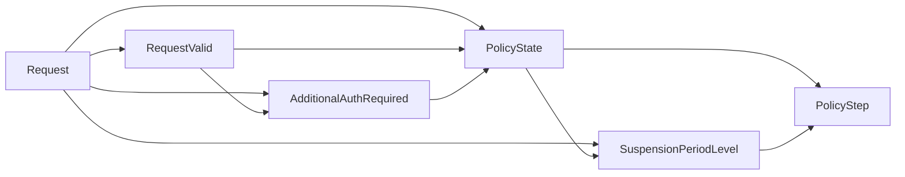
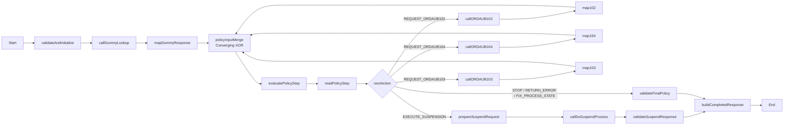

# Case 06 - ONLINE 유선 일시정지 복합 권한

> **목표**
>
> ONLINE 요청만 대상으로 하나의 DMN 모델의 `PolicyStep`을 반복 평가한다. DMN은 다음에
> 필요한 업무 증거 또는 최종 결정을 반환하고, BPMN은 그 semantic action에 따라
> ORDAUB102 → ORDAUB164 → 조건부 ORDAUB103 순서로 호출한다. 최종 `ALLOW`에서만
> `doSuspendProcess` side effect를 실행한다.
>
> **중요한 원문 정합성**
>
> 고객 PDF의 간략 의사코드는 `ORDAUB164 → ORDAUB102`로 읽히지만, 같은 PDF의
> 전체 C 소스는 `ORDAUB102 → ORDAUB164` 순서이며 102 body `ERROR`에서 즉시
> 종료한다. 이 가이드는 실행 근거가 더 구체적인 전체 C 소스를 PoC baseline으로
> 사용한다. 운영 확정 전 고객에게 호출 순서를 확인할 항목은 `TBD`로 남긴다.

[공통 준비와 UI 절차로 돌아가기](README.md)

---

## 1. 고객 규칙

### 1.1 ONLINE 기간 등급

ONLINE이고 더미 서비스가 아니면 원본 C의 순서대로 ORDAUB102 다음 ORDAUB164를
확인한다.

| 결과 | 기간 등급 |
|---|---|
| ORDAUB164 `GRANTED` | `UNLIMITED` - AS-IS `Z` |
| ORDAUB164 `DENIED`, ORDAUB102 `GRANTED` | `EXTENDED` - AS-IS `Y` |
| 두 권한 모두 `DENIED` | `STANDARD` - AS-IS `N` |

ORDAUB164가 상위 권한이므로 둘 다 `GRANTED`면 `UNLIMITED`다.

fail-fast:

1. ORDAUB102 body `ERROR` → `SYSTEM_ERROR`, ORDAUB164 미호출
2. ORDAUB102 `GRANTED`/`DENIED` → ORDAUB164 호출
3. ORDAUB164 body `ERROR` → `SYSTEM_ERROR`
4. 두 결과가 정상 권한 값이면 기간 등급 계산

더미 서비스는 ORDAUB102/164를 호출하지 않고 PoC 기본 등급 `STANDARD`를 사용한다.
이 기본값은 운영 전 고객 확인이 필요하다.

### 1.2 조건부 ORDAUB103

다음 조건을 모두 만족하면 ORDAUB103이 필요하다.

```text
serviceStatusChangeCode = "F1"
AND suspensionReasonCode IN ("01", "08")
AND channelClassCode = "NGM"
AND companyClassCode starts with "B"
AND zx98ProcessYn = "N"
```

| ORDAUB103 | 최종 정책 |
|---|---|
| `GRANTED` | `ALLOW` |
| `DENIED` | `DENY` |
| HTTP 200 body `ERROR` | `SYSTEM_ERROR` |

### 1.3 side effect

최종 `PolicyStep`이 다음을 반환할 때만 일시정지를 실행한다.

```text
decisionState = DECIDED
status = ALLOW
nextAction = EXECUTE_SUSPENSION
```

DMN은 side effect를 실행하지 않는다. BPMN Rest Service Task가
`doSuspendProcess(requestId, periodLevel)`을 호출하고 `requestId`를 멱등성 key로
사용한다.

---

## 2. v2 Process 자체가 ONLINE-only

원문의 BATCH 경로는 `susp_auth[0]`, `susp_auth[1]`의 schema와 의미가 없다. 이
가이드에서는 BATCH를 추측 구현하거나 DMN `INVALID_INPUT`으로 분류하지 않는다.
더 나아가 현재 `Case06WirelineSuspensionProcess` 요청 계약에 `executionMode`를
노출하지 않는다. 이 endpoint를 호출하는 것 자체가 ONLINE 요청이라는 뜻이다.

BATCH 지원 시에는 배열 schema, code mapping과 오류 계약을 받은 뒤 별도
Process/API version으로 설계한다. 현재 DMN Request, BPMN variable, Gateway,
OpenAPI와 E2E scenario 어디에도 BATCH branch를 만들지 않는다.

---

## 3. 정책 상태와 오류 경계

### 3.1 `PolicyStep`

`PolicyState`는 현재 업무 상태를 설명하고, `decisionState`는 Process가 계속 증거를
수집해야 하는지 최종화됐는지를 나타낸다.

| `policyState` 예 | 의미 |
|---|---|
| `NEEDS_ORDAUB102` | 다음 업무 증거는 ORDAUB102 |
| `ORDAUB102_ERROR` | 102 body ERROR로 fail-fast |
| `BASE_READY` | 기본 권한 증거가 모두 준비됨 |
| `INVALID_EVIDENCE` | 호출 상태와 결과 조합이 불가능함 |

| `decisionState` | `status` | 의미 |
|---|---|---|
| `NEEDS_EVIDENCE` | `null` | `nextAction`의 외부 증거가 필요 |
| `DECIDED` | `ALLOW`/`DENY`/`SYSTEM_ERROR`/`INVALID_INPUT` | 최종 정책 결정 |

`NEEDS_EVIDENCE`에 `PENDING` 같은 임시 status를 넣지 않는다.

semantic `nextAction`:

```text
REQUEST_ORDAUB102
REQUEST_ORDAUB164
REQUEST_ORDAUB103
EXECUTE_SUSPENSION
STOP
RETURN_ERROR
FIX_PROCESS_STATE
```

### 3.2 업무 오류와 기술 실패

| 상황 | 처리 | PolicyStep 평가 |
|---|---|---:|
| HTTP 200 body `GRANTED`/`DENIED`/`ERROR` | 내부 enum으로 정규화 | 예 |
| HTTP 4xx/5xx | REST Task 기술 실패. 선택적으로 BPMN Error Boundary에서 envelope 변환 | 아니오 |
| timeout/연결 실패 | BPMN 기술 오류 | 아니오 |
| malformed JSON/unknown enum | mapping fail fast | 아니오 |

기술 실패 응답은 정책 `status`를 사용하지 않는다.

```json
{
  "executionState": "TECHNICAL_FAILURE",
  "failedOperation": "ORDAUB164",
  "errorCode": "ORDAUB164_HTTP_500"
}
```

정상 정책 완료 응답은 별도의 `policyResult`를 가진다.

```json
{
  "executionState": "COMPLETED",
  "policyResult": {
    "policyState": "BASE_READY",
    "decisionState": "DECIDED",
    "status": "ALLOW",
    "nextAction": "EXECUTE_SUSPENSION"
  }
}
```

고객에게는 다음과 같이 설명한다.

> `PolicyState` Decision Table이 현재까지 수집된 증거를 사람이 읽을 수 있는
> 상태로 분류하고, `PolicyStep`이 다음 업무 action을 결정합니다. BPMN은 그
> action에 해당하는 API만 호출하고 다시 같은 정책을 평가합니다. 따라서 호출
> 조건은 DMN 표에서, 실제 실행 순서와 side effect는 BPMN 다이어그램과 journal에서
> 각각 확인할 수 있습니다.

---

## 4. 만들 자산

| 항목 | 값 |
|---|---|
| DMN | `src/main/resources/dmn/Case06WirelineSuspension.dmn` |
| Model | `Case06WirelineSuspension` |
| Namespace | `https://example.com/bamoe/poc/case06/v2` |
| Input Data | `Request` |
| Decision | `RequestValid`, `AdditionalAuthRequired`, `PolicyState`, `SuspensionPeriodLevel`, `PolicyStep` |
| Decision Service facade | `Case06PolicyFacade` |
| SCESIM | `src/test/resources/scesim/Case06WirelineSuspensionTest.scesim` |
| BPMN | `src/main/resources/bpmn/Case06WirelineSuspensionProcess.bpmn` |
| Process ID | `Case06WirelineSuspensionProcess` |
| Mock | `mock-server/case06_mock_server.py` |
| Mock port | `8096` |

---

## 5. UI로 상태가 보이는 정책 DMN 만들기

### 5.1 Model

1. `src/main/resources/dmn/Case06WirelineSuspension.dmn`을 만든다.
2. BAMOE DMN Editor로 연다.
3. 빈 canvas를 선택한다.

| 설정 | 값 |
|---|---|
| Name | `Case06WirelineSuspension` |
| Namespace | `https://example.com/bamoe/poc/case06/v2` |

### 5.2 Data Types

`YesNo`

```feel
"Y", "N"
```

`AuthResult`

```feel
"GRANTED", "DENIED", "ERROR"
```

`CallState`

```feel
"NOT_REQUESTED", "COMPLETED"
```

`PolicyDecisionState`

```feel
"NEEDS_EVIDENCE", "DECIDED"
```

`Case06PolicyState`

```feel
"INVALID_REQUEST", "INVALID_EVIDENCE",
"NEEDS_ORDAUB102", "ORDAUB102_ERROR",
"NEEDS_ORDAUB164", "ORDAUB164_ERROR",
"BASE_READY", "NEEDS_ORDAUB103",
"ORDAUB103_GRANTED", "ORDAUB103_DENIED", "ORDAUB103_ERROR"
```

`DecisionStatus`

```feel
"ALLOW", "DENY", "SYSTEM_ERROR", "INVALID_INPUT"
```

`SuspensionPeriodLevel`

```feel
"STANDARD", "EXTENDED", "UNLIMITED"
```

`NextAction`

```feel
"REQUEST_ORDAUB102", "REQUEST_ORDAUB164", "REQUEST_ORDAUB103",
"EXECUTE_SUSPENSION", "STOP", "RETURN_ERROR", "FIX_PROCESS_STATE"
```

`tCase06DecisionRequest`:

| Field | Type |
|---|---|
| `dummyServiceYn` | `YesNo` |
| `serviceStatusChangeCode` | `string` |
| `suspensionReasonCode` | `string` |
| `channelClassCode` | `string` |
| `companyClassCode` | `string` |
| `zx98ProcessYn` | `YesNo` |
| `ordAub102State` | `CallState` |
| `ordAub102Result` | `AuthResult` |
| `ordAub164State` | `CallState` |
| `ordAub164Result` | `AuthResult` |
| `ordAub103State` | `CallState` |
| `ordAub103Result` | `AuthResult` |

`tCase06PolicyStep`:

| Field | Type |
|---|---|
| `policyState` | `Case06PolicyState` |
| `decisionState` | `PolicyDecisionState` |
| `status` | `DecisionStatus` |
| `nextAction` | `NextAction` |
| `suspensionPeriodLevel` | `SuspensionPeriodLevel` |
| `reasonCode` | `string` |
| `reasonMessage` | `string` |

호출 전 result는 `null`이다. null만으로 호출 여부를 추측하지 않고 각
`CallState`를 함께 사용한다.

### 5.3 DRD

| 종류 | 이름 | Type |
|---|---|---|
| Input Data | `Request` | `tCase06DecisionRequest` |
| Decision | `RequestValid` | `boolean` |
| Decision | `AdditionalAuthRequired` | `boolean` |
| Decision | `PolicyState` | `Case06PolicyState` |
| Decision | `SuspensionPeriodLevel` | `SuspensionPeriodLevel` |
| Decision | `PolicyStep` | `tCase06PolicyStep` |

Information Requirement를 다음과 같이 연결한다.



현재까지 수집된 증거를 같은 모델에 다시 넣지만, 긴 consistency FEEL로 상태를
숨기지 않는다. `PolicyState`의 행이 현재 상태를 명시적으로 이름 붙이고,
`PolicyStep`은 그 상태를 실행 가능한 action으로 번역한다.

### 5.4 `RequestValid` Decision Table

| 설정 | 값 |
|---|---|
| Output data type | `boolean` |
| Hit Policy | `First (F)` |

Input은 다음 여섯 열로 만든다. 모든 field를 `Request.`로 완전히 한정해야 하며,
표시 이름만 보고 비한정 이름을 입력하지 않는다.

| 표시 이름 | Input Expression | Type |
|---|---|---|
| Dummy | `Request.dummyServiceYn` | `YesNo` |
| Status change | `Request.serviceStatusChangeCode` | `string` |
| Reason | `Request.suspensionReasonCode` | `string` |
| Channel | `Request.channelClassCode` | `string` |
| Company | `Request.companyClassCode` | `string` |
| zx98 | `Request.zx98ProcessYn` | `YesNo` |

Output 이름은 `valid`로 둔다. `boolean`은 **Decision node의 Output data
type**과 단일 output column의 Data Type 양쪽에 지정한다.

이 원칙은 이 모델의 단일-output Decision Table인 `RequestValid`,
`AdditionalAuthRequired`, `PolicyState`, `SuspensionPeriodLevel`에 모두 적용한다.
각 Decision node와 단일 output column에 위에서 지정한 같은 output type을
유지한다. 현재 실습에서 검증한 BAMOE `9.5.0-ibm-0005` 저장 형식과 맞추기 위한
기준이다.

| # | Dummy | Status change | Reason | Channel | Company | zx98 | valid |
|---:|---|---|---|---|---|---|---:|
| 1 | `null` | `-` | `-` | `-` | `-` | `-` | `false` |
| 2 | `-` | `null, ""` | `-` | `-` | `-` | `-` | `false` |
| 3 | `-` | `-` | `null, ""` | `-` | `-` | `-` | `false` |
| 4 | `-` | `-` | `-` | `null, ""` | `-` | `-` | `false` |
| 5 | `-` | `-` | `-` | `-` | `null, ""` | `-` | `false` |
| 6 | `-` | `-` | `-` | `-` | `-` | `null` | `false` |
| 7 | `-` | `-` | `-` | `-` | `-` | `-` | `true` |

### 5.5 `AdditionalAuthRequired` Decision Table

| 설정 | 값 |
|---|---|
| Output data type | `boolean` |
| Hit Policy | `First (F)` |

Input:

| 표시 이름 | Input Expression | Type |
|---|---|---|
| Valid | `RequestValid` | `boolean` |
| Status change | `Request.serviceStatusChangeCode` | `string` |
| Reason | `Request.suspensionReasonCode` | `string` |
| Channel | `Request.channelClassCode` | `string` |
| Company B | `Request.companyClassCode != null and starts with(Request.companyClassCode, "B")` | `boolean` |
| zx98 | `Request.zx98ProcessYn` | `YesNo` |

| # | Valid | Status change | Reason | Channel | Company B | zx98 | required |
|---:|---:|---|---|---|---:|---|---:|
| 1 | `false` | `-` | `-` | `-` | `-` | `-` | `false` |
| 2 | `true` | `"F1"` | `"01", "08"` | `"NGM"` | `true` | `"N"` | `true` |
| 3 | `-` | `-` | `-` | `-` | `-` | `-` | `false` |

### 5.6 `PolicyState` Decision Table

`PolicyState` Decision의 output data type은 `Case06PolicyState`, Hit Policy는
`First (F)`다.
Input은 다음 순서로 만든다.

| 표시 이름 | Input Expression | Type |
|---|---|---|
| Valid | `RequestValid` | `boolean` |
| Dummy | `Request.dummyServiceYn` | `YesNo` |
| 102 state | `Request.ordAub102State` | `CallState` |
| 102 result | `Request.ordAub102Result` | `AuthResult` |
| 164 state | `Request.ordAub164State` | `CallState` |
| 164 result | `Request.ordAub164Result` | `AuthResult` |
| Additional | `AdditionalAuthRequired` | `boolean` |
| 103 state | `Request.ordAub103State` | `CallState` |
| 103 result | `Request.ordAub103Result` | `AuthResult` |

`NR`은 `"NOT_REQUESTED"`, `C`는 `"COMPLETED"`, `G/D`는
`"GRANTED", "DENIED"`를 뜻한다.

| # | Valid | Dummy | 102 state | 102 result | 164 state | 164 result | Additional | 103 state | 103 result | PolicyState |
|---:|---:|---|---|---|---|---|---:|---|---|---|
| 1 | `false` | `-` | `-` | `-` | `-` | `-` | `-` | `-` | `-` | `"INVALID_REQUEST"` |
| 2 | `true` | `"Y"` | `NR` | `null` | `NR` | `null` | `false` | `NR` | `null` | `"BASE_READY"` |
| 3 | `true` | `"Y"` | `NR` | `null` | `NR` | `null` | `true` | `NR` | `null` | `"NEEDS_ORDAUB103"` |
| 4 | `true` | `"Y"` | `NR` | `null` | `NR` | `null` | `true` | `C` | `"GRANTED"` | `"ORDAUB103_GRANTED"` |
| 5 | `true` | `"Y"` | `NR` | `null` | `NR` | `null` | `true` | `C` | `"DENIED"` | `"ORDAUB103_DENIED"` |
| 6 | `true` | `"Y"` | `NR` | `null` | `NR` | `null` | `true` | `C` | `"ERROR"` | `"ORDAUB103_ERROR"` |
| 7 | `true` | `"N"` | `NR` | `null` | `NR` | `null` | `-` | `NR` | `null` | `"NEEDS_ORDAUB102"` |
| 8 | `true` | `"N"` | `C` | `"ERROR"` | `NR` | `null` | `-` | `NR` | `null` | `"ORDAUB102_ERROR"` |
| 9 | `true` | `"N"` | `C` | `G/D` | `NR` | `null` | `-` | `NR` | `null` | `"NEEDS_ORDAUB164"` |
| 10 | `true` | `"N"` | `C` | `G/D` | `C` | `"ERROR"` | `-` | `NR` | `null` | `"ORDAUB164_ERROR"` |
| 11 | `true` | `"N"` | `C` | `G/D` | `C` | `G/D` | `false` | `NR` | `null` | `"BASE_READY"` |
| 12 | `true` | `"N"` | `C` | `G/D` | `C` | `G/D` | `true` | `NR` | `null` | `"NEEDS_ORDAUB103"` |
| 13 | `true` | `"N"` | `C` | `G/D` | `C` | `G/D` | `true` | `C` | `"GRANTED"` | `"ORDAUB103_GRANTED"` |
| 14 | `true` | `"N"` | `C` | `G/D` | `C` | `G/D` | `true` | `C` | `"DENIED"` | `"ORDAUB103_DENIED"` |
| 15 | `true` | `"N"` | `C` | `G/D` | `C` | `G/D` | `true` | `C` | `"ERROR"` | `"ORDAUB103_ERROR"` |
| 16 | `-` | `-` | `-` | `-` | `-` | `-` | `-` | `-` | `-` | `"INVALID_EVIDENCE"` |

16행이 `NOT_REQUESTED + non-null result`, `COMPLETED + null result`, 102 ERROR 뒤
164 완료, 불필요한 103 호출 같은 불가능 조합을 한 곳에서 fail closed한다.
긴 `EvidenceConsistent`/`SequenceConsistent` FEEL보다 고객이 표에서 정상 전이와
예외 전이를 직접 검토할 수 있다는 점이 이 구조의 핵심이다.

### 5.7 `SuspensionPeriodLevel` Decision Table

Output data type은 `SuspensionPeriodLevel`, Hit Policy는 `First (F)`다. Input은
`PolicyState`, `Request.dummyServiceYn`, `Request.ordAub102Result`,
`Request.ordAub164Result`다.

| # | PolicyState | Dummy | 102 | 164 | level |
|---:|---|---|---|---|---|
| 1 | `"BASE_READY", "NEEDS_ORDAUB103", "ORDAUB103_GRANTED"` | `"Y"` | `-` | `-` | `"STANDARD"` |
| 2 | `"BASE_READY", "NEEDS_ORDAUB103", "ORDAUB103_GRANTED"` | `"N"` | `-` | `"GRANTED"` | `"UNLIMITED"` |
| 3 | `"BASE_READY", "NEEDS_ORDAUB103", "ORDAUB103_GRANTED"` | `"N"` | `"GRANTED"` | `"DENIED"` | `"EXTENDED"` |
| 4 | `"BASE_READY", "NEEDS_ORDAUB103", "ORDAUB103_GRANTED"` | `"N"` | `"DENIED"` | `"DENIED"` | `"STANDARD"` |
| 5 | `-` | `-` | `-` | `-` | `null` |

### 5.8 `PolicyStep` Decision Table

Output data type은 `tCase06PolicyStep`, Hit Policy는 `Unique (U)`다. Decision
Table Input은 `PolicyState` 한 열이다. `SuspensionPeriodLevel`은 Information
Requirement로 연결하고 필요한 output cell에서 FEEL 이름으로 참조한다. Output은
`policyState`, `decisionState`, `status`, `nextAction`,
`suspensionPeriodLevel`, `reasonCode`, `reasonMessage` 순서다.

| PolicyState input | policyState output | decisionState | status | nextAction | period | reasonCode | reasonMessage |
|---|---|---|---|---|---|---|---|
| `"INVALID_REQUEST"` | `"INVALID_REQUEST"` | `"DECIDED"` | `"INVALID_INPUT"` | `"FIX_PROCESS_STATE"` | `null` | `"REQUIRED_DECISION_INPUT_MISSING"` | `"필수 정책 입력값이 누락되었습니다."` |
| `"INVALID_EVIDENCE"` | `"INVALID_EVIDENCE"` | `"DECIDED"` | `"INVALID_INPUT"` | `"FIX_PROCESS_STATE"` | `null` | `"INVALID_EVIDENCE_SEQUENCE"` | `"외부 증거 상태와 호출 순서 조합이 유효하지 않습니다."` |
| `"NEEDS_ORDAUB102"` | `"NEEDS_ORDAUB102"` | `"NEEDS_EVIDENCE"` | `null` | `"REQUEST_ORDAUB102"` | `null` | `"ORDAUB102_REQUIRED"` | `"ORDAUB102 권한 확인이 필요합니다."` |
| `"ORDAUB102_ERROR"` | `"ORDAUB102_ERROR"` | `"DECIDED"` | `"SYSTEM_ERROR"` | `"RETURN_ERROR"` | `null` | `"ORDAUB102_BODY_ERROR"` | `"ORDAUB102 권한 서비스가 업무 오류를 반환했습니다."` |
| `"NEEDS_ORDAUB164"` | `"NEEDS_ORDAUB164"` | `"NEEDS_EVIDENCE"` | `null` | `"REQUEST_ORDAUB164"` | `null` | `"ORDAUB164_REQUIRED"` | `"ORDAUB164 권한 확인이 필요합니다."` |
| `"ORDAUB164_ERROR"` | `"ORDAUB164_ERROR"` | `"DECIDED"` | `"SYSTEM_ERROR"` | `"RETURN_ERROR"` | `null` | `"ORDAUB164_BODY_ERROR"` | `"ORDAUB164 권한 서비스가 업무 오류를 반환했습니다."` |
| `"BASE_READY"` | `"BASE_READY"` | `"DECIDED"` | `"ALLOW"` | `"EXECUTE_SUSPENSION"` | `SuspensionPeriodLevel` | `"SUSPENSION_AUTHORIZED"` | `"필요한 권한 확인이 완료되어 일시정지가 허용되었습니다."` |
| `"NEEDS_ORDAUB103"` | `"NEEDS_ORDAUB103"` | `"NEEDS_EVIDENCE"` | `null` | `"REQUEST_ORDAUB103"` | `SuspensionPeriodLevel` | `"ORDAUB103_REQUIRED"` | `"추가 조건에 따라 ORDAUB103 권한 확인이 필요합니다."` |
| `"ORDAUB103_GRANTED"` | `"ORDAUB103_GRANTED"` | `"DECIDED"` | `"ALLOW"` | `"EXECUTE_SUSPENSION"` | `SuspensionPeriodLevel` | `"SUSPENSION_AUTHORIZED"` | `"추가 권한이 승인되어 일시정지가 허용되었습니다."` |
| `"ORDAUB103_DENIED"` | `"ORDAUB103_DENIED"` | `"DECIDED"` | `"DENY"` | `"STOP"` | `null` | `"ORDAUB103_DENIED"` | `"ORDAUB103 권한이 거절되어 일시정지를 중단합니다."` |
| `"ORDAUB103_ERROR"` | `"ORDAUB103_ERROR"` | `"DECIDED"` | `"SYSTEM_ERROR"` | `"RETURN_ERROR"` | `null` | `"ORDAUB103_BODY_ERROR"` | `"ORDAUB103 권한 서비스가 업무 오류를 반환했습니다."` |

`PolicyStep`은 업무 상태를 semantic action으로 번역할 뿐 외부 호출을 실행하지
않는다. 특히
`ORDAUB102_ERROR`는 다음 action이 `RETURN_ERROR`이므로 164를 요구하지 않는다.

### 5.9 하나의 Decision Service facade

DMN canvas에서 `Decision Service`를 추가한다.

| 항목 | 값 |
|---|---|
| Name | `Case06PolicyFacade` |
| Output Decisions | `PolicyStep` |
| Encapsulated Decisions | `RequestValid`, `AdditionalAuthRequired`, `PolicyState`, `SuspensionPeriodLevel` |
| Input | `Request`가 자동 노출되는지 확인 |

이 facade는 DMN 외부 소비자에게 `PolicyStep`만 보여 주는 좁은 public component
API다. helper Decision은 `/dmnresult`에서 진단할 수 있지만 public component
응답에는 `PolicyStep`만 노출된다. BPMN Business Rule Task는 이 Decision Service
REST endpoint를 호출하는 것이 아니라 같은 Model을 embedded 평가하고
`PolicyStep` output만 mapping한다.
Decision Service 자체에 별도 Output data type을 강제로 지정하지 않는다. public
output의 type은 Output Decision인 `PolicyStep`의 `tCase06PolicyStep`에서 결정된다.

---

## 6. SCESIM 전이 테스트

### 6.1 만들기

1. `src/test/resources/scesim/Case06WirelineSuspensionTest.scesim`을 만든다.
2. `Reopen Editor With...` →
   `(classic)`이 붙지 않은 **BAMOE Test Scenario Editor**를 선택한다.
3. `DMN`과 `Case06WirelineSuspension.dmn`을 선택한다.
4. Settings를 확인한다.

| Settings | 값 |
|---|---|
| Namespace | `https://example.com/bamoe/poc/case06/v2` |
| Model | `Case06WirelineSuspension` |

GIVEN은 `Request`의 12개 field이고 EXPECT는 다음이다.

- `RequestValid.value`
- `AdditionalAuthRequired.value`
- `PolicyState.value`
- `SuspensionPeriodLevel.value`
- `PolicyStep.policyState`
- `PolicyStep.decisionState`
- `PolicyStep.status`
- `PolicyStep.nextAction`
- `PolicyStep.suspensionPeriodLevel`
- `PolicyStep.reasonCode`
- `PolicyStep.reasonMessage`

처음에는 `PolicyState`와 `PolicyStep` 필드만 필수 EXPECT로 구성해도 된다. helper
Decision까지 EXPECT하면 어떤 조건 때문에 상태가 바뀌었는지를 고객 앞에서 함께
보여 줄 수 있다.

기본 업무 입력 profile:

| profile | status change | reason | channel | company | zx98 | Additional |
|---|---|---|---|---|---|---:|
| `NO_103` | `F1` | `02` | `NGM` | `B01` | `N` | false |
| `NEED_103` | `F1` | `01` | `NGM` | `B01` | `N` | true |

### 6.2 필수 scenario

표의 `NR`은 state `NOT_REQUESTED`와 result `null`을 뜻한다. `C/G`, `C/D`,
`C/E`는 각각 state `COMPLETED`와 result `GRANTED`, `DENIED`, `ERROR`를 뜻하고,
`C/null`은 의도적으로 잘못된 `COMPLETED + null` 조합이다. 실제 SCESIM에서는
state와 result를 각각 별도 GIVEN 열에 입력한다. GIVEN과 EXPECT null은 `null`로
입력한다. `? = null`도 동작하지만 이 가이드는 `null`로 통일한다. 빈 EXPECT
cell은 검증 생략이다.

| ID | Dummy | profile | 102 | 164 | 103 | PolicyState | decisionState | status | nextAction | period | reasonCode |
|---|---|---|---|---|---|---|---|---|---|---|---|
| C06-S01 | N | NO_103 | NR | NR | NR | NEEDS_ORDAUB102 | NEEDS_EVIDENCE | `null` | REQUEST_ORDAUB102 | `null` | ORDAUB102_REQUIRED |
| C06-S02 | N | NO_103 | C/G | NR | NR | NEEDS_ORDAUB164 | NEEDS_EVIDENCE | `null` | REQUEST_ORDAUB164 | `null` | ORDAUB164_REQUIRED |
| C06-S03 | N | NO_103 | C/D | NR | NR | NEEDS_ORDAUB164 | NEEDS_EVIDENCE | `null` | REQUEST_ORDAUB164 | `null` | ORDAUB164_REQUIRED |
| C06-S04 | N | NO_103 | C/E | NR | NR | ORDAUB102_ERROR | DECIDED | SYSTEM_ERROR | RETURN_ERROR | `null` | ORDAUB102_BODY_ERROR |
| C06-S05 | N | NO_103 | C/G | C/D | NR | BASE_READY | DECIDED | ALLOW | EXECUTE_SUSPENSION | EXTENDED | SUSPENSION_AUTHORIZED |
| C06-S06 | N | NO_103 | C/G | C/G | NR | BASE_READY | DECIDED | ALLOW | EXECUTE_SUSPENSION | UNLIMITED | SUSPENSION_AUTHORIZED |
| C06-S07 | N | NO_103 | C/D | C/D | NR | BASE_READY | DECIDED | ALLOW | EXECUTE_SUSPENSION | STANDARD | SUSPENSION_AUTHORIZED |
| C06-S08 | N | NEED_103 | C/G | C/D | NR | NEEDS_ORDAUB103 | NEEDS_EVIDENCE | `null` | REQUEST_ORDAUB103 | EXTENDED | ORDAUB103_REQUIRED |
| C06-S09 | N | NEED_103 | C/G | C/D | C/G | ORDAUB103_GRANTED | DECIDED | ALLOW | EXECUTE_SUSPENSION | EXTENDED | SUSPENSION_AUTHORIZED |
| C06-S10 | N | NEED_103 | C/G | C/D | C/D | ORDAUB103_DENIED | DECIDED | DENY | STOP | `null` | ORDAUB103_DENIED |
| C06-S11 | N | NEED_103 | C/G | C/D | C/E | ORDAUB103_ERROR | DECIDED | SYSTEM_ERROR | RETURN_ERROR | `null` | ORDAUB103_BODY_ERROR |
| C06-S12 | Y | NO_103 | NR | NR | NR | BASE_READY | DECIDED | ALLOW | EXECUTE_SUSPENSION | STANDARD | SUSPENSION_AUTHORIZED |
| C06-S13 | Y | NEED_103 | NR | NR | NR | NEEDS_ORDAUB103 | NEEDS_EVIDENCE | `null` | REQUEST_ORDAUB103 | STANDARD | ORDAUB103_REQUIRED |
| C06-S14 | N | NO_103 | C/E | C/G | NR | INVALID_EVIDENCE | DECIDED | INVALID_INPUT | FIX_PROCESS_STATE | `null` | INVALID_EVIDENCE_SEQUENCE |
| C06-S15 | N | NO_103 | C/null | NR | NR | INVALID_EVIDENCE | DECIDED | INVALID_INPUT | FIX_PROCESS_STATE | `null` | INVALID_EVIDENCE_SEQUENCE |
| C06-S16 | N | companyClassCode=null | NR | NR | NR | INVALID_REQUEST | DECIDED | INVALID_INPUT | FIX_PROCESS_STATE | `null` | REQUIRED_DECISION_INPUT_MISSING |
| C06-S17 | N | NO_103 | C/D | C/G | NR | BASE_READY | DECIDED | ALLOW | EXECUTE_SUSPENSION | UNLIMITED | SUSPENSION_AUTHORIZED |
| C06-S18 | N | NO_103 | C/G | C/E | NR | ORDAUB164_ERROR | DECIDED | SYSTEM_ERROR | RETURN_ERROR | `null` | ORDAUB164_BODY_ERROR |

`C06-S16`의 profile 표기는 새 profile 이름이 아니다. `NO_103` 행의
status/reason/channel/zx98 값을 먼저 복사하고 `companyClassCode` GIVEN만
`null`로 덮어쓴다. 나머지 auth state/result는 표의 `NR` 그대로 입력한다.

`PolicyStep.reasonMessage`도 빈칸 없이 18개 행 모두 필수 EXPECT로 입력한다. 빈
EXPECT cell은 null 검증이 아니라 해당 검증을 생략하므로 하나라도 비워 두면 안
된다. 아래 `reasonCode`와 `reasonMessage`는 실제 SCESIM cell에 큰따옴표까지
포함한 FEEL string으로 입력한다.

| ID | reasonCode | reasonMessage |
|---|---|---|
| C06-S01 | `"ORDAUB102_REQUIRED"` | `"ORDAUB102 권한 확인이 필요합니다."` |
| C06-S02 | `"ORDAUB164_REQUIRED"` | `"ORDAUB164 권한 확인이 필요합니다."` |
| C06-S03 | `"ORDAUB164_REQUIRED"` | `"ORDAUB164 권한 확인이 필요합니다."` |
| C06-S04 | `"ORDAUB102_BODY_ERROR"` | `"ORDAUB102 권한 서비스가 업무 오류를 반환했습니다."` |
| C06-S05 | `"SUSPENSION_AUTHORIZED"` | `"필요한 권한 확인이 완료되어 일시정지가 허용되었습니다."` |
| C06-S06 | `"SUSPENSION_AUTHORIZED"` | `"필요한 권한 확인이 완료되어 일시정지가 허용되었습니다."` |
| C06-S07 | `"SUSPENSION_AUTHORIZED"` | `"필요한 권한 확인이 완료되어 일시정지가 허용되었습니다."` |
| C06-S08 | `"ORDAUB103_REQUIRED"` | `"추가 조건에 따라 ORDAUB103 권한 확인이 필요합니다."` |
| C06-S09 | `"SUSPENSION_AUTHORIZED"` | `"추가 권한이 승인되어 일시정지가 허용되었습니다."` |
| C06-S10 | `"ORDAUB103_DENIED"` | `"ORDAUB103 권한이 거절되어 일시정지를 중단합니다."` |
| C06-S11 | `"ORDAUB103_BODY_ERROR"` | `"ORDAUB103 권한 서비스가 업무 오류를 반환했습니다."` |
| C06-S12 | `"SUSPENSION_AUTHORIZED"` | `"필요한 권한 확인이 완료되어 일시정지가 허용되었습니다."` |
| C06-S13 | `"ORDAUB103_REQUIRED"` | `"추가 조건에 따라 ORDAUB103 권한 확인이 필요합니다."` |
| C06-S14 | `"INVALID_EVIDENCE_SEQUENCE"` | `"외부 증거 상태와 호출 순서 조합이 유효하지 않습니다."` |
| C06-S15 | `"INVALID_EVIDENCE_SEQUENCE"` | `"외부 증거 상태와 호출 순서 조합이 유효하지 않습니다."` |
| C06-S16 | `"REQUIRED_DECISION_INPUT_MISSING"` | `"필수 정책 입력값이 누락되었습니다."` |
| C06-S17 | `"SUSPENSION_AUTHORIZED"` | `"필요한 권한 확인이 완료되어 일시정지가 허용되었습니다."` |
| C06-S18 | `"ORDAUB164_BODY_ERROR"` | `"ORDAUB164 권한 서비스가 업무 오류를 반환했습니다."` |

S04와 S14의 차이가 중요하다.

- S04: 102 ERROR 뒤 164 미호출인 정상 fail-fast 상태
- S14: 102 ERROR 뒤 164가 이미 호출된 불가능 상태

```bash
cd "/Users/jihunkeom/Desktop/projects/2026/SKT/skt_bamoe_party/prelim/test"

READY=true
for file in \
  src/main/resources/dmn/Case06WirelineSuspension.dmn \
  src/test/resources/scesim/Case06WirelineSuspensionTest.scesim \
  src/test/java/testscenario/TestScenarioJunitActivatorTest.java
do
  if test -s "$file"; then
    echo "[OK] $file"
  else
    echo "[MISSING/EMPTY] $file"
    READY=false
  fi
done

if ! rg -q '@TestScenarioActivator' \
  src/test/java/testscenario/TestScenarioJunitActivatorTest.java 2>/dev/null
then
  echo "[INVALID] @TestScenarioActivator가 없습니다."
  READY=false
fi

if test "$READY" = true; then
  mvn -s config/settings-bamoe-container.xml clean verify
else
  echo "STOP: 자산을 UI에서 저장한 뒤 다시 실행하세요."
fi
```

Activator는 project 전체에서 하나만 재사용한다. 파일이나 annotation이 없으면
[Case 00 §8.5](case-00-environment-setup.md#85-병합-결과-확인)의 공통 Activator
생성 절차를 먼저 수행한다. `clean verify`의
`BUILD SUCCESS`와 SCESIM 실행 건수를 함께 확인한다.

---

## 7. DMN component endpoint 검증

### 7.1 server와 실제 path

Terminal B:

```bash
cd "/Users/jihunkeom/Desktop/projects/2026/SKT/skt_bamoe_party/prelim/test"
mvn -s config/settings-bamoe-container.xml clean verify
```

`BUILD SUCCESS`를 확인한 뒤 같은 Terminal B에서 server를 실행한다.

```bash
mvn -s config/settings-bamoe-container.xml spring-boot:run
```

Terminal C:

```bash
APP_READY=0
APP_READY_ATTEMPT=1

while [ "$APP_READY_ATTEMPT" -le 30 ]
do
  if curl -fsS \
      'http://127.0.0.1:8080/actuator/health' \
      2>/dev/null \
    | jq -e '.status == "UP"' >/dev/null
  then
    APP_READY=1
    break
  fi
  sleep 1
  APP_READY_ATTEMPT=$((APP_READY_ATTEMPT + 1))
done

if [ "$APP_READY" -eq 1 ]; then
  printf 'APP_READINESS_GATE=PASS\n'
else
  printf 'APP_READINESS_GATE=FAIL: BAMOE Terminal 로그를 확인하세요.\n' >&2
  false
fi
```

`PASS`일 때만 OpenAPI를 조회한다.

```bash
curl --fail-with-body -sS \
  'http://127.0.0.1:8080/v3/api-docs' \
  | jq -r \
    '.paths | keys[] | select(contains("Case06WirelineSuspension"))'
```

일반적으로 다음 네 종류가 보이지만 실제 출력이 우선이다.

| endpoint 종류 | 용도 |
|---|---|
| `/Case06WirelineSuspension` | 전체 model context 진단 |
| `/Case06WirelineSuspension/dmnresult` | 전체 model message/evaluation status |
| `/Case06WirelineSuspension/Case06PolicyFacade` | `PolicyStep` public component |
| `/Case06WirelineSuspension/Case06PolicyFacade/dmnresult` | facade 범위 상세 진단 |

```bash
DMN_URL='http://127.0.0.1:8080/Case06WirelineSuspension/Case06PolicyFacade'
DMN_DIAG_URL="${DMN_URL}/dmnresult"
set -o pipefail
```

### 7.2 대표 전이 curl

초기 ONLINE 비더미:

```bash
curl --fail-with-body -sS -X POST "$DMN_URL" \
  -H 'Content-Type: application/json' \
  -d '{
    "Request": {
      "dummyServiceYn": "N",
      "serviceStatusChangeCode": "F1",
      "suspensionReasonCode": "02",
      "channelClassCode": "NGM",
      "companyClassCode": "B01",
      "zx98ProcessYn": "N",
      "ordAub102State": "NOT_REQUESTED",
      "ordAub102Result": null,
      "ordAub164State": "NOT_REQUESTED",
      "ordAub164Result": null,
      "ordAub103State": "NOT_REQUESTED",
      "ordAub103Result": null
    }
  }' | jq
```

기대: `policyState=NEEDS_ORDAUB102`, `decisionState=NEEDS_EVIDENCE`,
status null, `nextAction=REQUEST_ORDAUB102`.

102 body ERROR 후:

```bash
curl --fail-with-body -sS -X POST "$DMN_URL" \
  -H 'Content-Type: application/json' \
  -d '{
    "Request": {
      "dummyServiceYn": "N",
      "serviceStatusChangeCode": "F1",
      "suspensionReasonCode": "02",
      "channelClassCode": "NGM",
      "companyClassCode": "B01",
      "zx98ProcessYn": "N",
      "ordAub102State": "COMPLETED",
      "ordAub102Result": "ERROR",
      "ordAub164State": "NOT_REQUESTED",
      "ordAub164Result": null,
      "ordAub103State": "NOT_REQUESTED",
      "ordAub103Result": null
    }
  }' | jq
```

기대: `policyState=ORDAUB102_ERROR`, `DECIDED`, `SYSTEM_ERROR`,
`RETURN_ERROR`.

103 승인 후 최종:

```bash
curl --fail-with-body -sS -X POST "$DMN_URL" \
  -H 'Content-Type: application/json' \
  -d '{
    "Request": {
      "dummyServiceYn": "N",
      "serviceStatusChangeCode": "F1",
      "suspensionReasonCode": "01",
      "channelClassCode": "NGM",
      "companyClassCode": "B01",
      "zx98ProcessYn": "N",
      "ordAub102State": "COMPLETED",
      "ordAub102Result": "GRANTED",
      "ordAub164State": "COMPLETED",
      "ordAub164Result": "DENIED",
      "ordAub103State": "COMPLETED",
      "ordAub103Result": "GRANTED"
    }
  }' | jq
```

기대: `policyState=ORDAUB103_GRANTED`, `DECIDED`, `ALLOW`,
`EXECUTE_SUSPENSION`, `EXTENDED`.

같은 payload를 `$DMN_DIAG_URL`에 보내 `messages`와 `decisionResults`의
`evaluationStatus`를 확인한다. component 검증이 끝나면 Terminal B의 server를
`Ctrl+C`로 종료한다. BPMN E2E 때 다시 시작한다.

---

## 8. 호출 journal과 멱등성 Mock

### 8.1 시나리오

| scenario | Dummy | 102 | 164 | 103 | suspend |
|---|---|---|---|---|---|
| `DUMMY_ALLOW` | Y | 금지 | 금지 | 금지 | 성공 |
| `STANDARD_ALLOW` | N | D | D | 금지 | 성공 |
| `EXTENDED_ALLOW` | N | G | D | 금지 | 성공 |
| `UNLIMITED_ALLOW` | N | G | G | 금지 | 성공 |
| `ORDAUB102_BODY_ERROR` | N | E | 금지 | 금지 | 금지 |
| `ORDAUB164_BODY_ERROR` | N | G | E | 금지 | 금지 |
| `ADDITIONAL_GRANTED` | N | G | D | G | 성공 |
| `ADDITIONAL_DENIED` | N | G | D | D | 금지 |
| `ADDITIONAL_BODY_ERROR` | N | G | D | E | 금지 |
| `DUMMY_HTTP_500` | HTTP 500 | 금지 | 금지 | 금지 | 금지 |
| `ORDAUB102_HTTP_500` | N | HTTP 500 | 금지 | 금지 | 금지 |
| `ORDAUB164_HTTP_500` | N | G | HTTP 500 | 금지 | 금지 |
| `ORDAUB103_HTTP_500` | N | G | D | HTTP 500 | 금지 |
| `SUSPEND_HTTP_500` | N | G | D | 금지 | HTTP 500 |

### 8.2 UI로 Mock 파일 만들기

`mock-server/case06_mock_server.py`:

```python
#!/usr/bin/env python3
import json
from http.server import BaseHTTPRequestHandler, ThreadingHTTPServer
from urllib.parse import unquote, urlparse


SCENARIOS = {
    "DUMMY_ALLOW": ("Y", None, None, None, "OK"),
    "STANDARD_ALLOW": ("N", "DENIED", "DENIED", None, "OK"),
    "EXTENDED_ALLOW": ("N", "GRANTED", "DENIED", None, "OK"),
    "UNLIMITED_ALLOW": ("N", "GRANTED", "GRANTED", None, "OK"),
    "ORDAUB102_BODY_ERROR": ("N", "ERROR", None, None, None),
    "ORDAUB164_BODY_ERROR": ("N", "GRANTED", "ERROR", None, None),
    "ADDITIONAL_GRANTED": ("N", "GRANTED", "DENIED", "GRANTED", "OK"),
    "ADDITIONAL_DENIED": ("N", "GRANTED", "DENIED", "DENIED", None),
    "ADDITIONAL_BODY_ERROR": ("N", "GRANTED", "DENIED", "ERROR", None),
    "DUMMY_HTTP_500": ("HTTP_500", None, None, None, None),
    "ORDAUB102_HTTP_500": ("N", "HTTP_500", None, None, None),
    "ORDAUB164_HTTP_500": ("N", "GRANTED", "HTTP_500", None, None),
    "ORDAUB103_HTTP_500": ("N", "GRANTED", "DENIED", "HTTP_500", None),
    "SUSPEND_HTTP_500": ("N", "GRANTED", "DENIED", None, "HTTP_500"),
}
AUTH_PATHS = {
    "/mock/auth/ordaub102": ("ORDAUB102", 1),
    "/mock/auth/ordaub164": ("ORDAUB164", 2),
    "/mock/auth/ordaub103": ("ORDAUB103", 3),
}
CALLS = {}
EFFECTS = {}
SUSPEND_PAYLOADS = {}


class Handler(BaseHTTPRequestHandler):
    def send_json(self, status, payload):
        body = json.dumps(payload, ensure_ascii=False).encode("utf-8")
        self.send_response(status)
        self.send_header("Content-Type", "application/json; charset=utf-8")
        self.send_header("Content-Length", str(len(body)))
        self.end_headers()
        self.wfile.write(body)

    def read_json(self):
        size = int(self.headers.get("Content-Length", "0"))
        return json.loads(self.rfile.read(size).decode("utf-8"))

    def do_GET(self):
        path = urlparse(self.path).path
        if path == "/health":
            self.send_json(200, {"status": "UP"})
            return
        prefix = "/mock/calls/"
        if path.startswith(prefix):
            request_id = unquote(path[len(prefix):])
            self.send_json(
                200,
                {
                    "requestId": request_id,
                    "calls": CALLS.get(request_id, []),
                    "effects": EFFECTS.get(request_id, []),
                },
            )
            return
        self.send_json(404, {"error": "NOT_FOUND", "path": path})

    def do_DELETE(self):
        path = urlparse(self.path).path
        prefix = "/mock/calls/"
        if path.startswith(prefix):
            request_id = unquote(path[len(prefix):])
            CALLS.pop(request_id, None)
            EFFECTS.pop(request_id, None)
            SUSPEND_PAYLOADS.pop(request_id, None)
            self.send_json(
                200,
                {"requestId": request_id, "calls": [], "effects": []},
            )
            return
        self.send_json(404, {"error": "NOT_FOUND", "path": path})

    def do_POST(self):
        path = urlparse(self.path).path
        try:
            request = self.read_json()
        except (ValueError, UnicodeDecodeError):
            self.send_json(400, {"error": "INVALID_JSON"})
            return

        request_id = request.get("requestId")
        scenario_name = request.get("mockScenario", "STANDARD_ALLOW")
        if not request_id or scenario_name not in SCENARIOS:
            self.send_json(400, {"error": "INVALID_REQUEST"})
            return
        scenario = SCENARIOS[scenario_name]

        if path == "/mock/service/dummy":
            CALLS.setdefault(request_id, []).append("DUMMY_LOOKUP")
            if scenario[0] == "HTTP_500":
                self.send_json(500, {"error": "DUMMY_PROVIDER_FAILURE"})
                return
            self.send_json(200, {"dummyServiceYn": scenario[0]})
            return

        auth = AUTH_PATHS.get(path)
        if auth is not None:
            authority, index = auth
            CALLS.setdefault(request_id, []).append(authority)
            result = scenario[index]
            if result is None:
                self.send_json(
                    409,
                    {"error": "UNEXPECTED_AUTH_CALL", "authority": authority},
                )
                return
            if result == "HTTP_500":
                self.send_json(
                    500,
                    {"error": "AUTH_PROVIDER_FAILURE", "authority": authority},
                )
                return
            self.send_json(200, {"authority": authority, "result": result})
            return

        if path == "/mock/suspension/execute":
            CALLS.setdefault(request_id, []).append("SUSPEND")
            if scenario[4] == "HTTP_500":
                self.send_json(500, {"error": "SUSPEND_PROVIDER_FAILURE"})
                return
            if scenario[4] is None:
                self.send_json(409, {"error": "UNEXPECTED_SUSPEND_CALL"})
                return

            canonical = {
                "requestId": request_id,
                "serviceManagementNumber":
                    request.get("serviceManagementNumber"),
                "suspensionPeriodLevel":
                    request.get("suspensionPeriodLevel"),
            }
            previous = SUSPEND_PAYLOADS.get(request_id)
            if previous is not None and previous != canonical:
                self.send_json(409, {"error": "IDEMPOTENCY_CONFLICT"})
                return
            if previous is not None:
                self.send_json(
                    200,
                    {"status": "ALREADY_EXECUTED", "duplicate": True},
                )
                return

            SUSPEND_PAYLOADS[request_id] = canonical
            EFFECTS.setdefault(request_id, []).append("SUSPEND")
            self.send_json(
                200,
                {"status": "EXECUTED", "duplicate": False},
            )
            return

        self.send_json(404, {"error": "NOT_FOUND", "path": path})

    def log_message(self, format_string, *args):
        print(
            "%s - %s"
            % (self.log_date_time_string(), format_string % args),
            flush=True,
        )


if __name__ == "__main__":
    server = ThreadingHTTPServer(("0.0.0.0", 8096), Handler)
    print("Case06 mock listening on http://0.0.0.0:8096", flush=True)
    try:
        server.serve_forever()
    except KeyboardInterrupt:
        pass
    finally:
        server.server_close()
```

Terminal A:

```bash
cd "/Users/jihunkeom/Desktop/projects/2026/SKT/skt_bamoe_party/prelim/test"
python3 -m py_compile mock-server/case06_mock_server.py
python3 mock-server/case06_mock_server.py
```

Terminal C:

```bash
curl --fail-with-body -sS 'http://127.0.0.1:8096/health' | jq
```

---

## 9. UI로 ONLINE-only BPMN 만들기

### 9.1 Process Properties

`src/main/resources/bpmn/Case06WirelineSuspensionProcess.bpmn`을 만들고 설정한다.

| Property | 값 |
|---|---|
| Name | `Case06 Wireline Suspension Process` |
| ID | `Case06WirelineSuspensionProcess` |
| Package | `org.acme.case06` |
| Process Type | `Public` |
| Executable | `true` |
| Target Namespace | `https://example.com/bamoe/poc/case06/process/v2` |

### 9.2 Process Variables와 Tags

| Name | Type | Tags | 의미 |
|---|---|---|---|
| `requestId` | `String` | `input,required,readonly` | tracing/idempotency key |
| `serviceManagementNumber` | `String` | `input,required,readonly` | 첫 Dummy 조회에 필요한 업무 대상 |
| `serviceStatusChangeCode` | `String` | `input,readonly` | 업무 원본 |
| `suspensionReasonCode` | `String` | `input,readonly` | 업무 원본 |
| `channelClassCode` | `String` | `input,readonly` | 업무 원본 |
| `companyClassCode` | `String` | `input,readonly` | 업무 원본 |
| `zx98ProcessYn` | `String` | `input,readonly` | 업무 원본 |
| `mockScenario` | `String` | `input` | PoC fixture; process가 기본값을 채움 |
| `adapterRequest` | `java.util.Map` | `internal` | REST body alias |
| `dummyResponse` | `java.util.Map` | `internal` | raw response |
| `authResponse` | `java.util.Map` | `internal` | 현재 auth raw response |
| `dummyServiceYn` | `String` | `internal` | 정규화 값 |
| `ordAub102State` | `String` | `internal` | evidence state |
| `ordAub102Result` | `String` | `internal` | auth result |
| `ordAub164State` | `String` | `internal` | evidence state |
| `ordAub164Result` | `String` | `internal` | auth result |
| `ordAub103State` | `String` | `internal` | evidence state |
| `ordAub103Result` | `String` | `internal` | auth result |
| `decisionRequest` | `java.util.Map` | `internal` | DMN input |
| `policyStep` | `java.util.Map` | `internal` | DMN output |
| `policyState` | `String` | `internal` | 설명 가능한 DMN 업무 상태 |
| `decisionState` | `String` | `internal` | `NEEDS_EVIDENCE`/`DECIDED` |
| `decisionStatus` | `String` | `internal` | terminal policy status |
| `nextAction` | `String` | `internal` | semantic action |
| `periodLevel` | `String` | `internal` | suspension period |
| `reasonCode` | `String` | `internal` | policy reason |
| `reasonMessage` | `String` | `internal` | policy message |
| `policyIteration` | `Integer` | `internal` | loop guard |
| `suspendRequest` | `java.util.Map` | `internal` | side-effect body alias |
| `suspendResponse` | `java.util.Map` | `internal` | side-effect raw response |
| `failureOperation` | `String` | `internal` | technical failure |
| `processResponse` | `java.util.Map` | `output` | public envelope |

첫 외부 호출에 반드시 필요한 `requestId`와 `serviceManagementNumber`만
`input,required,readonly`다. 나머지 caller 업무 원본은 `input,readonly`이고,
process가 기본값을 채우는 `mockScenario`는 `input`이다. 조건부 field까지 schema
`required`로 남발하지 않는다. 내부 evidence와 DMN context는 모두 `internal`이다.

### 9.3 최종 topology



같은 Business Rule Task node를 loop로 다시 방문한다. 최대 경로:

```text
dummy lookup → PolicyStep
→ 102 → PolicyStep
→ 164 → PolicyStep
→ optional 103 → PolicyStep
→ suspend
```

### 9.4 초기화

`validateAndInitialize` Java Script:

```java
String[] requiredNames = {
    "requestId",
    "serviceManagementNumber"
};
for (String name : requiredNames) {
    Object value = kcontext.getVariable(name);
    if (value == null || value.toString().isBlank()) {
        throw new IllegalArgumentException(
            "Process input is required: " + name);
    }
}

String scenario = (String) kcontext.getVariable("mockScenario");
if (scenario == null || scenario.isBlank()) {
    scenario = "STANDARD_ALLOW";
    kcontext.setVariable("mockScenario", scenario);
}

java.util.Map adapter = new java.util.LinkedHashMap();
adapter.put("requestId", kcontext.getVariable("requestId"));
adapter.put(
    "serviceManagementNumber",
    kcontext.getVariable("serviceManagementNumber"));
adapter.put("mockScenario", scenario);
kcontext.setVariable("adapterRequest", adapter);

java.util.Map request = new java.util.LinkedHashMap();
request.put("dummyServiceYn", null);
request.put(
    "serviceStatusChangeCode",
    kcontext.getVariable("serviceStatusChangeCode"));
request.put(
    "suspensionReasonCode",
    kcontext.getVariable("suspensionReasonCode"));
request.put(
    "channelClassCode",
    kcontext.getVariable("channelClassCode"));
request.put(
    "companyClassCode",
    kcontext.getVariable("companyClassCode"));
request.put(
    "zx98ProcessYn",
    kcontext.getVariable("zx98ProcessYn"));
request.put("ordAub102State", "NOT_REQUESTED");
request.put("ordAub102Result", null);
request.put("ordAub164State", "NOT_REQUESTED");
request.put("ordAub164Result", null);
request.put("ordAub103State", "NOT_REQUESTED");
request.put("ordAub103Result", null);
kcontext.setVariable("decisionRequest", request);
kcontext.setVariable("ordAub102State", "NOT_REQUESTED");
kcontext.setVariable("ordAub102Result", null);
kcontext.setVariable("ordAub164State", "NOT_REQUESTED");
kcontext.setVariable("ordAub164Result", null);
kcontext.setVariable("ordAub103State", "NOT_REQUESTED");
kcontext.setVariable("ordAub103Result", null);
kcontext.setVariable("policyIteration", 0);
kcontext.setVariable("processResponse", null);
```

`serviceStatusChangeCode`, reason/channel/company/zx98는 null이어도 이 Script에서
먼저 예외 처리하지 않는다. 그대로 `decisionRequest`에 넣어 `PolicyStep`의
`REQUIRED_DECISION_INPUT_MISSING` rule이 설명하게 한다.

### 9.5 REST body: 일반 alias와 전용 `Content Data`

Dummy와 auth Rest Service Task의 공통 설정:

| UI field | 값 |
|---|---|
| Method | `POST` |
| Request Timeout | `2000` |
| Access Token Acquisition Strategy | `none` |
| Header 1 | `Accept = application/json` |

각 Task에서:

| UI 위치 | Name | Data Type | Source/Target 종류 | 선택 변수 또는 값 |
|---|---|---|---|---|
| `Data Mapping` Input | `adapterRequest` | `java.util.Map` | `Var` | `adapterRequest` |
| REST 전용 Properties | `Content Data` | editor 관리 | 해당 없음 | ` #{adapterRequest}` |
| `Data Mapping` Output | `Result` | `java.util.Map` | `Var` | 아래 표의 response 변수 |

`Var/adapterRequest`는 Data Type 이름이 아니다. UI의 Source 종류에서 `Var`를 고른
뒤 옆 변수 선택란에서 `adapterRequest`를 선택한 상태를 줄여 쓴 표현이다. Data
Type은 `java.util.Map`으로 유지한다. Output도 Target 종류 `Var`를 고른 다음 아래
Target Process Variable을 선택한다.

`ContentData`는 REST handler의 예약 내부 이름이다. 일반 `Add Input data mapping`에는
alias `adapterRequest`를 만들고, 별도 REST `Content Data` 속성에
Space 키를 한 번 누른 뒤 `#{adapterRequest}`를 입력한다. 실제 값은
` #{adapterRequest}`다. `ContentData`를 Name으로 직접 입력할 때 마지막
`a`에서 행이 사라지는 것은 글자 수 제한이 아니다.

`Headers`에는 `Accept = application/json` 한 행만 둔다. 이 Lab의 BAMOE
`9.5.0-ibm-0005` Spring codegen에서는 `Content-Type` 행이 내부
`HEADER_Content-Type`으로 생성되면서 하이픈 때문에 compile을 깨뜨릴 수 있다.
Map body는 REST handler가 JSON으로 직렬화하며 wire Content-Type을 자동
설정한다. 정상 runtime 로그는 `ContentData={...}`다.

Task URL/Target:

| Task | URL | Target |
|---|---|---|
| `callDummyLookup` | `http://customer-rule-mock:8096/mock/service/dummy` | `dummyResponse` |
| `callORDAUB102` | `http://customer-rule-mock:8096/mock/auth/ordaub102` | `authResponse` |
| `callORDAUB164` | `http://customer-rule-mock:8096/mock/auth/ordaub164` | `authResponse` |
| `callORDAUB103` | `http://customer-rule-mock:8096/mock/auth/ordaub103` | `authResponse` |

각 auth 호출은 순차 loop 안에 있으므로 공통 `authResponse`를 안전하게 덮어쓴다.

### 9.6 Dummy mapping

```java
java.util.Map response =
    (java.util.Map) kcontext.getVariable("dummyResponse");
Object raw = response == null ? null : response.get("dummyServiceYn");
String value = raw == null ? null : raw.toString();
if (value == null
        || !java.util.List.of("Y", "N").contains(value)) {
    throw new IllegalStateException(
        "Invalid dummy response: " + response);
}
java.util.Map request =
    (java.util.Map) kcontext.getVariable("decisionRequest");
request.put("dummyServiceYn", value);
kcontext.setVariable("dummyServiceYn", value);
kcontext.setVariable("decisionRequest", request);
```

### 9.7 auth mapping

각 mapping Script에서 authority 관련 세 문자열만 바꾼다.

| Script | authority | state field | result field |
|---|---|---|---|
| `map102` | `ORDAUB102` | `ordAub102State` | `ordAub102Result` |
| `map164` | `ORDAUB164` | `ordAub164State` | `ordAub164Result` |
| `map103` | `ORDAUB103` | `ordAub103State` | `ordAub103Result` |

`map102` 전체:

```java
java.util.Map response =
    (java.util.Map) kcontext.getVariable("authResponse");
Object rawAuthority =
    response == null ? null : response.get("authority");
Object rawResult =
    response == null ? null : response.get("result");
String authority =
    rawAuthority == null ? null : rawAuthority.toString();
String value =
    rawResult == null ? null : rawResult.toString();
if (value == null
        || !"ORDAUB102".equals(authority)
        || !java.util.List.of(
            "GRANTED", "DENIED", "ERROR").contains(value)) {
    throw new IllegalStateException(
        "Invalid ORDAUB102 response: " + response);
}
java.util.Map request =
    (java.util.Map) kcontext.getVariable("decisionRequest");
request.put("ordAub102State", "COMPLETED");
request.put("ordAub102Result", value);
kcontext.setVariable("ordAub102State", "COMPLETED");
kcontext.setVariable("ordAub102Result", value);
kcontext.setVariable("decisionRequest", request);
```

`map164`, `map103`은 authority와 field 이름을 표대로 바꾼다. body `ERROR`도
`COMPLETED` evidence이며, mapping 후 PolicyStep으로 돌아간다.

### 9.8 반복 Business Rule Task

`mapDummyResponse`, `map102`, `map164`, `map103` 네 대안 flow를
`evaluatePolicyStep`에 직접 여러 개 연결하지 않는다. Converging Exclusive
Gateway 하나에 합치고 Name을 `policyInputMerge`로 지정한 뒤 Business Rule
Task로 나가는 sequence flow는 하나만 둔다. 이 노드는 네 경로를 모두 기다리는
Parallel Join이 아니라, 이번 반복에서 도착한 한 경로를 합치는 merge다.

`evaluatePolicyStep`:

1. variant를 `Business Rule Task`로 지정한다.
2. Implementation을 `DMN`으로 설정한다.
3. `Autofill...`에서 `../dmn/Case06WirelineSuspension.dmn`을 선택한다.

| DMN field | 값 |
|---|---|
| Relative path | `../dmn/Case06WirelineSuspension.dmn` |
| Namespace | `https://example.com/bamoe/poc/case06/v2` |
| Model | `Case06WirelineSuspension` |

Data Mapping:

| UI 위치 | DMN Name | Data Type | Source/Target 종류 | 선택할 Process Variable |
|---|---|---|---|---|
| `Data Mapping` → Inputs | `Request` | `java.util.Map` | Source 종류 `Var` | `decisionRequest` |
| `Data Mapping` → Outputs | `PolicyStep` | `java.util.Map` | Target 종류 `Var` | `policyStep` |

여기서 `Request`와 `PolicyStep`은 DMN에 정의된 이름이고,
`decisionRequest`와 `policyStep`은 BPMN Process Variable이다. Data Type
dropdown에서 `Var/decisionRequest` 같은 항목을 찾지 않는다.

BPMN Task는 5.9의 component API를 호출하는 것이 아니다. 같은 application의 DMN
Model을 embedded 평가하고 `PolicyStep`만 process variable로 mapping한다.

저장 후 merge 이름·종류·연결 수를 exact 검사한다. 이 Gate는
`policyInputMerge` Converging XOR 네 입력이 하나의 Business Rule Task로
합쳐졌는지 확인한다.

```bash
BPMN_FILE='src/main/resources/bpmn/Case06WirelineSuspensionProcess.bpmn'

python3 - "$BPMN_FILE" 4 evaluatePolicyStep <<'PY'
import sys
import xml.etree.ElementTree as ET

path, expected_incoming, task_name = sys.argv[1], int(sys.argv[2]), sys.argv[3]
root = ET.parse(path).getroot()
local = lambda tag: tag.rsplit("}", 1)[-1]

merges = [
    node for node in root.iter()
    if local(node.tag) == "exclusiveGateway"
    and node.get("name") == "policyInputMerge"
]
tasks = [
    node for node in root.iter()
    if local(node.tag) == "businessRuleTask"
    and node.get("name") == task_name
]

if len(merges) != 1 or len(tasks) != 1:
    raise SystemExit(
        "MERGE_GATE=FAIL: named merge/businessRuleTask must each be exactly one"
    )

merge, task = merges[0], tasks[0]
incoming = [n for n in merge if local(n.tag) == "incoming"]
outgoing = [n for n in merge if local(n.tag) == "outgoing"]
task_incoming = [n for n in task if local(n.tag) == "incoming"]
flows = [n for n in root.iter() if local(n.tag) == "sequenceFlow"]
direct = [
    flow for flow in flows
    if flow.get("sourceRef") == merge.get("id")
    and flow.get("targetRef") == task.get("id")
]

if (
    merge.get("gatewayDirection") != "Converging"
    or len(incoming) != expected_incoming
    or len(outgoing) != 1
    or len(task_incoming) != 1
    or len(direct) != 1
):
    raise SystemExit(
        "MERGE_GATE=FAIL: expected Converging "
        f"{expected_incoming}-in/1-out merge directly into {task_name}"
    )

print("MERGE_GATE=PASS")
PY
```

### 9.9 `PolicyStep` 읽기와 loop guard

```java
java.util.Map step =
    (java.util.Map) kcontext.getVariable("policyStep");
if (step == null
        || step.get("policyState") == null
        || step.get("decisionState") == null
        || step.get("nextAction") == null
        || step.get("reasonCode") == null
        || step.get("reasonMessage") == null) {
    throw new IllegalStateException(
        "PolicyStep mapping is incomplete: " + step);
}

String evaluatedPolicyState =
    step.get("policyState").toString();
String evaluatedDecisionState =
    step.get("decisionState").toString();
Object evaluatedStatus = step.get("status");
String evaluatedAction =
    step.get("nextAction").toString();
String evaluatedPeriod =
    step.get("suspensionPeriodLevel") == null
        ? null
        : step.get("suspensionPeriodLevel").toString();
String evaluatedReasonCode =
    step.get("reasonCode").toString();
String evaluatedReasonMessage =
    step.get("reasonMessage").toString();

if (evaluatedReasonCode.isBlank()
        || evaluatedReasonMessage.isBlank()) {
    throw new IllegalStateException(
        "PolicyStep reason is blank: " + step);
}

String evaluatedStatusText =
    evaluatedStatus == null ? null : evaluatedStatus.toString();
java.util.Set<String> validPeriods =
    java.util.Set.of("STANDARD", "EXTENDED", "UNLIMITED");

boolean request102or164 =
    "NEEDS_EVIDENCE".equals(evaluatedDecisionState)
    && evaluatedStatusText == null
    && java.util.Set.of(
        "REQUEST_ORDAUB102",
        "REQUEST_ORDAUB164").contains(evaluatedAction)
    && evaluatedPeriod == null;
boolean request103 =
    "NEEDS_EVIDENCE".equals(evaluatedDecisionState)
    && evaluatedStatusText == null
    && "REQUEST_ORDAUB103".equals(evaluatedAction)
    && evaluatedPeriod != null
    && validPeriods.contains(evaluatedPeriod);
boolean allowSuspend =
    "DECIDED".equals(evaluatedDecisionState)
    && "ALLOW".equals(evaluatedStatusText)
    && "EXECUTE_SUSPENSION".equals(evaluatedAction)
    && evaluatedPeriod != null
    && validPeriods.contains(evaluatedPeriod);
boolean denyStop =
    "DECIDED".equals(evaluatedDecisionState)
    && "DENY".equals(evaluatedStatusText)
    && "STOP".equals(evaluatedAction)
    && evaluatedPeriod == null;
boolean systemError =
    "DECIDED".equals(evaluatedDecisionState)
    && "SYSTEM_ERROR".equals(evaluatedStatusText)
    && "RETURN_ERROR".equals(evaluatedAction)
    && evaluatedPeriod == null;
boolean invalidInput =
    "DECIDED".equals(evaluatedDecisionState)
    && "INVALID_INPUT".equals(evaluatedStatusText)
    && "FIX_PROCESS_STATE".equals(evaluatedAction)
    && evaluatedPeriod == null;

if (!(request102or164
        || request103
        || allowSuspend
        || denyStop
        || systemError
        || invalidInput)) {
    throw new IllegalStateException(
        "Unsupported Case06 PolicyStep tuple: " + step);
}

int iteration =
    ((Number) kcontext.getVariable("policyIteration")).intValue() + 1;
if (iteration > 4) {
    throw new IllegalStateException(
        "PolicyStep loop exceeded four evaluations");
}

kcontext.setVariable("policyIteration", iteration);
kcontext.setVariable("policyState", evaluatedPolicyState);
kcontext.setVariable("decisionState", evaluatedDecisionState);
kcontext.setVariable(
    "decisionStatus",
    evaluatedStatusText);
kcontext.setVariable(
    "nextAction",
    evaluatedAction);
kcontext.setVariable(
    "periodLevel",
    evaluatedPeriod);
kcontext.setVariable(
    "reasonCode",
    evaluatedReasonCode);
kcontext.setVariable(
    "reasonMessage",
    evaluatedReasonMessage);
```

Kogito codegen은 Process Variable을 Script Task의 Java 변수로 이미 바인딩한다.
그래서 이 Script에서 `String policyState` 또는 `String decisionState`를 다시
선언하면 `variable ... is already defined` compile error가 발생한다. 따옴표 안의
Process Variable key는 유지하고, Java 지역변수만
`evaluatedPolicyState`/`evaluatedDecisionState`처럼 다른 이름을 쓴다.

### 9.10 action Gateway

Gateway가 아니라 **Gateway에서 나가는 Sequence Flow 화살표**를 선택하고
Properties의 Condition expression에 아래 **MVEL**을 입력한다. 이 칸은 Java Script
Task가 아니다.

각 요청 flow:

```text
return decisionState == "NEEDS_EVIDENCE"
    && nextAction == "REQUEST_ORDAUB102";
```

164/103 flow는 action 문자열만 각각 `REQUEST_ORDAUB164`,
`REQUEST_ORDAUB103`으로 바꾼다.

suspend flow:

```text
return decisionState == "DECIDED"
    && decisionStatus == "ALLOW"
    && nextAction == "EXECUTE_SUSPENSION";
```

최종 응답으로 가는 flow는 Default이며 `validateFinalPolicy` Script를 거쳐야 한다.
Script에서 다음을 검증한다.

```java
String terminalState =
    String.valueOf(kcontext.getVariable("decisionState"));
String terminalStatus =
    String.valueOf(kcontext.getVariable("decisionStatus"));
String terminalAction =
    String.valueOf(kcontext.getVariable("nextAction"));
Object terminalPeriod = kcontext.getVariable("periodLevel");

boolean terminalWithoutSideEffect =
    "DECIDED".equals(terminalState)
    && terminalPeriod == null
    && (("DENY".equals(terminalStatus)
            && "STOP".equals(terminalAction))
        || ("SYSTEM_ERROR".equals(terminalStatus)
            && "RETURN_ERROR".equals(terminalAction))
        || ("INVALID_INPUT".equals(terminalStatus)
            && "FIX_PROCESS_STATE".equals(terminalAction)));
if (!terminalWithoutSideEffect) {
    throw new IllegalStateException(
        "Unsupported default PolicyStep route: "
        + kcontext.getVariable("policyStep"));
}
```

Gateway에서 다섯 업무 조건이나 raw auth 결과를 다시 구현하지 않는다.
`readPolicyStep`은 먼저 허용된
`decisionState/status/nextAction/suspensionPeriodLevel` 조합과 비어 있지 않은
reason을 검증한다. 따라서 잘못된 `DECIDED + ALLOW + STOP`이나 period 없는
`EXECUTE_SUSPENSION`을 default 성공 경로로 흘려보내지 않는다.
MVEL에서 boolean Process Variable을 비교해야 하는 경우에는
`someFlag == true`/`someFlag == false`를 사용한다.
`java.lang.Boolean.TRUE.equals(someFlag)` 같은 Java class 표현을 Condition
expression에 넣으면 runtime에서 `java`를 변수로 해석하여 Process POST가 500이
될 수 있다. 아래 `validateFinalPolicy`는 Java Script Task이므로 Java 문법을
그대로 사용한다.

### 9.11 suspend 호출

`prepareSuspendRequest`:

```java
java.util.Map body = new java.util.LinkedHashMap();
body.put("requestId", kcontext.getVariable("requestId"));
body.put(
    "serviceManagementNumber",
    kcontext.getVariable("serviceManagementNumber"));
body.put(
    "suspensionPeriodLevel",
    kcontext.getVariable("periodLevel"));
body.put(
    "mockScenario",
    kcontext.getVariable("mockScenario"));
kcontext.setVariable("suspendRequest", body);
```

`callDoSuspendProcess`:

| UI field | 값 |
|---|---|
| Method | `POST` |
| URL | `http://customer-rule-mock:8096/mock/suspension/execute` |
| Request Timeout | `2000` |
| Header 1 | `Accept = application/json` |

Data Mapping Input의 Name은 `suspendRequest`, Data Type은 `java.util.Map`이다.
Source 종류 `Var`를 고른 뒤 변수 `suspendRequest`를 선택한다. Output Name은
`Result`, Data Type은 `java.util.Map`이고, Target 종류 `Var`에서
`suspendResponse`를 선택한다. 별도 REST `Content Data`는 선행 공백을 포함한
` #{suspendRequest}`다. 입력 칸에서 Space 키를 한 번 누른 뒤
`#{suspendRequest}`를 입력한다. `Var/suspendRequest`는 Data Type이 아니며 예약
이름 `ContentData`를 직접 만들지 않는다.

`validateSuspendResponse`:

```java
java.util.Map response =
    (java.util.Map) kcontext.getVariable("suspendResponse");
Object raw = response == null ? null : response.get("status");
String status = raw == null ? null : raw.toString();
if (status == null
        || !java.util.List.of(
        "EXECUTED", "ALREADY_EXECUTED").contains(status)) {
    throw new IllegalStateException(
        "Invalid suspend response: " + response);
}
```

### 9.12 완료 응답

```java
if (!"DECIDED".equals(kcontext.getVariable("decisionState"))) {
    throw new IllegalStateException("Only DECIDED policy can be returned");
}
java.util.Map policyResult = new java.util.LinkedHashMap();
policyResult.put("policyState", kcontext.getVariable("policyState"));
policyResult.put("decisionState", kcontext.getVariable("decisionState"));
policyResult.put("status", kcontext.getVariable("decisionStatus"));
policyResult.put("nextAction", kcontext.getVariable("nextAction"));
policyResult.put(
    "suspensionPeriodLevel",
    kcontext.getVariable("periodLevel"));
policyResult.put("reasonCode", kcontext.getVariable("reasonCode"));
policyResult.put("reasonMessage", kcontext.getVariable("reasonMessage"));

java.util.Map response = new java.util.LinkedHashMap();
response.put("requestId", kcontext.getVariable("requestId"));
response.put("executionState", "COMPLETED");
response.put("policyResult", policyResult);
response.put(
    "sideEffectStatus",
    kcontext.getVariable("suspendResponse") == null
        ? "NOT_EXECUTED"
        : ((java.util.Map) kcontext.getVariable(
            "suspendResponse")).get("status"));
kcontext.setVariable("processResponse", response);
```

DENY/SYSTEM_ERROR에서는 `sideEffectStatus=NOT_EXECUTED`다.

### 9.13 선택 실습: 기술 Error Boundary

현재 Case06은 가이드-only이며 Boundary는 필수 baseline이 아니다. 먼저 Process
HTTP 5xx와 journal로 transport 실패를 증명해도 된다. 구조화된 기술 envelope를
보여 주려면 Dummy, 102, 164, 103, suspend Rest Service Task에 다음 HTTP 500
실습을 추가한다.

1. Process Properties → Errors에서 Name `restHttp500`, Error Code `500`을
   추가한다.
2. 각 Task에 interrupting Error Boundary를 붙이고 Error Ref를
   `restHttp500`으로 선택한다.
3. boundary Script에서 아래 기술 envelope를 만들고 기술 End로 보낸다.

```java
java.util.Map response = new java.util.LinkedHashMap();
response.put("requestId", kcontext.getVariable("requestId"));
response.put("executionState", "TECHNICAL_FAILURE");
response.put("failedOperation", "ORDAUB164");
response.put("errorCode", "ORDAUB164_HTTP_500");
response.put("errorMessage", "ORDAUB164 transport call failed");
kcontext.setVariable("failureOperation", "ORDAUB164");
kcontext.setVariable("processResponse", response);
```

Task마다 operation과 errorCode를 바꾼다. Dummy는
`DUMMY_LOOKUP / DUMMY_LOOKUP_HTTP_500`, suspend는
`SUSPEND / SUSPEND_HTTP_500`을 사용한다. 기술 envelope에 `policyResult`를
넣지 않는다. timeout/connection error의 실제 code는 runtime으로 확인하기 전까지
500으로 가정하지 않는다. Boundary가 없으면 Process POST 5xx와 journal을 실패
증거로 쓴다.

---

## 10. Build와 Process endpoint

```bash
cd "/Users/jihunkeom/Desktop/projects/2026/SKT/skt_bamoe_party/prelim/test"

READY=true
for file in \
  src/main/resources/dmn/Case06WirelineSuspension.dmn \
  src/main/resources/bpmn/Case06WirelineSuspensionProcess.bpmn \
  src/test/resources/scesim/Case06WirelineSuspensionTest.scesim
do
  if test -s "$file"; then
    echo "[OK] $file"
  else
    echo "[MISSING/EMPTY] $file"
    READY=false
  fi
done

if test "$(rg -c '<artifactId>kogito-rest-workitem</artifactId>' pom.xml)" -eq 1; then
  echo "[OK] kogito-rest-workitem exactly once"
else
  echo "[INVALID] kogito-rest-workitem 누락 또는 중복"
  READY=false
fi

BPMN_MODEL='src/main/resources/bpmn/Case06WirelineSuspensionProcess.bpmn'
if test -s "$BPMN_MODEL"; then
  if rg -n -U \
    '<conditionExpression[^>]*>[^<]*(java\.(lang|util)\.|Boolean\.(TRUE|FALSE)|kcontext\.)' \
    "$BPMN_MODEL"
  then
    echo "[INVALID] Gateway MVEL에서 Java 전용 표현을 사용하고 있습니다."
    READY=false
  else
    echo "[OK] Gateway conditions contain no Java-only syntax"
  fi
fi

if test "$READY" = true; then
  mvn -s config/settings-bamoe-container.xml clean verify
else
  echo "STOP: build 전 자산과 dependency를 수정하세요."
fi
```

`BUILD SUCCESS`일 때만 다음 명령으로 server를 실행한다.
`clean verify`는 DMN/SCESIM과 BPMN code generation을 검증하지만 REST Task를
실제 Mock server에 호출하지 않는다. 따라서 `BUILD SUCCESS`만으로 아래 Process
E2E와 journal 검증이 끝났다고 판단하지 않는다.

```bash
mvn -s config/settings-bamoe-container.xml spring-boot:run
```

dependency는 정확히 한 번이어야 한다. 다른 Terminal에서:

```bash
APP_READY=0
APP_READY_ATTEMPT=1

while [ "$APP_READY_ATTEMPT" -le 30 ]
do
  if curl -fsS \
      'http://127.0.0.1:8080/actuator/health' \
      2>/dev/null \
    | jq -e '.status == "UP"' >/dev/null
  then
    APP_READY=1
    break
  fi
  sleep 1
  APP_READY_ATTEMPT=$((APP_READY_ATTEMPT + 1))
done

if [ "$APP_READY" -eq 1 ]; then
  printf 'APP_READINESS_GATE=PASS\n'
else
  printf 'APP_READINESS_GATE=FAIL: BAMOE Terminal 로그를 확인하세요.\n' >&2
  false
fi
```

`PASS`일 때만 OpenAPI를 조회한다.

```bash
curl --fail-with-body -sS \
  'http://127.0.0.1:8080/v3/api-docs' \
  | jq -r \
    '.paths | keys[] | select(contains("Case06WirelineSuspensionProcess"))'
```

```bash
PROCESS_URL='http://127.0.0.1:8080/Case06WirelineSuspensionProcess'
```

---

## 11. Process E2E와 journal

### 11.1 helper

`profile`이 `NEED_103`이면 다섯 조건을 만족시킨다.

```bash
set -o pipefail
run_case06 () {
  local request_id="$1"
  local scenario="$2"
  local reason_code="${3:-02}"
  local expected_result="$4"
  local expected_calls="$5"
  local expected_effects="$6"
  local process_wire
  local process_http_status
  local process_body
  local journal_body
  local process_failed=0
  local journal_failed=0

  curl --fail-with-body -sS -X DELETE \
    "http://127.0.0.1:8096/mock/calls/$request_id" \
    >/dev/null

  if ! process_wire="$(
    curl -sS -X POST \
      -H 'Content-Type: application/json' \
      -d "{
        \"requestId\": \"$request_id\",
        \"serviceManagementNumber\": \"SMN-001\",
        \"serviceStatusChangeCode\": \"F1\",
        \"suspensionReasonCode\": \"$reason_code\",
        \"channelClassCode\": \"NGM\",
        \"companyClassCode\": \"B01\",
        \"zx98ProcessYn\": \"N\",
        \"mockScenario\": \"$scenario\"
      }" \
      -w '\n%{http_code}' \
      "$PROCESS_URL"
  )"
  then
    process_failed=1
  fi

  process_http_status="${process_wire##*$'\n'}"
  process_body="${process_wire%$'\n'*}"

  if test "$process_failed" -ne 0; then
    echo "[PROCESS TRANSPORT FAILED]"
  else
    case "$process_http_status" in
      2??)
        printf '[HTTP %s]\n' "$process_http_status"
        if printf '%s\n' "$process_body" \
            | jq -e \
                --arg request_id "$request_id" \
                --argjson expected_result "$expected_result" \
                '
                  .processResponse.requestId == $request_id
                  and .processResponse.executionState == "COMPLETED"
                  and (
                    {
                      policyState:
                        .processResponse.policyResult.policyState,
                      status:
                        .processResponse.policyResult.status,
                      nextAction:
                        .processResponse.policyResult.nextAction,
                      suspensionPeriodLevel:
                        .processResponse.policyResult.suspensionPeriodLevel,
                      reasonCode:
                        .processResponse.policyResult.reasonCode,
                      sideEffectStatus:
                        .processResponse.sideEffectStatus
                    }
                    == $expected_result
                  )
                  and (
                    .processResponse.policyResult.reasonMessage
                    | type == "string" and length > 0
                  )
                ' \
                >/dev/null
        then
          echo "[OK] exact policy result"
          printf '%s\n' "$process_body" | jq '{processResponse}'
        else
          process_failed=1
          echo "[INVALID] 2xx policy result assertion 실패"
        fi
        ;;
      *)
        process_failed=1
        printf '[PROCESS POST FAILED: HTTP %s] 전체 오류 응답:\n' \
          "$process_http_status"
        ;;
    esac
  fi

  if test "$process_failed" -ne 0; then
    printf '%s\n' "$process_body" | jq . 2>/dev/null \
      || printf '%s\n' "$process_body"
  fi

  if journal_body="$(
      curl --fail-with-body -sS \
        "http://127.0.0.1:8096/mock/calls/$request_id"
    )" \
    && printf '%s\n' "$journal_body" \
      | jq -e \
          --argjson expected_calls "$expected_calls" \
          --argjson expected_effects "$expected_effects" \
          '
            .calls == $expected_calls
            and .effects == $expected_effects
          ' \
          >/dev/null
  then
    echo "[OK] exact journal and effects"
    printf '%s\n' "$journal_body" | jq .
  else
    journal_failed=1
    echo "[INVALID] journal/effects assertion 실패"
    printf '%s\n' "$journal_body" | jq . 2>/dev/null || true
  fi

  if test "$process_failed" -ne 0 \
      || test "$journal_failed" -ne 0
  then
    return 1
  fi
  return 0
}
```

실패 응답을 곧바로 `jq '{processResponse}'`로 축소하면 실제 오류 필드가 사라지고
`processResponse: null`만 보일 수 있다. 위 helper는 성공일 때만 기대
policy tuple, exact calls, exact effects를 검증하고 `processResponse`를 추린다.
HTTP 실패면 전체 body와 journal을 함께 출력한다.

### 11.2 정상·거절·body ERROR

```bash
CASE06_POLICY_FAILED=0

run_case06 \
  'C06-P01' 'DUMMY_ALLOW' '02' \
  '{"policyState":"BASE_READY","status":"ALLOW","nextAction":"EXECUTE_SUSPENSION","suspensionPeriodLevel":"STANDARD","reasonCode":"SUSPENSION_AUTHORIZED","sideEffectStatus":"EXECUTED"}' \
  '["DUMMY_LOOKUP","SUSPEND"]' '["SUSPEND"]' \
  || CASE06_POLICY_FAILED=1

run_case06 \
  'C06-P02' 'STANDARD_ALLOW' '02' \
  '{"policyState":"BASE_READY","status":"ALLOW","nextAction":"EXECUTE_SUSPENSION","suspensionPeriodLevel":"STANDARD","reasonCode":"SUSPENSION_AUTHORIZED","sideEffectStatus":"EXECUTED"}' \
  '["DUMMY_LOOKUP","ORDAUB102","ORDAUB164","SUSPEND"]' \
  '["SUSPEND"]' \
  || CASE06_POLICY_FAILED=1

run_case06 \
  'C06-P03' 'EXTENDED_ALLOW' '02' \
  '{"policyState":"BASE_READY","status":"ALLOW","nextAction":"EXECUTE_SUSPENSION","suspensionPeriodLevel":"EXTENDED","reasonCode":"SUSPENSION_AUTHORIZED","sideEffectStatus":"EXECUTED"}' \
  '["DUMMY_LOOKUP","ORDAUB102","ORDAUB164","SUSPEND"]' \
  '["SUSPEND"]' \
  || CASE06_POLICY_FAILED=1

run_case06 \
  'C06-P04' 'UNLIMITED_ALLOW' '02' \
  '{"policyState":"BASE_READY","status":"ALLOW","nextAction":"EXECUTE_SUSPENSION","suspensionPeriodLevel":"UNLIMITED","reasonCode":"SUSPENSION_AUTHORIZED","sideEffectStatus":"EXECUTED"}' \
  '["DUMMY_LOOKUP","ORDAUB102","ORDAUB164","SUSPEND"]' \
  '["SUSPEND"]' \
  || CASE06_POLICY_FAILED=1

run_case06 \
  'C06-P05' 'ORDAUB102_BODY_ERROR' '02' \
  '{"policyState":"ORDAUB102_ERROR","status":"SYSTEM_ERROR","nextAction":"RETURN_ERROR","suspensionPeriodLevel":null,"reasonCode":"ORDAUB102_BODY_ERROR","sideEffectStatus":"NOT_EXECUTED"}' \
  '["DUMMY_LOOKUP","ORDAUB102"]' '[]' \
  || CASE06_POLICY_FAILED=1

run_case06 \
  'C06-P06' 'ORDAUB164_BODY_ERROR' '02' \
  '{"policyState":"ORDAUB164_ERROR","status":"SYSTEM_ERROR","nextAction":"RETURN_ERROR","suspensionPeriodLevel":null,"reasonCode":"ORDAUB164_BODY_ERROR","sideEffectStatus":"NOT_EXECUTED"}' \
  '["DUMMY_LOOKUP","ORDAUB102","ORDAUB164"]' '[]' \
  || CASE06_POLICY_FAILED=1

run_case06 \
  'C06-P07' 'ADDITIONAL_GRANTED' '01' \
  '{"policyState":"ORDAUB103_GRANTED","status":"ALLOW","nextAction":"EXECUTE_SUSPENSION","suspensionPeriodLevel":"EXTENDED","reasonCode":"SUSPENSION_AUTHORIZED","sideEffectStatus":"EXECUTED"}' \
  '["DUMMY_LOOKUP","ORDAUB102","ORDAUB164","ORDAUB103","SUSPEND"]' \
  '["SUSPEND"]' \
  || CASE06_POLICY_FAILED=1

run_case06 \
  'C06-P08' 'ADDITIONAL_DENIED' '01' \
  '{"policyState":"ORDAUB103_DENIED","status":"DENY","nextAction":"STOP","suspensionPeriodLevel":null,"reasonCode":"ORDAUB103_DENIED","sideEffectStatus":"NOT_EXECUTED"}' \
  '["DUMMY_LOOKUP","ORDAUB102","ORDAUB164","ORDAUB103"]' '[]' \
  || CASE06_POLICY_FAILED=1

run_case06 \
  'C06-P09' 'ADDITIONAL_BODY_ERROR' '01' \
  '{"policyState":"ORDAUB103_ERROR","status":"SYSTEM_ERROR","nextAction":"RETURN_ERROR","suspensionPeriodLevel":null,"reasonCode":"ORDAUB103_BODY_ERROR","sideEffectStatus":"NOT_EXECUTED"}' \
  '["DUMMY_LOOKUP","ORDAUB102","ORDAUB164","ORDAUB103"]' '[]' \
  || CASE06_POLICY_FAILED=1

if [ "$CASE06_POLICY_FAILED" -eq 0 ]; then
  echo 'CASE06_POLICY_SUITE=PASS'
else
  echo 'CASE06_POLICY_SUITE=FAIL' >&2
  false
fi
```

| ID | policyState | status/period | reasonCode | 정확한 calls | effects |
|---|---|---|---|---|---|
| P01 | BASE_READY | ALLOW/STANDARD | `SUSPENSION_AUTHORIZED` | `DUMMY_LOOKUP,SUSPEND` | `SUSPEND` 1회 |
| P02 | BASE_READY | ALLOW/STANDARD | `SUSPENSION_AUTHORIZED` | `DUMMY_LOOKUP,ORDAUB102,ORDAUB164,SUSPEND` | 1회 |
| P03 | BASE_READY | ALLOW/EXTENDED | `SUSPENSION_AUTHORIZED` | `DUMMY_LOOKUP,ORDAUB102,ORDAUB164,SUSPEND` | 1회 |
| P04 | BASE_READY | ALLOW/UNLIMITED | `SUSPENSION_AUTHORIZED` | `DUMMY_LOOKUP,ORDAUB102,ORDAUB164,SUSPEND` | 1회 |
| P05 | ORDAUB102_ERROR | SYSTEM_ERROR/null | `ORDAUB102_BODY_ERROR` | `DUMMY_LOOKUP,ORDAUB102` | 0회 |
| P06 | ORDAUB164_ERROR | SYSTEM_ERROR/null | `ORDAUB164_BODY_ERROR` | `DUMMY_LOOKUP,ORDAUB102,ORDAUB164` | 0회 |
| P07 | ORDAUB103_GRANTED | ALLOW/EXTENDED | `SUSPENSION_AUTHORIZED` | `DUMMY_LOOKUP,ORDAUB102,ORDAUB164,ORDAUB103,SUSPEND` | 1회 |
| P08 | ORDAUB103_DENIED | DENY/null | `ORDAUB103_DENIED` | `DUMMY_LOOKUP,ORDAUB102,ORDAUB164,ORDAUB103` | 0회 |
| P09 | ORDAUB103_ERROR | SYSTEM_ERROR/null | `ORDAUB103_BODY_ERROR` | `DUMMY_LOOKUP,ORDAUB102,ORDAUB164,ORDAUB103` | 0회 |

P05에서 ORDAUB164가 **없는 것**이 원본 C 정합성의 핵심 증거다.

업무 입력 누락도 Process가 DMN에 맡기는지 확인한다.

```bash
REQUEST_ID='C06-P10'
curl --fail-with-body -sS -X DELETE \
  "http://127.0.0.1:8096/mock/calls/$REQUEST_ID" >/dev/null

curl --fail-with-body -sS -X POST \
  -H 'Content-Type: application/json' \
  -d "{
    \"requestId\": \"$REQUEST_ID\",
    \"serviceManagementNumber\": \"SMN-001\",
    \"serviceStatusChangeCode\": \"F1\",
    \"suspensionReasonCode\": \"02\",
    \"channelClassCode\": \"NGM\",
    \"companyClassCode\": null,
    \"zx98ProcessYn\": \"N\",
    \"mockScenario\": \"STANDARD_ALLOW\"
  }" \
  "$PROCESS_URL" | jq -e \
    --arg request_id "$REQUEST_ID" \
    '
      .processResponse.requestId == $request_id
      and .processResponse.executionState == "COMPLETED"
      and .processResponse.policyResult.policyState == "INVALID_REQUEST"
      and .processResponse.policyResult.decisionState == "DECIDED"
      and .processResponse.policyResult.status == "INVALID_INPUT"
      and .processResponse.policyResult.nextAction
        == "FIX_PROCESS_STATE"
      and .processResponse.policyResult.suspensionPeriodLevel == null
      and .processResponse.policyResult.reasonCode
        == "REQUIRED_DECISION_INPUT_MISSING"
      and (
        .processResponse.policyResult.reasonMessage
        | type == "string" and length > 0
      )
      and .processResponse.sideEffectStatus == "NOT_EXECUTED"
    '

curl --fail-with-body -sS \
  "http://127.0.0.1:8096/mock/calls/$REQUEST_ID" \
  | jq -e '.calls == ["DUMMY_LOOKUP"] and .effects == []'
```

기대: `policyResult.status=INVALID_INPUT`,
`reasonCode=REQUIRED_DECISION_INPUT_MISSING`. 첫 조회에 필요한 두 식별자는 이미
검증되었으므로 Dummy 조회까지 실행되고, DMN 판정 후 auth/suspend는 호출하지 않는다.

### 11.3 ONLINE-only 계약 확인

Swagger/OpenAPI의 `Case06WirelineSuspensionProcess` 시작 요청 schema에
`executionMode`, `batchSuspAuth0`, `batchSuspAuth1`이 없는지 확인한다. 이 v2
endpoint에 BATCH payload를 보내는 runtime scenario 자체를 만들지 않는다. BATCH는
계약이 확정된 후 별도 Process/API version의 테스트로 다룬다.

### 11.4 HTTP 기술 실패

정상 policy helper는 2xx `COMPLETED` 응답만 성공으로 인정하므로 기술 실패에는
별도 helper를 사용한다. 이 helper는 두 가지 허용 baseline을 명시적으로
구분한다.

- 선택 실습의 Error Boundary를 구성했다면 exact
  `TECHNICAL_FAILURE` envelope를 검증한다.
- Boundary를 구성하지 않았다면 Process HTTP 5xx 자체를 기대 결과로 인정한다.

두 경우 모두 journal의 호출 위치와 side effect 0회를 exact 비교한다. HTTP
2xx인데 정상 `COMPLETED`가 오거나, HTTP 4xx가 오거나, 예상 다음 호출이
journal에 남으면 실패한다.

```bash
run_case06_technical () {
  local request_id="$1"
  local scenario="$2"
  local reason_code="$3"
  local expected_mode="$4"
  local expected_operation="$5"
  local expected_calls="$6"
  local expected_effects="$7"
  local process_wire
  local process_http_status
  local process_body
  local journal_body
  local process_failed=0
  local journal_failed=0

  curl --fail-with-body -sS -X DELETE \
    "http://127.0.0.1:8096/mock/calls/$request_id" \
    >/dev/null

  if ! process_wire="$(
    curl -sS -X POST \
      -H 'Content-Type: application/json' \
      -d "{
        \"requestId\": \"$request_id\",
        \"serviceManagementNumber\": \"SMN-001\",
        \"serviceStatusChangeCode\": \"F1\",
        \"suspensionReasonCode\": \"$reason_code\",
        \"channelClassCode\": \"NGM\",
        \"companyClassCode\": \"B01\",
        \"zx98ProcessYn\": \"N\",
        \"mockScenario\": \"$scenario\"
      }" \
      -w '\n%{http_code}' \
      "$PROCESS_URL"
  )"
  then
    process_failed=1
  fi

  process_http_status="${process_wire##*$'\n'}"
  process_body="${process_wire%$'\n'*}"

  if test "$process_failed" -ne 0; then
    echo "[INVALID] Process transport 자체가 실패했습니다."
  else
    case "$expected_mode" in
      boundary)
        case "$process_http_status" in
          2??)
            if printf '%s\n' "$process_body" \
                | jq -e \
                    --arg request_id "$request_id" \
                    --arg operation "$expected_operation" \
                    '
                      .processResponse.requestId == $request_id
                      and .processResponse.executionState
                        == "TECHNICAL_FAILURE"
                      and .processResponse.failedOperation == $operation
                      and .processResponse.errorCode
                        == ($operation + "_HTTP_500")
                      and (
                        .processResponse.errorMessage
                        | type == "string" and length > 0
                      )
                      and (
                        .processResponse
                        | has("policyResult")
                        | not
                      )
                    ' \
                    >/dev/null
            then
              printf '[OK] HTTP %s exact technical envelope\n' \
                "$process_http_status"
              printf '%s\n' "$process_body" | jq '{processResponse}'
            else
              process_failed=1
              printf '[INVALID] HTTP %s technical envelope assertion 실패\n' \
                "$process_http_status"
            fi
            ;;
          *)
            process_failed=1
            printf '[INVALID] boundary mode expected 2xx envelope, got HTTP %s\n' \
              "$process_http_status"
            ;;
        esac
        ;;
      raw-5xx)
        case "$process_http_status" in
          5??)
            printf '[OK] HTTP %s raw technical failure\n' \
              "$process_http_status"
            printf '%s\n' "$process_body" | jq . 2>/dev/null \
              || printf '%s\n' "$process_body"
            ;;
          *)
            process_failed=1
            printf '[INVALID] raw-5xx mode expected HTTP 5xx, got %s\n' \
              "$process_http_status"
            ;;
        esac
        ;;
      *)
        process_failed=1
        printf '[INVALID] expected_mode must be boundary or raw-5xx: %s\n' \
          "$expected_mode"
        ;;
    esac
  fi

  if test "$process_failed" -ne 0; then
    case "$process_http_status" in
      2??|5??)
        ;;
      *)
        if test -n "$process_body"; then
          printf '%s\n' "$process_body" | jq . 2>/dev/null \
            || printf '%s\n' "$process_body"
        fi
        ;;
    esac
  fi

  if journal_body="$(
      curl --fail-with-body -sS \
        "http://127.0.0.1:8096/mock/calls/$request_id"
    )" \
    && printf '%s\n' "$journal_body" \
      | jq -e \
          --argjson expected_calls "$expected_calls" \
          --argjson expected_effects "$expected_effects" \
          '
            .calls == $expected_calls
            and .effects == $expected_effects
          ' \
          >/dev/null
  then
    echo "[OK] exact technical-failure journal"
    printf '%s\n' "$journal_body" | jq .
  else
    journal_failed=1
    echo "[INVALID] technical-failure journal assertion 실패"
    printf '%s\n' "$journal_body" | jq . 2>/dev/null || true
  fi

  if test "$process_failed" -ne 0 \
      || test "$journal_failed" -ne 0
  then
    return 1
  fi
  return 0
}
```

Boundary를 만들지 않은 baseline에서는 다음 값을 사용한다.

```bash
CASE06_TECHNICAL_MODE='raw-5xx'
```

9.13의 Error Boundary를 모두 구성했다면 위 assignment 한 줄의 값만
`boundary`로 바꾼 뒤 T00~T04를 다시 실행한다. 두 assignment를 연속 실행하지
않는다. Boundary가 끊겨 raw 5xx가 나오면 `boundary` mode는 실패한다.

```bash
CASE06_TECHNICAL_FAILED=0

run_case06_technical \
  'C06-T00' 'DUMMY_HTTP_500' '02' \
  "$CASE06_TECHNICAL_MODE" 'DUMMY_LOOKUP' \
  '["DUMMY_LOOKUP"]' '[]' \
  || CASE06_TECHNICAL_FAILED=1

run_case06_technical \
  'C06-T01' 'ORDAUB102_HTTP_500' '02' \
  "$CASE06_TECHNICAL_MODE" 'ORDAUB102' \
  '["DUMMY_LOOKUP","ORDAUB102"]' '[]' \
  || CASE06_TECHNICAL_FAILED=1

run_case06_technical \
  'C06-T02' 'ORDAUB164_HTTP_500' '02' \
  "$CASE06_TECHNICAL_MODE" 'ORDAUB164' \
  '["DUMMY_LOOKUP","ORDAUB102","ORDAUB164"]' '[]' \
  || CASE06_TECHNICAL_FAILED=1

run_case06_technical \
  'C06-T03' 'ORDAUB103_HTTP_500' '01' \
  "$CASE06_TECHNICAL_MODE" 'ORDAUB103' \
  '["DUMMY_LOOKUP","ORDAUB102","ORDAUB164","ORDAUB103"]' '[]' \
  || CASE06_TECHNICAL_FAILED=1

run_case06_technical \
  'C06-T04' 'SUSPEND_HTTP_500' '02' \
  "$CASE06_TECHNICAL_MODE" 'SUSPEND' \
  '["DUMMY_LOOKUP","ORDAUB102","ORDAUB164","SUSPEND"]' '[]' \
  || CASE06_TECHNICAL_FAILED=1

if [ "$CASE06_TECHNICAL_FAILED" -eq 0 ]; then
  echo 'CASE06_TECHNICAL_SUITE=PASS'
else
  echo 'CASE06_TECHNICAL_SUITE=FAIL' >&2
  false
fi
```

| ID | calls | DMN/side effect |
|---|---|---|
| T00 | `DUMMY_LOOKUP` | Dummy 후 PolicyStep 미평가, effect 0 |
| T01 | `DUMMY_LOOKUP,ORDAUB102` | 102 후 PolicyStep 미평가, effect 0 |
| T02 | `DUMMY_LOOKUP,ORDAUB102,ORDAUB164` | 164 후 PolicyStep 미평가, effect 0 |
| T03 | `DUMMY_LOOKUP,ORDAUB102,ORDAUB164,ORDAUB103` | 103 후 PolicyStep 미평가, effect 0 |
| T04 | `DUMMY_LOOKUP,ORDAUB102,ORDAUB164,SUSPEND` | ALLOW 결정 후 suspend transport 실패, effect 0 |

`raw-5xx` mode는 Process POST 5xx만, `boundary` mode는
`executionState=TECHNICAL_FAILURE` exact envelope만 성공으로 인정한다.

### 11.5 side-effect 멱등성

같은 `requestId`와 같은 payload를 두 번 실행하되 두 실행 사이 journal을 삭제하지
않는다.

```bash
REQUEST_ID='C06-I01'
curl --fail-with-body -sS -X DELETE \
  "http://127.0.0.1:8096/mock/calls/$REQUEST_ID" >/dev/null

for n in 1 2
do
  if [ "$n" -eq 1 ]; then
    expected_side_effect_status='EXECUTED'
  else
    expected_side_effect_status='ALREADY_EXECUTED'
  fi

  curl --fail-with-body -sS -X POST \
    -H 'Content-Type: application/json' \
    -d "{
      \"requestId\": \"$REQUEST_ID\",
      \"serviceManagementNumber\": \"SMN-001\",
      \"serviceStatusChangeCode\": \"F1\",
      \"suspensionReasonCode\": \"02\",
      \"channelClassCode\": \"NGM\",
      \"companyClassCode\": \"B01\",
      \"zx98ProcessYn\": \"N\",
      \"mockScenario\": \"EXTENDED_ALLOW\"
    }" \
    "$PROCESS_URL" \
    | jq -e \
        --arg request_id "$REQUEST_ID" \
        --arg side_effect_status "$expected_side_effect_status" \
        '
          .processResponse.requestId == $request_id
          and .processResponse.executionState == "COMPLETED"
          and .processResponse.policyResult.policyState == "BASE_READY"
          and .processResponse.policyResult.status == "ALLOW"
          and .processResponse.policyResult.nextAction
            == "EXECUTE_SUSPENSION"
          and .processResponse.policyResult.suspensionPeriodLevel
            == "EXTENDED"
          and .processResponse.policyResult.reasonCode
            == "SUSPENSION_AUTHORIZED"
          and .processResponse.sideEffectStatus == $side_effect_status
        '
done

curl --fail-with-body -sS \
  "http://127.0.0.1:8096/mock/calls/$REQUEST_ID" \
  | jq -e '
      .calls == [
        "DUMMY_LOOKUP",
        "ORDAUB102",
        "ORDAUB164",
        "SUSPEND",
        "DUMMY_LOOKUP",
        "ORDAUB102",
        "ORDAUB164",
        "SUSPEND"
      ]
      and .effects == ["SUSPEND"]
    '
```

두 번째 process가 provider를 다시 조회할 수는 있지만 실제 `effects`는 한 번이어야
한다. 같은 requestId로 period/service가 달라지면 Mock은
`IDEMPOTENCY_CONFLICT`를 반환해야 한다. 운영에서는 timeout 후 결과 조회와
reconciliation 계약도 추가한다.

### 11.6 종료

Terminal B와 A에서 `Ctrl+C`를 누른다.

```bash
lsof -nP -iTCP:8080 -sTCP:LISTEN
lsof -nP -iTCP:8096 -sTCP:LISTEN
```

출력이 없어야 한다.

---

## 12. 문제 해결

| 증상 | 확인 |
|---|---|
| OpenAPI에 BATCH/executionMode가 보임 | Process Variable과 Gateway에서 해당 field/branch 제거 |
| 102 body ERROR 뒤 164 호출 | `map102 → PolicyStep` loop와 `ORDAUB102_ERROR` 상태 행 |
| 102 GRANTED/DENIED 뒤 164 미호출 | `REQUEST_ORDAUB164` Gateway flow |
| 103이 항상 호출됨 | `AdditionalAuthRequired`의 Information Requirement와 2번 rule에서 다섯 조건을 확인 |
| NEEDS_EVIDENCE에 status가 있음 | Decision Table pending row의 status를 `null`로 수정 |
| `ContentData` 행이 사라짐 | 일반 alias `adapterRequest`/`suspendRequest`와 전용 `Content Data`를 분리 |
| request body 누락/415 | alias Map Source, 선행 공백이 있는 ` #{...}`, runtime의 `ContentData={...}`를 확인 |
| 내부 auth 결과가 OpenAPI input에 보임 | Process Variable Tags를 `internal`로 수정 |
| ALLOW가 아닌데 suspend 호출 | Gateway가 decisionState/status/nextAction 세 값을 모두 확인하는지 |
| suspend가 두 번 effect | requestId 전달, payload hash/conflict, Mock `effects` 확인 |
| HTTP 500이 SYSTEM_ERROR | transport 실패를 body `"ERROR"`로 변환하는 Script 제거 |
| Policy loop가 반복 | CallState 갱신과 `policyIteration` max 4 확인 |
| Java compile에 `variable ... is already defined` | Script 지역변수가 Process Variable 이름을 재선언하지 않았는지 확인 |
| Mock journal에는 호출이 남는데 Process POST가 500 | 서버 로그의 실패 node를 확인하고 Gateway Condition expression에 `java.lang.Boolean...` 같은 Java class 문법이 없는지 확인 |

---

## 13. 완료 체크리스트

### DMN/SCESIM

- [ ] ONLINE DecisionContext에 BATCH field가 없다.
- [ ] 긴 consistency FEEL 대신 `PolicyState` Decision Table로 전이가 보인다.
- [ ] `RequestValid`, `AdditionalAuthRequired`, `SuspensionPeriodLevel`은 각각 시각적 Decision Table이다.
- [ ] `AuthResult`는 `GRANTED`/`DENIED`/`ERROR`, 호출 여부는 별도 `CallState`다.
- [ ] 미호출 result는 null이고 `NOT_CHECKED`를 사용하지 않는다.
- [ ] `PolicyStep.policyState`가 현재 업무 상태를 그대로 노출한다.
- [ ] `PolicyStep.decisionState`는 `NEEDS_EVIDENCE`/`DECIDED`다.
- [ ] NEEDS_EVIDENCE status는 null이다.
- [ ] 102 ERROR rule은 164를 요구하지 않는다.
- [ ] 모든 `reasonCode`에 정확한 `reasonMessage`를 입력했다.
- [ ] `Case06PolicyFacade`는 `PolicyStep`만 output으로 노출한다.
- [ ] stage별 Decision Service를 만들지 않았다.
- [ ] C06-S01~S18이 통과한다.
- [ ] facade component curl 전/후 전이와 `/dmnresult`를 확인했다.

### BPMN/REST

- [ ] requestId와 serviceManagementNumber는 `input,required,readonly`다.
- [ ] 다른 caller 업무 원본은 `input,readonly`, mockScenario는 `input`이다.
- [ ] 내부 evidence/context는 `internal`, `processResponse`는 `output`이다.
- [ ] Process/OpenAPI에 BATCH field나 runtime branch가 없다.
- [ ] 하나의 Business Rule Task loop가 같은 `PolicyStep`을 반복 평가한다.
- [ ] `mapDummyResponse`·`map102`·`map164`·`map103`의 네 대안 flow가 `policyInputMerge` Converging XOR에 합쳐지고, 이 Gateway에서 `evaluatePolicyStep`으로 나가는 flow는 하나다.
- [ ] Script 지역변수는 Process Variable과 다른 이름을 사용한다.
- [ ] Gateway는 semantic nextAction만 실행하며 Condition expression은 MVEL-safe한 `==` 비교이고 Java 전용 표현이 없다.
- [ ] PolicyStep reader가 허용된 state/status/action/period tuple과 비어 있지 않은 reason을 fail-fast 검증한다.
- [ ] default flow의 `validateFinalPolicy`는 `DENY/STOP`, `SYSTEM_ERROR/RETURN_ERROR`, `INVALID_INPUT/FIX_PROCESS_STATE`만 허용한다.
- [ ] 일반 body alias와 REST 전용 `Content Data` 속성을 구분했다.
- [ ] 모든 POST REST Task에 `Accept: application/json`만 설정하고 수동 `Content-Type` 행은 추가하지 않았다.
- [ ] 모든 `Content Data` 값은 선행 공백을 포함한 ` #{alias}`다.
- [ ] HTTP 200 body ERROR를 transport 실패와 분리했고, Boundary를 구성했다면 기술 envelope를, 구성하지 않았다면 Process HTTP 5xx를 확인했다.
- [ ] ALLOW/EXECUTE_SUSPENSION에서만 side effect를 호출한다.

### E2E 증거

- [ ] P05 journal에 ORDAUB164가 없다.
- [ ] PDF 순서 충돌과 `102 → 164` PoC baseline을 고객 확인 TBD로 기록했다.
- [ ] P07만 조건부 ORDAUB103 뒤 suspend한다.
- [ ] P08/P09에는 suspend/effect가 없다.
- [ ] P10 입력 누락은 Dummy만 호출한 뒤 DMN INVALID_INPUT으로 끝난다.
- [ ] OpenAPI에서 ONLINE-only request schema를 확인했다.
- [ ] T01~T04 기술 실패 위치와 effect 0을 확인했다.
- [ ] 동일 requestId 재실행에도 suspension effect는 한 번이다.
- [ ] Maven build/OpenAPI path 확인이 성공했다.
- [ ] 8080/8096 server를 종료했다.
