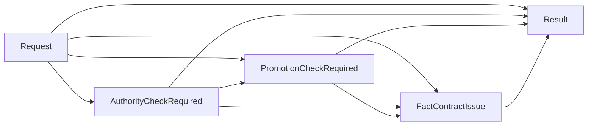

# Case 01 Fact-ready DMN - 서비스 상태 변경 최종 판정

> 이 가이드는 DB/API 조회와 권한 확인을 기존 애플리케이션 또는 adapter가 모두 끝낸 뒤, 완성된 fact를 BAMOE Decision Service에 한 번 전달하는 버전이다. 이 문서에서는 DMN과 SCESIM만 만든다.

[Fact-ready DMN-only 공통 가이드로 돌아가기](README.md)

## 1. 이 버전을 적용하는 시점

다음 조건을 만족할 때 이 구성을 선택한다.

- 기존 Java 서비스나 integration layer가 `zord_svc_s4253`, ORDAUX227, `zord_svc_prod_s0425` 호출을 이미 담당한다.
- BAMOE에는 외부 호출 방법이 아니라 **최종 업무 판정 규칙**만 맡기려 한다.
- 한 요청에 필요한 조건부 fact까지 모두 준비한 후 DMN을 한 번 호출할 수 있다.
- 외부 코드는 `Result.status`, `reasonCode`, `nextAction`을 소비해 후속 처리를 수행한다.

조건상 필요했던 fact가 빠졌거나 ORDAUX227 결과가 아직 `NOT_CHECKED`이면 최종 결과는 `INVALID_INPUT`이다. 이 버전의 DMN은 추가 조회를 지시하거나 호출 순서를 제어하지 않는다.

## 2. 기존 모델과 함께 사용할 별도 자산

기존 Case 01 자산을 덮어쓰지 않는다.

| 항목 | 값 |
|---|---|
| DMN 파일 | `src/main/resources/dmn/Case01ServiceStatusChangeFactReady.dmn` |
| Model Name | `Case01ServiceStatusChangeFactReady` |
| Namespace | `https://example.com/bamoe/poc/fact-ready/case01/v1` |
| Input Data | `Request` |
| 최종 Decision | `Result` |
| Decision Service | `Case01FactReadyService` |
| SCESIM | `src/test/resources/scesim/Case01ServiceStatusChangeFactReadyTest.scesim` |

파일명, Model Name, Namespace가 모두 별도이므로 기존 orchestration용 Case 01과 같은 Maven 프로젝트에서 공존할 수 있다.

## 3. 외부 fact 계약

외부 adapter는 다음 순서로 값을 준비한다.

1. `zord_svc_s4253` 결과에서 서비스 상세 분류를 얻는다.
2. 분류가 `CA`이고 상태 변경 코드가 `F1`, `F2`, `FR` 중 하나이면 ORDAUX227을 호출한다.
3. ORDAUX227이 `GRANTED`이고 상태 변경 코드가 `F1`이면 프로모션 가입 건수를 조회한다.
4. 아래 계약에 맞춰 하나의 `Request`를 조립한다.

| Field | Type | 외부 조립 규칙 |
|---|---|---|
| `serviceDetailClassCode` | `string` | `zord_svc_s4253.svc_dtl_cl_cd` |
| `serviceStatusChangeCode` | `string` | 상태 변경 업무 입력 |
| `ordAux227Result` | `AuthResult` | 대상이면 실제 결과, 비대상이면 `"NOT_CHECKED"` |
| `promotionSubscriptionCount` | `number` | `CA + F1 + GRANTED`이면 0 이상의 건수, 그 외에는 `null` |

adapter는 두 코드 문자열의 앞뒤 공백을 정규화하고, 정규화 결과가 빈 문자열이면
DMN을 호출하지 않는 것이 원칙이다. DMN도 방어적으로 null과 `""`를
`REQUIRED_INPUT_MISSING`으로 처리한다.

예:

```json
{
  "Request": {
    "serviceDetailClassCode": "CA",
    "serviceStatusChangeCode": "F1",
    "ordAux227Result": "GRANTED",
    "promotionSubscriptionCount": 0
  }
}
```

### 기술 실패와 업무 결과를 섞지 않는다

- ORDAUX227이 정상 HTTP 응답으로 업무 값 `ERROR`를 반환했다면 `"ordAux227Result": "ERROR"`로 전달한다.
- timeout, 연결 실패, HTTP 4xx/5xx, JSON 역직렬화 실패를 `"ERROR"`로 위조하지 않는다.
- 그런 기술 실패는 DMN을 호출하기 전 adapter의 예외·재시도·관측성 정책으로 처리한다.

## 4. 고객 원문 규칙

1. `serviceDetailClassCode = "CA"`이고 상태 변경 코드가 `F1`, `F2`, `FR` 중 하나일 때만 ORDAUX227 권한 대상이다.
2. 대상 요청의 ORDAUX227 결과가 `ERROR`이면 시스템 오류다.
3. 대상 요청의 ORDAUX227 결과가 `DENIED`이면 차량 eSIM 처리 권한 없음으로 거절한다.
4. 권한이 `GRANTED`이고 상태 코드가 `F1`이면 프로모션 가입 건수를 확인한다.
5. 프로모션 가입 건수가 0보다 크면 정지를 거절한다.
6. 나머지는 허용한다.

```text
CA AND status in [F1, F2, FR]
├─ false: ALLOW
└─ true
   ├─ ORDAUX227 ERROR: SYSTEM_ERROR
   ├─ ORDAUX227 DENIED: DENY
   └─ ORDAUX227 GRANTED
      ├─ F1 AND promotion count > 0: DENY
      └─ otherwise: ALLOW
```

## 5. UI에서 DMN 파일 만들기

1. VS Code에서 `/Users/jihunkeom/Desktop/projects/2026/SKT/skt_bamoe_party/prelim/test`를 연다.
2. `src/main/resources/dmn` 아래에 `Case01ServiceStatusChangeFactReady.dmn`을 만든다.
3. text editor로 열렸다면 editor tab을 우클릭하고 `Reopen Editor With...` → **Modern BAMOE DMN Editor**를 선택한다.
4. 빈 모델의 Properties에서 다음 값을 입력한다.

| Property | 값 |
|---|---|
| Name | `Case01ServiceStatusChangeFactReady` |
| Namespace | `https://example.com/bamoe/poc/fact-ready/case01/v1` |

5. `Cmd+S`로 저장한다.

## 6. Data Types

`Data Types` tab에서 다음 순서로 만든다. 모든 enum의 base type은 `string`, `Is Collection`은 끈다.

### 6.1 `AuthResult`

```feel
"GRANTED", "DENIED", "ERROR", "NOT_CHECKED"
```

이 enumeration 밖의 문자열은 정상적인 업무 fact가 아니다. 예를 들어
`"UNKNOWN"`을 넣으면 빌드 오류가 아니라 **해당 요청을 평가할 때** DMN
type/allowed-values 진단이 먼저 발생할 수 있다. 따라서 아래
`ORDAUX227_RESULT_INVALID` 분기는 adapter 계약을 설명하는 방어 코드로
유지하되, out-of-enum 문자열이 반드시 그 Result 행까지 도달한다고 가정하지
않는다. SCESIM의 정상 업무 시나리오는 enumeration 안의 값만 사용하고, wire
schema나 임의 문자열 검증은 adapter 테스트에서 수행한다.

### 6.2 `DecisionStatus`

```feel
"ALLOW", "DENY", "SYSTEM_ERROR", "INVALID_INPUT"
```

### 6.3 `tCase01FactReadyRequest`

| Field | Type |
|---|---|
| `serviceDetailClassCode` | `string` |
| `serviceStatusChangeCode` | `string` |
| `ordAux227Result` | `AuthResult` |
| `promotionSubscriptionCount` | `number` |

### 6.4 `tCase01FactReadyResult`

| Field | Type |
|---|---|
| `status` | `DecisionStatus` |
| `reasonCode` | `string` |
| `reasonMessage` | `string` |
| `nextAction` | `string` |

`Result.status`를 단순 `string`으로 두지 말고 반드시 `DecisionStatus`로 지정한다.

## 7. DRD와 모든 Decision output type

### 7.1 Node

| 종류 | 이름 | Decision output type |
|---|---|---|
| Input Data | `Request` | `tCase01FactReadyRequest` |
| Decision | `AuthorityCheckRequired` | `boolean` |
| Decision | `PromotionCheckRequired` | `boolean` |
| Decision | `FactContractIssue` | `string` |
| Decision | `Result` | `tCase01FactReadyResult` |

### 7.2 Information Requirement



모든 연결은 `Association`이 아니라 `Information Requirement`다.

## 8. Helper Decision

각 Decision을 열고 `Literal Expression`을 선택한 뒤 표에 적힌 output type을 다시 지정한다.

### 8.1 `AuthorityCheckRequired` → `boolean`

```feel
if Request = null
  or Request.serviceDetailClassCode = null
  or Request.serviceDetailClassCode = ""
  or Request.serviceStatusChangeCode = null
  or Request.serviceStatusChangeCode = ""
then false
else Request.serviceDetailClassCode = "CA"
  and list contains(
    ["F1", "F2", "FR"],
    Request.serviceStatusChangeCode
  )
```

### 8.2 `PromotionCheckRequired` → `boolean`

```feel
AuthorityCheckRequired = true
and Request.ordAux227Result = "GRANTED"
and Request.serviceStatusChangeCode = "F1"
```

### 8.3 `FactContractIssue` → `string`

```feel
if Request = null
  or Request.serviceDetailClassCode = null
  or Request.serviceDetailClassCode = ""
  or Request.serviceStatusChangeCode = null
  or Request.serviceStatusChangeCode = ""
then "REQUIRED_INPUT_MISSING"
else if AuthorityCheckRequired = true
  and (
    Request.ordAux227Result = null
    or Request.ordAux227Result = "NOT_CHECKED"
  )
then "ORDAUX227_RESULT_REQUIRED"
else if AuthorityCheckRequired = true
  and list contains(
    ["GRANTED", "DENIED", "ERROR"],
    Request.ordAux227Result
  ) = false
then "ORDAUX227_RESULT_INVALID"
else if AuthorityCheckRequired = false
  and (
    Request.ordAux227Result = null
    or Request.ordAux227Result != "NOT_CHECKED"
  )
then "UNEXPECTED_AUTH_RESULT"
else if AuthorityCheckRequired = false
  and Request.promotionSubscriptionCount != null
then "UNEXPECTED_PROMOTION_COUNT"
else if AuthorityCheckRequired = true
  and list contains(
    ["DENIED", "ERROR"],
    Request.ordAux227Result
  )
  and Request.promotionSubscriptionCount != null
then "UNEXPECTED_PROMOTION_COUNT"
else if PromotionCheckRequired = true
  and Request.promotionSubscriptionCount = null
then "PROMOTION_COUNT_REQUIRED"
else if PromotionCheckRequired = true
  and Request.promotionSubscriptionCount < 0
then "PROMOTION_COUNT_INVALID"
else if AuthorityCheckRequired = true
  and Request.ordAux227Result = "GRANTED"
  and PromotionCheckRequired = false
  and Request.promotionSubscriptionCount != null
then "UNEXPECTED_PROMOTION_COUNT"
else null
```

이 helper는 외부 fact 계약의 누락과 불가능한 조합을 하나의 코드로 정규화한다.
HTTP 응답 schema 검증을 대신하는 Decision은 아니다. 특히 enumeration 밖
문자열은 엔진의 type 검증이 먼저 실패할 수 있으므로
`ORDAUX227_RESULT_INVALID`를 out-of-enum REST payload의 안정적인 업무 응답
계약으로 사용하지 않는다.

## 9. 최종 `Result` Decision Table

`Result`를 열고 다음과 같이 지정한다.

| UI 설정 | 값 |
|---|---|
| Expression type | `Decision Table` |
| Decision Output data type | `tCase01FactReadyResult` |
| Hit Policy | `Unique (U)` |

### 9.1 Input columns

| Input Expression | Type |
|---|---|
| `FactContractIssue` | `string` |
| `AuthorityCheckRequired` | `boolean` |
| `PromotionCheckRequired` | `boolean` |
| `Request.ordAux227Result` | `AuthResult` |
| `Request.promotionSubscriptionCount` | `number` |

### 9.2 Output columns

| Output Name | Type |
|---|---|
| `status` | `DecisionStatus` |
| `reasonCode` | `string` |
| `reasonMessage` | `string` |
| `nextAction` | `string` |

### 9.3 전체 Rule rows

`-`는 해당 input column의 Any cell이다. `null`은 문자열이 아닌 FEEL null이다.

| # | Contract issue | Auth required | Promo required | Auth result | Promo count | status | reasonCode | nextAction |
|---:|---|---:|---:|---|---|---|---|---|
| 1 | `"REQUIRED_INPUT_MISSING"` | `-` | `-` | `-` | `-` | `"INVALID_INPUT"` | `"REQUIRED_INPUT_MISSING"` | `"FIX_INPUT"` |
| 2 | `"ORDAUX227_RESULT_REQUIRED"` | `-` | `-` | `-` | `-` | `"INVALID_INPUT"` | `"ORDAUX227_RESULT_REQUIRED"` | `"FIX_INPUT"` |
| 3 | `"ORDAUX227_RESULT_INVALID"` | `-` | `-` | `-` | `-` | `"INVALID_INPUT"` | `"ORDAUX227_RESULT_INVALID"` | `"FIX_INPUT"` |
| 4 | `"UNEXPECTED_AUTH_RESULT"` | `-` | `-` | `-` | `-` | `"INVALID_INPUT"` | `"UNEXPECTED_AUTH_RESULT"` | `"FIX_INPUT"` |
| 5 | `"UNEXPECTED_PROMOTION_COUNT"` | `-` | `-` | `-` | `-` | `"INVALID_INPUT"` | `"UNEXPECTED_PROMOTION_COUNT"` | `"FIX_INPUT"` |
| 6 | `"PROMOTION_COUNT_REQUIRED"` | `-` | `-` | `-` | `-` | `"INVALID_INPUT"` | `"PROMOTION_COUNT_REQUIRED"` | `"FIX_INPUT"` |
| 7 | `"PROMOTION_COUNT_INVALID"` | `-` | `-` | `-` | `-` | `"INVALID_INPUT"` | `"PROMOTION_COUNT_INVALID"` | `"FIX_INPUT"` |
| 8 | `null` | `false` | `false` | `"NOT_CHECKED"` | `null` | `"ALLOW"` | `"RULE_NOT_APPLICABLE"` | `"CONTINUE"` |
| 9 | `null` | `true` | `false` | `"ERROR"` | `null` | `"SYSTEM_ERROR"` | `"ORDAUX227_ERROR"` | `"RETURN_ERROR"` |
| 10 | `null` | `true` | `false` | `"DENIED"` | `null` | `"DENY"` | `"ORDAUX227_DENIED"` | `"STOP"` |
| 11 | `null` | `true` | `false` | `"GRANTED"` | `null` | `"ALLOW"` | `"STATUS_CHANGE_ALLOWED"` | `"CONTINUE"` |
| 12 | `null` | `true` | `true` | `"GRANTED"` | `> 0` | `"DENY"` | `"ACTIVE_PROMOTION_EXISTS"` | `"STOP"` |
| 13 | `null` | `true` | `true` | `"GRANTED"` | `0` | `"ALLOW"` | `"STATUS_CHANGE_ALLOWED"` | `"CONTINUE"` |

각 행의 `reasonMessage`는 다음과 같이 입력한다.

| reasonCode | reasonMessage |
|---|---|
| `REQUIRED_INPUT_MISSING` | `"서비스 분류와 상태 변경 코드가 필요합니다."` |
| `ORDAUX227_RESULT_REQUIRED` | `"대상 요청에는 완료된 ORDAUX227 결과가 필요합니다."` |
| `ORDAUX227_RESULT_INVALID` | `"ORDAUX227 결과 값이 유효하지 않습니다."` |
| `UNEXPECTED_AUTH_RESULT` | `"비대상 요청에는 실제 ORDAUX227 결과가 없어야 합니다."` |
| `UNEXPECTED_PROMOTION_COUNT` | `"이 조건에서는 프로모션 가입 건수가 없어야 합니다."` |
| `PROMOTION_COUNT_REQUIRED` | `"F1 처리에는 조회가 완료된 프로모션 가입 건수가 필요합니다."` |
| `PROMOTION_COUNT_INVALID` | `"프로모션 가입 건수는 음수일 수 없습니다."` |
| `RULE_NOT_APPLICABLE` | `"ORDAUX227 확인 대상이 아닙니다."` |
| `ORDAUX227_ERROR` | `"ORDAUX227 권한 확인 중 오류가 발생했습니다."` |
| `ORDAUX227_DENIED` | `"차량 eSIM 처리 권한이 없습니다."` |
| `ACTIVE_PROMOTION_EXISTS` | `"프로모션 기간 중에는 정지할 수 없습니다."` |
| `STATUS_CHANGE_ALLOWED` | `"서비스 상태 변경이 허용되었습니다."` |

## 10. Decision Service

1. palette에서 `Decision Service`를 추가한다.
2. 이름을 `Case01FactReadyService`로 지정한다.
3. `Result`를 **Output Decisions**에 넣는다.
4. `AuthorityCheckRequired`, `PromotionCheckRequired`, `FactContractIssue`를 **Encapsulated Decisions**에 넣는다.
5. `Request`가 service input으로 잡히는지 확인한다.

```text
Case01FactReadyService
├─ Input: Request
├─ Encapsulated
│  ├─ AuthorityCheckRequired
│  ├─ PromotionCheckRequired
│  └─ FactContractIssue
└─ Output: Result
```

Decision Service 자체에 output type을 별도로 지정하지 않는다. 유일한 Output
Decision인 `Result`의 output type `tCase01FactReadyResult`에서 service 응답
타입이 파생된다. Editor가 Decision Service variable의 `typeRef` 관련 경고를
출력하더라도, 존재하지 않는 서비스 전용 Data Type을 새로 만들지 않는다.

## 11. SCESIM

### 11.1 파일 생성과 Settings

1. `src/test/resources/scesim/Case01ServiceStatusChangeFactReadyTest.scesim`을 만든다.
2. `Reopen Editor With...` → `(classic)`이 붙지 않은 **BAMOE Test Scenario Editor**를 선택한다.
3. `Create a new Test Scenario`에서 `Decision (DMN)`과 `Case01ServiceStatusChangeFactReady.dmn`을 선택한다.
4. `Autofill DMN Data`는 해제한다.
5. Settings를 다음과 같이 확인한다.

| 설정 | 값 |
|---|---|
| DMN Name | `Case01ServiceStatusChangeFactReady` |
| DMN Namespace | `https://example.com/bamoe/poc/fact-ready/case01/v1` |
| Skip this test scenario | 선택 해제 |

### 11.2 GIVEN과 EXPECT

GIVEN:

- `Request.serviceDetailClassCode`
- `Request.serviceStatusChangeCode`
- `Request.ordAux227Result`
- `Request.promotionSubscriptionCount`

EXPECT:

- `AuthorityCheckRequired.value`
- `PromotionCheckRequired.value`
- `FactContractIssue.value`
- `Result.status`
- `Result.reasonCode`
- `Result.reasonMessage`
- `Result.nextAction`

SCESIM cell에는 JSON이 아니라 FEEL literal을 넣는다. 문자열은 `"CA"`처럼
**큰따옴표까지 포함해서** 입력하고 null은 빈칸이 아니라 `null`을 입력한다.
아래 표의 `status`, `reasonCode`, `reasonMessage`, `nextAction`도 표시된
큰따옴표를 포함한 FEEL string을 실제 EXPECT cell에 그대로 입력한다.

### 11.3 대표 시나리오

아래 표에서 `Issue`는 `FactContractIssue`, 마지막 네 열은 `Result`의 EXPECT다.

| ID | Class | Change | Auth | Count | Auth req. | Promo req. | Issue | status | reasonCode | reasonMessage | nextAction |
|---|---|---|---|---:|---:|---:|---|---|---|---|---|
| `C01-FR-01` | `null` | `"F1"` | `"NOT_CHECKED"` | `null` | `false` | `false` | `"REQUIRED_INPUT_MISSING"` | `"INVALID_INPUT"` | `"REQUIRED_INPUT_MISSING"` | `"서비스 분류와 상태 변경 코드가 필요합니다."` | `"FIX_INPUT"` |
| `C01-FR-02` | `"VOICE"` | `"F1"` | `"NOT_CHECKED"` | `null` | `false` | `false` | `null` | `"ALLOW"` | `"RULE_NOT_APPLICABLE"` | `"ORDAUX227 확인 대상이 아닙니다."` | `"CONTINUE"` |
| `C01-FR-03` | `"VOICE"` | `"F1"` | `"GRANTED"` | `null` | `false` | `false` | `"UNEXPECTED_AUTH_RESULT"` | `"INVALID_INPUT"` | `"UNEXPECTED_AUTH_RESULT"` | `"비대상 요청에는 실제 ORDAUX227 결과가 없어야 합니다."` | `"FIX_INPUT"` |
| `C01-FR-04` | `"CA"` | `"F2"` | `"NOT_CHECKED"` | `null` | `true` | `false` | `"ORDAUX227_RESULT_REQUIRED"` | `"INVALID_INPUT"` | `"ORDAUX227_RESULT_REQUIRED"` | `"대상 요청에는 완료된 ORDAUX227 결과가 필요합니다."` | `"FIX_INPUT"` |
| `C01-FR-05` | `"CA"` | `"F2"` | `"ERROR"` | `null` | `true` | `false` | `null` | `"SYSTEM_ERROR"` | `"ORDAUX227_ERROR"` | `"ORDAUX227 권한 확인 중 오류가 발생했습니다."` | `"RETURN_ERROR"` |
| `C01-FR-06` | `"CA"` | `"FR"` | `"DENIED"` | `null` | `true` | `false` | `null` | `"DENY"` | `"ORDAUX227_DENIED"` | `"차량 eSIM 처리 권한이 없습니다."` | `"STOP"` |
| `C01-FR-07` | `"CA"` | `"F2"` | `"GRANTED"` | `null` | `true` | `false` | `null` | `"ALLOW"` | `"STATUS_CHANGE_ALLOWED"` | `"서비스 상태 변경이 허용되었습니다."` | `"CONTINUE"` |
| `C01-FR-08` | `"CA"` | `"F1"` | `"GRANTED"` | `null` | `true` | `true` | `"PROMOTION_COUNT_REQUIRED"` | `"INVALID_INPUT"` | `"PROMOTION_COUNT_REQUIRED"` | `"F1 처리에는 조회가 완료된 프로모션 가입 건수가 필요합니다."` | `"FIX_INPUT"` |
| `C01-FR-09` | `"CA"` | `"F1"` | `"GRANTED"` | `-1` | `true` | `true` | `"PROMOTION_COUNT_INVALID"` | `"INVALID_INPUT"` | `"PROMOTION_COUNT_INVALID"` | `"프로모션 가입 건수는 음수일 수 없습니다."` | `"FIX_INPUT"` |
| `C01-FR-10` | `"CA"` | `"F1"` | `"GRANTED"` | `2` | `true` | `true` | `null` | `"DENY"` | `"ACTIVE_PROMOTION_EXISTS"` | `"프로모션 기간 중에는 정지할 수 없습니다."` | `"STOP"` |
| `C01-FR-11` | `"CA"` | `"F1"` | `"GRANTED"` | `0` | `true` | `true` | `null` | `"ALLOW"` | `"STATUS_CHANGE_ALLOWED"` | `"서비스 상태 변경이 허용되었습니다."` | `"CONTINUE"` |
| `C01-FR-12` | `""` | `"F1"` | `"NOT_CHECKED"` | `null` | `false` | `false` | `"REQUIRED_INPUT_MISSING"` | `"INVALID_INPUT"` | `"REQUIRED_INPUT_MISSING"` | `"서비스 분류와 상태 변경 코드가 필요합니다."` | `"FIX_INPUT"` |
| `C01-FR-13` | `"CA"` | `""` | `"NOT_CHECKED"` | `null` | `false` | `false` | `"REQUIRED_INPUT_MISSING"` | `"INVALID_INPUT"` | `"REQUIRED_INPUT_MISSING"` | `"서비스 분류와 상태 변경 코드가 필요합니다."` | `"FIX_INPUT"` |

### 11.4 Activator와 실행

프로젝트 전체에서 activator는 하나만 사용한다.

```bash
cd "/Users/jihunkeom/Desktop/projects/2026/SKT/skt_bamoe_party/prelim/test"

READY=1
for asset in \
  src/main/resources/dmn/Case01ServiceStatusChangeFactReady.dmn \
  src/test/resources/scesim/Case01ServiceStatusChangeFactReadyTest.scesim
do
  if test -s "$asset"; then
    echo "[OK] $asset"
  else
    echo "[MISSING/EMPTY] $asset"
    READY=0
  fi
done

ACTIVATOR='src/test/java/testscenario/TestScenarioJunitActivatorTest.java'
if test -s "$ACTIVATOR" && rg -q '@TestScenarioActivator' "$ACTIVATOR"; then
  echo "[OK] project-wide Test Scenario activator"
else
  echo "[MISSING/INVALID] $ACTIVATOR"
  READY=0
fi

SCESIM_FILE='src/test/resources/scesim/Case01ServiceStatusChangeFactReadyTest.scesim'
if test -s "$SCESIM_FILE" \
    && rg -q '<expressionAlias>reasonMessage</expressionAlias>' "$SCESIM_FILE"; then
  echo "[OK] Case01 Fact-ready reasonMessage EXPECT column"
else
  echo "[FIX] UI에서 Result.reasonMessage EXPECT column을 추가"
  READY=0
fi

if test "$READY" -eq 1; then
  mvn -s config/settings-bamoe-container.xml clean test
else
  echo "[SKIP] UI에서 DMN/SCESIM을 저장하고 activator를 확인한 뒤 다시 실행"
fi
```

모든 Gate가 `[OK]`일 때만 Maven을 실행한다. 성공 기준은 `Failures: 0`,
`Errors: 0`, `BUILD SUCCESS`다. project-wide activator가 다른 `.scesim`도
함께 실행하므로 실패 시 report의 scenario description을 확인한다.
문자열 검색은 column 존재만 확인한다. UI에서 13개 시나리오의
`reasonMessage` cell이 모두 채워졌는지도 확인한다. 빈 EXPECT cell은 null이
아니라 검증 생략이다.

## 12. Maven build와 server

### 12.1 build

```bash
cd "/Users/jihunkeom/Desktop/projects/2026/SKT/skt_bamoe_party/prelim/test"

mvn -s config/settings-bamoe-container.xml clean verify
```

### 12.2 Terminal A에서 server 실행

```bash
mvn -s config/settings-bamoe-container.xml spring-boot:run
```

`Started BamoeSpringBootApplication`이 보이면 Terminal A를 그대로 둔다.

### 12.3 Terminal B에서 readiness

```bash
ready=0

for attempt in {1..30}; do
  if curl -fsS 'http://127.0.0.1:8080/v3/api-docs' >/dev/null 2>&1; then
    ready=1
    break
  fi
  sleep 2
done

test "$ready" -eq 1
```

## 13. OpenAPI의 네 endpoint

URL을 추측하지 말고 실행 중인 server의 OpenAPI를 확인한다.

```bash
set -o pipefail

curl --fail-with-body -sS \
  'http://127.0.0.1:8080/v3/api-docs' \
  | jq -e -r '
      [
        .paths | keys[]
        | select(contains("Case01ServiceStatusChangeFactReady"))
      ] as $paths
      | if ($paths | length) == 4
        then $paths[]
        else error(
          "expected 4 Case01 FactReady endpoints: \($paths | tojson)"
        )
        end
    '
```

일반적으로 다음 네 path가 생성된다.

```text
/Case01ServiceStatusChangeFactReady
/Case01ServiceStatusChangeFactReady/dmnresult
/Case01ServiceStatusChangeFactReady/Case01FactReadyService
/Case01ServiceStatusChangeFactReady/Case01FactReadyService/dmnresult
```

| endpoint | 용도 |
|---|---|
| model | helper와 `Result`를 포함한 전체 context |
| model `/dmnresult` | 전체 모델의 평가 상태와 message 진단 |
| Decision Service | 공개 계약인 `Result`만 소비 |
| Decision Service `/dmnresult` | service 경계의 상세 평가 진단 |

## 14. curl 검증

### 14.1 Decision Service - 최종 허용

```bash
SERVICE_URL='http://127.0.0.1:8080/Case01ServiceStatusChangeFactReady/Case01FactReadyService'
set -o pipefail

curl --fail-with-body -sS -X POST \
  "$SERVICE_URL" \
  -H 'Content-Type: application/json' \
  -H 'Accept: application/json' \
  -d '{
    "Request": {
      "serviceDetailClassCode": "CA",
      "serviceStatusChangeCode": "F1",
      "ordAux227Result": "GRANTED",
      "promotionSubscriptionCount": 0
    }
  }' | jq -e '
      if (
        .status == "ALLOW"
        and .reasonCode == "STATUS_CHANGE_ALLOWED"
        and .reasonMessage == "서비스 상태 변경이 허용되었습니다."
        and .nextAction == "CONTINUE"
      )
      then {status, reasonCode, reasonMessage, nextAction}
      else error("CASE01_ALLOW_ASSERTION_FAILED: \(. | tojson)")
      end
    '
```

예상: `ALLOW / STATUS_CHANGE_ALLOWED / CONTINUE`.

### 14.2 Decision Service - 미조립 fact

```bash
curl --fail-with-body -sS -X POST \
  "$SERVICE_URL" \
  -H 'Content-Type: application/json' \
  -H 'Accept: application/json' \
  -d '{
    "Request": {
      "serviceDetailClassCode": "CA",
      "serviceStatusChangeCode": "F2",
      "ordAux227Result": "NOT_CHECKED",
      "promotionSubscriptionCount": null
    }
  }' | jq -e '
      if (
        .status == "INVALID_INPUT"
        and .reasonCode == "ORDAUX227_RESULT_REQUIRED"
        and .reasonMessage
          == "대상 요청에는 완료된 ORDAUX227 결과가 필요합니다."
        and .nextAction == "FIX_INPUT"
      )
      then {status, reasonCode, reasonMessage, nextAction}
      else error("CASE01_INCOMPLETE_FACT_ASSERTION_FAILED: \(. | tojson)")
      end
    '
```

예상: `INVALID_INPUT / ORDAUX227_RESULT_REQUIRED / FIX_INPUT`.

### 14.3 전체 model 확인

```bash
MODEL_URL='http://127.0.0.1:8080/Case01ServiceStatusChangeFactReady'

curl --fail-with-body -sS -X POST \
  "$MODEL_URL" \
  -H 'Content-Type: application/json' \
  -d '{
    "Request": {
      "serviceDetailClassCode": "CA",
      "serviceStatusChangeCode": "F1",
      "ordAux227Result": "GRANTED",
      "promotionSubscriptionCount": 2
    }
  }' | jq -e '
      if (
        .AuthorityCheckRequired == true
        and .PromotionCheckRequired == true
        and .FactContractIssue == null
        and .Result.status == "DENY"
        and .Result.reasonCode == "ACTIVE_PROMOTION_EXISTS"
        and .Result.reasonMessage
          == "프로모션 기간 중에는 정지할 수 없습니다."
        and .Result.nextAction == "STOP"
      )
      then {
          AuthorityCheckRequired,
          PromotionCheckRequired,
          FactContractIssue,
          Result
        }
      else error("CASE01_MODEL_ASSERTION_FAILED: \(. | tojson)")
      end
    '
```

### 14.4 `/dmnresult` 진단

```bash
curl --fail-with-body -sS -X POST \
  "${MODEL_URL}/dmnresult" \
  -H 'Content-Type: application/json' \
  -d '{
    "Request": {
      "serviceDetailClassCode": "CA",
      "serviceStatusChangeCode": "FR",
      "ordAux227Result": "DENIED",
      "promotionSubscriptionCount": null
    }
  }' | jq -e '
      if (
        .modelName == "Case01ServiceStatusChangeFactReady"
        and .messages == []
        and (.decisionResults | type == "array")
        and (.decisionResults | length > 0)
        and all(
          .decisionResults[];
          .evaluationStatus == "SUCCEEDED"
        )
        and .dmnContext.Result.status == "DENY"
        and .dmnContext.Result.reasonCode == "ORDAUX227_DENIED"
        and .dmnContext.Result.reasonMessage
          == "차량 eSIM 처리 권한이 없습니다."
        and .dmnContext.Result.nextAction == "STOP"
      )
      then {
          namespace,
          modelName,
          result: .dmnContext.Result,
          messages,
          decisions: [
            .decisionResults[] |
            {decisionName, evaluationStatus, messages}
          ]
        }
      else error("CASE01_DMNRESULT_ASSERTION_FAILED: \(. | tojson)")
      end
    '
```

확인할 것:

- `modelName = Case01ServiceStatusChangeFactReady`
- 최상위 `messages`가 빈 배열
- 각 `evaluationStatus`가 `SUCCEEDED`
- `.dmnContext.Result`가 `DENY / ORDAUX227_DENIED / STOP`

`INVALID_INPUT`, `DENY`, `SYSTEM_ERROR`는 정상적으로 계산된 업무 결과다. 이 경우에도 DMN 평가 자체는 `SUCCEEDED`일 수 있다.

### 14.5 서버 종료

curl 검증이 끝나면 server를 실행한 Terminal에서 `Ctrl+C`를 누른다. 다음
Fact-ready 모델을 추가한 뒤에는 새 runtime을 시작해야 하므로 기존 8080 server를
남겨 두지 않는다.

```bash
if lsof -nP -iTCP:8080 -sTCP:LISTEN; then
  echo 'STOP: 기존 Fact-ready server를 먼저 종료하세요.' >&2
  false
else
  echo 'FACT_READY_SERVER_STOP_GATE=PASS'
fi
```

## 15. 완료 체크리스트

- [ ] 기존 Case 01 DMN을 덮어쓰지 않고 `Case01ServiceStatusChangeFactReady.dmn`을 만들었다.
- [ ] Model Name과 Namespace가 fact-ready 전용 값이다.
- [ ] 모든 Decision의 output type을 지정했다.
- [ ] 대상 요청의 `NOT_CHECKED`를 `INVALID_INPUT`으로 처리한다.
- [ ] enumeration 밖 AuthResult는 업무 Result가 아니라 평가 시 type 진단이 될 수 있음을 이해했다.
- [ ] 필수 코드의 null과 빈 문자열을 모두 `INVALID_INPUT`으로 처리한다.
- [ ] `GRANTED + F1`에서만 프로모션 가입 건수를 요구한다.
- [ ] 프로모션 건수 0과 양수, 음수를 각각 테스트했다.
- [ ] Decision Service 이름이 `Case01FactReadyService`다.
- [ ] SCESIM 대표 시나리오가 통과한다.
- [ ] 모든 SCESIM 행에 `Result.reasonMessage` EXPECT를 입력했다.
- [ ] Maven `clean verify`가 성공한다.
- [ ] OpenAPI에서 네 endpoint를 실제로 확인했다.
- [ ] Decision Service curl과 `/dmnresult` 진단을 모두 실행했다.
- [ ] curl 검증 후 8080 server를 종료했다.
- [ ] 기술 HTTP 실패를 DMN의 `"ERROR"` payload로 위조하지 않는 경계를 이해했다.
