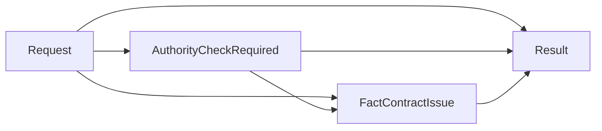

# Case 02 Fact-ready DMN - 별정서비스 명의변경 최종 판정

> 이 가이드는 서비스 정보 조회와 ORDAU1520 확인을 기존 애플리케이션 또는 adapter가 완료한 뒤, 완성된 fact를 BAMOE Decision Service에 한 번 전달하는 버전이다. 이 문서에서는 DMN과 SCESIM만 만든다.

[Fact-ready DMN-only 공통 가이드로 돌아가기](README.md)

## 1. 이 버전을 적용하는 시점

다음 조건을 만족할 때 사용한다.

- 기존 코드가 `zordmb07s0100`과 ORDAU1520 호출을 이미 수행한다.
- BAMOE에는 `P + 72` 대상 판별과 권한 결과의 최종 업무 판정만 맡긴다.
- 대상 요청이라면 ORDAU1520 결과까지 받은 뒤 DMN을 호출한다.
- 외부 코드는 최종 `Result`만 받아 계속 진행, 거절, 오류 반환 중 하나를 수행한다.

대상 요청인데 권한 결과가 `NOT_CHECKED`이거나 누락되었다면 `INVALID_INPUT`이다. 이 DMN은 미완성 요청을 받아 추가 조회를 요청하지 않는다.

## 2. 기존 모델과 함께 사용할 별도 자산

| 항목 | 값 |
|---|---|
| DMN 파일 | `src/main/resources/dmn/Case02WirelineNameChangeFactReady.dmn` |
| Model Name | `Case02WirelineNameChangeFactReady` |
| Namespace | `https://example.com/bamoe/poc/fact-ready/case02/v1` |
| Input Data | `Request` |
| 최종 Decision | `Result` |
| Decision Service | `Case02FactReadyService` |
| SCESIM | `src/test/resources/scesim/Case02WirelineNameChangeFactReadyTest.scesim` |

기존 `Case02WirelineNameChange.dmn`을 열어 이름을 바꾸는 방식이 아니라 새 파일로 만든다.

## 3. 외부 fact 계약

외부 adapter의 책임:

1. `zordmb07s0100`을 호출한다.
2. `svc_cd`를 `serviceCode`, `svc_typ_cd`를 `serviceTypeCode`로 매핑한다.
3. `serviceCode = "P"`이고 `serviceTypeCode = "72"`이면 ORDAU1520을 호출한다.
4. 대상이면 실제 권한 결과, 비대상이면 `"NOT_CHECKED"`를 넣어 DMN을 호출한다.

| Field | Type | 외부 조립 규칙 |
|---|---|---|
| `serviceCode` | `string` | `zordmb07s0100.svc_cd` |
| `serviceTypeCode` | `string` | `zordmb07s0100.svc_typ_cd`; `"72"`는 문자열 |
| `ordAu1520Result` | `AuthResult` | 대상이면 완료된 결과, 비대상이면 `"NOT_CHECKED"` |

adapter는 두 코드 문자열의 앞뒤 공백을 정규화하고, 정규화 결과가 빈 문자열이면
DMN을 호출하지 않는 것이 원칙이다. DMN도 방어적으로 null과 `""`를
`SERVICE_INFO_REQUIRED`로 처리한다.

```json
{
  "Request": {
    "serviceCode": "P",
    "serviceTypeCode": "72",
    "ordAu1520Result": "GRANTED"
  }
}
```

### 기술 실패와 업무 결과

- 정상 HTTP 응답의 provider 업무 값 `ERROR`만 `"ordAu1520Result": "ERROR"`로 전달한다.
- timeout, 연결 실패, HTTP 4xx/5xx, 깨진 JSON은 adapter가 기술 실패로 처리한다.
- 기술 실패를 DMN payload의 `"ERROR"`로 바꾸면 재시도 가능한 장애와 실제 업무 응답을 구분할 수 없으므로 그렇게 하지 않는다.

## 4. 고객 원문 규칙

1. `serviceCode = "P"`이고 `serviceTypeCode = "72"`이면 ORDAU1520 확인 대상이다.
2. 대상 요청의 권한 결과가 `ERROR`이면 시스템 오류다.
3. 대상 요청의 권한 결과가 `DENIED`이면 별정서비스 명의변경 권한 없음으로 거절한다.
4. 대상 요청의 권한 결과가 `GRANTED`이면 허용한다.
5. 조건에 해당하지 않으면 권한 확인 없이 허용한다.

> 원문의 두 필드를 바꾸지 않는다. 조건은 `serviceCode = "P"` 그리고 `serviceTypeCode = "72"`다.

## 5. UI에서 DMN 파일 만들기

1. `/Users/jihunkeom/Desktop/projects/2026/SKT/skt_bamoe_party/prelim/test`를 VS Code로 연다.
2. `src/main/resources/dmn/Case02WirelineNameChangeFactReady.dmn`을 만든다.
3. `Reopen Editor With...` → **Modern BAMOE DMN Editor**를 선택한다.
4. 모델 Properties를 설정한다.

| Property | 값 |
|---|---|
| Name | `Case02WirelineNameChangeFactReady` |
| Namespace | `https://example.com/bamoe/poc/fact-ready/case02/v1` |

5. 저장하고 editor를 닫았다 다시 열어 값이 유지되는지 확인한다.

## 6. Data Types

### 6.1 `AuthResult`

Base type은 `string`, enumeration은 다음과 같다.

```feel
"GRANTED", "DENIED", "ERROR", "NOT_CHECKED"
```

`DENIED` 철자를 정확히 사용한다. 기존 초기 자산에 있었던 `DEINED` 오타를 새 모델에 복사하지 않는다.

enumeration 밖의 문자열은 정상 업무 fact가 아니다. 예를 들어 `"UNKNOWN"`은
빌드 오류가 아니라 **그 요청의 DMN 평가 시점**에 type/allowed-values 진단이
먼저 발생할 수 있다. 따라서 아래 `ORDAU1520_RESULT_INVALID` 분기는 adapter
계약을 설명하는 방어 코드로 유지하되, out-of-enum 문자열이 반드시 그 Result
행까지 도달한다고 가정하지 않는다. SCESIM 업무 시나리오는 enumeration 안의
값만 사용하고, 임의 문자열과 wire schema는 adapter 테스트에서 검증한다.

### 6.2 `DecisionStatus`

```feel
"ALLOW", "DENY", "SYSTEM_ERROR", "INVALID_INPUT"
```

### 6.3 `tCase02FactReadyRequest`

| Field | Type |
|---|---|
| `serviceCode` | `string` |
| `serviceTypeCode` | `string` |
| `ordAu1520Result` | `AuthResult` |

### 6.4 `tCase02FactReadyResult`

| Field | Type |
|---|---|
| `status` | `DecisionStatus` |
| `reasonCode` | `string` |
| `reasonMessage` | `string` |
| `nextAction` | `string` |

## 7. DRD와 모든 Decision output type

### 7.1 Node

| 종류 | 이름 | Decision output type |
|---|---|---|
| Input Data | `Request` | `tCase02FactReadyRequest` |
| Decision | `AuthorityCheckRequired` | `boolean` |
| Decision | `FactContractIssue` | `string` |
| Decision | `Result` | `tCase02FactReadyResult` |

### 7.2 Information Requirement



## 8. Helper Decision

### 8.1 `AuthorityCheckRequired` → `boolean`

Expression type을 `Literal Expression`으로 선택한다.

```feel
if Request = null
  or Request.serviceCode = null
  or Request.serviceCode = ""
  or Request.serviceTypeCode = null
  or Request.serviceTypeCode = ""
then false
else Request.serviceCode = "P"
  and Request.serviceTypeCode = "72"
```

### 8.2 `FactContractIssue` → `string`

```feel
if Request = null
  or Request.serviceCode = null
  or Request.serviceCode = ""
  or Request.serviceTypeCode = null
  or Request.serviceTypeCode = ""
then "SERVICE_INFO_REQUIRED"
else if AuthorityCheckRequired = true
  and (
    Request.ordAu1520Result = null
    or Request.ordAu1520Result = "NOT_CHECKED"
  )
then "ORDAU1520_RESULT_REQUIRED"
else if AuthorityCheckRequired = true
  and list contains(
    ["GRANTED", "DENIED", "ERROR"],
    Request.ordAu1520Result
  ) = false
then "ORDAU1520_RESULT_INVALID"
else if AuthorityCheckRequired = false
  and (
    Request.ordAu1520Result = null
    or Request.ordAu1520Result != "NOT_CHECKED"
  )
then "UNEXPECTED_AUTH_RESULT"
else null
```

비대상 요청의 명시적인 `"NOT_CHECKED"`는 완성된 fact 계약이다. 대상 요청에서
같은 값은 미조립 상태이므로 오류다. enumeration 밖 문자열은 엔진의 type
검증이 먼저 실패할 수 있으므로 `ORDAU1520_RESULT_INVALID`를 out-of-enum REST
payload의 안정적인 업무 응답 계약으로 사용하지 않는다.

## 9. 최종 `Result` Decision Table

| UI 설정 | 값 |
|---|---|
| Expression type | `Decision Table` |
| Decision Output data type | `tCase02FactReadyResult` |
| Hit Policy | `Unique (U)` |

### 9.1 Input columns

| Input Expression | Type |
|---|---|
| `FactContractIssue` | `string` |
| `AuthorityCheckRequired` | `boolean` |
| `Request.ordAu1520Result` | `AuthResult` |

### 9.2 Output columns

| Output Name | Type |
|---|---|
| `status` | `DecisionStatus` |
| `reasonCode` | `string` |
| `reasonMessage` | `string` |
| `nextAction` | `string` |

### 9.3 전체 Rule rows

| # | Contract issue | Auth required | Auth result | status | reasonCode | reasonMessage | nextAction |
|---:|---|---:|---|---|---|---|---|
| 1 | `"SERVICE_INFO_REQUIRED"` | `-` | `-` | `"INVALID_INPUT"` | `"SERVICE_INFO_REQUIRED"` | `"서비스 코드와 서비스 유형 코드가 필요합니다."` | `"FIX_INPUT"` |
| 2 | `"ORDAU1520_RESULT_REQUIRED"` | `-` | `-` | `"INVALID_INPUT"` | `"ORDAU1520_RESULT_REQUIRED"` | `"대상 요청에는 완료된 ORDAU1520 결과가 필요합니다."` | `"FIX_INPUT"` |
| 3 | `"ORDAU1520_RESULT_INVALID"` | `-` | `-` | `"INVALID_INPUT"` | `"ORDAU1520_RESULT_INVALID"` | `"ORDAU1520 결과 값이 유효하지 않습니다."` | `"FIX_INPUT"` |
| 4 | `"UNEXPECTED_AUTH_RESULT"` | `-` | `-` | `"INVALID_INPUT"` | `"UNEXPECTED_AUTH_RESULT"` | `"비대상 요청에는 실제 ORDAU1520 결과가 없어야 합니다."` | `"FIX_INPUT"` |
| 5 | `null` | `false` | `"NOT_CHECKED"` | `"ALLOW"` | `"RULE_NOT_APPLICABLE"` | `"ORDAU1520 권한 확인 대상이 아닙니다."` | `"CONTINUE"` |
| 6 | `null` | `true` | `"ERROR"` | `"SYSTEM_ERROR"` | `"ORDAU1520_ERROR"` | `"ORDAU1520 권한 확인 중 오류가 발생했습니다."` | `"RETURN_ERROR"` |
| 7 | `null` | `true` | `"DENIED"` | `"DENY"` | `"ORDAU1520_DENIED"` | `"별정서비스 명의변경 권한이 없습니다."` | `"STOP"` |
| 8 | `null` | `true` | `"GRANTED"` | `"ALLOW"` | `"NAME_CHANGE_ALLOWED"` | `"명의변경 처리가 허용되었습니다."` | `"CONTINUE"` |

한 cell에 `"GRANTED", "DENIED", "ERROR"`를 묶어 넣는 방식 대신 정책 결과별 행을 분리한다. 특히 `DENIED`와 `ERROR`는 status와 후속 행동이 다르다.

## 10. Decision Service

1. `Decision Service` node를 추가한다.
2. 이름을 `Case02FactReadyService`로 지정한다.
3. `Result`를 Output Decisions에 넣는다.
4. `AuthorityCheckRequired`, `FactContractIssue`를 Encapsulated Decisions에 넣는다.
5. `Request`가 service input으로 잡히는지 확인한다.

```text
Case02FactReadyService
├─ Input: Request
├─ Encapsulated: AuthorityCheckRequired, FactContractIssue
└─ Output: Result
```

Decision Service에 별도 output type을 지정하지 않는다. `Result`의
`tCase02FactReadyResult`가 service 응답 타입의 근거다. Editor가 Decision
Service variable의 `typeRef` 관련 경고를 출력하더라도, 존재하지 않는 서비스
전용 Data Type을 만들어 넣지는 않는다.

## 11. SCESIM

### 11.1 파일과 Settings

1. `src/test/resources/scesim/Case02WirelineNameChangeFactReadyTest.scesim`을 만든다.
2. `Reopen Editor With...` → `(classic)`이 붙지 않은 **BAMOE Test Scenario Editor**를 선택한다.
3. Asset type은 `Decision (DMN)`, DMN file은 `Case02WirelineNameChangeFactReady.dmn`으로 지정한다.
4. `Autofill DMN Data`는 해제한다.
5. Settings를 확인한다.

| 설정 | 값 |
|---|---|
| DMN Name | `Case02WirelineNameChangeFactReady` |
| DMN Namespace | `https://example.com/bamoe/poc/fact-ready/case02/v1` |
| Skip this test scenario | 선택 해제 |

### 11.2 GIVEN과 EXPECT

GIVEN:

- `Request.serviceCode`
- `Request.serviceTypeCode`
- `Request.ordAu1520Result`

EXPECT:

- `AuthorityCheckRequired.value`
- `FactContractIssue.value`
- `Result.status`
- `Result.reasonCode`
- `Result.reasonMessage`
- `Result.nextAction`

문자열은 `"P"`, `"72"`, `"DENIED"`처럼 **큰따옴표까지 포함한** FEEL
string으로 입력한다. 명시적인 null은 `null`로 입력한다. 아래 표의
`status`, `reasonCode`, `reasonMessage`, `nextAction`도 표시된 큰따옴표를
포함해 실제 EXPECT cell에 그대로 입력한다.

### 11.3 대표 시나리오

| ID | Service | Type | Auth | Auth required | Issue | status | reasonCode | reasonMessage | nextAction |
|---|---|---|---|---:|---|---|---|---|---|
| `C02-FR-01` | `null` | `"72"` | `"NOT_CHECKED"` | `false` | `"SERVICE_INFO_REQUIRED"` | `"INVALID_INPUT"` | `"SERVICE_INFO_REQUIRED"` | `"서비스 코드와 서비스 유형 코드가 필요합니다."` | `"FIX_INPUT"` |
| `C02-FR-02` | `"C"` | `"72"` | `"NOT_CHECKED"` | `false` | `null` | `"ALLOW"` | `"RULE_NOT_APPLICABLE"` | `"ORDAU1520 권한 확인 대상이 아닙니다."` | `"CONTINUE"` |
| `C02-FR-03` | `"P"` | `"71"` | `"GRANTED"` | `false` | `"UNEXPECTED_AUTH_RESULT"` | `"INVALID_INPUT"` | `"UNEXPECTED_AUTH_RESULT"` | `"비대상 요청에는 실제 ORDAU1520 결과가 없어야 합니다."` | `"FIX_INPUT"` |
| `C02-FR-04` | `"P"` | `"72"` | `"NOT_CHECKED"` | `true` | `"ORDAU1520_RESULT_REQUIRED"` | `"INVALID_INPUT"` | `"ORDAU1520_RESULT_REQUIRED"` | `"대상 요청에는 완료된 ORDAU1520 결과가 필요합니다."` | `"FIX_INPUT"` |
| `C02-FR-05` | `"P"` | `"72"` | `null` | `true` | `"ORDAU1520_RESULT_REQUIRED"` | `"INVALID_INPUT"` | `"ORDAU1520_RESULT_REQUIRED"` | `"대상 요청에는 완료된 ORDAU1520 결과가 필요합니다."` | `"FIX_INPUT"` |
| `C02-FR-06` | `"P"` | `"72"` | `"ERROR"` | `true` | `null` | `"SYSTEM_ERROR"` | `"ORDAU1520_ERROR"` | `"ORDAU1520 권한 확인 중 오류가 발생했습니다."` | `"RETURN_ERROR"` |
| `C02-FR-07` | `"P"` | `"72"` | `"DENIED"` | `true` | `null` | `"DENY"` | `"ORDAU1520_DENIED"` | `"별정서비스 명의변경 권한이 없습니다."` | `"STOP"` |
| `C02-FR-08` | `"P"` | `"72"` | `"GRANTED"` | `true` | `null` | `"ALLOW"` | `"NAME_CHANGE_ALLOWED"` | `"명의변경 처리가 허용되었습니다."` | `"CONTINUE"` |
| `C02-FR-09` | `""` | `"72"` | `"NOT_CHECKED"` | `false` | `"SERVICE_INFO_REQUIRED"` | `"INVALID_INPUT"` | `"SERVICE_INFO_REQUIRED"` | `"서비스 코드와 서비스 유형 코드가 필요합니다."` | `"FIX_INPUT"` |
| `C02-FR-10` | `"P"` | `""` | `"NOT_CHECKED"` | `false` | `"SERVICE_INFO_REQUIRED"` | `"INVALID_INPUT"` | `"SERVICE_INFO_REQUIRED"` | `"서비스 코드와 서비스 유형 코드가 필요합니다."` | `"FIX_INPUT"` |

### 11.4 저장과 실행

```bash
cd "/Users/jihunkeom/Desktop/projects/2026/SKT/skt_bamoe_party/prelim/test"

READY=1
for asset in \
  src/main/resources/dmn/Case02WirelineNameChangeFactReady.dmn \
  src/test/resources/scesim/Case02WirelineNameChangeFactReadyTest.scesim
do
  if test -s "$asset"; then
    echo "[OK] $asset"
  else
    echo "[MISSING/EMPTY] $asset"
    READY=0
  fi
done

ACTIVATOR='src/test/java/testscenario/TestScenarioJunitActivatorTest.java'
if test -s "$ACTIVATOR" && rg -q '@TestScenarioActivator' "$ACTIVATOR"; then
  echo "[OK] project-wide Test Scenario activator"
else
  echo "[MISSING/INVALID] $ACTIVATOR"
  READY=0
fi

DMN_FILE='src/main/resources/dmn/Case02WirelineNameChangeFactReady.dmn'
if test -s "$DMN_FILE"; then
  if rg -n 'DEINED' "$DMN_FILE"; then
    echo "[FIX] UI에서 DEINED를 DENIED로 수정"
    READY=0
  else
    echo "[OK] DENIED 철자"
  fi
fi

SCESIM_FILE='src/test/resources/scesim/Case02WirelineNameChangeFactReadyTest.scesim'
if test -s "$SCESIM_FILE" \
    && rg -q '<expressionAlias>reasonMessage</expressionAlias>' "$SCESIM_FILE"; then
  echo "[OK] Case02 Fact-ready reasonMessage EXPECT column"
else
  echo "[FIX] UI에서 Result.reasonMessage EXPECT column을 추가"
  READY=0
fi

if test "$READY" -eq 1; then
  mvn -s config/settings-bamoe-container.xml clean test
else
  echo "[SKIP] UI 자산과 activator를 수정한 뒤 다시 실행"
fi
```

모든 Gate가 `[OK]`일 때만 Maven을 실행한다. 성공 기준은 `Failures: 0`,
`Errors: 0`, `BUILD SUCCESS`다.
문자열 검색은 column 존재만 확인한다. UI에서 10개 시나리오의
`reasonMessage` cell이 모두 채워졌는지도 확인한다. 빈 EXPECT cell은 null이
아니라 검증 생략이다.

## 12. Maven build와 server

### 12.1 build

```bash
cd "/Users/jihunkeom/Desktop/projects/2026/SKT/skt_bamoe_party/prelim/test"
mvn -s config/settings-bamoe-container.xml clean verify
```

### 12.2 Terminal A

```bash
mvn -s config/settings-bamoe-container.xml spring-boot:run
```

`Started BamoeSpringBootApplication`이 보이면 Terminal A는 그대로 둔다.

### 12.3 Terminal B readiness

```bash
ready=0

for attempt in {1..30}; do
  if curl -fsS 'http://127.0.0.1:8080/v3/api-docs' >/dev/null 2>&1; then
    ready=1
    break
  fi
  sleep 2
done

test "$ready" -eq 1
```

Swagger UI는 `http://127.0.0.1:8080/swagger-ui/index.html`이다.

## 13. OpenAPI의 네 endpoint

```bash
set -o pipefail

curl --fail-with-body -sS \
  'http://127.0.0.1:8080/v3/api-docs' \
  | jq -e -r '
      [
        .paths | keys[]
        | select(contains("Case02WirelineNameChangeFactReady"))
      ] as $paths
      | if ($paths | length) == 4
        then $paths[]
        else error(
          "expected 4 Case02 FactReady endpoints: \($paths | tojson)"
        )
        end
    '
```

일반적으로 다음 네 path가 보인다.

```text
/Case02WirelineNameChangeFactReady
/Case02WirelineNameChangeFactReady/dmnresult
/Case02WirelineNameChangeFactReady/Case02FactReadyService
/Case02WirelineNameChangeFactReady/Case02FactReadyService/dmnresult
```

| endpoint | 응답과 용도 |
|---|---|
| model | `AuthorityCheckRequired`, `FactContractIssue`, `Result` |
| model `/dmnresult` | 전체 Decision별 평가 상태와 message |
| Decision Service | 공개 결과인 `Result` |
| Decision Service `/dmnresult` | service 경계의 상세 진단 |

## 14. curl 검증

### 14.1 Decision Service - 권한 거절

```bash
SERVICE_URL='http://127.0.0.1:8080/Case02WirelineNameChangeFactReady/Case02FactReadyService'
set -o pipefail

curl --fail-with-body -sS -X POST \
  "$SERVICE_URL" \
  -H 'Content-Type: application/json' \
  -H 'Accept: application/json' \
  -d '{
    "Request": {
      "serviceCode": "P",
      "serviceTypeCode": "72",
      "ordAu1520Result": "DENIED"
    }
  }' | jq -e '
      if (
        .status == "DENY"
        and .reasonCode == "ORDAU1520_DENIED"
        and .reasonMessage == "별정서비스 명의변경 권한이 없습니다."
        and .nextAction == "STOP"
      )
      then {status, reasonCode, reasonMessage, nextAction}
      else error("CASE02_DENY_ASSERTION_FAILED: \(. | tojson)")
      end
    '
```

예상: `DENY / ORDAU1520_DENIED / STOP`.

### 14.2 Decision Service - 필요한 fact 미조립

```bash
curl --fail-with-body -sS -X POST \
  "$SERVICE_URL" \
  -H 'Content-Type: application/json' \
  -H 'Accept: application/json' \
  -d '{
    "Request": {
      "serviceCode": "P",
      "serviceTypeCode": "72",
      "ordAu1520Result": "NOT_CHECKED"
    }
  }' | jq -e '
      if (
        .status == "INVALID_INPUT"
        and .reasonCode == "ORDAU1520_RESULT_REQUIRED"
        and .reasonMessage
          == "대상 요청에는 완료된 ORDAU1520 결과가 필요합니다."
        and .nextAction == "FIX_INPUT"
      )
      then {status, reasonCode, reasonMessage, nextAction}
      else error("CASE02_INCOMPLETE_FACT_ASSERTION_FAILED: \(. | tojson)")
      end
    '
```

예상: `INVALID_INPUT / ORDAU1520_RESULT_REQUIRED / FIX_INPUT`.

### 14.3 전체 model

```bash
MODEL_URL='http://127.0.0.1:8080/Case02WirelineNameChangeFactReady'

curl --fail-with-body -sS -X POST \
  "$MODEL_URL" \
  -H 'Content-Type: application/json' \
  -d '{
    "Request": {
      "serviceCode": "P",
      "serviceTypeCode": "72",
      "ordAu1520Result": "GRANTED"
    }
  }' | jq -e '
      if (
        .AuthorityCheckRequired == true
        and .FactContractIssue == null
        and .Result.status == "ALLOW"
        and .Result.reasonCode == "NAME_CHANGE_ALLOWED"
        and .Result.reasonMessage == "명의변경 처리가 허용되었습니다."
        and .Result.nextAction == "CONTINUE"
      )
      then {AuthorityCheckRequired, FactContractIssue, Result}
      else error("CASE02_MODEL_ASSERTION_FAILED: \(. | tojson)")
      end
    '
```

### 14.4 `/dmnresult` 진단

```bash
curl --fail-with-body -sS -X POST \
  "${MODEL_URL}/dmnresult" \
  -H 'Content-Type: application/json' \
  -d '{
    "Request": {
      "serviceCode": "P",
      "serviceTypeCode": "72",
      "ordAu1520Result": "DENIED"
    }
  }' | jq -e '
      if (
        .modelName == "Case02WirelineNameChangeFactReady"
        and .messages == []
        and (.decisionResults | type == "array")
        and (.decisionResults | length > 0)
        and all(
          .decisionResults[];
          .evaluationStatus == "SUCCEEDED"
        )
        and .dmnContext.Result.status == "DENY"
        and .dmnContext.Result.reasonCode == "ORDAU1520_DENIED"
        and .dmnContext.Result.reasonMessage
          == "별정서비스 명의변경 권한이 없습니다."
        and .dmnContext.Result.nextAction == "STOP"
      )
      then {
          namespace,
          modelName,
          result: .dmnContext.Result,
          messages,
          decisions: [
            .decisionResults[] |
            {decisionName, evaluationStatus, messages}
          ]
        }
      else error("CASE02_DMNRESULT_ASSERTION_FAILED: \(. | tojson)")
      end
    '
```

확인할 것:

- `modelName = Case02WirelineNameChangeFactReady`
- `messages`가 빈 배열
- 각 Decision의 `evaluationStatus = SUCCEEDED`
- `.dmnContext.Result = DENY / ORDAU1520_DENIED / STOP`

### 14.5 서버 종료

curl 검증이 끝나면 server를 실행한 Terminal에서 `Ctrl+C`를 누른다. 다음
Fact-ready 모델을 추가한 뒤에는 새 runtime을 시작해야 하므로 기존 8080 server를
남겨 두지 않는다.

```bash
if lsof -nP -iTCP:8080 -sTCP:LISTEN; then
  echo 'STOP: 기존 Fact-ready server를 먼저 종료하세요.' >&2
  false
else
  echo 'FACT_READY_SERVER_STOP_GATE=PASS'
fi
```

## 15. 완료 체크리스트

- [ ] 기존 모델과 별도인 `Case02WirelineNameChangeFactReady.dmn`을 만들었다.
- [ ] Namespace가 `https://example.com/bamoe/poc/fact-ready/case02/v1`이다.
- [ ] `serviceCode = "P"`와 `serviceTypeCode = "72"`를 바꾸지 않았다.
- [ ] `AuthResult`에는 `DENIED`가 있고 `DEINED`는 없다.
- [ ] 모든 Decision의 output type을 지정했다.
- [ ] 대상 요청의 `NOT_CHECKED`와 null이 `INVALID_INPUT`이다.
- [ ] enumeration 밖 AuthResult는 업무 Result가 아니라 평가 시 type 진단이 될 수 있음을 이해했다.
- [ ] 서비스 코드와 유형 코드의 null·빈 문자열이 `INVALID_INPUT`이다.
- [ ] 비대상 요청의 실제 권한 결과도 `INVALID_INPUT`이다.
- [ ] Decision Service 이름이 `Case02FactReadyService`다.
- [ ] SCESIM 대표 행과 Maven build가 성공한다.
- [ ] 모든 SCESIM 행에 `Result.reasonMessage` EXPECT를 입력했다.
- [ ] OpenAPI의 네 endpoint를 확인했다.
- [ ] Decision Service curl과 `/dmnresult` 진단을 실행했다.
- [ ] curl 검증 후 8080 server를 종료했다.
- [ ] 기술 HTTP 실패를 `"ERROR"` 업무 payload로 위조하지 않는다.
