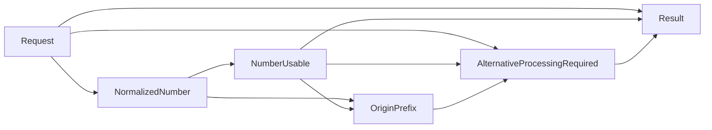

# Case 03 Fact-ready DMN - MMS 발신번호 권한과 대체 처리 판정

> 이 가이드는 CSMAUX004 결과와 MMS 발신번호를 기존 애플리케이션 또는 adapter가 이미 조립한 뒤, BAMOE Decision Service를 한 번 호출하는 버전이다. DMN은 대체 처리 필요 여부를 결과로만 반환하며 실제 side effect는 외부 코드가 수행한다.

[Fact-ready DMN-only 공통 가이드로 돌아가기](README.md)

## 1. 이 버전을 적용하는 시점

- 기존 코드가 CSMAUX004 호출과 기술 오류 처리를 이미 담당한다.
- BAMOE에는 권한 결과, 번호 정규화, 접두어 정책, 대체 처리 필요 여부만 맡긴다.
- DMN 호출 시점에는 CSMAUX004의 정상 업무 응답이 반드시 준비되어 있다.
- 외부 코드는 `alternativeProcessingRequired = true`일 때 실제 대체 처리를 실행한다.

CSMAUX004가 아직 `NOT_CHECKED`이거나 결과가 누락되면 최종 `INVALID_INPUT`이다. `DENIED`일 때 필요한 발신번호가 없거나 앞뒤 공백 제거 후 3자리보다 짧아도 `INVALID_INPUT`이다.

## 2. 기존 모델과 함께 사용할 별도 자산

| 항목 | 값 |
|---|---|
| DMN 파일 | `src/main/resources/dmn/Case03MmsSendAuthorityFactReady.dmn` |
| Model Name | `Case03MmsSendAuthorityFactReady` |
| Namespace | `https://example.com/bamoe/poc/fact-ready/case03/v1` |
| Input Data | `Request` |
| 최종 Decision | `Result` |
| Decision Service | `Case03FactReadyService` |
| SCESIM | `src/test/resources/scesim/Case03MmsSendAuthorityFactReadyTest.scesim` |

기존 `Case03MmsSendAuthority.dmn`과 이름, namespace, endpoint가 겹치지 않는다.

## 3. 외부 fact 계약과 책임 경계

| Field | Type | 외부 조립 규칙 |
|---|---|---|
| `csmAux004Result` | `AuthResult` | 완료된 CSMAUX004 업무 결과 |
| `mmsOriginNumber` | `string` | MMS 발신번호 원문; DMN이 앞뒤 whitespace만 제거 |

```json
{
  "Request": {
    "csmAux004Result": "DENIED",
    "mmsOriginNumber": " 01712345678 "
  }
}
```

권한이 `GRANTED`이거나 `ERROR`이면 번호는 정책 계산에 사용하지 않는다. `DENIED`이면 usable한 번호가 조건부 필수 fact다.

### 실제 대체 처리

Decision Service가 다음처럼 반환하면 외부 코드가 대체 처리를 수행한다.

```json
{
  "status": "ALLOW",
  "reasonCode": "ALTERNATIVE_PROCESSING_REQUIRED",
  "nextAction": "ALTERNATIVE_PROCESSING",
  "alternativeProcessingRequired": true
}
```

DMN은 DB 변경, REST 호출, 번호 변환 side effect를 수행하지 않는다. 실제 처리의 timeout, retry, idempotency, 보상 정책도 외부 코드 책임이다.

### 기술 실패를 payload로 위조하지 않는다

- CSMAUX004가 HTTP 200 body로 업무 값 `ERROR`를 반환했을 때만 `"csmAux004Result": "ERROR"`를 전달한다.
- timeout, 연결 실패, HTTP 4xx/5xx, malformed body는 DMN을 호출하기 전 기술 실패로 처리한다.
- 기술 장애를 `"ERROR"`로 바꾸면 provider가 실제로 반환한 업무 오류와 구분할 수 없다.

## 4. 고객 원문 규칙

1. CSMAUX004 결과가 `ERROR`이면 시스템 오류다.
2. 결과가 `DENIED`이면 `mms_org_no`의 앞뒤 공백을 제거한다.
3. 정규화한 번호의 앞 3자리를 구한다.
4. 접두어가 다음 7개 중 하나이면 대체 업무 처리가 필요하다.

```text
010, 011, 012, 016, 017, 018, 019
```

5. `DENIED`라도 시스템 오류가 아니면 기본 업무 결과는 거절이 아니라 계속 진행이다.
6. 대체 처리 여부만 별도 boolean으로 반환한다.

## 5. UI에서 DMN 파일 만들기

1. `/Users/jihunkeom/Desktop/projects/2026/SKT/skt_bamoe_party/prelim/test`를 VS Code로 연다.
2. `src/main/resources/dmn/Case03MmsSendAuthorityFactReady.dmn`을 만든다.
3. `Reopen Editor With...` → **Modern BAMOE DMN Editor**를 선택한다.
4. Model Properties를 다음과 같이 설정한다.

| Property | 값 |
|---|---|
| Name | `Case03MmsSendAuthorityFactReady` |
| Namespace | `https://example.com/bamoe/poc/fact-ready/case03/v1` |

5. 저장하고 다시 열어 Name과 Namespace가 유지되는지 확인한다.

## 6. Data Types

### 6.1 `AuthResult`

Base type은 `string`이다.

```feel
"GRANTED", "DENIED", "ERROR", "NOT_CHECKED"
```

### 6.2 `DecisionStatus`

```feel
"ALLOW", "DENY", "SYSTEM_ERROR", "INVALID_INPUT"
```

이 사례의 Result는 `DENY`를 실제로 반환하지 않지만, 여섯 모델의 공통 결과
계약을 유지하기 위해 enum에는 포함한다. CSMAUX004의 `DENIED`를 곧바로 업무
`DENY`로 매핑하면 안 된다.

### 6.3 `tCase03FactReadyRequest`

| Field | Type |
|---|---|
| `csmAux004Result` | `AuthResult` |
| `mmsOriginNumber` | `string` |

### 6.4 `tCase03FactReadyResult`

| Field | Type |
|---|---|
| `status` | `DecisionStatus` |
| `reasonCode` | `string` |
| `reasonMessage` | `string` |
| `nextAction` | `string` |
| `alternativeProcessingRequired` | `boolean` |

## 7. DRD와 모든 Decision output type

### 7.1 Node

| 종류 | 이름 | Decision output type |
|---|---|---|
| Input Data | `Request` | `tCase03FactReadyRequest` |
| Decision | `NormalizedNumber` | `string` |
| Decision | `NumberUsable` | `boolean` |
| Decision | `OriginPrefix` | `string` |
| Decision | `AlternativeProcessingRequired` | `boolean` |
| Decision | `Result` | `tCase03FactReadyResult` |

이 표의 type은 **Decision node의 output type**이다. 이 가이드의 최종 `Result`는
여러 output column을 가진 구조 결과이므로 9.2의 각 output column Type도
명시한다. 단일 output Decision Table도 Decision node와 output column에 같은
type을 지정해 이 프로젝트의 BAMOE `9.5.0-ibm-0005` 기준과 맞춘다.

### 7.2 Information Requirement



## 8. Helper Decision

각 Decision의 Expression type은 `Literal Expression`이다.

### 8.1 `NormalizedNumber` → `string`

```feel
if Request.csmAux004Result = "DENIED"
then if Request.mmsOriginNumber = null
     then null
     else replace(Request.mmsOriginNumber, "^\\s+|\\s+$", "")
else null
```

정규식은 번호 앞뒤의 whitespace만 제거한다. 번호 중간 공백, 하이픈, 국가번호는 임의로 바꾸지 않는다.

### 8.2 `NumberUsable` → `boolean`

```feel
NormalizedNumber != null
and string length(NormalizedNumber) >= 3
```

### 8.3 `OriginPrefix` → `string`

```feel
if NumberUsable
then substring(NormalizedNumber, 1, 3)
else null
```

FEEL의 문자열 첫 index는 1이다.

### 8.4 `AlternativeProcessingRequired` → `boolean`

```feel
Request.csmAux004Result = "DENIED"
and NumberUsable
and list contains(
  ["010", "011", "012", "016", "017", "018", "019"],
  OriginPrefix
)
```

원문 목록의 `017`을 빠뜨리지 않는다.

## 9. 최종 `Result` Decision Table

| UI 설정 | 값 |
|---|---|
| Expression type | `Decision Table` |
| Decision Output data type | `tCase03FactReadyResult` |
| Hit Policy | `Unique (U)` |

### 9.1 Input columns

| Input Expression | Type |
|---|---|
| `Request.csmAux004Result` | `AuthResult` |
| `NumberUsable` | `boolean` |
| `AlternativeProcessingRequired` | `boolean` |

### 9.2 Output columns

| Output Name | Type |
|---|---|
| `status` | `DecisionStatus` |
| `reasonCode` | `string` |
| `reasonMessage` | `string` |
| `nextAction` | `string` |
| `alternativeProcessingRequired` | `boolean` |

### 9.3 전체 Rule rows

| # | Auth | Number usable | Alternative | status | reasonCode | reasonMessage | nextAction | alternativeProcessingRequired |
|---:|---|---:|---:|---|---|---|---|---:|
| 1 | `"ERROR"` | `-` | `-` | `"SYSTEM_ERROR"` | `"CSMAUX004_BODY_ERROR"` | `"CSMAUX004가 업무 오류를 반환했습니다."` | `"RETURN_ERROR"` | `false` |
| 2 | `"NOT_CHECKED"` | `-` | `-` | `"INVALID_INPUT"` | `"CSMAUX004_RESULT_REQUIRED"` | `"완료된 CSMAUX004 권한 결과가 필요합니다."` | `"FIX_INPUT"` | `false` |
| 3 | `null` | `-` | `-` | `"INVALID_INPUT"` | `"CSMAUX004_RESULT_REQUIRED"` | `"완료된 CSMAUX004 권한 결과가 필요합니다."` | `"FIX_INPUT"` | `false` |
| 4 | `"GRANTED"` | `-` | `-` | `"ALLOW"` | `"PRIMARY_AUTH_GRANTED"` | `"CSMAUX004 권한이 승인되었습니다."` | `"CONTINUE"` | `false` |
| 5 | `"DENIED"` | `false` | `-` | `"INVALID_INPUT"` | `"MMS_ORIGIN_NUMBER_INVALID"` | `"발신번호의 앞 3자리를 확인할 수 없습니다."` | `"FIX_INPUT"` | `false` |
| 6 | `"DENIED"` | `true` | `true` | `"ALLOW"` | `"ALTERNATIVE_PROCESSING_REQUIRED"` | `"대체 처리 대상 발신번호이므로 대체 처리가 필요합니다."` | `"ALTERNATIVE_PROCESSING"` | `true` |
| 7 | `"DENIED"` | `true` | `false` | `"ALLOW"` | `"NORMAL_PROCESSING"` | `"대체 처리 대상이 아니므로 정상 처리를 계속합니다."` | `"CONTINUE"` | `false` |

`NOT_CHECKED`와 null은 같은 결과지만 SCESIM에서 각각 확인하기 쉽도록 별도 행으로 만들었다. `DENIED` 세 행의 status가 `DENY`가 아니라는 점을 다시 확인한다.

## 10. Decision Service

1. `Decision Service`를 추가한다.
2. 이름을 `Case03FactReadyService`로 지정한다.
3. `Result`를 Output Decisions에 넣는다.
4. 다음을 Encapsulated Decisions에 넣는다.
   - `NormalizedNumber`
   - `NumberUsable`
   - `OriginPrefix`
   - `AlternativeProcessingRequired`
5. `Request`가 service input인지 확인한다.

```text
Case03FactReadyService
├─ Input: Request
├─ Encapsulated
│  ├─ NormalizedNumber
│  ├─ NumberUsable
│  ├─ OriginPrefix
│  └─ AlternativeProcessingRequired
└─ Output: Result
```

Decision Service 자체에는 별도 output type을 강제로 지정하지 않는다. 유일한
Output Decision `Result`의 `tCase03FactReadyResult`에서 service 응답 type이
파생된다.

## 11. SCESIM

### 11.1 파일과 Settings

1. `src/test/resources/scesim/Case03MmsSendAuthorityFactReadyTest.scesim`을 만든다.
2. `Reopen Editor With...` → `(classic)`이 붙지 않은 **BAMOE Test Scenario Editor**를 선택한다.
3. Asset type은 `Decision (DMN)`, DMN file은 `Case03MmsSendAuthorityFactReady.dmn`으로 지정한다.
4. `Autofill DMN Data`는 해제한다.
5. Settings를 확인한다.

| 설정 | 값 |
|---|---|
| DMN Name | `Case03MmsSendAuthorityFactReady` |
| DMN Namespace | `https://example.com/bamoe/poc/fact-ready/case03/v1` |
| Skip this test scenario | 선택 해제 |

### 11.2 GIVEN과 EXPECT

GIVEN:

- `Request.csmAux004Result`
- `Request.mmsOriginNumber`

EXPECT:

- `NormalizedNumber.value`
- `NumberUsable.value`
- `OriginPrefix.value`
- `AlternativeProcessingRequired.value`
- `Result.status`
- `Result.reasonCode`
- `Result.reasonMessage`
- `Result.nextAction`
- `Result.alternativeProcessingRequired`

문자열과 앞뒤 공백은 따옴표 안에 넣는다. 아래 표의 `status`,
`reasonCode`, `reasonMessage`, `nextAction`도 표시된 **큰따옴표까지 포함한**
FEEL string을 실제 EXPECT cell에 그대로 입력한다. EXPECT의 null을 확인할
때는 cell을 비우지 말고 `null`을 입력한다.

### 11.3 대표 시나리오

| ID | Auth | Number | Normalized | Usable | Prefix | Alternative | status | reasonCode | reasonMessage | nextAction |
|---|---|---|---|---:|---|---:|---|---|---|---|
| `C03-FR-01` | `"ERROR"` | `"01012345678"` | `null` | `false` | `null` | `false` | `"SYSTEM_ERROR"` | `"CSMAUX004_BODY_ERROR"` | `"CSMAUX004가 업무 오류를 반환했습니다."` | `"RETURN_ERROR"` |
| `C03-FR-02` | `"NOT_CHECKED"` | `"01012345678"` | `null` | `false` | `null` | `false` | `"INVALID_INPUT"` | `"CSMAUX004_RESULT_REQUIRED"` | `"완료된 CSMAUX004 권한 결과가 필요합니다."` | `"FIX_INPUT"` |
| `C03-FR-03` | `null` | `"01012345678"` | `null` | `false` | `null` | `false` | `"INVALID_INPUT"` | `"CSMAUX004_RESULT_REQUIRED"` | `"완료된 CSMAUX004 권한 결과가 필요합니다."` | `"FIX_INPUT"` |
| `C03-FR-04` | `"GRANTED"` | `"01012345678"` | `null` | `false` | `null` | `false` | `"ALLOW"` | `"PRIMARY_AUTH_GRANTED"` | `"CSMAUX004 권한이 승인되었습니다."` | `"CONTINUE"` |
| `C03-FR-05` | `"DENIED"` | `"01"` | `"01"` | `false` | `null` | `false` | `"INVALID_INPUT"` | `"MMS_ORIGIN_NUMBER_INVALID"` | `"발신번호의 앞 3자리를 확인할 수 없습니다."` | `"FIX_INPUT"` |
| `C03-FR-06` | `"DENIED"` | `" 01612345678 "` | `"01612345678"` | `true` | `"016"` | `true` | `"ALLOW"` | `"ALTERNATIVE_PROCESSING_REQUIRED"` | `"대체 처리 대상 발신번호이므로 대체 처리가 필요합니다."` | `"ALTERNATIVE_PROCESSING"` |
| `C03-FR-07` | `"DENIED"` | `"01312345678"` | `"01312345678"` | `true` | `"013"` | `false` | `"ALLOW"` | `"NORMAL_PROCESSING"` | `"대체 처리 대상이 아니므로 정상 처리를 계속합니다."` | `"CONTINUE"` |
| `C03-FR-017` | `"DENIED"` | `"01712345678"` | `"01712345678"` | `true` | `"017"` | `true` | `"ALLOW"` | `"ALTERNATIVE_PROCESSING_REQUIRED"` | `"대체 처리 대상 발신번호이므로 대체 처리가 필요합니다."` | `"ALTERNATIVE_PROCESSING"` |

`C03-FR-017`은 원문 목록의 `017` 누락을 잡는 필수 회귀 행이다.
`C03-FR-06`에서 이미 공백이 포함된 `016`도 확인했다. 나머지 다섯 접두어를
확인하려면 다음 5개 행을 복제해 같은 결과를 기대한다.

| Prefix | Number |
|---|---|
| `010` | `"01012345678"` |
| `011` | `"01112345678"` |
| `012` | `"01212345678"` |
| `018` | `"01812345678"` |
| `019` | `"01912345678"` |

복제한 5개 행도 모두 다음 EXPECT를 실제 cell에 입력한다.

| EXPECT | 값 |
|---|---|
| `AlternativeProcessingRequired.value` | `true` |
| `Result.status` | `"ALLOW"` |
| `Result.reasonCode` | `"ALTERNATIVE_PROCESSING_REQUIRED"` |
| `Result.reasonMessage` | `"대체 처리 대상 발신번호입니다."` |
| `Result.nextAction` | `"ALTERNATIVE_PROCESSING"` |
| `Result.alternativeProcessingRequired` | `true` |

### 11.4 저장과 실행

```bash
cd "/Users/jihunkeom/Desktop/projects/2026/SKT/skt_bamoe_party/prelim/test"

READY=1
for asset in \
  src/main/resources/dmn/Case03MmsSendAuthorityFactReady.dmn \
  src/test/resources/scesim/Case03MmsSendAuthorityFactReadyTest.scesim
do
  if test -s "$asset"; then
    echo "[OK] $asset"
  else
    echo "[MISSING/EMPTY] $asset"
    READY=0
  fi
done

ACTIVATOR='src/test/java/testscenario/TestScenarioJunitActivatorTest.java'
if test -s "$ACTIVATOR" && rg -q '@TestScenarioActivator' "$ACTIVATOR"; then
  echo "[OK] project-wide Test Scenario activator"
else
  echo "[MISSING/INVALID] $ACTIVATOR"
  READY=0
fi

DMN_FILE='src/main/resources/dmn/Case03MmsSendAuthorityFactReady.dmn'
for prefix in 010 011 012 016 017 018 019; do
  if rg -q "\"$prefix\"" "$DMN_FILE"; then
    echo "[OK] $prefix"
  else
    echo "[MISSING] $prefix"
    READY=0
  fi
done

if test "$READY" -eq 1; then
  mvn -s config/settings-bamoe-container.xml clean test
else
  echo "[SKIP] UI 자산, activator와 접두어 목록을 수정한 뒤 다시 실행"
fi
```

접두어 `[OK]`가 7번 보여야 하며 모든 Gate가 통과한 경우 Maven은
`Failures: 0`, `Errors: 0`, `BUILD SUCCESS`여야 한다. 누락이 있으면 XML을
직접 편집하지 말고 DMN Editor에서 `AlternativeProcessingRequired`를 수정한다.

## 12. Maven build와 server

### 12.1 build

```bash
cd "/Users/jihunkeom/Desktop/projects/2026/SKT/skt_bamoe_party/prelim/test"
mvn -s config/settings-bamoe-container.xml clean verify
```

### 12.2 Terminal A

```bash
mvn -s config/settings-bamoe-container.xml spring-boot:run
```

`Started BamoeSpringBootApplication`이 보이면 Terminal A를 유지한다.

### 12.3 Terminal B readiness

```bash
ready=0

for attempt in {1..30}; do
  if curl -fsS 'http://127.0.0.1:8080/v3/api-docs' >/dev/null 2>&1; then
    ready=1
    break
  fi
  sleep 2
done

test "$ready" -eq 1
```

## 13. OpenAPI의 네 endpoint

```bash
set -o pipefail

curl --fail-with-body -sS \
  'http://127.0.0.1:8080/v3/api-docs' \
  | jq -e -r '
      [
        .paths | keys[]
        | select(contains("Case03MmsSendAuthorityFactReady"))
      ] as $paths
      | if ($paths | length) == 4
        then $paths[]
        else error(
          "expected 4 Case03 FactReady endpoints: \($paths | tojson)"
        )
        end
    '
```

일반적으로 다음 네 path가 생성된다.

```text
/Case03MmsSendAuthorityFactReady
/Case03MmsSendAuthorityFactReady/dmnresult
/Case03MmsSendAuthorityFactReady/Case03FactReadyService
/Case03MmsSendAuthorityFactReady/Case03FactReadyService/dmnresult
```

| endpoint | 응답과 용도 |
|---|---|
| model | 번호 정규화, 접두어, 대체 처리 여부, `Result` |
| model `/dmnresult` | 전체 Decision 평가 상태와 message |
| Decision Service | 공개 계약인 `Result` |
| Decision Service `/dmnresult` | service 경계 상세 진단 |

## 14. curl 검증

### 14.1 Decision Service - 대체 처리 필요

```bash
SERVICE_URL='http://127.0.0.1:8080/Case03MmsSendAuthorityFactReady/Case03FactReadyService'
set -o pipefail

curl --fail-with-body -sS -X POST \
  "$SERVICE_URL" \
  -H 'Content-Type: application/json' \
  -H 'Accept: application/json' \
  -d '{
    "Request": {
      "csmAux004Result": "DENIED",
      "mmsOriginNumber": " 01712345678 "
    }
  }' | jq -e '
      if (
        .status == "ALLOW"
        and .reasonCode == "ALTERNATIVE_PROCESSING_REQUIRED"
        and .reasonMessage
          == "대체 처리 대상 발신번호이므로 대체 처리가 필요합니다."
        and .nextAction == "ALTERNATIVE_PROCESSING"
        and .alternativeProcessingRequired == true
      )
      then {
          status,
          reasonCode,
          reasonMessage,
          nextAction,
          alternativeProcessingRequired
        }
      else error("CASE03_ALTERNATIVE_ASSERTION_FAILED: \(. | tojson)")
      end
    '
```

예상: `ALLOW / ALTERNATIVE_PROCESSING_REQUIRED / ALTERNATIVE_PROCESSING / true`.

### 14.2 Decision Service - 미조립 권한 fact

```bash
curl --fail-with-body -sS -X POST \
  "$SERVICE_URL" \
  -H 'Content-Type: application/json' \
  -H 'Accept: application/json' \
  -d '{
    "Request": {
      "csmAux004Result": "NOT_CHECKED",
      "mmsOriginNumber": "01012345678"
    }
  }' | jq -e '
      if (
        .status == "INVALID_INPUT"
        and .reasonCode == "CSMAUX004_RESULT_REQUIRED"
        and .reasonMessage
          == "완료된 CSMAUX004 권한 결과가 필요합니다."
        and .nextAction == "FIX_INPUT"
        and .alternativeProcessingRequired == false
      )
      then {
          status,
          reasonCode,
          reasonMessage,
          nextAction,
          alternativeProcessingRequired
        }
      else error("CASE03_INCOMPLETE_FACT_ASSERTION_FAILED: \(. | tojson)")
      end
    '
```

예상: `INVALID_INPUT / CSMAUX004_RESULT_REQUIRED / FIX_INPUT`.

### 14.3 전체 model

```bash
MODEL_URL='http://127.0.0.1:8080/Case03MmsSendAuthorityFactReady'

curl --fail-with-body -sS -X POST \
  "$MODEL_URL" \
  -H 'Content-Type: application/json' \
  -d '{
    "Request": {
      "csmAux004Result": "DENIED",
      "mmsOriginNumber": " 01612345678 "
    }
  }' | jq -e '
      if (
        .NormalizedNumber == "01612345678"
        and .NumberUsable == true
        and .OriginPrefix == "016"
        and .AlternativeProcessingRequired == true
        and .Result.status == "ALLOW"
        and .Result.reasonCode == "ALTERNATIVE_PROCESSING_REQUIRED"
        and .Result.reasonMessage
          == "대체 처리 대상 발신번호이므로 대체 처리가 필요합니다."
        and .Result.nextAction == "ALTERNATIVE_PROCESSING"
        and .Result.alternativeProcessingRequired == true
      )
      then {
          NormalizedNumber,
          NumberUsable,
          OriginPrefix,
          AlternativeProcessingRequired,
          Result
        }
      else error("CASE03_MODEL_ASSERTION_FAILED: \(. | tojson)")
      end
    '
```

### 14.4 `/dmnresult` 진단

```bash
curl --fail-with-body -sS -X POST \
  "${MODEL_URL}/dmnresult" \
  -H 'Content-Type: application/json' \
  -d '{
    "Request": {
      "csmAux004Result": "DENIED",
      "mmsOriginNumber": "01312345678"
    }
  }' | jq -e '
      if (
        .modelName == "Case03MmsSendAuthorityFactReady"
        and .messages == []
        and (.decisionResults | type == "array")
        and (.decisionResults | length > 0)
        and all(
          .decisionResults[];
          .evaluationStatus == "SUCCEEDED"
        )
        and .dmnContext.Result.status == "ALLOW"
        and .dmnContext.Result.reasonCode == "NORMAL_PROCESSING"
        and .dmnContext.Result.reasonMessage
          == "대체 처리 대상이 아니므로 정상 처리를 계속합니다."
        and .dmnContext.Result.nextAction == "CONTINUE"
        and .dmnContext.Result.alternativeProcessingRequired == false
      )
      then {
          namespace,
          modelName,
          result: .dmnContext.Result,
          messages,
          decisions: [
            .decisionResults[] |
            {decisionName, evaluationStatus, messages}
          ]
        }
      else error("CASE03_DMNRESULT_ASSERTION_FAILED: \(. | tojson)")
      end
    '
```

확인할 것:

- `modelName = Case03MmsSendAuthorityFactReady`
- 최상위 `messages`가 빈 배열
- 모든 `evaluationStatus = SUCCEEDED`
- `.dmnContext.Result = ALLOW / NORMAL_PROCESSING / CONTINUE / false`

`INVALID_INPUT`과 `SYSTEM_ERROR`는 정상적으로 산출할 수 있는 업무 결과다. DMN 엔진의 `evaluationStatus: FAILED`와 구분한다.

### 14.5 서버 종료

curl 검증이 끝나면 server를 실행한 Terminal에서 `Ctrl+C`를 누른다. 다음
Fact-ready 모델을 추가한 뒤에는 새 runtime을 시작해야 하므로 기존 8080 server를
남겨 두지 않는다.

```bash
if lsof -nP -iTCP:8080 -sTCP:LISTEN; then
  echo 'STOP: 기존 Fact-ready server를 먼저 종료하세요.' >&2
  false
else
  echo 'FACT_READY_SERVER_STOP_GATE=PASS'
fi
```

## 15. 완료 체크리스트

- [ ] `Case03MmsSendAuthorityFactReady.dmn`을 별도 파일로 만들었다.
- [ ] fact-ready 전용 Model Name과 Namespace를 사용한다.
- [ ] 모든 Decision node의 output type을 지정했다.
- [ ] 구조 결과 `Result`의 각 output column type을 지정했다.
- [ ] 원문 접두어 `010, 011, 012, 016, 017, 018, 019`가 모두 있다.
- [ ] `NOT_CHECKED`와 null 권한 결과는 `INVALID_INPUT`이다.
- [ ] `DENIED`일 때만 발신번호의 usable 여부를 요구한다.
- [ ] `DENIED`가 최종 `DENY`로 잘못 변환되지 않는다.
- [ ] DMN은 `alternativeProcessingRequired`를 반환하기만 한다.
- [ ] 실제 대체 처리와 idempotency는 외부 코드 책임으로 남겼다.
- [ ] Decision Service 이름이 `Case03FactReadyService`다.
- [ ] SCESIM과 Maven build가 성공한다.
- [ ] OpenAPI의 네 endpoint를 확인했다.
- [ ] Decision Service curl과 `/dmnresult` 진단을 실행했다.
- [ ] curl 검증 후 8080 server를 종료했다.
- [ ] HTTP 기술 실패를 `"ERROR"` payload로 위조하지 않는다.
