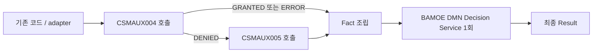
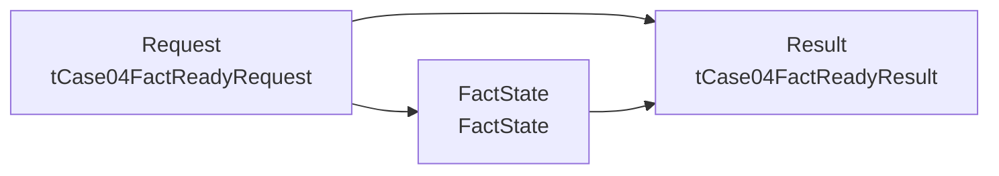

# Case 04 Fact-ready - CSMAUX004/005 대체 권한 DMN-only

> **이 문서의 버전**
>
> 외부 adapter 또는 기존 애플리케이션 코드가 CSMAUX004/005 호출을 끝내고,
> 완성된 fact를 BAMOE Decision Service에 한 번 전달하는 버전이다.
>
> - BPMN을 만들지 않는다.
> - DMN은 외부 API를 호출하거나 다음 호출을 지시하지 않는다.
> - `NEEDS_EVIDENCE`와 `PolicyStep`을 사용하지 않는다.
> - 정상 호출은 항상 최종 `Result`를 한 번 반환한다.
> - 필요한 fact가 없거나 호출 순서와 모순되면 `INVALID_INPUT`을 반환한다.

[Fact-ready DMN-only 공통 가이드로 돌아가기](README.md)

---

## 1. 언제 이 버전을 선택하는가

다음 조건이면 이 DMN-only 버전이 적합하다.

- CSMAUX004/005를 호출하는 adapter나 기존 Java 서비스가 이미 있다.
- adapter가 004 결과에 따라 005 호출 여부를 결정할 수 있다.
- BAMOE에는 최종 권한 판정과 사유를 중앙화하고 싶다.
- 장기 실행, 재시도, process 상태 추적이 필요하지 않다.

전체 실행 구조는 다음과 같다.



이 구조에서는 **호출 절차가 코드에 남는다**. DMN이 보여 주는 가치는 다음으로
한정된다.

- 최종 조합 규칙의 시각화
- 입력 계약의 방어적 검증
- 결과와 사유 코드의 표준화
- SCESIM 기반 회귀 테스트
- Decision Service를 통한 독립 배포·호출

반대로 “004가 DENIED일 때만 005를 호출한다”는 실행 흐름까지 BAMOE에서
보여 주려면 BPMN 버전을 사용해야 한다.

---

## 2. 고객 원문 규칙

```text
CSMAUX004 = GRANTED
OR
(CSMAUX004 = DENIED AND CSMAUX005 = GRANTED)
```

오류와 호출 순서를 포함한 최종 규칙은 다음과 같다.

1. CSMAUX004는 항상 먼저 호출한다.
2. 004가 `GRANTED`이면 005를 호출하지 않고 `ALLOW`다.
3. 004가 HTTP 200 body `ERROR`이면 005를 호출하지 않고 `SYSTEM_ERROR`다.
4. 004가 `DENIED`일 때만 005를 호출한다.
5. 005가 `GRANTED`이면 `ALLOW`다.
6. 005가 `DENIED`이면 `DENY`다.
7. 005가 HTTP 200 body `ERROR`이면 `SYSTEM_ERROR`다.

### 2.1 중요한 오류 경계

`AuthResult.ERROR`는 provider가 **정상 HTTP 응답 body**로 반환한 업무 결과다.

다음 기술 실패를 adapter가 임의로 `"ERROR"`로 바꾸면 안 된다.

- HTTP 4xx/5xx
- timeout 또는 connection failure
- malformed JSON
- 알 수 없는 enum

이 경우 adapter는 BAMOE를 호출하지 않고 자체 기술 오류·재시도 정책으로 처리한다.
그래야 provider 업무 오류와 통신 장애의 감사 의미가 섞이지 않는다.

---

## 3. Fact-ready 입력 계약

adapter가 DMN에 전달할 `Request`는 다음 두 fact로 구성한다.

| Field | Type | 의미 |
|---|---|---|
| `csmAux004Result` | `AuthResult` | 항상 수집된 004 body 결과 |
| `csmAux005Result` | `AuthResult` | 조건부 005 결과 또는 `NOT_CHECKED` |

허용되는 조합은 정확히 다음과 같다.

| 004 | 005 | 계약 의미 |
|---|---|---|
| `GRANTED` | `NOT_CHECKED` | 004에서 승인되어 005 미호출 |
| `ERROR` | `NOT_CHECKED` | 004 body 오류로 종료되어 005 미호출 |
| `DENIED` | `GRANTED` | 005까지 호출 완료 |
| `DENIED` | `DENIED` | 005까지 호출 완료 |
| `DENIED` | `ERROR` | 005까지 호출 완료, 005 body 오류 |

다음은 DMN이 `INVALID_INPUT`으로 차단한다.

- 004가 `NOT_CHECKED` 또는 `null`
- 004가 `GRANTED`/`ERROR`인데 005 결과가 들어옴
- 004가 `DENIED`인데 005가 `NOT_CHECKED` 또는 `null`

`NOT_CHECKED`는 외부 호출이 필요하다는 요청이 아니다. 이 버전에서는 adapter가
호출하지 않아도 되는 fact를 명시하는 최종 값이다.

---

## 4. 만들 자산

현재 BPMN 중심 자산과 충돌하지 않도록 이름과 namespace를 모두 분리한다.

| 항목 | 값 |
|---|---|
| DMN | `src/main/resources/dmn/Case04FallbackAuthorityFactReady.dmn` |
| Model Name | `Case04FallbackAuthorityFactReady` |
| Namespace | `https://example.com/bamoe/poc/fact-ready/case04/v1` |
| Input Data | `Request` |
| Helper Decision | `FactState` |
| 최종 Decision | `Result` |
| Decision Service | `Case04FactReadyService` |
| SCESIM | `src/test/resources/scesim/Case04FallbackAuthorityFactReadyTest.scesim` |

BPMN, Mock server, Java 호출 코드는 이 실습에서 만들지 않는다.

---

## 5. UI로 Data Types 만들기

### 5.1 파일과 Model

1. Explorer에서 `src/main/resources/dmn`을 선택한다.
2. `Case04FallbackAuthorityFactReady.dmn`을 만든다.
3. 파일을 **Modern BAMOE DMN Editor**로 연다.
4. 빈 canvas를 선택하고 Model properties를 입력한다.

| Property | 값 |
|---|---|
| Name | `Case04FallbackAuthorityFactReady` |
| Namespace | `https://example.com/bamoe/poc/fact-ready/case04/v1` |

### 5.2 단순 타입

`Data Types` panel에서 다음 타입을 만든다. Enumeration/Constraints에는 아래 FEEL
literal을 그대로 입력한다.

`AuthResult`

```feel
"GRANTED", "DENIED", "ERROR", "NOT_CHECKED"
```

`FactState`

```feel
"PRIMARY_ONLY_VALID", "FALLBACK_VALID",
"PRIMARY_MISSING", "FALLBACK_MISSING", "UNEXPECTED_FALLBACK",
"INVALID_COMBINATION"
```

`DecisionStatus`

```feel
"ALLOW", "DENY", "SYSTEM_ERROR", "INVALID_INPUT"
```

`NextAction`

```feel
"CONTINUE", "STOP", "RETURN_ERROR", "FIX_INPUT"
```

### 5.3 구조 타입

`tCase04FactReadyRequest`를 Structure로 만든다.

| Field | Type |
|---|---|
| `csmAux004Result` | `AuthResult` |
| `csmAux005Result` | `AuthResult` |

`tCase04FactReadyResult`도 Structure로 만든다.

| Field | Type |
|---|---|
| `status` | `DecisionStatus` |
| `nextAction` | `NextAction` |
| `reasonCode` | `string` |
| `reasonMessage` | `string` |

`Result`에는 중간 상태가 없다. `status`는 네 최종 값 중 하나다.

---

## 6. DRD와 모든 Decision output type

canvas에 다음 node를 배치한다.

| 종류 | 이름 | Output data type |
|---|---|---|
| Input Data | `Request` | `tCase04FactReadyRequest` |
| Decision | `FactState` | `FactState` |
| Decision | `Result` | `tCase04FactReadyResult` |

Information Requirement를 다음처럼 연결한다.



각 Decision을 선택하고 Properties에서 output data type이 표와 일치하는지 확인한다.
Decision output type을 비워 두지 않는다.

이 표는 **Decision node의 output type**을 뜻한다. 단일 output Decision Table인
`FactState`의 output column Data Type과는 별도 설정이다.

---

## 7. `FactState` helper Decision Table

`FactState`를 열고 다음처럼 설정한다.

| 설정 | 값 |
|---|---|
| Expression | Decision Table |
| Output data type | `FactState` |
| Hit Policy | `First (F)` |

Input:

| Input Expression | Type |
|---|---|
| `Request.csmAux004Result` | `AuthResult` |
| `Request.csmAux005Result` | `AuthResult` |

Output column의 이름은 `FactState`로 지정하고, **output column Data Type도
`FactState`로 지정**한다. Decision node의 Output data type도 위 설정대로
`FactState`를 유지한다. 현재 실습에서 검증한 BAMOE `9.5.0-ibm-0005` 저장
형식과 맞추기 위한 기준이다.

| # | 004 | 005 | FactState |
|---:|---|---|---|
| 1 | `"NOT_CHECKED", null` | `-` | `"PRIMARY_MISSING"` |
| 2 | `"GRANTED", "ERROR"` | `"GRANTED", "DENIED", "ERROR"` | `"UNEXPECTED_FALLBACK"` |
| 3 | `"DENIED"` | `"NOT_CHECKED", null` | `"FALLBACK_MISSING"` |
| 4 | `"GRANTED", "ERROR"` | `"NOT_CHECKED"` | `"PRIMARY_ONLY_VALID"` |
| 5 | `"DENIED"` | `"GRANTED", "DENIED", "ERROR"` | `"FALLBACK_VALID"` |
| 6 | `-` | `-` | `"INVALID_COMBINATION"` |

6행은 `AuthResult`의 허용값 안에서 앞선 행이 다루지 못한 조합과 null 조합을
차단하는 fail-closed fallback이다. 허용 enum 밖의 값은 DMN type/evaluation
오류가 될 수 있으므로 2.1절처럼 adapter가 호출 전에 차단한다.

---

## 8. 최종 `Result` Decision Table

`Result`를 열고 다음처럼 설정한다.

| 설정 | 값 |
|---|---|
| Expression | Decision Table |
| Decision Output data type | `tCase04FactReadyResult` |
| Hit Policy | `First (F)` |

Input:

| Input Expression | Type |
|---|---|
| `FactState` | `FactState` |
| `Request.csmAux004Result` | `AuthResult` |
| `Request.csmAux005Result` | `AuthResult` |

Output:

| Output Name | Type |
|---|---|
| `status` | `DecisionStatus` |
| `nextAction` | `NextAction` |
| `reasonCode` | `string` |
| `reasonMessage` | `string` |

아래가 최종 Result의 **전체 행**이다. 문자열 output은 큰따옴표를 포함해 입력한다.

| # | FactState | 004 | 005 | status | nextAction | reasonCode | reasonMessage |
|---:|---|---|---|---|---|---|---|
| 1 | `"PRIMARY_MISSING"` | `-` | `-` | `"INVALID_INPUT"` | `"FIX_INPUT"` | `"PRIMARY_AUTH_RESULT_MISSING"` | `"CSMAUX004 결과가 필요합니다."` |
| 2 | `"FALLBACK_MISSING"` | `-` | `-` | `"INVALID_INPUT"` | `"FIX_INPUT"` | `"FALLBACK_AUTH_RESULT_MISSING"` | `"CSMAUX004가 거절이면 CSMAUX005 결과가 필요합니다."` |
| 3 | `"UNEXPECTED_FALLBACK"` | `-` | `-` | `"INVALID_INPUT"` | `"FIX_INPUT"` | `"UNEXPECTED_FALLBACK_RESULT"` | `"CSMAUX004 승인 또는 오류 뒤에는 CSMAUX005 결과가 없어야 합니다."` |
| 4 | `"INVALID_COMBINATION"` | `-` | `-` | `"INVALID_INPUT"` | `"FIX_INPUT"` | `"UNRECOGNIZED_FACT_COMBINATION"` | `"인식할 수 없는 권한 fact 조합입니다."` |
| 5 | `"PRIMARY_ONLY_VALID"` | `"GRANTED"` | `"NOT_CHECKED"` | `"ALLOW"` | `"CONTINUE"` | `"PRIMARY_AUTH_GRANTED"` | `"CSMAUX004 권한이 승인되었습니다."` |
| 6 | `"PRIMARY_ONLY_VALID"` | `"ERROR"` | `"NOT_CHECKED"` | `"SYSTEM_ERROR"` | `"RETURN_ERROR"` | `"CSMAUX004_BODY_ERROR"` | `"CSMAUX004가 업무 오류를 반환했습니다."` |
| 7 | `"FALLBACK_VALID"` | `"DENIED"` | `"GRANTED"` | `"ALLOW"` | `"CONTINUE"` | `"FALLBACK_AUTH_GRANTED"` | `"CSMAUX005 대체 권한이 승인되었습니다."` |
| 8 | `"FALLBACK_VALID"` | `"DENIED"` | `"DENIED"` | `"DENY"` | `"STOP"` | `"ALL_AUTH_DENIED"` | `"CSMAUX004와 CSMAUX005 권한이 모두 거절되었습니다."` |
| 9 | `"FALLBACK_VALID"` | `"DENIED"` | `"ERROR"` | `"SYSTEM_ERROR"` | `"RETURN_ERROR"` | `"CSMAUX005_BODY_ERROR"` | `"CSMAUX005가 업무 오류를 반환했습니다."` |
| 10 | `-` | `-` | `-` | `"INVALID_INPUT"` | `"FIX_INPUT"` | `"UNRECOGNIZED_FACT_COMBINATION"` | `"인식할 수 없는 권한 fact 조합입니다."` |

저장한 뒤 Editor의 `Analysis`에서 gap/overlap을 확인한다. `First`이므로 방어 행이
정상 판정 행보다 위에 있어야 한다.

---

## 9. Decision Service 만들기

1. DMN palette에서 `Decision Service`를 canvas에 추가한다.
2. 이름을 `Case04FactReadyService`로 지정한다.
3. `Result`를 Output Decision 영역에 넣는다.
4. `FactState`를 Encapsulated Decision 영역에 넣는다.
5. `Request`가 service input으로 노출되는지 확인한다.

Decision Service의 public 계약은 다음뿐이다.

```text
Request → Result
```

`FactState`는 내부 설명용 helper이므로 component endpoint의 public output으로
노출하지 않는다.

Decision Service 자체에는 별도 output type을 강제로 지정하지 않는다. 유일한
Output Decision인 `Result`의 `tCase04FactReadyResult`에서 service 응답 type이
파생된다.

---

## 10. SCESIM

### 10.1 파일 생성

1. `src/test/resources/scesim`에서
   `Case04FallbackAuthorityFactReadyTest.scesim`을 만든다.
2. `Reopen Editor With...` → `(classic)`이 붙지 않은 **BAMOE Test Scenario Editor**를 선택한다.
3. `DMN`을 선택한다.
4. DMN file로 `Case04FallbackAuthorityFactReady.dmn`을 선택한다.
5. Settings를 확인한다.

| Settings | 값 |
|---|---|
| DMN namespace | `https://example.com/bamoe/poc/fact-ready/case04/v1` |
| DMN name | `Case04FallbackAuthorityFactReady` |

### 10.2 GIVEN과 EXPECT

GIVEN:

- `Request.csmAux004Result`
- `Request.csmAux005Result`

EXPECT:

- `Result.status`
- `Result.nextAction`
- `Result.reasonCode`
- `Result.reasonMessage`

문자열은 `"GRANTED"`처럼 FEEL literal로 입력하고 null은 `null`로 입력한다.
아래 표는 읽기 쉽게 따옴표를 생략했지만, 실제 SCESIM 문자열 cell에는 반드시
`"GRANTED"`, `"ALLOW"`처럼 큰따옴표까지 입력한다. `reasonMessage`도 표에
표시된 문장 전체를 `"CSMAUX004 권한이 승인되었습니다."`처럼 큰따옴표로
감싸서 입력한다.

### 10.3 필수 scenario

| ID | 004 | 005 | status | nextAction | reasonCode | reasonMessage |
|---|---|---|---|---|---|---|
| C04-FR-01 | `GRANTED` | `NOT_CHECKED` | `ALLOW` | `CONTINUE` | `PRIMARY_AUTH_GRANTED` | `"CSMAUX004 권한이 승인되었습니다."` |
| C04-FR-02 | `ERROR` | `NOT_CHECKED` | `SYSTEM_ERROR` | `RETURN_ERROR` | `CSMAUX004_BODY_ERROR` | `"CSMAUX004가 업무 오류를 반환했습니다."` |
| C04-FR-03 | `DENIED` | `GRANTED` | `ALLOW` | `CONTINUE` | `FALLBACK_AUTH_GRANTED` | `"CSMAUX005 대체 권한이 승인되었습니다."` |
| C04-FR-04 | `DENIED` | `DENIED` | `DENY` | `STOP` | `ALL_AUTH_DENIED` | `"CSMAUX004와 CSMAUX005 권한이 모두 거절되었습니다."` |
| C04-FR-05 | `DENIED` | `ERROR` | `SYSTEM_ERROR` | `RETURN_ERROR` | `CSMAUX005_BODY_ERROR` | `"CSMAUX005가 업무 오류를 반환했습니다."` |
| C04-FR-06 | `NOT_CHECKED` | `NOT_CHECKED` | `INVALID_INPUT` | `FIX_INPUT` | `PRIMARY_AUTH_RESULT_MISSING` | `"CSMAUX004 결과가 필요합니다."` |
| C04-FR-07 | `DENIED` | `NOT_CHECKED` | `INVALID_INPUT` | `FIX_INPUT` | `FALLBACK_AUTH_RESULT_MISSING` | `"CSMAUX004가 거절이면 CSMAUX005 결과가 필요합니다."` |
| C04-FR-08 | `GRANTED` | `GRANTED` | `INVALID_INPUT` | `FIX_INPUT` | `UNEXPECTED_FALLBACK_RESULT` | `"CSMAUX004 승인 또는 오류 뒤에는 CSMAUX005 결과가 없어야 합니다."` |
| C04-FR-09 | `ERROR` | `DENIED` | `INVALID_INPUT` | `FIX_INPUT` | `UNEXPECTED_FALLBACK_RESULT` | `"CSMAUX004 승인 또는 오류 뒤에는 CSMAUX005 결과가 없어야 합니다."` |

SCESIM은 최종 fact 조합만 테스트한다. CSMAUX004/005의 실제 호출 순서는 adapter의
단위·통합 테스트에서 별도로 검증해야 한다.

project에 공통 activator가 이미 있으므로 case별 activator를 추가하지 않는다.

```bash
cd "/Users/jihunkeom/Desktop/projects/2026/SKT/skt_bamoe_party/prelim/test"

READY=1
for asset in \
  src/main/resources/dmn/Case04FallbackAuthorityFactReady.dmn \
  src/test/resources/scesim/Case04FallbackAuthorityFactReadyTest.scesim
do
  if test -s "$asset"; then
    echo "[OK] $asset"
  else
    echo "[MISSING/EMPTY] $asset"
    READY=0
  fi
done

ACTIVATOR='src/test/java/testscenario/TestScenarioJunitActivatorTest.java'
if test -s "$ACTIVATOR" && rg -q '@TestScenarioActivator' "$ACTIVATOR"; then
  echo "[OK] project-wide Test Scenario activator"
else
  echo "[MISSING/INVALID] $ACTIVATOR"
  READY=0
fi

test "$READY" -eq 1 \
  && echo "[READY] Maven 검증 가능" \
  || echo "[NOT READY] 누락 자산을 UI에서 저장한 뒤 다음 절로 이동"
```

`[READY]`일 때만 다음 Maven 절로 이동한다.

---

## 11. Maven build와 서버 시작

project root에서 테스트와 build를 실행한다.

```bash
cd "/Users/jihunkeom/Desktop/projects/2026/SKT/skt_bamoe_party/prelim/test"
mvn -s config/settings-bamoe-container.xml clean verify
```

`verify`가 SCESIM을 포함한 test phase도 실행하므로 별도의 `mvn test`를 먼저
중복 실행하지 않는다. Maven은 이 DMN만이 아니라 project의 모든 DMN/BPMN을
함께 검사한다. 오류 메시지가
다른 기존 자산을 가리키면 해당 자산의 미완성 여부를 먼저 확인한다. fact-ready
실습을 위해 기존 자산을 삭제하거나 덮어쓰지는 않는다.

서버를 시작한다.

```bash
mvn -s config/settings-bamoe-container.xml spring-boot:run
```

다른 terminal에서 readiness를 기다린다.

```bash
APP_READY=0
APP_READY_ATTEMPT=1

while [ "$APP_READY_ATTEMPT" -le 30 ]
do
  if curl -fsS \
      'http://127.0.0.1:8080/actuator/health' \
      2>/dev/null \
    | jq -e '.status == "UP"' >/dev/null
  then
    APP_READY=1
    break
  fi
  sleep 1
  APP_READY_ATTEMPT=$((APP_READY_ATTEMPT + 1))
done

if [ "$APP_READY" -eq 1 ]; then
  printf 'APP_READINESS_GATE=PASS\n'
else
  printf 'APP_READINESS_GATE=FAIL: BAMOE Terminal 로그를 확인하세요.\n' >&2
  false
fi
```

---

## 12. OpenAPI에서 네 endpoint 확인

경로를 추측해 바로 호출하지 말고 OpenAPI를 먼저 확인한다.

```bash
set -o pipefail

curl --fail-with-body -sS \
  'http://127.0.0.1:8080/v3/api-docs' \
  | jq -e -r '
      [
        .paths | keys[]
        | select(contains("Case04FallbackAuthorityFactReady"))
      ] as $paths
      | if ($paths | length) == 4
        then $paths[]
        else error(
          "expected 4 Case04 FactReady endpoints: \($paths | tojson)"
        )
        end
    '
```

일반적으로 다음 네 endpoint가 생성된다. 실제 OpenAPI 출력이 최종 기준이다.

| Endpoint | 반환 범위 |
|---|---|
| `/Case04FallbackAuthorityFactReady` | 전체 model context |
| `/Case04FallbackAuthorityFactReady/dmnresult` | 전체 model의 상세 평가 결과와 message |
| `/Case04FallbackAuthorityFactReady/Case04FactReadyService` | Decision Service의 최종 `Result` |
| `/Case04FallbackAuthorityFactReady/Case04FactReadyService/dmnresult` | Decision Service 범위 상세 평가 결과와 message |

---

## 13. Decision Service curl

```bash
DMN_URL='http://127.0.0.1:8080/Case04FallbackAuthorityFactReady/Case04FactReadyService'
DMN_RESULT_URL="${DMN_URL}/dmnresult"
set -o pipefail
```

004 거절, 005 승인 fact를 한 번에 전달한다.

```bash
curl --fail-with-body -sS -X POST "$DMN_URL" \
  -H 'Content-Type: application/json' \
  -d '{
    "Request": {
      "csmAux004Result": "DENIED",
      "csmAux005Result": "GRANTED"
    }
  }' | jq -e '
      if (
        .status == "ALLOW"
        and .reasonCode == "FALLBACK_AUTH_GRANTED"
        and .reasonMessage
          == "CSMAUX005 대체 권한이 승인되었습니다."
        and .nextAction == "CONTINUE"
      )
      then {status, reasonCode, reasonMessage, nextAction}
      else error("CASE04_FALLBACK_ASSERTION_FAILED: \(. | tojson)")
      end
    '
```

기대 결과의 핵심:

```json
{
  "status": "ALLOW",
  "nextAction": "CONTINUE",
  "reasonCode": "FALLBACK_AUTH_GRANTED"
}
```

Decision Service endpoint는 유일한 output Decision인 `Result` 객체를 바로
반환한다. 실제 field 계약은 OpenAPI schema를 최종 기준으로 확인한다.

같은 payload를 진단 endpoint에 보낸다.

```bash
curl --fail-with-body -sS -X POST "$DMN_RESULT_URL" \
  -H 'Content-Type: application/json' \
  -d '{
    "Request": {
      "csmAux004Result": "DENIED",
      "csmAux005Result": "GRANTED"
    }
  }' \
  | jq -e '
      if (
        .modelName == "Case04FallbackAuthorityFactReady"
        and .messages == []
        and (.decisionResults | type == "array")
        and (.decisionResults | length > 0)
        and all(
          .decisionResults[];
          .evaluationStatus == "SUCCEEDED"
        )
        and .dmnContext.Result.status == "ALLOW"
        and .dmnContext.Result.reasonCode == "FALLBACK_AUTH_GRANTED"
        and .dmnContext.Result.reasonMessage
          == "CSMAUX005 대체 권한이 승인되었습니다."
        and .dmnContext.Result.nextAction == "CONTINUE"
      )
      then {
          modelName,
          result: .dmnContext.Result,
          messages,
          decisionResults
        }
      else error("CASE04_DMNRESULT_ASSERTION_FAILED: \(. | tojson)")
      end
    '
```

`/dmnresult`에서는 `messages`가 비어 있고 `Result`의 `evaluationStatus`가
정상인지 확인한다. 테스트가 끝나면 서버 terminal에서 `Ctrl+C`를 누른다.

---

## 14. 이 버전의 한계

- 005 호출 조건과 호출 순서가 BAMOE 밖의 코드에 남는다.
- adapter가 잘못된 순서로 호출해도 DMN은 최종 fact 모순만 발견할 수 있다.
- timeout/retry/circuit breaker/감사 journal은 BAMOE DMN의 책임이 아니다.
- 규칙과 호출 흐름을 한 화면에서 설명할 수 없다.
- 호출 단계가 더 늘어나면 adapter의 `if/else`가 다시 복잡해질 수 있다.

따라서 이 버전은 **fact가 이미 준비되는 시스템에 Decision Service를 삽입하는
저위험 시작점**이다. 실행 흐름까지 모델링해야 할 때는 기존 BPMN+DMN 가이드로
전환한다.

---

## 15. 완료 체크리스트

### DMN

- [ ] `Case04FallbackAuthorityFactReady.dmn`을 별도 이름으로 만들었다.
- [ ] Model/namespace가 fact-ready 값과 정확히 일치한다.
- [ ] `Request`, `FactState`, `Result` node의 output type을 모두 지정했다.
- [ ] 단일 output인 `FactState` 표의 output column Data Type도 `FactState`다.
- [ ] 004 `GRANTED`와 `ERROR`일 때 005는 `NOT_CHECKED`만 허용한다.
- [ ] 004 `DENIED`일 때 005 `GRANTED`/`DENIED`/`ERROR`만 허용한다.
- [ ] 필요한 fact 누락과 모순은 `INVALID_INPUT`이다.
- [ ] `Case04FactReadyService`는 `Result`만 public output으로 노출한다.

### 테스트와 endpoint

- [ ] 9개 SCESIM scenario가 통과한다.
- [ ] Maven `clean verify`가 통과한다.
- [ ] actuator health가 `UP`이다.
- [ ] OpenAPI에서 model/service 각각 일반·`dmnresult` endpoint를 확인했다.
- [ ] representative Decision Service curl이 `ALLOW`를 반환한다.
- [ ] `/dmnresult`의 message와 evaluation status를 확인했다.

### 경계

- [ ] BPMN과 Mock server를 만들지 않았다.
- [ ] HTTP 기술 실패를 `AuthResult.ERROR`로 위조하지 않는다.
- [ ] adapter가 004→조건부 005 호출과 기술 오류를 책임진다는 점을 문서화했다.
