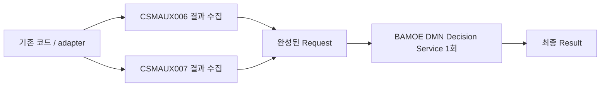
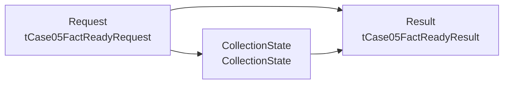

# Case 05 Fact-ready - CSMAUX006/007 복합 권한 DMN-only

> **이 문서의 버전**
>
> 외부 adapter 또는 기존 애플리케이션 코드가 CSMAUX006과 CSMAUX007 결과를
> 모두 수집한 뒤 BAMOE Decision Service를 한 번 호출하는 버전이다.
>
> - BPMN, Mock server, 중간 `PolicyStep`을 만들지 않는다.
> - DMN은 API를 호출하지 않으며 최종 `Result`만 반환한다.
> - 두 결과 중 하나라도 수집되지 않았으면 `INVALID_INPUT`이다.
> - 결과 완전성 검사를 `ERROR`, `DENY`, `ALLOW` 판정보다 먼저 수행한다.

[Fact-ready DMN-only 공통 가이드로 돌아가기](README.md)

---

## 1. 언제 이 버전을 선택하는가

다음 조건이면 DMN-only 구조가 가장 단순하다.

- CSMAUX006/007을 호출하는 기존 서비스가 이미 있다.
- 두 호출의 순서, 병렬성, timeout, retry를 해당 서비스가 책임진다.
- BAMOE에는 두 결과의 AND 정책과 표준 사유만 중앙화하려 한다.
- 장기 실행이나 process 상태 추적이 필요하지 않다.



006/007을 순차 또는 병렬로 호출할지는 이 DMN의 규칙이 아니다. 외부 계약, 감사
순서, rate limit과 취소 정책을 아는 adapter가 결정한다.

---

## 2. 고객 원문 규칙

```text
CSMAUX006 = GRANTED
AND
CSMAUX007 = GRANTED
→ ALLOW
```

최종 판정 규칙:

1. 006과 007 결과가 모두 수집되어야 한다.
2. 하나라도 HTTP 200 body `ERROR`이면 `SYSTEM_ERROR`다.
3. 둘 다 `GRANTED`인 경우에만 `ALLOW`다.
4. 완성된 정상 결과 조합에 `DENIED`가 하나라도 있으면 `DENY`다.
5. 두 결과가 모두 `ERROR`이면 006을 대표 오류 사유로 사용한다.

5번은 고객 원문의 새 업무 규칙이 아니라 결과를 결정적으로 만들기 위한 PoC
baseline이다. 운영 계약에서 오류 우선순위나 복수 오류 반환 방식을 다시 확정한다.

### 2.1 기술 실패와 body `ERROR`

`ERROR`는 provider가 HTTP 200 body로 반환한 업무 결과만 의미한다.

adapter는 다음 상황에서 DMN을 호출하지 않는다.

- HTTP 4xx/5xx
- timeout 또는 connection failure
- malformed JSON
- 알 수 없는 enum

기술 실패를 문자열 `"ERROR"`로 바꾸면 재시도 가능한 장애와 provider 업무
오류가 동일한 판정으로 섞이므로 금지한다.

---

## 3. Fact-ready 입력 계약

| Field | Type | 계약 |
|---|---|---|
| `csmAux006Result` | `AuthResult` | `GRANTED`/`DENIED`/`ERROR` 중 하나 |
| `csmAux007Result` | `AuthResult` | `GRANTED`/`DENIED`/`ERROR` 중 하나 |

`NOT_CHECKED`와 `null`은 입력 표현에는 허용하지만 정상 평가 fact가 아니다. 두 값
모두 수집되지 않은 결과로 해석하여 `INVALID_INPUT`을 반환한다.

이 완전성 규칙은 반드시 판정 규칙보다 먼저 적용한다. 예를 들어 다음 요청은
`SYSTEM_ERROR`가 아니다.

```json
{
  "csmAux006Result": "ERROR",
  "csmAux007Result": "NOT_CHECKED"
}
```

007을 수집하지 않았으므로 결과는 `INVALID_INPUT /
CSMAUX007_RESULT_NOT_COLLECTED`다.

---

## 4. 만들 자산

| 항목 | 값 |
|---|---|
| DMN | `src/main/resources/dmn/Case05CompositeAuthorityFactReady.dmn` |
| Model Name | `Case05CompositeAuthorityFactReady` |
| Namespace | `https://example.com/bamoe/poc/fact-ready/case05/v1` |
| Input Data | `Request` |
| Helper Decision | `CollectionState` |
| 최종 Decision | `Result` |
| Decision Service | `Case05FactReadyService` |
| SCESIM | `src/test/resources/scesim/Case05CompositeAuthorityFactReadyTest.scesim` |

기존 `Case05CompositeAuthority.dmn`을 복사하거나 이름만 바꾸지 않는다. 새 파일에서
별도 model/namespace로 만든다.

---

## 5. UI로 Data Types 만들기

### 5.1 파일과 Model

1. `src/main/resources/dmn` 아래에
   `Case05CompositeAuthorityFactReady.dmn`을 만든다.
2. **Modern BAMOE DMN Editor**로 연다.
3. 빈 canvas를 선택하고 Model properties를 입력한다.

| Property | 값 |
|---|---|
| Name | `Case05CompositeAuthorityFactReady` |
| Namespace | `https://example.com/bamoe/poc/fact-ready/case05/v1` |

### 5.2 단순 타입

`AuthResult`

```feel
"GRANTED", "DENIED", "ERROR", "NOT_CHECKED"
```

`CollectionState`

```feel
"COMPLETE", "MISSING_006", "MISSING_007"
```

`DecisionStatus`

```feel
"ALLOW", "DENY", "SYSTEM_ERROR", "INVALID_INPUT"
```

`NextAction`

```feel
"CONTINUE", "STOP", "RETURN_ERROR", "FIX_INPUT"
```

### 5.3 구조 타입

`tCase05FactReadyRequest`:

| Field | Type |
|---|---|
| `csmAux006Result` | `AuthResult` |
| `csmAux007Result` | `AuthResult` |

`tCase05FactReadyResult`:

| Field | Type |
|---|---|
| `status` | `DecisionStatus` |
| `nextAction` | `NextAction` |
| `reasonCode` | `string` |
| `reasonMessage` | `string` |

---

## 6. DRD와 모든 Decision output type

| 종류 | 이름 | Output data type |
|---|---|---|
| Input Data | `Request` | `tCase05FactReadyRequest` |
| Decision | `CollectionState` | `CollectionState` |
| Decision | `Result` | `tCase05FactReadyResult` |

Information Requirement:



각 Decision을 선택하여 output type을 명시한다. `Result`만 지정하고 helper의
output type을 비워 두지 않는다.

---

## 7. `CollectionState` helper Decision Table

| 설정 | 값 |
|---|---|
| Expression | Decision Table |
| Output data type | `CollectionState` |
| Hit Policy | `First (F)` |

Input:

| Input Expression | Type |
|---|---|
| `Request.csmAux006Result` | `AuthResult` |
| `Request.csmAux007Result` | `AuthResult` |

Output column 이름은 `CollectionState`로 둔다. `CollectionState` type은
**Decision node의 Output data type**과 단일 output column의 Data Type 양쪽에
지정한다. 현재 실습에서 검증한 BAMOE `9.5.0-ibm-0005` 저장 형식과 맞추기 위한
기준이다.

| # | 006 | 007 | CollectionState |
|---:|---|---|---|
| 1 | `"NOT_CHECKED", null` | `-` | `"MISSING_006"` |
| 2 | `-` | `"NOT_CHECKED", null` | `"MISSING_007"` |
| 3 | `-` | `-` | `"COMPLETE"` |

둘 다 누락되면 `First` hit policy에 따라 006 누락을 대표 사유로 반환한다.

---

## 8. 최종 `Result` Decision Table

### 8.1 설정과 column

| 설정 | 값 |
|---|---|
| Expression | Decision Table |
| Decision Output data type | `tCase05FactReadyResult` |
| Hit Policy | `First (F)` |

Input:

| Input Expression | Type |
|---|---|
| `CollectionState` | `CollectionState` |
| `Request.csmAux006Result` | `AuthResult` |
| `Request.csmAux007Result` | `AuthResult` |

Output:

| Output Name | Type |
|---|---|
| `status` | `DecisionStatus` |
| `nextAction` | `NextAction` |
| `reasonCode` | `string` |
| `reasonMessage` | `string` |

### 8.2 전체 Rule rows

| # | CollectionState | 006 | 007 | status | nextAction | reasonCode | reasonMessage |
|---:|---|---|---|---|---|---|---|
| 1 | `"MISSING_006"` | `-` | `-` | `"INVALID_INPUT"` | `"FIX_INPUT"` | `"CSMAUX006_RESULT_NOT_COLLECTED"` | `"CSMAUX006 결과가 수집되지 않았습니다."` |
| 2 | `"MISSING_007"` | `-` | `-` | `"INVALID_INPUT"` | `"FIX_INPUT"` | `"CSMAUX007_RESULT_NOT_COLLECTED"` | `"CSMAUX007 결과가 수집되지 않았습니다."` |
| 3 | `"COMPLETE"` | `"ERROR"` | `"GRANTED", "DENIED", "ERROR"` | `"SYSTEM_ERROR"` | `"RETURN_ERROR"` | `"CSMAUX006_BODY_ERROR"` | `"CSMAUX006 권한 서비스가 업무 오류를 반환했습니다."` |
| 4 | `"COMPLETE"` | `"GRANTED", "DENIED"` | `"ERROR"` | `"SYSTEM_ERROR"` | `"RETURN_ERROR"` | `"CSMAUX007_BODY_ERROR"` | `"CSMAUX007 권한 서비스가 업무 오류를 반환했습니다."` |
| 5 | `"COMPLETE"` | `"GRANTED"` | `"GRANTED"` | `"ALLOW"` | `"CONTINUE"` | `"COMPOSITE_AUTH_GRANTED"` | `"CSMAUX006과 CSMAUX007 권한이 모두 승인되었습니다."` |
| 6 | `"COMPLETE"` | `"DENIED"` | `"GRANTED", "DENIED"` | `"DENY"` | `"STOP"` | `"COMPOSITE_AUTH_DENIED"` | `"CSMAUX006 또는 CSMAUX007 권한이 거절되었습니다."` |
| 7 | `"COMPLETE"` | `"GRANTED"` | `"DENIED"` | `"DENY"` | `"STOP"` | `"COMPOSITE_AUTH_DENIED"` | `"CSMAUX006 또는 CSMAUX007 권한이 거절되었습니다."` |
| 8 | `-` | `-` | `-` | `"INVALID_INPUT"` | `"FIX_INPUT"` | `"UNRECOGNIZED_AUTH_COMBINATION"` | `"인식할 수 없는 복합 권한 결과 조합입니다."` |

행 순서는 업무 의미의 일부다.

1. 완전성
2. body `ERROR`
3. `ALLOW`
4. `DENY`
5. fail-closed

따라서 `ERROR + NOT_CHECKED`는 3행보다 먼저 2행에 도달해
`INVALID_INPUT`이 된다. 두 값이 모두 `ERROR`이면 3행이 먼저 일치하므로 006을
대표 사유로 반환한다.

Editor `Analysis`에서 gap/overlap을 확인한다.

---

## 9. Decision Service

1. DMN palette에서 `Decision Service`를 추가한다.
2. 이름을 `Case05FactReadyService`로 지정한다.
3. `Result`를 Output Decision으로 지정한다.
4. `CollectionState`를 Encapsulated Decision으로 지정한다.
5. `Request`가 input으로 노출되는지 확인한다.

public component 계약:

```text
Request → Result
```

외부 caller는 `CollectionState`를 계산하거나 전달하지 않는다.
Decision Service 자체에 별도 Output data type을 강제로 지정하지 않는다. public
output의 type은 Output Decision인 `Result`의 `tCase05FactReadyResult`에서
결정된다.

---

## 10. SCESIM

### 10.1 생성과 Settings

1. `src/test/resources/scesim/Case05CompositeAuthorityFactReadyTest.scesim`을
   만든다.
2. `Reopen Editor With...` → `(classic)`이 붙지 않은 **BAMOE Test Scenario Editor**를 선택한다.
3. `DMN`과 `Case05CompositeAuthorityFactReady.dmn`을 선택한다.

| Settings | 값 |
|---|---|
| DMN namespace | `https://example.com/bamoe/poc/fact-ready/case05/v1` |
| DMN name | `Case05CompositeAuthorityFactReady` |

GIVEN:

- `Request.csmAux006Result`
- `Request.csmAux007Result`

EXPECT:

- `Result.status`
- `Result.nextAction`
- `Result.reasonCode`
- `Result.reasonMessage`

아래 표는 읽기 쉽게 따옴표를 생략했다. 실제 SCESIM 문자열 cell에는
`"GRANTED"`, `"ALLOW"`, `"COMPOSITE_AUTH_GRANTED"`처럼 큰따옴표까지 입력한다.
`reasonMessage`도 문장 전체를
`"CSMAUX006과 CSMAUX007 권한이 모두 승인되었습니다."`처럼 큰따옴표로 감싸서
입력한다.

### 10.2 3×3 업무 조합

| ID | 006 | 007 | status | nextAction | reasonCode | reasonMessage |
|---|---|---|---|---|---|---|
| C05-FR-01 | `GRANTED` | `GRANTED` | `ALLOW` | `CONTINUE` | `COMPOSITE_AUTH_GRANTED` | `"CSMAUX006과 CSMAUX007 권한이 모두 승인되었습니다."` |
| C05-FR-02 | `GRANTED` | `DENIED` | `DENY` | `STOP` | `COMPOSITE_AUTH_DENIED` | `"복합 권한 중 하나 이상이 거절되었습니다."` |
| C05-FR-03 | `GRANTED` | `ERROR` | `SYSTEM_ERROR` | `RETURN_ERROR` | `CSMAUX007_BODY_ERROR` | `"CSMAUX007이 업무 오류를 반환했습니다."` |
| C05-FR-04 | `DENIED` | `GRANTED` | `DENY` | `STOP` | `COMPOSITE_AUTH_DENIED` | `"복합 권한 중 하나 이상이 거절되었습니다."` |
| C05-FR-05 | `DENIED` | `DENIED` | `DENY` | `STOP` | `COMPOSITE_AUTH_DENIED` | `"복합 권한 중 하나 이상이 거절되었습니다."` |
| C05-FR-06 | `DENIED` | `ERROR` | `SYSTEM_ERROR` | `RETURN_ERROR` | `CSMAUX007_BODY_ERROR` | `"CSMAUX007이 업무 오류를 반환했습니다."` |
| C05-FR-07 | `ERROR` | `GRANTED` | `SYSTEM_ERROR` | `RETURN_ERROR` | `CSMAUX006_BODY_ERROR` | `"CSMAUX006가 업무 오류를 반환했습니다."` |
| C05-FR-08 | `ERROR` | `DENIED` | `SYSTEM_ERROR` | `RETURN_ERROR` | `CSMAUX006_BODY_ERROR` | `"CSMAUX006가 업무 오류를 반환했습니다."` |
| C05-FR-09 | `ERROR` | `ERROR` | `SYSTEM_ERROR` | `RETURN_ERROR` | `CSMAUX006_BODY_ERROR` | `"CSMAUX006가 업무 오류를 반환했습니다."` |

### 10.3 완전성 방어 scenario

| ID | 006 | 007 | status | nextAction | reasonCode | reasonMessage |
|---|---|---|---|---|---|---|
| C05-FR-10 | `NOT_CHECKED` | `GRANTED` | `INVALID_INPUT` | `FIX_INPUT` | `CSMAUX006_RESULT_NOT_COLLECTED` | `"CSMAUX006 결과가 수집되지 않았습니다."` |
| C05-FR-11 | `ERROR` | `NOT_CHECKED` | `INVALID_INPUT` | `FIX_INPUT` | `CSMAUX007_RESULT_NOT_COLLECTED` | `"CSMAUX007 결과가 수집되지 않았습니다."` |
| C05-FR-12 | `NOT_CHECKED` | `NOT_CHECKED` | `INVALID_INPUT` | `FIX_INPUT` | `CSMAUX006_RESULT_NOT_COLLECTED` | `"CSMAUX006 결과가 수집되지 않았습니다."` |
| C05-FR-13 | `null` | `GRANTED` | `INVALID_INPUT` | `FIX_INPUT` | `CSMAUX006_RESULT_NOT_COLLECTED` | `"CSMAUX006 결과가 수집되지 않았습니다."` |

SCESIM은 AND 정책과 completeness만 검증한다. 실제 006/007 호출 횟수, 동시성,
순서와 기술 오류는 adapter 테스트 대상이다.

공통 activator가 있는지 확인한다. case별 activator를 중복 생성하지 않는다.

```bash
cd "/Users/jihunkeom/Desktop/projects/2026/SKT/skt_bamoe_party/prelim/test"

READY=1
for asset in \
  src/main/resources/dmn/Case05CompositeAuthorityFactReady.dmn \
  src/test/resources/scesim/Case05CompositeAuthorityFactReadyTest.scesim
do
  if test -s "$asset"; then
    echo "[OK] $asset"
  else
    echo "[MISSING/EMPTY] $asset"
    READY=0
  fi
done

ACTIVATOR='src/test/java/testscenario/TestScenarioJunitActivatorTest.java'
if test -s "$ACTIVATOR" && rg -q '@TestScenarioActivator' "$ACTIVATOR"; then
  echo "[OK] project-wide Test Scenario activator"
else
  echo "[MISSING/INVALID] $ACTIVATOR"
  READY=0
fi

test "$READY" -eq 1 \
  && echo "[READY] Maven 검증 가능" \
  || echo "[NOT READY] 누락 자산을 UI에서 저장한 뒤 다음 절로 이동"
```

`[READY]`일 때만 다음 Maven 절로 이동한다.

---

## 11. Maven, 서버와 readiness

```bash
cd "/Users/jihunkeom/Desktop/projects/2026/SKT/skt_bamoe_party/prelim/test"
mvn -s config/settings-bamoe-container.xml clean verify
```

`verify`가 SCESIM을 포함한 test phase도 실행하므로 별도의 `mvn test`를 먼저
중복 실행하지 않는다. Maven은 project의 모든 DMN/BPMN을 함께 검사한다. 다른
기존 자산의 이름이 포함된
오류라면 해당 자산의 미완성 여부를 먼저 확인한다. fact-ready 실습 때문에 기존
자산을 삭제하거나 덮어쓰지 않는다.

서버:

```bash
mvn -s config/settings-bamoe-container.xml spring-boot:run
```

다른 terminal에서:

```bash
APP_READY=0
APP_READY_ATTEMPT=1

while [ "$APP_READY_ATTEMPT" -le 30 ]
do
  if curl -fsS \
      'http://127.0.0.1:8080/actuator/health' \
      2>/dev/null \
    | jq -e '.status == "UP"' >/dev/null
  then
    APP_READY=1
    break
  fi
  sleep 1
  APP_READY_ATTEMPT=$((APP_READY_ATTEMPT + 1))
done

if [ "$APP_READY" -eq 1 ]; then
  printf 'APP_READINESS_GATE=PASS\n'
else
  printf 'APP_READINESS_GATE=FAIL: BAMOE Terminal 로그를 확인하세요.\n' >&2
  false
fi
```

---

## 12. OpenAPI 네 endpoint

```bash
set -o pipefail

curl --fail-with-body -sS \
  'http://127.0.0.1:8080/v3/api-docs' \
  | jq -e -r '
      [
        .paths | keys[]
        | select(contains("Case05CompositeAuthorityFactReady"))
      ] as $paths
      | if ($paths | length) == 4
        then $paths[]
        else error(
          "expected 4 Case05 FactReady endpoints: \($paths | tojson)"
        )
        end
    '
```

일반적으로 다음 네 경로가 생성된다. 정확한 경로와 schema는 OpenAPI 출력이
최종 기준이다.

| Endpoint | 반환 범위 |
|---|---|
| `/Case05CompositeAuthorityFactReady` | 전체 model context |
| `/Case05CompositeAuthorityFactReady/dmnresult` | 전체 model 상세 평가 결과 |
| `/Case05CompositeAuthorityFactReady/Case05FactReadyService` | Decision Service 최종 `Result` |
| `/Case05CompositeAuthorityFactReady/Case05FactReadyService/dmnresult` | service 범위 상세 평가 결과 |

---

## 13. Decision Service curl

```bash
DMN_URL='http://127.0.0.1:8080/Case05CompositeAuthorityFactReady/Case05FactReadyService'
DMN_RESULT_URL="${DMN_URL}/dmnresult"
set -o pipefail
```

두 결과가 모두 승인된 대표 요청:

```bash
curl --fail-with-body -sS -X POST "$DMN_URL" \
  -H 'Content-Type: application/json' \
  -d '{
    "Request": {
      "csmAux006Result": "GRANTED",
      "csmAux007Result": "GRANTED"
    }
  }' | jq -e '
      if (
        .status == "ALLOW"
        and .reasonCode == "COMPOSITE_AUTH_GRANTED"
        and .reasonMessage
          == "CSMAUX006과 CSMAUX007 권한이 모두 승인되었습니다."
        and .nextAction == "CONTINUE"
      )
      then {status, reasonCode, reasonMessage, nextAction}
      else error("CASE05_ALLOW_ASSERTION_FAILED: \(. | tojson)")
      end
    '
```

기대 핵심:

```json
{
  "status": "ALLOW",
  "nextAction": "CONTINUE",
  "reasonCode": "COMPOSITE_AUTH_GRANTED"
}
```

Decision Service endpoint는 유일한 output Decision인 `Result` 객체를 바로
반환한다. 실제 field 계약은 OpenAPI schema를 최종 기준으로 확인한다.

완전성 우선 동작도 확인한다.

```bash
curl --fail-with-body -sS -X POST "$DMN_URL" \
  -H 'Content-Type: application/json' \
  -d '{
    "Request": {
      "csmAux006Result": "ERROR",
      "csmAux007Result": "NOT_CHECKED"
    }
  }' | jq -e '
      if (
        .status == "INVALID_INPUT"
        and .reasonCode == "CSMAUX007_RESULT_NOT_COLLECTED"
        and .reasonMessage
          == "CSMAUX007 결과가 수집되지 않았습니다."
        and .nextAction == "FIX_INPUT"
      )
      then {status, reasonCode, reasonMessage, nextAction}
      else error("CASE05_INCOMPLETE_FACT_ASSERTION_FAILED: \(. | tojson)")
      end
    '
```

기대: `INVALID_INPUT / CSMAUX007_RESULT_NOT_COLLECTED`.

진단 endpoint:

```bash
curl --fail-with-body -sS -X POST "$DMN_RESULT_URL" \
  -H 'Content-Type: application/json' \
  -d '{
    "Request": {
      "csmAux006Result": "GRANTED",
      "csmAux007Result": "GRANTED"
    }
  }' \
  | jq -e '
      if (
        .modelName == "Case05CompositeAuthorityFactReady"
        and .messages == []
        and (.decisionResults | type == "array")
        and (.decisionResults | length > 0)
        and all(
          .decisionResults[];
          .evaluationStatus == "SUCCEEDED"
        )
        and .dmnContext.Result.status == "ALLOW"
        and .dmnContext.Result.reasonCode == "COMPOSITE_AUTH_GRANTED"
        and .dmnContext.Result.reasonMessage
          == "CSMAUX006과 CSMAUX007 권한이 모두 승인되었습니다."
        and .dmnContext.Result.nextAction == "CONTINUE"
      )
      then {
          modelName,
          result: .dmnContext.Result,
          messages,
          decisionResults
        }
      else error("CASE05_DMNRESULT_ASSERTION_FAILED: \(. | tojson)")
      end
    '
```

`messages`와 각 `evaluationStatus`를 확인한다. 종료는 서버 terminal에서
`Ctrl+C`다.

---

## 14. 이 버전의 한계

- 006/007 호출과 오류 처리가 BAMOE 밖에 있다.
- “두 권한을 모두 확인한다”는 실행 사실을 DMN만으로 증명할 수 없다.
- 병렬성, latency, retry와 sibling 취소 정책은 adapter 코드와 관측 자료가 필요하다.
- adapter가 `NOT_CHECKED`를 보내면 DMN은 거절할 수 있지만 누락 원인을 복구하지
  않는다.
- 권한 호출이 늘거나 조건부 호출이 생기면 코드 orchestration이 복잡해질 수 있다.

반면 두 fact가 기존 시스템에서 원래 함께 제공된다면 이 구조가 BPMN보다 작고
명확하다. **고정 fact 조합은 DMN, 실행 절차는 기존 코드**라는 경계가 유지되기
때문이다.

---

## 15. 완료 체크리스트

### DMN

- [ ] fact-ready 전용 file/model/namespace를 사용했다.
- [ ] `AuthResult`에 `NOT_CHECKED`를 포함했다.
- [ ] `Request`의 data type과 `CollectionState`, `Result` Decision output type을 지정했다.
- [ ] 단일 output인 `CollectionState`의 output column Data Type도 `CollectionState`다.
- [ ] completeness 행이 ERROR/DENY/ALLOW보다 위에 있다.
- [ ] 006/007이 모두 `GRANTED`일 때만 `ALLOW`다.
- [ ] 두 body가 모두 `ERROR`이면 006 대표 사유를 반환한다.
- [ ] Decision Service는 helper가 아닌 최종 `Result`만 노출한다.

### SCESIM과 실행

- [ ] 3×3 업무 조합 9개가 모두 통과한다.
- [ ] 누락 fact scenario 4개가 모두 `INVALID_INPUT`이다.
- [ ] Maven `clean verify`가 통과한다.
- [ ] actuator readiness가 `UP`이다.
- [ ] OpenAPI에서 네 endpoint를 확인했다.
- [ ] Decision Service와 `/dmnresult` curl을 실행했다.

### 경계

- [ ] BPMN과 Mock server를 추가하지 않았다.
- [ ] 기술 HTTP 실패를 `ERROR` fact로 바꾸지 않는다.
- [ ] 호출 순서·병렬성·재시도는 adapter 책임임을 명시했다.
