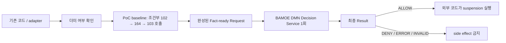
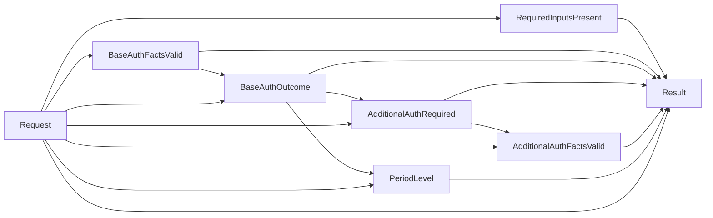

# Case 06 Fact-ready - ONLINE 유선 일시정지 DMN-only

> **이 문서의 버전**
>
> 외부 adapter 또는 기존 애플리케이션 코드가 더미 여부와 ORDAUB102/164/103
> 결과를 조건에 맞게 모두 조립한 뒤 BAMOE Decision Service를 한 번 호출한다.
>
> - ONLINE 요청만 다룬다. `executionMode`와 BATCH field를 만들지 않는다.
> - BPMN, Mock server, `PolicyStep`, `NEEDS_EVIDENCE`를 사용하지 않는다.
> - DMN은 최종 `Result`만 반환한다.
> - 외부 호출 순서와 모순되거나 필요한 fact가 없으면 `INVALID_INPUT`이다.
> - 최종 `ALLOW`이면 외부 코드가 실제 suspension side effect를 실행한다.

[Fact-ready DMN-only 공통 가이드로 돌아가기](README.md)

---

## 1. 이 버전의 적용 조건

다음 조건을 만족할 때 사용한다.

- 기존 코드가 더미 서비스 조회와 ORDAUB 호출을 이미 수행한다.
- 기존 코드가 fail-fast, timeout, retry와 호출 순서를 책임질 수 있다.
- BAMOE에는 기간 등급, 추가 권한 조건, 최종 판정과 사유를 중앙화하려 한다.
- 장기 실행, 재개, process 상태 추적이 필요하지 않다.



이 버전의 가장 큰 trade-off는 103 호출 조건이 adapter와 DMN 양쪽에 등장한다는
점이다. adapter는 DMN을 호출하기 전에 103 결과까지 준비해야 하므로 5개 조건을
알아야 한다. DMN은 동일 조건으로 fact 계약을 재검증한다.

호출 조건을 한 곳에서만 관리하고 BAMOE가 다음 호출을 선택하게 하려면 기존
BPMN+DMN 버전이 더 적합하다.

---

## 2. 범위: ONLINE-only

이 model은 endpoint 자체가 ONLINE 요청용이다.

- `executionMode` field를 만들지 않는다.
- BATCH를 `"INVALID_INPUT"`으로 분류하지 않는다.
- 원문의 `susp_auth[0]`, `susp_auth[1]`을 추측하여 만들지 않는다.

BATCH schema와 code mapping을 고객에게 받은 뒤 별도 model/API version으로
설계한다. 현재 fact-ready 계약에는 ONLINE 규칙만 존재한다.

---

## 3. 원문 해석과 PoC baseline

> PDF의 간략 의사코드는 `ORDAUB164 → ORDAUB102`로 읽히지만 상세 C 흐름은
> `ORDAUB102 → ORDAUB164`다. 두 표현이 충돌하므로 이 가이드는 상세 C 흐름을
> **PoC baseline**으로 채택한다. 운영 계약으로 확정하기 전에는 고객에게 호출
> 순서와 첫 호출의 body `ERROR` 시 두 번째 호출 생략 여부를 확인해야 한다.

### 3.1 더미 여부와 기본 권한

더미 서비스가 아니면 현재 PoC baseline인 상세 C의 순서대로 처리한다.

1. ORDAUB102를 먼저 호출한다.
2. 102가 HTTP 200 body `ERROR`이면 즉시 종료한다.
3. 102가 `GRANTED` 또는 `DENIED`이면 ORDAUB164를 호출한다.
4. 164가 HTTP 200 body `ERROR`이면 즉시 종료한다.
5. 102/164가 정상 권한 결과이면 기간 등급을 계산한다.

더미 서비스이면 102/164를 호출하지 않는다.

### 3.2 기간 등급

우선순위는 다음과 같다.

| 조건 | `suspensionPeriodLevel` |
|---|---|
| ORDAUB164 = `GRANTED` | `UNLIMITED` |
| 164가 승인 아님, ORDAUB102 = `GRANTED` | `EXTENDED` |
| 그 외 정상 경로 또는 더미 서비스 | `STANDARD` |

즉 `164 GRANTED > 102 GRANTED > STANDARD`다. 두 권한이 모두 `GRANTED`이면
`UNLIMITED`다.

### 3.3 조건부 ORDAUB103

base 권한 경로가 오류 없이 완료되고 다음 다섯 조건을 모두 만족하면 103 결과가
필수다.

```text
serviceStatusChangeCode = "F1"
AND suspensionReasonCode IN ("01", "08")
AND channelClassCode = "NGM"
AND companyClassCode starts with "B"
AND zx98ProcessYn = "N"
```

| ORDAUB103 | 최종 결과 |
|---|---|
| `GRANTED` | `ALLOW` |
| `DENIED` | `DENY` |
| HTTP 200 body `ERROR` | `SYSTEM_ERROR` |

다섯 조건 중 하나라도 맞지 않으면 103은 `NOT_CHECKED`여야 하며 최종
`ALLOW`다.

### 3.4 suspension side effect

DMN은 실제 일시정지를 실행하지 않는다. 외부 코드는 다음 최종 결과에서만
side effect를 실행한다.

```text
Result.status = "ALLOW"
AND Result.nextAction = "EXECUTE_SUSPENSION"
```

`requestId` 같은 멱등성 key와 side-effect 결과는 DMN 입력이 아니라 외부 실행
계층의 책임이다.

---

## 4. 기술 실패와 body `ERROR`

`AuthResult.ERROR`는 권한 provider가 HTTP 200 body로 반환한 업무 결과다.

다음 상황은 fact `"ERROR"`로 바꾸지 않는다.

- HTTP 4xx/5xx
- timeout 또는 connection failure
- malformed JSON
- 알 수 없는 enum

외부 코드는 이 경우 BAMOE를 호출하지 않고 기술 실패·재시도 경로로 이동한다.

예를 들어 ORDAUB102 HTTP 500은 다음처럼 조립하지 않는다.

```json
{
  "ordAub102Result": "ERROR",
  "ordAub164Result": "NOT_CHECKED"
}
```

이 payload는 “102가 HTTP 200 body ERROR를 반환했다”는 다른 의미이기 때문이다.

---

## 5. Fact-ready 입력 계약

### 5.1 Request field

| Field | Type | 의미 |
|---|---|---|
| `dummyServiceYn` | `YesNo` | 더미 서비스 여부 |
| `serviceStatusChangeCode` | `string` | 103 조건 1 |
| `suspensionReasonCode` | `string` | 103 조건 2 |
| `channelClassCode` | `string` | 103 조건 3 |
| `companyClassCode` | `string` | 103 조건 4 |
| `zx98ProcessYn` | `YesNo` | 103 조건 5 |
| `ordAub102Result` | `AuthResult` | 102 결과 또는 `NOT_CHECKED` |
| `ordAub164Result` | `AuthResult` | 164 결과 또는 `NOT_CHECKED` |
| `ordAub103Result` | `AuthResult` | 조건부 103 결과 또는 `NOT_CHECKED` |

`executionMode`, BATCH 배열, URL, request ID와 side-effect payload는 넣지 않는다.

### 5.2 base 권한 조합

| Dummy | 102 | 164 | 계약 |
|---|---|---|---|
| `Y` | `NOT_CHECKED` | `NOT_CHECKED` | 더미 경로 |
| `N` | `ERROR` | `NOT_CHECKED` | 102 body ERROR fail-fast |
| `N` | `GRANTED`/`DENIED` | `GRANTED`/`DENIED`/`ERROR` | 164까지 호출 완료 |

그 밖의 조합은 `INVALID_INPUT`이다. 특히 다음을 차단한다.

- Dummy `Y`인데 102 또는 164 결과가 있음
- Dummy `N`인데 102가 `NOT_CHECKED`
- 102가 `ERROR`인데 164 결과가 있음
- 102가 `GRANTED`/`DENIED`인데 164가 `NOT_CHECKED`

### 5.3 103 조합

base 권한이 body `ERROR` 없이 완료된 뒤 다섯 조건을 평가한다.

| AdditionalAuthRequired | 103 fact |
|---:|---|
| `true` | `GRANTED`/`DENIED`/`ERROR` 필수 |
| `false` | `NOT_CHECKED` 필수 |

102/164 body `ERROR`로 fail-fast된 경우도 103은 `NOT_CHECKED`여야 한다.

---

## 6. adapter가 fact를 조립하는 순서

DMN 밖의 코드는 현재 PoC에서 다음 절차를 구현한다. 이 순서는 3절의 원문 충돌에
대한 임시 baseline이며 고객 확인 후 adapter 테스트와 함께 갱신한다.

```text
1. 더미 여부를 조회한다.

2. dummy = Y
   → 102 = NOT_CHECKED
   → 164 = NOT_CHECKED

3. dummy = N
   → 102 호출
   → 102 body ERROR이면 164 = NOT_CHECKED로 종료
   → 102 G/D이면 164 호출
   → 164 body ERROR이면 base 경로 종료

4. base 경로가 body ERROR가 아니면 5개 조건 계산
   → 조건 true이면 103 호출
   → 조건 false이면 103 = NOT_CHECKED

5. base가 body ERROR이면 103 = NOT_CHECKED

6. 완성된 Request로 BAMOE Decision Service를 한 번 호출한다.

7. Result = ALLOW일 때만 외부 코드가 suspension을 실행한다.
```

이 절차의 3~5번이 코드에 남는다는 사실을 고객에게 숨기지 않는다.

---

## 7. 만들 자산

| 항목 | 값 |
|---|---|
| DMN | `src/main/resources/dmn/Case06WirelineSuspensionFactReady.dmn` |
| Model Name | `Case06WirelineSuspensionFactReady` |
| Namespace | `https://example.com/bamoe/poc/fact-ready/case06/v1` |
| Input Data | `Request` |
| Helper Decisions | `RequiredInputsPresent`, `BaseAuthFactsValid`, `BaseAuthOutcome`, `AdditionalAuthRequired`, `AdditionalAuthFactsValid`, `PeriodLevel` |
| 최종 Decision | `Result` |
| Decision Service | `Case06FactReadyService` |
| SCESIM | `src/test/resources/scesim/Case06WirelineSuspensionFactReadyTest.scesim` |

---

## 8. UI로 Data Types 만들기

### 8.1 파일과 Model

1. `src/main/resources/dmn/Case06WirelineSuspensionFactReady.dmn`을 만든다.
2. **Modern BAMOE DMN Editor**로 연다.
3. 빈 canvas를 선택하고 Model properties를 입력한다.

| Property | 값 |
|---|---|
| Name | `Case06WirelineSuspensionFactReady` |
| Namespace | `https://example.com/bamoe/poc/fact-ready/case06/v1` |

### 8.2 단순 타입

`YesNo`

```feel
"Y", "N"
```

`AuthResult`

```feel
"GRANTED", "DENIED", "ERROR", "NOT_CHECKED"
```

`BaseAuthOutcome`

```feel
"READY", "ERROR_102", "ERROR_164", "INVALID"
```

`SuspensionPeriodLevel`

```feel
"STANDARD", "EXTENDED", "UNLIMITED"
```

`DecisionStatus`

```feel
"ALLOW", "DENY", "SYSTEM_ERROR", "INVALID_INPUT"
```

`NextAction`

```feel
"EXECUTE_SUSPENSION", "STOP", "RETURN_ERROR", "FIX_INPUT"
```

### 8.3 구조 타입

`tCase06FactReadyRequest`:

| Field | Type |
|---|---|
| `dummyServiceYn` | `YesNo` |
| `serviceStatusChangeCode` | `string` |
| `suspensionReasonCode` | `string` |
| `channelClassCode` | `string` |
| `companyClassCode` | `string` |
| `zx98ProcessYn` | `YesNo` |
| `ordAub102Result` | `AuthResult` |
| `ordAub164Result` | `AuthResult` |
| `ordAub103Result` | `AuthResult` |

`tCase06FactReadyResult`:

| Field | Type |
|---|---|
| `status` | `DecisionStatus` |
| `nextAction` | `NextAction` |
| `suspensionPeriodLevel` | `SuspensionPeriodLevel` |
| `reasonCode` | `string` |
| `reasonMessage` | `string` |

---

## 9. DRD와 모든 Decision output type

### 9.1 Node

| 종류 | 이름 | Output data type |
|---|---|---|
| Input Data | `Request` | `tCase06FactReadyRequest` |
| Decision | `RequiredInputsPresent` | `boolean` |
| Decision | `BaseAuthFactsValid` | `boolean` |
| Decision | `BaseAuthOutcome` | `BaseAuthOutcome` |
| Decision | `AdditionalAuthRequired` | `boolean` |
| Decision | `AdditionalAuthFactsValid` | `boolean` |
| Decision | `PeriodLevel` | `SuspensionPeriodLevel` |
| Decision | `Result` | `tCase06FactReadyResult` |

Decision output type을 하나도 비워 두지 않는다.

### 9.2 Information Requirement



연결선이 많으므로 canvas에서 helper를 왼쪽에서 오른쪽 순서로 정렬한다.

---

## 10. Helper Decisions

각 helper는 `Literal expression`으로 만든다.

### 10.1 `RequiredInputsPresent` → `boolean`

```feel
Request != null
and Request.dummyServiceYn != null
and Request.serviceStatusChangeCode != null
and Request.serviceStatusChangeCode != ""
and Request.suspensionReasonCode != null
and Request.suspensionReasonCode != ""
and Request.channelClassCode != null
and Request.channelClassCode != ""
and Request.companyClassCode != null
and Request.companyClassCode != ""
and Request.zx98ProcessYn != null
and Request.ordAub102Result != null
and Request.ordAub164Result != null
and Request.ordAub103Result != null
```

### 10.2 `BaseAuthFactsValid` → `boolean`

```feel
if Request = null
   or Request.dummyServiceYn = null
   or Request.ordAub102Result = null
   or Request.ordAub164Result = null
then false
else if Request.dummyServiceYn = "Y"
then
  Request.ordAub102Result = "NOT_CHECKED"
  and Request.ordAub164Result = "NOT_CHECKED"
else if Request.dummyServiceYn = "N"
        and Request.ordAub102Result = "ERROR"
then Request.ordAub164Result = "NOT_CHECKED"
else if Request.dummyServiceYn = "N"
        and list contains(
          ["GRANTED", "DENIED"],
          Request.ordAub102Result)
then list contains(
       ["GRANTED", "DENIED", "ERROR"],
       Request.ordAub164Result)
else false
```

### 10.3 `BaseAuthOutcome` → `BaseAuthOutcome`

```feel
if not(BaseAuthFactsValid)
then "INVALID"
else if Request.dummyServiceYn = "N"
        and Request.ordAub102Result = "ERROR"
then "ERROR_102"
else if Request.dummyServiceYn = "N"
        and Request.ordAub164Result = "ERROR"
then "ERROR_164"
else "READY"
```

### 10.4 `AdditionalAuthRequired` → `boolean`

null-safe하게 작성한다. DMN은 모든 helper를 평가할 수 있으므로
`RequiredInputsPresent=false`일 때도 FEEL evaluation failure가 나면 안 된다.

```feel
if BaseAuthOutcome != "READY"
   or Request = null
   or Request.serviceStatusChangeCode = null
   or Request.suspensionReasonCode = null
   or Request.channelClassCode = null
   or Request.companyClassCode = null
   or Request.zx98ProcessYn = null
then false
else
  Request.serviceStatusChangeCode = "F1"
  and list contains(
    ["01", "08"],
    Request.suspensionReasonCode)
  and Request.channelClassCode = "NGM"
  and starts with(
    Request.companyClassCode,
    "B")
  and Request.zx98ProcessYn = "N"
```

### 10.5 `AdditionalAuthFactsValid` → `boolean`

```feel
if Request = null
   or Request.ordAub103Result = null
then false
else if AdditionalAuthRequired
then list contains(
       ["GRANTED", "DENIED", "ERROR"],
       Request.ordAub103Result)
else Request.ordAub103Result = "NOT_CHECKED"
```

이 식 때문에 102/164 body `ERROR` 뒤 103 결과가 들어온 상태도
`INVALID_INPUT`으로 차단된다.

### 10.6 `PeriodLevel` → `SuspensionPeriodLevel`

```feel
if BaseAuthOutcome != "READY"
then null
else if Request.dummyServiceYn = "Y"
then "STANDARD"
else if Request.ordAub164Result = "GRANTED"
then "UNLIMITED"
else if Request.ordAub102Result = "GRANTED"
then "EXTENDED"
else "STANDARD"
```

---

## 11. 최종 `Result` Decision Table

### 11.1 설정

| 설정 | 값 |
|---|---|
| Expression | Decision Table |
| Decision Output data type | `tCase06FactReadyResult` |
| Hit Policy | `First (F)` |

### 11.2 Input columns

| 표시 이름 | Input Expression | Type |
|---|---|---|
| Required | `RequiredInputsPresent` | `boolean` |
| Base valid | `BaseAuthFactsValid` | `boolean` |
| Base outcome | `BaseAuthOutcome` | `BaseAuthOutcome` |
| Additional required | `AdditionalAuthRequired` | `boolean` |
| Additional valid | `AdditionalAuthFactsValid` | `boolean` |
| 103 result | `Request.ordAub103Result` | `AuthResult` |
| Period | `PeriodLevel` | `SuspensionPeriodLevel` |

### 11.3 Output columns

| Output Name | Type |
|---|---|
| `status` | `DecisionStatus` |
| `nextAction` | `NextAction` |
| `suspensionPeriodLevel` | `SuspensionPeriodLevel` |
| `reasonCode` | `string` |
| `reasonMessage` | `string` |

아래 표에서 `PERIOD`는 output cell에 `PeriodLevel`을 입력한다는 뜻이다.

### 11.4 전체 Rule rows

| # | Required | Base valid | Base outcome | Additional required | Additional valid | 103 | Period input | status | nextAction | period output | reasonCode | reasonMessage |
|---:|---:|---:|---|---:|---:|---|---|---|---|---|---|---|
| 1 | `false` | `-` | `-` | `-` | `-` | `-` | `-` | `"INVALID_INPUT"` | `"FIX_INPUT"` | `null` | `"REQUIRED_INPUT_MISSING"` | `"ONLINE 판정에 필요한 입력 fact가 누락되었습니다."` |
| 2 | `true` | `false` | `-` | `-` | `-` | `-` | `-` | `"INVALID_INPUT"` | `"FIX_INPUT"` | `null` | `"BASE_AUTH_FACTS_INVALID"` | `"더미 여부와 ORDAUB102/164 결과 조합이 호출 순서와 맞지 않습니다."` |
| 3 | `true` | `true` | `-` | `-` | `false` | `-` | `-` | `"INVALID_INPUT"` | `"FIX_INPUT"` | `null` | `"ADDITIONAL_AUTH_FACTS_INVALID"` | `"ORDAUB103 필요 여부와 입력 결과가 일치하지 않습니다."` |
| 4 | `true` | `true` | `"ERROR_102"` | `false` | `true` | `"NOT_CHECKED"` | `null` | `"SYSTEM_ERROR"` | `"RETURN_ERROR"` | `null` | `"ORDAUB102_BODY_ERROR"` | `"ORDAUB102가 업무 오류를 반환했습니다."` |
| 5 | `true` | `true` | `"ERROR_164"` | `false` | `true` | `"NOT_CHECKED"` | `null` | `"SYSTEM_ERROR"` | `"RETURN_ERROR"` | `null` | `"ORDAUB164_BODY_ERROR"` | `"ORDAUB164가 업무 오류를 반환했습니다."` |
| 6 | `true` | `true` | `"READY"` | `true` | `true` | `"ERROR"` | `-` | `"SYSTEM_ERROR"` | `"RETURN_ERROR"` | `null` | `"ORDAUB103_BODY_ERROR"` | `"ORDAUB103이 업무 오류를 반환했습니다."` |
| 7 | `true` | `true` | `"READY"` | `true` | `true` | `"DENIED"` | `-` | `"DENY"` | `"STOP"` | `null` | `"ORDAUB103_DENIED"` | `"조건부 ORDAUB103 권한이 거절되었습니다."` |
| 8 | `true` | `true` | `"READY"` | `true` | `true` | `"GRANTED"` | `-` | `"ALLOW"` | `"EXECUTE_SUSPENSION"` | `PERIOD` | `"SUSPENSION_AUTHORIZED"` | `"일시정지 실행이 승인되었습니다."` |
| 9 | `true` | `true` | `"READY"` | `false` | `true` | `"NOT_CHECKED"` | `-` | `"ALLOW"` | `"EXECUTE_SUSPENSION"` | `PERIOD` | `"SUSPENSION_AUTHORIZED"` | `"추가 권한 없이 일시정지 실행이 승인되었습니다."` |
| 10 | `-` | `-` | `-` | `-` | `-` | `-` | `-` | `"INVALID_INPUT"` | `"FIX_INPUT"` | `null` | `"UNRECOGNIZED_FACT_COMBINATION"` | `"인식할 수 없는 ONLINE 일시정지 fact 조합입니다."` |

`First` hit policy에서 검증 행이 항상 업무 결과보다 위에 있어야 한다.

- 누락 fact → 1행
- 102/164 순서 모순 → 2행
- 103 조건 모순 → 3행
- body `ERROR` → 4~6행
- 최종 거절/허용 → 7~9행

저장한 뒤 `Analysis`에서 gap/overlap을 확인한다.

---

## 12. Decision Service

1. DMN palette에서 `Decision Service`를 추가한다.
2. 이름을 `Case06FactReadyService`로 지정한다.
3. `Result`를 Output Decision 영역에 넣는다.
4. 다음 helper를 Encapsulated Decision으로 지정한다.

```text
RequiredInputsPresent
BaseAuthFactsValid
BaseAuthOutcome
AdditionalAuthRequired
AdditionalAuthFactsValid
PeriodLevel
```

5. `Request`가 service input으로 노출되는지 확인한다.

public 계약은 `Request → Result`다. caller가 helper 값을 계산해서 보내지 않는다.
Decision Service 자체에 별도 Output data type을 강제로 지정하지 않는다. public
output의 type은 Output Decision인 `Result`의 `tCase06FactReadyResult`에서
결정된다.

---

## 13. SCESIM

### 13.1 생성과 Settings

1. `src/test/resources/scesim/Case06WirelineSuspensionFactReadyTest.scesim`을
   만든다.
2. `Reopen Editor With...` → `(classic)`이 붙지 않은 **BAMOE Test Scenario Editor**를 선택한다.
3. `DMN`과 `Case06WirelineSuspensionFactReady.dmn`을 선택한다.

| Settings | 값 |
|---|---|
| DMN namespace | `https://example.com/bamoe/poc/fact-ready/case06/v1` |
| DMN name | `Case06WirelineSuspensionFactReady` |

### 13.2 GIVEN과 EXPECT

GIVEN은 `Request`의 9개 field다.

EXPECT:

- `Result.status`
- `Result.nextAction`
- `Result.suspensionPeriodLevel`
- `Result.reasonCode`
- `Result.reasonMessage`

문자열은 큰따옴표를 포함한 FEEL literal로 입력한다. null은 빈칸이 아니라
`null`로 입력한다. `reasonMessage` 역시 표의 문장 전체를
`"일시정지 실행이 승인되었습니다."`처럼 큰따옴표로 감싸서 입력한다.

### 13.3 profile

반복 입력을 구분하기 위한 설명용 profile이다. SCESIM에는 실제 field 값을
입력한다.

| Profile | status change | reason | channel | company | zx98 | 103 필요 |
|---|---|---|---|---|---|---:|
| `NO_103` | `F1` | `02` | `NGM` | `B01` | `N` | false |
| `NEED_103_01` | `F1` | `01` | `NGM` | `B01` | `N` | true |
| `NEED_103_08` | `F1` | `08` | `NGM` | `B99` | `N` | true |

### 13.4 정상·body ERROR scenario

| ID | Dummy | Profile | 102 | 164 | 103 | status | nextAction | period | reasonCode | reasonMessage |
|---|---|---|---|---|---|---|---|---|---|---|
| C06-FR-01 | Y | NO_103 | NC | NC | NC | ALLOW | EXECUTE_SUSPENSION | STANDARD | SUSPENSION_AUTHORIZED | `"추가 권한 없이 일시정지 실행이 승인되었습니다."` |
| C06-FR-02 | Y | NEED_103_01 | NC | NC | G | ALLOW | EXECUTE_SUSPENSION | STANDARD | SUSPENSION_AUTHORIZED | `"일시정지 실행이 승인되었습니다."` |
| C06-FR-03 | Y | NEED_103_01 | NC | NC | D | DENY | STOP | null | ORDAUB103_DENIED | `"조건부 ORDAUB103 권한이 거절되었습니다."` |
| C06-FR-04 | N | NO_103 | E | NC | NC | SYSTEM_ERROR | RETURN_ERROR | null | ORDAUB102_BODY_ERROR | `"ORDAUB102가 업무 오류를 반환했습니다."` |
| C06-FR-05 | N | NO_103 | G | E | NC | SYSTEM_ERROR | RETURN_ERROR | null | ORDAUB164_BODY_ERROR | `"ORDAUB164가 업무 오류를 반환했습니다."` |
| C06-FR-06 | N | NO_103 | D | D | NC | ALLOW | EXECUTE_SUSPENSION | STANDARD | SUSPENSION_AUTHORIZED | `"추가 권한 없이 일시정지 실행이 승인되었습니다."` |
| C06-FR-07 | N | NO_103 | G | D | NC | ALLOW | EXECUTE_SUSPENSION | EXTENDED | SUSPENSION_AUTHORIZED | `"추가 권한 없이 일시정지 실행이 승인되었습니다."` |
| C06-FR-08 | N | NO_103 | D | G | NC | ALLOW | EXECUTE_SUSPENSION | UNLIMITED | SUSPENSION_AUTHORIZED | `"추가 권한 없이 일시정지 실행이 승인되었습니다."` |
| C06-FR-09 | N | NO_103 | G | G | NC | ALLOW | EXECUTE_SUSPENSION | UNLIMITED | SUSPENSION_AUTHORIZED | `"추가 권한 없이 일시정지 실행이 승인되었습니다."` |
| C06-FR-10 | N | NEED_103_08 | G | D | G | ALLOW | EXECUTE_SUSPENSION | EXTENDED | SUSPENSION_AUTHORIZED | `"일시정지 실행이 승인되었습니다."` |
| C06-FR-11 | N | NEED_103_08 | G | D | D | DENY | STOP | null | ORDAUB103_DENIED | `"조건부 ORDAUB103 권한이 거절되었습니다."` |
| C06-FR-12 | N | NEED_103_08 | G | D | E | SYSTEM_ERROR | RETURN_ERROR | null | ORDAUB103_BODY_ERROR | `"ORDAUB103이 업무 오류를 반환했습니다."` |

표의 약어:

```text
G = GRANTED
D = DENIED
E = ERROR
NC = NOT_CHECKED
```

이 약어와 profile 이름은 설명용이며 SCESIM cell에 그대로 넣지 않는다. 실제
문자열 cell에는 `"GRANTED"`, `"DENIED"`, `"ERROR"`, `"NOT_CHECKED"`와 각
profile의 원래 field 값을 큰따옴표까지 포함해 입력한다.

### 13.5 계약 방어 scenario

| ID | Dummy | Profile | 102 | 164 | 103 | status | nextAction | period | reasonCode | reasonMessage |
|---|---|---|---|---|---|---|---|---|---|---|
| C06-FR-13 | Y | NO_103 | G | NC | NC | INVALID_INPUT | FIX_INPUT | null | BASE_AUTH_FACTS_INVALID | `"더미 여부와 ORDAUB102/164 결과 조합이 호출 순서와 맞지 않습니다."` |
| C06-FR-14 | N | NO_103 | NC | NC | NC | INVALID_INPUT | FIX_INPUT | null | BASE_AUTH_FACTS_INVALID | `"더미 여부와 ORDAUB102/164 결과 조합이 호출 순서와 맞지 않습니다."` |
| C06-FR-15 | N | NO_103 | E | G | NC | INVALID_INPUT | FIX_INPUT | null | BASE_AUTH_FACTS_INVALID | `"더미 여부와 ORDAUB102/164 결과 조합이 호출 순서와 맞지 않습니다."` |
| C06-FR-16 | N | NO_103 | G | NC | NC | INVALID_INPUT | FIX_INPUT | null | BASE_AUTH_FACTS_INVALID | `"더미 여부와 ORDAUB102/164 결과 조합이 호출 순서와 맞지 않습니다."` |
| C06-FR-17 | N | NEED_103_01 | G | D | NC | INVALID_INPUT | FIX_INPUT | null | ADDITIONAL_AUTH_FACTS_INVALID | `"ORDAUB103 필요 여부와 입력 결과가 일치하지 않습니다."` |
| C06-FR-18 | N | NO_103 | G | D | G | INVALID_INPUT | FIX_INPUT | null | ADDITIONAL_AUTH_FACTS_INVALID | `"ORDAUB103 필요 여부와 입력 결과가 일치하지 않습니다."` |
| C06-FR-19 | N | NEED_103_01 | E | NC | G | INVALID_INPUT | FIX_INPUT | null | ADDITIONAL_AUTH_FACTS_INVALID | `"ORDAUB103 필요 여부와 입력 결과가 일치하지 않습니다."` |
| C06-FR-20 | N | company=null | G | D | NC | INVALID_INPUT | FIX_INPUT | null | REQUIRED_INPUT_MISSING | `"ONLINE 판정에 필요한 입력 fact가 누락되었습니다."` |

C06-FR-04와 C06-FR-15의 차이가 중요하다.

- FR-04: 102 body ERROR 뒤 164 `NOT_CHECKED`인 올바른 fail-fast fact
- FR-15: 102 body ERROR 뒤 164 결과가 들어온 불가능한 fact

SCESIM은 최종 fact 계약과 판정만 검증한다. 실제 호출 순서와 suspension
멱등성은 adapter의 단위·통합 테스트에서 검증한다.

공통 activator와 새 SCESIM 파일을 확인한다. case별 activator를 만들지 않는다.

```bash
cd "/Users/jihunkeom/Desktop/projects/2026/SKT/skt_bamoe_party/prelim/test"

READY=1
for asset in \
  src/main/resources/dmn/Case06WirelineSuspensionFactReady.dmn \
  src/test/resources/scesim/Case06WirelineSuspensionFactReadyTest.scesim
do
  if test -s "$asset"; then
    echo "[OK] $asset"
  else
    echo "[MISSING/EMPTY] $asset"
    READY=0
  fi
done

ACTIVATOR='src/test/java/testscenario/TestScenarioJunitActivatorTest.java'
if test -s "$ACTIVATOR" && rg -q '@TestScenarioActivator' "$ACTIVATOR"; then
  echo "[OK] project-wide Test Scenario activator"
else
  echo "[MISSING/INVALID] $ACTIVATOR"
  READY=0
fi

test "$READY" -eq 1 \
  && echo "[READY] Maven 검증 가능" \
  || echo "[NOT READY] 누락 자산을 UI에서 저장한 뒤 다음 절로 이동"
```

`[READY]`일 때만 다음 Maven 절로 이동한다.

---

## 14. Maven build와 서버 시작

```bash
cd "/Users/jihunkeom/Desktop/projects/2026/SKT/skt_bamoe_party/prelim/test"
mvn -s config/settings-bamoe-container.xml clean verify
```

`verify`가 SCESIM을 포함한 test phase도 실행하므로 별도의 `mvn test`를 먼저
중복 실행하지 않는다. Maven은 project 전체의 DMN/BPMN을 검사한다. 다른 기존
자산을 가리키는 오류는
해당 자산의 미완성 여부를 먼저 확인한다. fact-ready 버전을 실행하려고 기존
orchestration 자산을 삭제하거나 덮어쓰지 않는다.

`BUILD SUCCESS`는 Case 06 Fact-ready DMN과 SCESIM의 build-time 검증 결과다.
Spring server를 시작하거나 Decision Service REST endpoint를 호출한 결과는
아니므로 15~16절의 OpenAPI와 curl 검증을 별도로 수행한다.

서버를 시작한다.

```bash
mvn -s config/settings-bamoe-container.xml spring-boot:run
```

다른 terminal에서 readiness를 확인한다.

```bash
APP_READY=0
APP_READY_ATTEMPT=1

while [ "$APP_READY_ATTEMPT" -le 30 ]
do
  if curl -fsS \
      'http://127.0.0.1:8080/actuator/health' \
      2>/dev/null \
    | jq -e '.status == "UP"' >/dev/null
  then
    APP_READY=1
    break
  fi
  sleep 1
  APP_READY_ATTEMPT=$((APP_READY_ATTEMPT + 1))
done

if [ "$APP_READY" -eq 1 ]; then
  printf 'APP_READINESS_GATE=PASS\n'
else
  printf 'APP_READINESS_GATE=FAIL: BAMOE Terminal 로그를 확인하세요.\n' >&2
  false
fi
```

---

## 15. OpenAPI 네 endpoint

```bash
set -o pipefail

curl --fail-with-body -sS \
  'http://127.0.0.1:8080/v3/api-docs' \
  | jq -e -r '
      [
        .paths | keys[]
        | select(contains("Case06WirelineSuspensionFactReady"))
      ] as $paths
      | if ($paths | length) == 4
        then $paths[]
        else error(
          "expected 4 Case06 FactReady endpoints: \($paths | tojson)"
        )
        end
    '
```

일반적으로 다음 네 endpoint가 보인다. 실제 경로와 request/response schema는
OpenAPI가 최종 기준이다.

| Endpoint | 반환 범위 |
|---|---|
| `/Case06WirelineSuspensionFactReady` | 전체 model context |
| `/Case06WirelineSuspensionFactReady/dmnresult` | 전체 model 상세 평가 결과와 message |
| `/Case06WirelineSuspensionFactReady/Case06FactReadyService` | Decision Service 최종 `Result` |
| `/Case06WirelineSuspensionFactReady/Case06FactReadyService/dmnresult` | service 범위 상세 평가 결과와 message |

---

## 16. Decision Service curl

```bash
DMN_URL='http://127.0.0.1:8080/Case06WirelineSuspensionFactReady/Case06FactReadyService'
DMN_RESULT_URL="${DMN_URL}/dmnresult"
set -o pipefail
```

### 16.1 103 승인 후 EXTENDED

```bash
curl --fail-with-body -sS -X POST "$DMN_URL" \
  -H 'Content-Type: application/json' \
  -d '{
    "Request": {
      "dummyServiceYn": "N",
      "serviceStatusChangeCode": "F1",
      "suspensionReasonCode": "01",
      "channelClassCode": "NGM",
      "companyClassCode": "B01",
      "zx98ProcessYn": "N",
      "ordAub102Result": "GRANTED",
      "ordAub164Result": "DENIED",
      "ordAub103Result": "GRANTED"
    }
  }' | jq -e '
      if (
        .status == "ALLOW"
        and .reasonCode == "SUSPENSION_AUTHORIZED"
        and .reasonMessage == "일시정지 실행이 승인되었습니다."
        and .nextAction == "EXECUTE_SUSPENSION"
        and .suspensionPeriodLevel == "EXTENDED"
      )
      then {
          status,
          reasonCode,
          reasonMessage,
          nextAction,
          suspensionPeriodLevel
        }
      else error("CASE06_EXTENDED_ASSERTION_FAILED: \(. | tojson)")
      end
    '
```

기대 핵심:

```json
{
  "status": "ALLOW",
  "nextAction": "EXECUTE_SUSPENSION",
  "suspensionPeriodLevel": "EXTENDED",
  "reasonCode": "SUSPENSION_AUTHORIZED"
}
```

Decision Service endpoint는 유일한 output Decision인 `Result` 객체를 바로
반환한다. 실제 field 계약은 OpenAPI schema를 최종 기준으로 확인한다.

이 응답을 받은 **외부 코드**가 request ID를 멱등성 key로 사용해 suspension을
실행한다. curl 자체는 side effect를 실행하지 않는다.

### 16.2 102 body ERROR fail-fast

```bash
curl --fail-with-body -sS -X POST "$DMN_URL" \
  -H 'Content-Type: application/json' \
  -d '{
    "Request": {
      "dummyServiceYn": "N",
      "serviceStatusChangeCode": "F1",
      "suspensionReasonCode": "02",
      "channelClassCode": "NGM",
      "companyClassCode": "B01",
      "zx98ProcessYn": "N",
      "ordAub102Result": "ERROR",
      "ordAub164Result": "NOT_CHECKED",
      "ordAub103Result": "NOT_CHECKED"
    }
  }' | jq -e '
      if (
        .status == "SYSTEM_ERROR"
        and .reasonCode == "ORDAUB102_BODY_ERROR"
        and .reasonMessage == "ORDAUB102가 업무 오류를 반환했습니다."
        and .nextAction == "RETURN_ERROR"
        and .suspensionPeriodLevel == null
      )
      then {
          status,
          reasonCode,
          reasonMessage,
          nextAction,
          suspensionPeriodLevel
        }
      else error("CASE06_BODY_ERROR_ASSERTION_FAILED: \(. | tojson)")
      end
    '
```

기대: `SYSTEM_ERROR / ORDAUB102_BODY_ERROR`.

### 16.3 `/dmnresult`

```bash
curl --fail-with-body -sS -X POST "$DMN_RESULT_URL" \
  -H 'Content-Type: application/json' \
  -d '{
    "Request": {
      "dummyServiceYn": "N",
      "serviceStatusChangeCode": "F1",
      "suspensionReasonCode": "01",
      "channelClassCode": "NGM",
      "companyClassCode": "B01",
      "zx98ProcessYn": "N",
      "ordAub102Result": "GRANTED",
      "ordAub164Result": "DENIED",
      "ordAub103Result": "GRANTED"
    }
  }' \
  | jq -e '
      if (
        .modelName == "Case06WirelineSuspensionFactReady"
        and .messages == []
        and (.decisionResults | type == "array")
        and (.decisionResults | length > 0)
        and all(
          .decisionResults[];
          .evaluationStatus == "SUCCEEDED"
        )
        and .dmnContext.Result.status == "ALLOW"
        and .dmnContext.Result.reasonCode == "SUSPENSION_AUTHORIZED"
        and .dmnContext.Result.reasonMessage
          == "일시정지 실행이 승인되었습니다."
        and .dmnContext.Result.nextAction == "EXECUTE_SUSPENSION"
        and .dmnContext.Result.suspensionPeriodLevel == "EXTENDED"
      )
      then {
          modelName,
          result: .dmnContext.Result,
          messages,
          decisionResults
        }
      else error("CASE06_DMNRESULT_ASSERTION_FAILED: \(. | tojson)")
      end
    '
```

`messages`와 모든 `evaluationStatus`를 확인한다. 테스트가 끝나면 server
terminal에서 `Ctrl+C`를 누른다.

---

## 17. 외부 코드가 반드시 테스트할 것

DMN SCESIM만으로 다음은 증명할 수 없다.

- Dummy `Y`에서 102/164 미호출
- 102 body `ERROR` 뒤 164 미호출
- 102 `GRANTED`/`DENIED` 뒤 164 호출
- 5개 조건 true일 때만 103 호출
- 기술 HTTP 실패 시 DMN 미호출
- 최종 `ALLOW`일 때만 suspension 실행
- suspension의 멱등성

adapter 단위·통합 테스트에는 최소한 다음 assertion을 둔다.

```text
102 ERROR       → calls = [DUMMY_LOOKUP, ORDAUB102]
164 ERROR       → calls = [DUMMY_LOOKUP, ORDAUB102, ORDAUB164]
103 DENIED      → suspensionCalls = 0
DMN ALLOW       → suspensionCalls = 1
동일 requestId 재시도 → 실제 suspension effect = 1
```

---

## 18. 이 버전의 한계와 판단

Case 06은 세 사례 중 DMN-only의 단점이 가장 크다.

- ORDAUB102/164 fail-fast가 외부 코드에 남는다.
- 103의 5개 조건을 adapter도 알아야 한다.
- DMN에서 조건을 변경하면 adapter 호출 조건도 함께 배포해야 한다.
- DMN은 잘못 조립된 fact를 거절할 수 있지만 누락된 API를 직접 호출하지 않는다.
- suspension side effect와 멱등성은 BAMOE DMN 밖에서 구현한다.

따라서 다음처럼 판단한다.

| 상황 | 권장 구조 |
|---|---|
| 기존 adapter가 안정적으로 존재하고 decision만 교체 | 이 Fact-ready DMN-only |
| 호출 흐름도 업무 변경 대상이며 한 모델로 보여 줘야 함 | BPMN + DMN |
| 규칙도 호출도 거의 변하지 않고 팀이 BAMOE 운영을 원치 않음 | 일반 코드도 합리적 |

이 DMN-only 버전은 BAMOE 사용을 정당화하기 위해 불필요한 orchestration을
추가하는 설계가 아니다. 이미 fact가 조립되는 경계에서 **변경 가능한 판정만
DMN component로 분리**하는 현실적인 선택이다.

---

## 19. 완료 체크리스트

### 범위와 계약

- [ ] ONLINE-only이며 `executionMode`와 BATCH field가 없다.
- [ ] PDF의 호출 순서 충돌과 `102 → 164` PoC baseline을 고객 확인 TBD로 기록했다.
- [ ] Dummy `Y`이면 102/164가 모두 `NOT_CHECKED`다.
- [ ] 102 `ERROR`이면 164와 103이 `NOT_CHECKED`다.
- [ ] 102 `GRANTED`/`DENIED`이면 164 `GRANTED`/`DENIED`/`ERROR`가 필수다.
- [ ] 5개 조건이 true일 때만 103 결과가 필수다.
- [ ] 조건이 false이면 103은 `NOT_CHECKED`다.
- [ ] 기술 HTTP 실패를 `AuthResult.ERROR`로 바꾸지 않는다.

### DMN

- [ ] fact-ready 전용 file/model/namespace를 사용했다.
- [ ] 모든 helper와 `Result`의 output type을 지정했다.
- [ ] 기간 우선순위가 `164 G > 102 G > STANDARD`다.
- [ ] 102 ERROR 뒤 164 결과가 있으면 `INVALID_INPUT`이다.
- [ ] 조건부 103 누락·과잉 결과가 `INVALID_INPUT`이다.
- [ ] 최종 `ALLOW`만 `EXECUTE_SUSPENSION`을 반환한다.
- [ ] Decision Service는 최종 `Result`만 public output으로 노출한다.

### 테스트와 실행

- [ ] 정상/body ERROR SCESIM 12개가 통과한다.
- [ ] 계약 방어 SCESIM 8개가 통과한다.
- [ ] Maven `clean verify`가 통과한다.
- [ ] actuator health가 `UP`이다.
- [ ] OpenAPI에서 네 endpoint를 확인했다.
- [ ] Decision Service curl과 `/dmnresult` curl을 실행했다.

### 외부 코드

- [ ] adapter가 현재 PoC baseline인 102→164→조건부 103 순서를 테스트한다.
- [ ] 기술 실패 시 BAMOE를 호출하지 않는다.
- [ ] `ALLOW`일 때만 suspension을 실행한다.
- [ ] suspension을 request ID 기반으로 멱등 처리한다.
